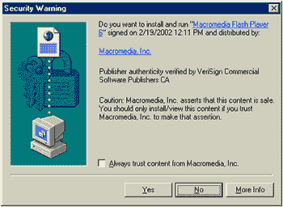
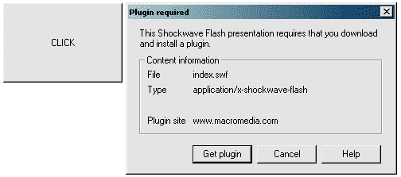

# 发掘 Flash 播放器检测技术

> 原文：<https://www.sitepoint.com/techniques-unearthed/>

**Flash 是第三方文件类型，网站访问者的浏览软件可能不支持。作为 Web 开发人员和设计人员，我们的工作是确保 Flash 电影尽可能易于访问，并根据 W3C 的建议，在需要时提供相关的替代内容。**

这是通过使用 Flash Player 检测来实现的。

本文将向您展示如何做到这一点。它将对当前和未来的检测方法进行调查，并提出想法和解决方案，让您的用户能够无缝访问您的 Flash 数据，如果他们安装的播放器恰好低于所需版本，还可以访问替代内容。

我们将了解在 Windows 上使用 Javascript 和微软的 VBScript 进行客户端检测，内置版本检测和基于标记的检测。还将讨论从 Flash Player 6.0r65 开始提供的服务器端检测。

我将用针对不同情况推荐的检测技术来结束讨论，最后，我将提供一些链接来进一步阅读这里讨论的方法。

所以我们开始吧！

##### 关于 Macromedia Flash 文件格式

Macromedia Flash Web 内容封装在开放文件规范(SWF)中，由专有创作软件生成，如 Macromedia Flash MX、Adobe Livemotion、Swift3d 和 Swish。

SWF 文件格式对于浏览器来说是非本机的。也就是说，我们使用的图形浏览器，如 Mozilla，Safari，Opera 和 Internet Explorer 不能单独运行 SWF 文件，因为它们可以运行 HTML，XML，GIF，JPG 和 PNG 文件。要处理 SWF 内容，浏览器需要免费的 Macromedia Flash Player。

Macromedia Flash Player 处理 Shockwave Flash (SWF)和 future Flash(SPL)文件格式(future Flash 是 Shockwave Flash 的前身)。SWF 是两者中最为流行的，所以出于本文的目的，我将重点介绍这种文件格式。

自 20 世纪 90 年代末以来，Flash Player 一直是 Web 浏览器的标准第三方插件。Flash Player 3 是第一个在市场上产生重大影响的播放器，点语法是在 Flash Player 5 中引入的，当前的播放器版本 6 是迄今为止发布的播放器中使用率最高的。

Flash Player 有多种形式:

*   独立玩家
*   支持 Netscape 插件 API 的浏览器插件
*   运行在 Windows 操作系统上的 Internet Explorer 浏览器的 ActiveX 控件

从语义上讲，在本教程中，每当我提到 Flash Player 时，我指的是在[http://www.macromedia.com/go/getflashplayer](http://www.macromedia.com/go/getflashplayer)可下载的插件，而不是 Macromedia Flash MX 打包的独立 Flash Player。

最后，所有 Flash Player 版本都包含次要版本。例如，在整篇文章中，这些版本被描述为 6.0r65，意思是 Flash Player 6 的第 65 个版本。这有点像 WD40 (#40 是他们得到正确混合的尝试)。我打赌你不知道！

为什么需要 Flash Player 检测？

如上所述，因为 SWF 文件不是由浏览器本机处理的，所以我们需要采用某种形式的 Flash Player 检测来确保我们的 SWF 电影流畅运行，或者不流畅，视情况而定。

我们需要使用 Flash Player 检测的其他原因有:

*   Flash Player 可以选择安装和卸载。
*   有些浏览器有关闭插件的功能。
*   最新播放器的 ActionScript 可能无法在较旧的 Flash 播放器中运行。这在从 Flash Player 4 斜杠语法到 Flash Player 5 点语法的过渡中表现得最为明显。此外，Flash Player 6 类(如 LoadVars、回调函数和 JPEG 图像的动态加载)不受旧播放器的支持。

在我看来，检测应该被视为一种确保:

*   为目标版本顺利部署电影
*   旧版本的透明识别和
*   按照 W3C 建议部署适当的替代内容，并在需要时提供 Flash Player 下载页面的链接。如果用户愿意，应该为他们提供升级的选项。

Flash Player 检测并不是我们应该在 Flash 应用程序或网站开始时就添加的东西。执行不当的检测方案会给想要访问 Flash 或替代内容的用户带来不可逾越的障碍。

首先要记住谁是你的目标受众。如果你提示用户，Flash 站点缺乏可访问性和可用性

*“如果您有 Flash Player 5 或更高版本，请单击此处”*

Web 用户不应该决定这个(他们中有多少人知道他们安装的是什么版本？)，不管我们是否为用户提供一个纯文本选项来缓解潜在的可访问性问题。作为开发人员，我们应该在所有场景中采用透明的 Flash Player 检测方法。

##### 我的目标是哪个版本？

每个新 Flash Player 的发布通常都提供了以前版本中没有的属性(请参见本文末尾的 Flash Player 7 链接)。Jpegs 动态加载、XML 对象、LoadVars 和电影剪辑事件处理程序就是其中的一部分。

你应该瞄准哪个版本的闪付将取决于你的目标受众。如果您的受众是 Flash 开发人员，他们很可能会安装最新的(或接近最新的)播放器。另一方面，普通大众倾向于对下载插件和 ActiveX 控件保持警惕——他们倾向于落后一个版本。在这种情况下，最好使用 Flash Player 5 ActionScript 来确保最大的可玩性，以便随着用户群对该技术接受程度的提高而进行升级。

我通常不为版本 4 或更低版本开发，因为在 Flash Player 5 中，发生了向点语法的过渡，ActionScript 大幅增长。但是，如果设计人员使用简单的补间动画和非常基本的 ActionScript，他们可能希望为 Flash Player 4 部署。但是要记住，这样做只会让你的电影的影响力增加几个百分点。

在撰写本文时，尽管 Flash Player 6 正以相当高的速度增长，但 Flash Player 5 是迄今为止面向最广泛受众的最佳版本。

##### 处理 Flash Player 下载

对于普通的网站访问者来说，被提示下载并安装任何东西到他们的机器上以便他们可以浏览内容可能是一件令人毛骨悚然的事情。许多网站访问者非常谨慎地在他们的机器上安装任何他们认为可能对机器造成损害的东西，这是明智的。

这是我们的工作，然后使下载和安装无缝，友好的过程。我们要避免的是任何 ActiveX 弹出窗口或自动重定向到 Macromedia 的 Flash Player 下载页面。用户经验告诉我们，这些可以让访问者成群结队地离开。



一个 ActiveX 警告:很吓人吧？



Opera7 版本——没那么吓人，但对于不熟悉网络的用户来说，它仍然没有什么信息(那个“点击”按钮就是 Flash 电影)。

我们想要实现的是一种更明智的方法，确保在需要时下载播放器——这种方法符合我们的网站设计，并让用户完全控制下载过程。

首先要做的是使用一些符合标准的标记——您将在本文的代码中看到这些标记的使用。像这样编写标记的好处是，它允许我们为所有兼容的浏览器部署一致的下载体验。

我们需要做的是:

*   去掉 Netscape 特有的嵌入标签——Mozilla、Safari、IE5+Mac 和 Opera7 只要稍加调整，就能很好地运行你的电影。
*   将 codebase 标记从默认的 Internet Explorer 特定属性更改为 W3C 推荐的属性。
*   按照 W3c 推荐标准的规定，在可选的 param 标记之后的 object 标记中放置替代的描述性内容。

请注意，对于没有 Flash Player 的 Windows 上的 Internet Explorer 用户，像这样更改 codebase 属性将导致他们的浏览器执行以下三种操作之一(取决于用户对“未签名”控件的 ActiveX 安全设置):

*   **提示:**弹出窗口，选择是、否、更多信息。
*   **Enable** :浏览器将尝试渲染 Flash 对象，失败，然后显示替代内容，如上所述。
*   **Disable** :浏览器会发出警告，说由于安全设置，它不能呈现对象，然后在对象标签内呈现替代内容。

这些响应是由于 IE for Windows 支持 object 标记的方式而产生的，而不是 W3C 建议的方式，应该注意的是，在所有情况下都会显示替代内容。

如果您不希望这种情况发生，我建议您将 codebase 属性保留为默认值——这样做时，您将需要在 data 属性和 movie <param>标记中绝对引用您的电影，以便所有浏览器都可以找到它。

另一方面，既然 embed 标签已经从等式中删除，Mozilla、Opera7 和其他兼容的浏览器将在 object 标签中呈现替代内容，如果它们不能运行指定的文件的话。这些浏览器不会出现烦人的拼图或弹出窗口——只有你指定的替代内容。

所以我们有了它——一种以透明的方式保持对 Flash Player 下载过程的控制的相当健壮的方法。接下来，我们可以在将要讨论的所有检测场景中使用这个代码，从“Manyana”方法开始。

##### 什么都不做-“Manyana”方法

这就是检测方法的 Cosmo Kramer，它反映了 Flash Player 在市场上的影响——它是一个如此流行的第三方插件，当正确使用时，这种方法将有很高的成功率。目前的统计数据显示，能够处理 Flash Player 5 内容(一般网站的最佳目标播放器)的网络浏览器数量约为 96%。在撰写本文时，Flash Player 6 拥有大约 80%的受众，并且还在不断增长。

在这里描述的所有方法中，这种方法是最简单的。使用 Macromedia Flash 中的发布设置(“文件”>“发布设置”),生成所需的标记，然后对(X)HTML 进行任何更改，例如标题标签、标题标签和 CSS 文件链接。现在需要做的就是把文件放到网络服务器上。

您也可以使用为您的项目定制的 Flash 发布模板，如在线 Flash 帮助文件中所述。

这是最大的优势—易于实施。

主要的缺点包括当不可避免地出现问题时，没有适当的控制方法来帮助站点访问者，以及我们假设大多数站点访问者将使用 Flash Player 5 或更高版本。例如，如果您将 Flash Player 6 的内容提供给 Flash Player 3，并且没有为用户提供支持结构，事情可能会出错。这是一个很好的编程实践，以确保当出现问题时，我们有适当的后备方法，这意味着这不是为一般观众实现的最佳方法。

***代码示例***

下面是“处理 Flash Player 下载”一节中描述的标记。浏览器将尝试运行该文件，如果不能，则显示替代内容。

请注意，这种方法本身没有版本检测。

```
<object  

   data="manyana.swf"  

   type="application/x-shockwave-flash"  

   codebase="http://www.example.com/"  

   width="550"  

   height="400">  

         <param name="movie" value="manyana.swf" />  

         <param name="menu" value="false" />  

         <param name="quality" value="high" />  

         <param name="bgcolor" value="#ededed" />  

         <p>  

           Alternate descriptive content can go here, plus a link to the Flash Player download page for the user to optionally activate.  

           <br />  

           This text will be rendered if the user-agent cannot render the file specified in the object tag.  

         </p>  

   </object>
```

***什么时候应该采用这种方法？***

当您准确知道用户计算机上安装的 Flash Player 版本时。例子包括:

*   具有标准化设置的内部网。
*   面向活跃的 Flash 开发人员的站点，他们通常会安装 Flash Player 5 或更高版本。
*   当您使用与 Flash Player 2 兼容的简单动画时。

***什么时候应该避免这种方法？***

*   当你用未知的 Flash Player 版本为匿名用户建立一个网站时，基本上是为大众建立一个网站。
*   当您提供特定版本的 Flash 内容时。

当然，在使用客户端脚本检测时，您也可以使用这种标记…

##### 使用 Javascript 和 VBScript 的客户端脚本

这种方法是开发社区中使用最广泛的方法。它包括使用客户端脚本来检查 Flash Player 版本信息，然后使用条件(if…else)来根据返回的结果确定要做什么。

要使用客户端脚本，我们必须知道不同的浏览器和操作系统是如何安装和处理播放器的。

除了用于 Windows 的 Internet Explorer 5、5.5 和 6 之外，所有浏览器都使用 Netscape Plugin API 来处理播放器。这意味着一旦安装了播放器，脚本就可以通过 Javascript Navigator.plugins 数组获得版本信息。

与网络上的大多数东西一样，上面提到的 Internet Explorer 版本处理事情的方式不同。这些浏览器支持使用微软 ActiveX 技术的 Flash，不支持 Navigator.plugins 数组。要在这些情况下检测版本信息，需要使用微软自己的脚本语言 VBScript。

幸运的是，兼容 Netscape 的浏览器，如 Mozilla、Netscape 7、用于 Mac 的 Internet Explorer 5、Safari、Opera 和 Netscape Navigator 4 完全忽略 VBScript，我们可以在开发客户端检测技术时利用这一点。

***代码示例***

下面是在用户机器上检查 Flash Player 6 的脚本。如果检测到比这更低的版本，或者没有检测到任何版本，则会显示替代的描述性内容——根据 W3C 建议。注意，脚本标签是符合 XHTML 的。

```
<script type="text/vbscript">   

<!--   

        //check for Flash Player X   

        //script for IE on Win32 systems   

        on error resume next   

        //set a variable to hold the detection result   

        Dim checkForFlash6   

        //assign a boolean value   

        checkForFlash6 = (IsObject(CreateObject("ShockwaveFlash.ShockwaveFlash.6")))   

        //note here that if the object is demoted to ShockwaveFlash.ShockwaveFlash.5 or less, checkForFlash6 will still return true   

        //this is ok as Flash Player 6 can run previous version content.   

        //change 6 to 7 and you will see the alternate content (if 7 is not installed).   

        //check that Shockwave Flash Plugin 6 is available   

        //if false display alternate content, if true show object tag   

        //quotes need to be doubled in vbscript in order for IE to render them in markup.   

        if checkForFlash6 = true then   

           document.write("<object data=""index.swf"" type=""application/x-shockwave-flash"" codebase=""http://www.example.com/"" width=""550"" height=""400""><param name=""movie"" value=""index.swf"" /><param name=""menu"" value=""false"" /><param name=""quality"" value=""high"" /><param name=""bgcolor"" value=""#ededed"" /></object>")   

        else   

           document.write("Alternate descriptive content can go here, plus a link to the Flash Player download page for the user to optionally activate.<br />This text will be rendered if the user-agent cannot render the file specified in the object tag.")   

        end If   

-->   

</script>   

<script type="text/javascript">   

<!--   

//check for Flash Player X   

//check the navigator.plugins array exists, IE for Windows will fail on this.   

if(navigator.plugins.length)   

{   

   //some variables   

   //a counter   

   var i;   

   var xhtmlContent = "<object data="index.swf" type="application/x-shockwave-flash" codebase="http://www.example.com/" width="550" height="400"><param name="movie" value="index.swf" /><param name="menu" value="false" /><param name="quality" value="high" /><param name="bgcolor" value="#ededed" /></object>";   

   var alternateContent = "Alternate descriptive content can go here, plus a link to the Flash Player download page for the user to optionally activate.<br />This text will be rendered if the user-agent cannot render the file specified in the object tag.";   

   //loop through all the plugins installed   

   for (i=0; i < navigator.plugins.length; i++)   

   {   

        //put the plugin string in a variable   

        var pluginIdent = navigator.plugins[i].description.split(" ");   

        //The Flash Player identification string is ([] = the array index) [0]Shockwave [1]Flash [2]6.0 [3]r21   

        //if less than Flash Player 6 is detected, run this code.   

        if(pluginIdent[0] == "Shockwave" && pluginIdent[1] == "Flash")   

        {   

           //set a toggle to show that some sort of Flash Player (of versions 1-5) was found   

           var isSwfEnabled = true;   

           //an array of the Flash version number (major.minor)   

           var versionArray = pluginIdent[2].split(".");   

           if(versionArray[0] < 6)   

           {   

              //show alternate content   

              document.write(alternateContent);   

           }   

           else   

           {   

              //Flash Player 6 or greater has been found, roll out the <object> tag.   

              document.write(xhtmlContent);   

           }   

        //need to break this loop as some browsers may have two versions installed   

        //eg my Firebird release has r65 and r79 installed!   

        break;   

        }//end if pluginIdent   

   }//end for   

   //check if no Shockwave Flash was detected in the array (no Flash Player installed)   

   if(!isSwfEnabled)   

   {   

      document.write(alternateContent);   

   }//end if   

}   

-->   

</script>
```

上面使用的代码显示了如何根据脚本结果将替代内容部署到浏览器中。它没有利用重定向，因为我在本文中努力坚持 W3C 的建议。

***什么时候应该采用这种检测方法？***

这种方法目前最有可能为页面的几乎所有访问者获得准确的版本信息。因此，当你面对匿名观众时，这是最有用的:

*   面向普通浏览者的页面。
*   当 Flash Player 版本未知时的 Intranet 站点。
*   当您希望根据脚本找到的内容显示替代内容时。

***什么时候应该避免这种检测方式？***

*   如果站点访问者的计算机上没有启用脚本，此方法将失败。您应该根据大约 98%的用户会运行客户端脚本这一事实来决定是否启用脚本。使用

    <noscript>标签来解决这个问题，并在这些情况下提供替代内容。</noscript>

*   这种方法在不支持客户端脚本的浏览器中不起作用，例如用于 Mac 版本 3 和 4 的 Internet Explorer。在这种情况下，是时候向前兼容了，如果需要的话，可以对这些浏览器中的一小部分进行嗅探。
*   当您希望屏幕阅读器可以访问替代内容时。
*   当您不希望页面膨胀或者将内容锁定在脚本中时，我们可以使用一些轻量级的检测方法。

##### 级联 XHTML:对象标签

object 标签是 w3c 推荐的元素，用于在基于标记的设置中部署任何对象。“对象”在这个意义上意味着任何非文本内容，例如 Quicktime 电影、Java applet、图像、Flash 电影等等。

该建议指出，如果浏览器无法部署对象标签所针对的内容，它应该尝试呈现对象标签中包含的内容。如果这不可能，它应该尝试呈现它找到的第一个可用内容。

这是处理闪光检测的一种优雅且容易实现的方式。例如，第一个对象标记可以链接到所需的 Flash 电影，下一个嵌套的对象标记可以尝试部署图像。如果这是不可能的，嵌套在这个标签中的将是一些关于电影的描述性文本。

这是一个非常简单的方法，基于 Object 标签的级联能力。这是 W3C 推荐的用户代理处理对象的方式，适用于所有符合标准的浏览器。至于闪光检测，它是本文开头描述的“manyana”方法的扩展。

***代码示例***

下面是本文开头描述的相同的有效 XHTML，增加了一些内容:

```
<object    

   data="index.swf"    

   type="application/x-shockwave-flash"    

   codebase="http://<?=$_SERVER['HTTP_HOST']?>/sitepoint/flashdetection/testmovie/"    

   width="550"    

   height="400">    

         <param name="movie" value="http://<?=$_SERVER['HTTP_HOST']?>/sitepoint/flashdetection/testmovie/index.swf" />    

         <param name="menu" value="false" />    

         <param name="quality" value="high" />    

         <param name="bgcolor" value="#ededed" />    

         <!-if no Flash Player present, render an image -->    

         <object    

          data="alternate.gif"    

          type="image/gif"    

          width="550"    

          height="400">    

         <!-if images turned off, or a text only browser, render the text -->    

           <p>Alternate descriptive content can go here, plus a link to the Flash Player download page for the user to optionally activate.    

           <br />    

           This text will be rendered if the user-agent cannot render the Flash file or the GIF image.    

           </p>    

         </object>    

   </object>
```

唉，尽管这种检测技术很优雅，尽管 object 是 1997 年的 HTML4 推荐标准，但这种解决方案严重缺乏浏览器支持。Internet Explorer for Windows 将尝试呈现代码中存在的所有对象标记，因此如果安装了播放器，您将看到 Flash 电影和 GIF 图像。

在 XHTML2.0 中，object 将是用来部署图像的方法，所以我们希望将来浏览器能对此提供更好的支持。不过，现在这只是一个编码者的梦想。

***什么时候应该采用这种方法？***

*   当您知道您的站点访问者正在使用符合标准的浏览器时。例如，默认使用基于 Gecko 的浏览器的内部网。

***什么时候应该避免这种方法？***

*   当你面对匿名观众时。
*   当您的受众主要使用 Internet Explorer for Windows 作为 Web 浏览器时。

请注意，标记内的版本检测不可用，因此如果这很重要(例如，如果您使用 Flash Player 6 ActionScript)，请使用 Flash 内的内置版本检测:

##### 内置 Flash 播放器版本检测

Flash ActionScript 本身有三种方法可以检测客户端计算机上 Flash Player 的版本:

*   `$version`(在 Flash Player 4 release 11 中引入)返回操作系统字符串以及版本信息(例如 WIN 6，0，79，0)
*   `getVersion()`(在 Flash Player 5 中引入)返回类似于`$version`的字符串
*   根据 Macromedia，System.capabilities.version(在 Flash Player 6 中引入)返回版本号(例如 6.0)，但在我的测试中，它返回类似于`$version`和`getVersion();`的信息

ActionScript 的字符串方法允许从`$version`和`getVersion();`获取版本信息

您使用哪种版本检测方法将取决于您的目标受众，这一点在为 Web 开发 Flash 内容时再强调也不为过。

使用这种方法需要检查版本号。如果版本号低于所需的版本号，请将用户带到显示一些描述性内容的电影帧，然后提示他们升级浏览器。如果用户拥有所需的 Flash 播放器，电影就可以继续加载。

***代码示例***

下面是为处理版本检测而开发的一些 ActionScript。在我的测试中，它在 Flash Player 4 和更高版本上运行良好。Flash Player 2 和 3 未通过测试，显示了一部空白电影，这可能是由于使用了 ActionScript。请注意，这些代码中的一部分与本文后面描述的服务器端检测技术一起使用。

```
function checkPlayerAgainst(requiredPlayerVersion, thisPlayerId)     

{     

  //----- first get the user's player information -------//     

  //make an array of the client player's version numbers     

  //thisPlayerId will be "WIN 6,0,21,0" or similar     

  thisVer = thisPlayerId.split(",");     

  //get rid of the gunk before the major player version number     

  //eg "WIN 6" etc - the first entry of the array will old OS information     

  thisVerSpaceNum = thisVer[0].indexOf(" ");     

  //finally, a major version number (eg 6)     

  thisMajorVer = Number(thisVer[0].substr(thisVerSpaceNum));     

  //---------------------------------------------------------------------//     

    //if the passed variable is not set     

    //or the major version number is equal to the minimum required      

    if(thisPlayerId == false || (thisMajorVer == requiredPlayerVersion))     

    {     

      gotoAndStop("upgrade");     

    }     

    //if the major version number found is greater than the required version     

    else if(thisMajorVer > requiredPlayerVersion)     

    {     

      //play the movie     

      gotoAndStop("init");     

    }     

    //default to upgrade information     

    else     

    {     

      gotoAndStop("upgrade");     

    }     

}
```

此函数由以下代码调用:

```
//Flash Player <4 doesn't like >=     

//so set minimum to 5 if checking for 6     

//set minimum to  4 if checking for 5 and above     

minimumVersion = 5;     

//just for display     

youNeed = minimumVersion+1;     

//get the installed Player version     

installedVersion = getVersion();     

//less than Flash Player 5     

if(installedVersion == "")     

{     

  //debug = "mime type not found";     

  gotoAndStop("upgrade");       

}     

//Flash Player 5 or later     

else     

{     

  //Flash Player 6.0r65 or later and mime-type found     

  //the mime-type can be found using server side detection     

  if(skipVersionCheck=="true")     

  {     

    gotoAndStop("init");     

    //debug = "skipped version check as mime-type was found";     

  }     

  //Flash Player 5 or later and mime-type not found     

  else     

  {     

    //debug = "mime-type not found";     

    checkPlayerAgainst(minimumVersion, installedVersion);         

  }     

}     

stop();
```

***什么时候应该采用这种方法？***

*   当您确定用户是否将至少安装 Flash Player 4r11 时。请注意，此方法不会因 Flash 3 和 2 而中断——电影会开始播放，但不会运行，这可能是由于涉及到了 ActionScript。

***什么时候应该避免这种方法？***

*   当您可能有大量的 Flash Player 2 和 3 用户时(不太可能)。
*   当您希望为低于所需 Flash Player 版本的用户提供基于标记的替代内容时。

这种检测方法非常适合可能是所有 Flash Player 检测场景中最优雅的一种，即服务器端检测:

##### 服务器端 Flash 播放器检测

这种方法使用脚本语言，如 PHP、Coldfusion、Perl 和服务器端语言的 Microsoft stable。不需要客户端版本检测，因为这种检测方法可以由 Flash ActionScript 本身在内部处理。

Macromedia 针对 Flash Player 6 的发行说明指出，当 Flash Player 6 版本 65 或更高版本安装在所有可用的浏览器上时，Flash mime 类型“application/x-shockwave-flash”会添加到 HTTP-ACCEPT 标头中。从表面上看，这很棒——它将 Flash 检测从一个未知的浏览器中分离出来，并将其放在一个稳定的、可管理的环境中。

然而在实践中，我们发现这种方法仍然依赖于浏览器的支持。Mozilla 允许将 mime-type 写入其标题，Internet Explorer 6 允许发生同样的情况，但在页面刷新时不发送标题，Opera 7 的标题没有任何变化。

别担心。与网络上的大多数事情一样，有一个解决方法—在这种情况下，依赖于 Flash Player 足迹和内置的版本检测。

***那么这是怎么做到的呢？***

发送到服务器的 HTTP-ACCEPT 头包含浏览器可以处理的所有 mime 类型的列表，例如 text/html、image/gif 等。当安装最新的 Flash Player 时，它会尝试将此条目添加到标题中:

```
"application/x-shockwave-flash"
```

例如，使用 PHP，我们可以检查这个字符串是否出现在头中:

```
<?php     

//flash detection -- search the HTTP_ACCEPT string for the Flash mime-type.     

//use $HTTP_ACCEPT for PHP versions  <4.1     

if(eregi("application/x-shockwave-flash", $_SERVER['HTTP_ACCEPT']))     

{     

   $hasFlashSupport=true;     

}     

//eregi is the string (case insensitive) comparison function in PHP     

//it will return a true or false depending on whether the substring is found     

?>
```

多么优雅的闪光检测解决方案！如果变量`$hasFlashSupport`设置为 true，我们可以假设安装了 Flash Player 6 .0r65*或更高版本。我们还可以根据在 HTTP-ACCEPT 头中找到的内容向浏览器发送标记，而不是依赖客户端脚本来呈现替代内容，因此减少了与臃肿的客户端脚本相关的带宽问题。
(* Flash Player 6.0r65 适用于 Windows 和 Mac Classic，6.0r67 适用于 Mac OSX，6.0r69 适用于 Linux)

然而，这种解决方案有一个大问题。任何使用低于上述版本(包括 Flash Player 6 的早期版本)的 Flash Player 的人、使用 Opera 的人以及使用 Internet Explorer 刷新页面的用户都将被服务器端脚本视为没有安装 Flash Player！

我们有几个选择来解决这个棘手的问题:

*   完全忽略这一点，坚持使用客户端脚本(直到 Flash Player 6.0r65 和更高版本的人口增长)或
*   部署一个 Flash 电影，然后使用我们上面内置的版本检测方法来检查所需的版本。最新 Flash Player 的用户可以完全跳过版本检测，这要归功于' flashvars' `<param>`标签，如下图所示。那些没有 Flash Player 的人将会看到我们的描述性内容，按照我们的 XHTML 兼容标记。

让我们再来看看前面的 PHP 代码的一部分:

```
<?      

//check for flash!      

if(eregi("application/x-shockwave-flash", $_SERVER['HTTP_ACCEPT']))      

{      

       $hasFlashSupport=true;      

}      

<object      

   data="index.swf"      

   type="application/x-shockwave-flash"      

   codebase="http://<?=$_SERVER['HTTP_HOST']?>/sitepoint/flashdetection/testmovie/"      

   width="550"      

   height="400">      

         <param name="movie" value="http://<?=$_SERVER['HTTP_HOST']?>/sitepoint/flashdetection/testmovie/index.swf" />      

         <param name="menu" value="false" />      

         <param name="quality" value="high" />      

         <param name="bgcolor" value="#ededed" />      

         <?      

         if($hasFlashSupport)      

         {      

         //tell actionscript to skip the version check (we know version 6.0r65 or greater is installed)      

         //flashvars makes a variable called skipVersionCheck available on the _root timeline.      

         ?>      

          <param name="flashvars" value="&skipVersionCheck=true" />      

         <?      

         }      

         ?>      

           <p>      

           Alternate descriptive content can go here, plus a link to the Flash Player download page for the user to optionally activate.      

           <br />      

           This text will be displayed if the user-agent cannot render the Flash file specified in the object tag.      

           </p>      

   </object>      

?>
```

flashvars param 标记非常重要，因为我们可以使用内置版本检测的服务器端检测。如果我们想完全跳过内置版本检测，我们可以在 ActionScript 中检查 _root.skipVersionCheck 的值。

***什么时候应该采用这种方法？***

*   您希望向开发人员展示这种检测方法。
*   当您想要为最新的播放器(下一代 Flash Player(7 及更高版本))部署 Flash 电影时，这种方法对于那些想要区分播放器版本的人来说非常重要，例如，仅用于 Flash Player 7 及更高版本的电影。
*   当你不担心你的 Flash 电影可能会被 Flash 2、3 和 4 用户破坏时。
*   当您想要一个快速简单的 Flash Player 6 检测实现，可以用于站点中任意数量的 Flash 电影时(该`$hasFlashSupport`变量可以在整个脚本环境中使用，甚至可以附加到一个会话变量)。

***什么时候应该避免这种方法？***

*   当您想要为一般观众部署 Flash 内容时。
*   如果您没有访问服务器端脚本语言的权限，就不能使用它。
*   当您可能有大量的 Flash Player 2 和 3 用户时(不太可能)。

服务器端检测无疑是未来的发展方向，现在由您来决定是否采用它。希望像 Internet Explorer 和 Opera 这样的浏览器将来能更好地支持这一点。

##### 不同情况下的最佳选择

在运行完这些选项后，您可能会想知道什么是最适合您的站点的检测场景。下面列出了两个列表，基于尽可能广泛的受众和易于实施的原则。

将覆盖尽可能多的受众的检测方法:

1.  客户端检测
2.  内置版本检测
3.  服务器端检测
4.  马尼亚那方法
5.  嵌套的 HTML 标签

最容易使用的检测方法:

1.  服务器端检测(包括内置版本检测)
2.  内置版本检测
3.  马尼亚那方法
4.  客户端检测
5.  嵌套的 HTML 标签

##### 结论

我们在这里讨论了五种主要的 Flash 播放器检测方法，每种方法都有不同程度的复杂性和浏览器支持。除此之外，我们还研究了一些有用的方法，使检测过程对我们的最终用户透明，并对那些没有 Flash Player 的用户可降解。

在写这篇文章时，我惊讶于标准支持在构建比客户端脚本更优雅的版本检测方法中所起的重要作用。

如果 Internet Explorer for Windows 支持 w3c 推荐的 Object 标记并正确发送其 HTTP-ACCEPT 标头，我们会发现标记嵌套和服务器端检测等检测方法更容易实现，这将导致更轻的标记和更智能的 Flash 支持。

不幸的是，这种浏览器在市场上的垄断使得我们只能将客户端脚本作为目前最强大的检测方法，供公众跨网站使用。

对于其他更优雅的检测场景，我建议 Flash 开发人员研究一下服务器端检测、内置版本检测和标签嵌套，如本文所述。

我还建议开发人员和设计人员开始使用本文和其他文章中使用的基于对象标签的标记，放弃 embed 标签。只为部署 Flash 文件处理一个标签确实有助于控制播放器下载，并将检测置于您的控制之下，而不是将它交给访问者使用的任何浏览器。

越多的 Web 开发人员和设计人员开始推动更好的浏览器支持，我们就能越快地为大多数用户实现更智能、更精简的 Flash Player 检测场景。

##### 脚注 Flash Player 7 测试版

本文完成时，Macromedia 发布了 Flash Player 7 的测试版。乍一看，这个播放器有许多新增功能，包括一个新的 Flash Player 更新机制(目前仅适用于运行在 Windows 上的 Internet Explorer 浏览器)。关于这个测试版播放器的更多信息，请访问[下载这里讨论的所有五种方法的压缩文件](http://www.macromedia.com/software/flashplayer/public_beta/<br />
“>http://www.macromedia.com/software/flashplayer/public_beta/</a></p>
<h5>Code Download</h5>
<p><a rel='external' class=)。阅读自述文件以确定安装所需的内容。

##### 资源链接

***Macromedia Flash SWF 文件格式信息***

Flash SWF 文件格式下载链接。
[http://www . macromedia . com/software/flash/open/licensing/file format/](http://www.macromedia.com/software/flash/open/licensing/fileformat/)

老玩家下载测试。
[http://www . macromedia . com/support/flash/ts/documents/old players . htm](http://www.macromedia.com/support/flash/ts/documents/oldplayers.htm)

如何卸载 Flash Player 在没有播放器的情况下测试检测方法？
[http://www . macromedia . com/support/flash/ts/documents/remove _ player . htm](http://www.macromedia.com/support/flash/ts/documents/remove_player.htm)

***曼雅娜法***

Flash Player 人口普查
[http://www . macromedia . com/software/Player _ census/flash Player/version _ penetration . html](http://www.macromedia.com/software/player_census/flashplayer/version_penetration.html)

***客户端检测***

科林·穆克的 FPI(Flash Player Inspector)
[http://www.moock.org/webdesign/flash/detection/moockfpi/](http://www.moock.org/webdesign/flash/detection/moockfpi/)

Javascript 字典中的 Navigator.plugins。
[http://devedge . Netscape . com/library/manuals/2000/JavaScript/1.3/reference/nav . html # 1193425](http://devedge.netscape.com/library/manuals/2000/javascript/1.3/reference/nav.html#1193425)

VBScript 中的 CreateObject。
[http://support . Microsoft . com:80/support/kb/articles/q183/2/84 . ASP](http://support.microsoft.com:80/support/kb/articles/q183/2/84.asp)

Flash Deployment Kit 是 Macromedia 对客户端检测的贡献。
[http://www . macromedia . com/support/flash/player/flash _ deployment _ readme/](http://www.macromedia.com/support/flash/player/flash_deployment_readme/)

***级联 XHTML:对象标签***

HTML4 W3c 建议中的 Object 元素。
[https://www.w3.org/TR/html4/struct/objects.html](https://www.w3.org/TR/html4/struct/objects.html)

支持嵌套对象标记的 Internet Explorer 问题。
[http://www.xml.com/pub/a/2003/07/02/dive.html](http://www.xml.com/pub/a/2003/07/02/dive.html)

***内置 Flash 版本检测***

ActionScript 中的$version。
[http://www . macromedia . com/support/flash/ts/documents/version . htm](http://www.macromedia.com/support/flash/ts/documents/version.htm)

ActionScript 字典中的 getVersion()。
[http://www . macromedia . com/support/flash/action _ scripts/action script _ dictionary/action script _ dictionary 378 . html](http://www.macromedia.com/support/flash/action_scripts/actionscript_dictionary/actionscript_dictionary378.html)

ActionScript 字典中的 System.capabilities.version。
[http://www . macromedia . com/support/flash/action _ scripts/action script _ dictionary/action script _ dictionary 719 . html](http://www.macromedia.com/support/flash/action_scripts/actionscript_dictionary/actionscript_dictionary719.html)

***服务器端 Flash 检测***

Macromedia Flash Player 6 发行说明。
[http://www . macromedia . com/support/flash/release notes/player/rn _ 6 . html # new](http://www.macromedia.com/support/flash/releasenotes/player/rn_6.html#new)

依靠重定向和 Browserhawk 的 Macromedia Devnet 文章。
[http://www . macromedia . com/devnet/MX/flash/articles/browser _ hawk . html](http://www.macromedia.com/devnet/mx/flash/articles/browser_hawk.html)

Coldfusion 和带有 HTTP-ACCEPT 的服务器端 Flash 检测。
[http://cfm . blogspot . com/2003 _ 03 _ 01 _ cfm _ archive . html # 90765995](http://cfm.blogspot.com/2003_03_01_cfm_archive.html#90765995)

***其他资源***

HTTP-从 W3C 接受。
[https://www.w3.org/Protocols/rfc2616/rfc2616-sec14.html](https://www.w3.org/Protocols/rfc2616/rfc2616-sec14.html)

Web 内容可访问性指南-使用 W3c 技术。
[https://www.w3.org/TR/WCAG10/#gl-use-w3c](https://www.w3.org/TR/WCAG10/#gl-use-w3c)

嵌入标记 Netscape 4 的遗留物。
[http://devedge . Netscape . com/library/manuals/1998/html guide/tags 14 . html # 1286379](http://devedge.netscape.com/library/manuals/1998/htmlguide/tags14.html#1286379)

Flash Satay 符合标准的标记，用于部署 Flash 电影。
[http://www.alistapart.com/stories/flashsatay/](http://www.alistapart.com/stories/flashsatay/)

一篇关于对象和嵌入的 Netscape Devedge 文章。
http://devedge . Netscape . com/view source/2002/markup-and-plugins/

## 分享这篇文章