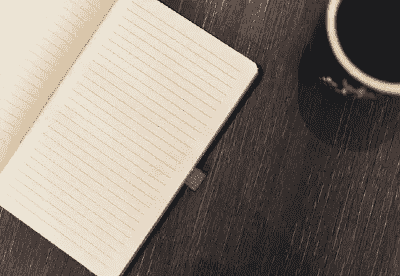
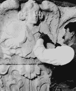
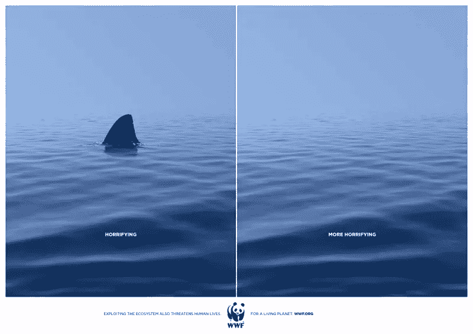
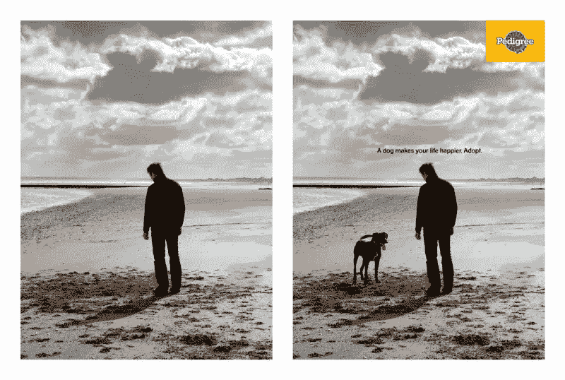

# 会用 Photoshop 讲故事吗？

> 原文：<https://www.sitepoint.com/telling-stories-with-photoshop/>

我们是“创造性类型”。我们喜欢创造东西。

这通常意味着从 ***什么都没有*** 开始——一个空白的页面，一个空白的屏幕，一个新的记事本——然后慢慢地往里面添加新的东西。通常，我们可能会添加如下元素:

*   话
*   颜色；色彩；色调
*   形状
*   照片
*   密码

最终，我们有了自己喜欢的新项目组合。

但那不是只有**的创造新事物的方式。您也可以通过移除项目来创建。如果你仔细想想，雕塑家的伟大天赋就是准确地知道该扔掉哪些石头。我们喜欢他们的剩菜。**

 **这种方法也可以很好地处理视觉图像。这里有两个我最喜欢的例子，通过“拿走”图像的一部分来讲述一个新的故事。

### WWF ( [世界野生动物基金会](http://www.worldwildlife.org/))

([见全尺寸](https://adsoftheworld.com/media/print/wwf_shark_0))

世界自然基金会采取了一种勇敢的方式，选择避开广告中常见的可爱的熊猫、狮子幼崽和海豹幼崽。

如果你不太明白这封邮件的内容，我不得不把它缩小，第一张带有鲨鱼鳍的图片的标签是:

> 太可怕了。

第二张图片简单地“ps 掉”了鱼翅，并添加了标签:

> 更可怕，”

鉴于自《大白鲨》上映以来鲨鱼遭受的公关打击，世界自然基金会能够通过移除一只鲨鱼来制造一种悲伤的感觉令人印象深刻。世界自然基金会对包括秃鹫在内的其他动物使用了这个主题，但认为这个是最有效的。

### 血统

纯种狗粮因创造简单而有效的视觉效果而闻名，但我认为这是一个特别令人心酸的想法。他们不是在卖狗粮，而是在卖狗——或者至少是领养一只狗的想法。

对于血统，数学很简单:更多的狗主人=更多的狗粮销售。

([见全尺寸](https://adsoftheworld.com/media/outdoor/pedigree_dog_3))

把狗从第一帧中去掉，我们看到了一个孤独的人在灰色的冬日海滩上。有种失落感，铅灰色的天空似乎正向他压来。

把狗放回第二帧，一切都变了。这家伙并不沮丧，他只是在和他的狗玩耍。就连云也似乎更加令人振奋和兴奋。我们的大脑自动描绘故事的方式真是疯狂。

正文简单地说:

> 一只狗让你的生活更快乐。领养吧。

这是(我认为)Pedigree 为这次活动创作的一系列广告中最好的一个。

两个例子都使用了相对较小的、简单的 Photoshop 修改来完全重写故事。

非常聪明。

*转载自 [SitePoint 设计简讯](https://www.sitepoint.com/newsletter/)* 。** 

## **分享这篇文章**