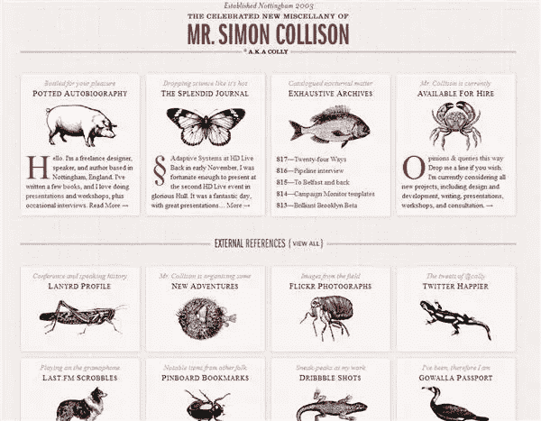
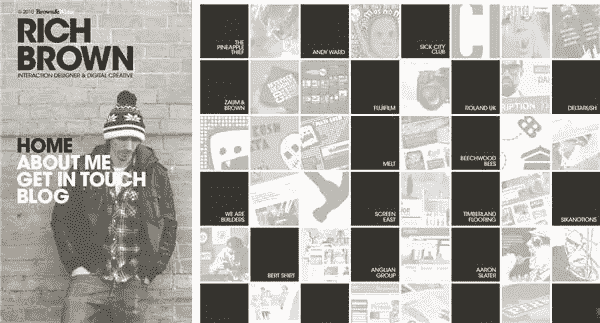
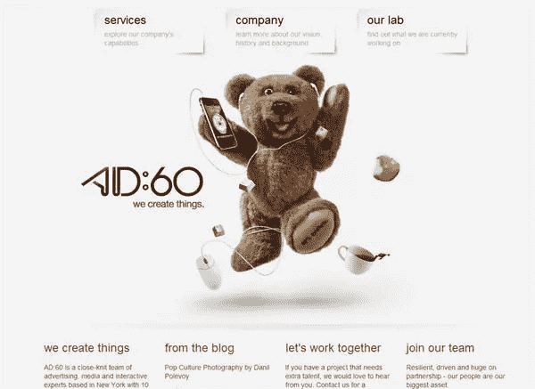
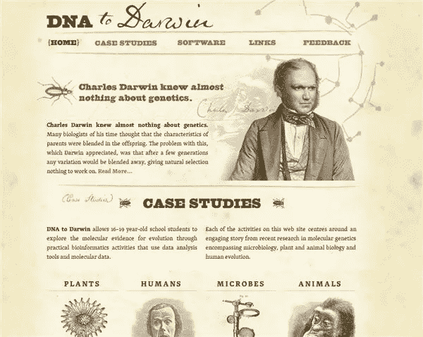
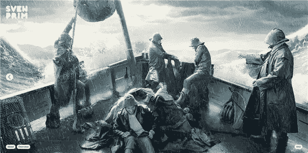
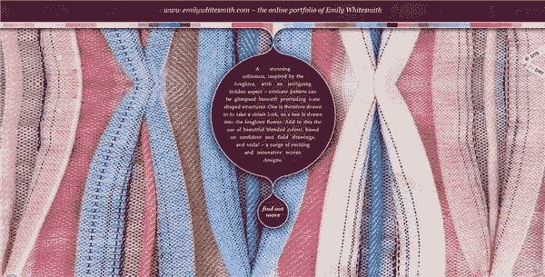
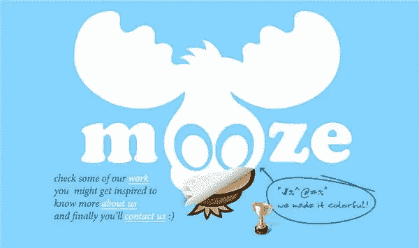
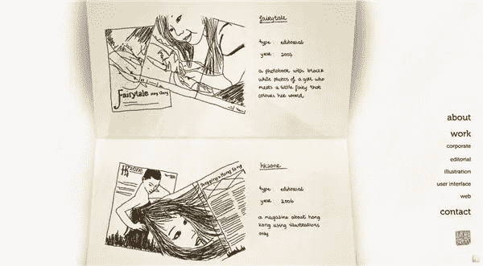
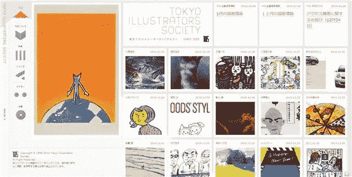
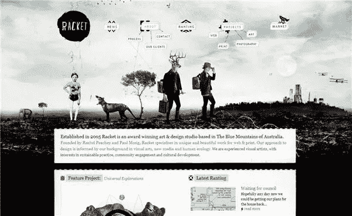

# 2010 年十大漂亮的 CSS 网站

> 原文：<https://www.sitepoint.com/ten-beautiful-css-web-sites-of-2010/>

这是一年中的反思时间，本周在 Sitepoint 上，我回顾了 2010 年一些最可爱/最有趣/最酷的设计。由于现在网上大约有 15 个网站，我选择的基于 HTML 和 CSS 的网站是基于那些出现在 [CSS Awards](http://www.thecssawards.com/) 网站上的网站，这总是灵感的巨大来源，授予一个每日网站和一个月网站。CSS 大奖网站标准网页设计 **50%** 创意 **25%** 内容 **15%** 可用性 **10%。**

我也很想知道你今年最喜欢的 CSS 网站是什么，所以请在下面的评论区添加它们。因此，排名不分先后，以下是一些引起我注意的网站。其中许多都是作品集网站，我总是觉得看到设计师如何展示他们的作品很有趣。

西蒙·科利森的网站因其独特的设计而频繁出现在榜单上，让人想起一个古老的插图动物博物馆。

Rich Brown 的网站灰度柔和，但充满了有趣的内容。

虽然设计本身并不特别独特，但我喜欢在 AD 60 网站上使用图片。

[达尔文的 DNA](http://www.dnadarwin.org/)使用漂亮的字体和图像来传达一种“旧世界”的感觉

斯文·普里姆的摄影作品在这个美丽的网站上无处不在。

Emily White Smith 的作品集简洁优雅，带有有趣的主页图片。

正如 Mooze Design 的网站创建者所说，“我们让它变得丰富多彩。”

Wing Cheng 的迷人的标志和网页设计给投资组合网站带来了非常个人化的感觉。

东京插画家协会的网站将大量的视觉信息压缩在一个小空间里

[球拍的](http://www.racket.net.au/)插画与设计作品的结合让人大饱眼福。

这些只是我今年喜欢的许多基于 CSS 的网站中的一部分。你喜欢他们中的任何一个吗？哪些网站吸引了你的眼球？

## 分享这篇文章