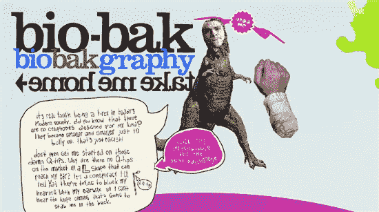
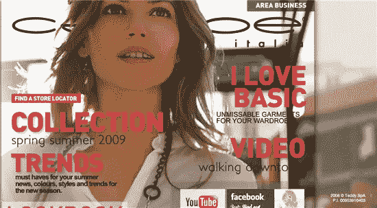
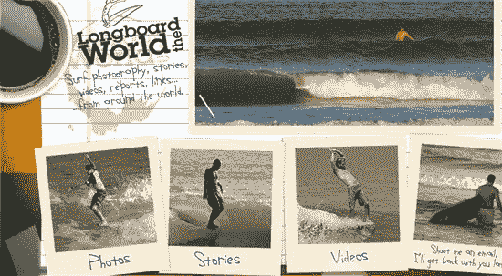
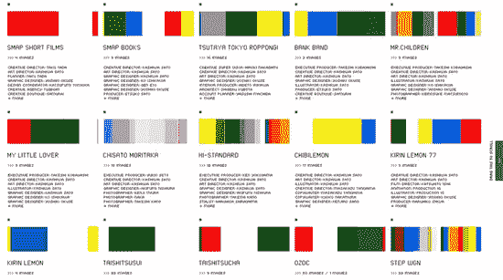
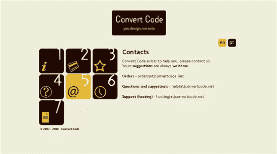
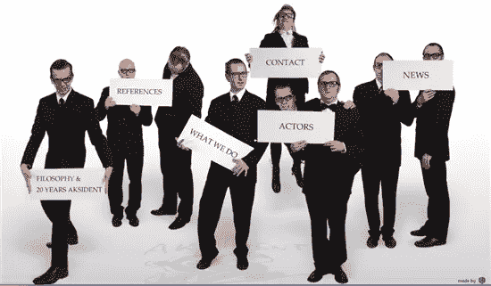
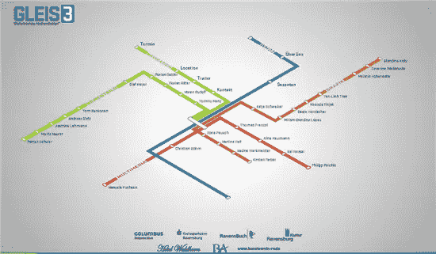
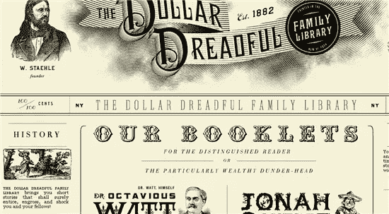
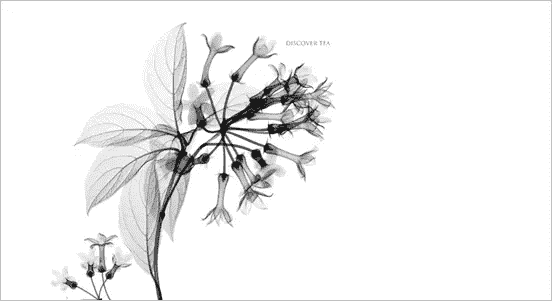

# 非常规网站导航的十个例子

> 原文：<https://www.sitepoint.com/ten-examples-of-unconventional-site-navigation/>

虽然对于网站访问者来说，能够自由地、无拘无束地浏览网站是很重要的，但有时登陆一个网站并使用一个有点不寻常的导航系统也是不错的。它可能不寻常，因为它的外观或功能。菜单不必总是以列表的形式出现在页面的顶部，侧边栏也不必总是用来保存链接或“关于我”的文本。

目标受众是决定你的导航和布局有多狂野的一个主要因素。失去访客的最快方法之一就是让他们很难找到路，从而疏远他们。如果你正在创建一个公司网站，你可能想避免除了标准布局和导航之外的任何东西。然而，如果你有巨大的创造力，并且知道你的观众会顺其自然，那么为什么不尝试一下呢？

我选择的许多网站都是基于 Flash 的，但我相信使用 HTML 和 CSS 来重现许多想法是可能的，也许只是没有流畅的动画。从一些不典型的东西中寻找和学习，并获得新的想法是很好的。

因此，为了获得灵感和新的设计视角，这里有十个打破“传统”导航模式的网站。他们富有创造力，与众不同，而且(哦，不！)可能会让访问者稍微思考一下。

[生物烘焙](http://Bio-Bak.nl)

这个网站有手绘，拼贴的感觉，使用起来很有趣。当你浏览内容时，有按钮可以按，有图标可以拖动。

[Calliope](http://Calliope.info)

这种布局看起来就像一个典型的女性杂志，标题是链接。这是一个 flash 网站，但我认为使用 CSS 可以实现非常类似的东西。

[长板世界](http://LongboardTheWorld.com)

一个美丽的，有触感的网站。老式的宝丽来图片链接到网站的不同部分。

[柏佐藤](http://kashiwasato.com/)

另一个 flash 网站。我不太确定对此该说些什么——这真的有点疯狂，而且可以被认为是具有挑战性的。最好还是去看看这个，看看你有什么想法。

[餐巾的背面](http://www.TheBackOfTheNapkin.com)

餐巾纸的背面用漂亮的手绘图形展示了网站的各个部分。它是 HTML/CSS 和餐巾纸上的一些小块 flash 的混合物。

[转换代码](http://www.ConvertCode.net)

这非常简单易用。一个编号的滚动网格提供了站点导航。网格保持不变，右侧的文本发生变化。

AK ident 使用持有卡片的“演员”来标识网站的不同部分。当你点击一张卡片时，你会被带到网站的那个部分，在那里，演员以一种新颖的方式展示信息。好好玩。

Gleis3 使用看起来像地下交通图的东西来设计他们网站的内容。

可怕的美元被设计成看起来像旧时代的报纸。页面中央的滚动链接指向免费的小册子。左边和右边的报纸专栏中的链接提供了关于该网站的信息以及到各个部分的链接。这是非常好的放在一起。

[皮卡迪利大街的杰克逊](http://www.jacksonsofpiccadilly.co.uk)

这是一个美丽的网站，很大程度上依赖于 flash 的流畅动画。它要求访问者将鼠标悬停在图像上来显示导航。

你对导航与“正常”有些不同的网站有什么感觉？你见过像这样的让你印象深刻的网站吗？

## 分享这篇文章