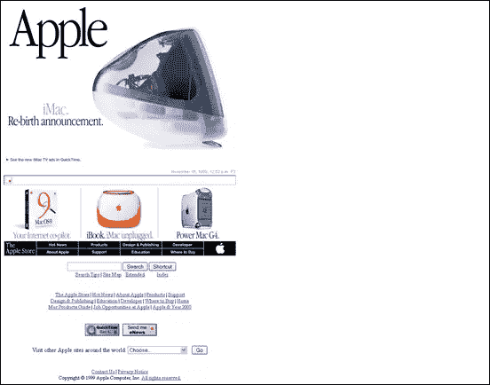
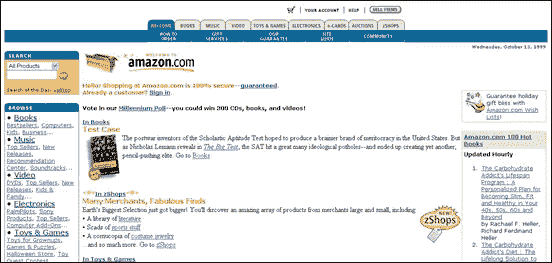
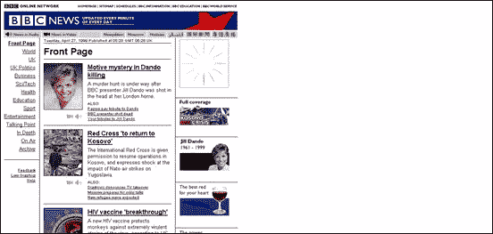
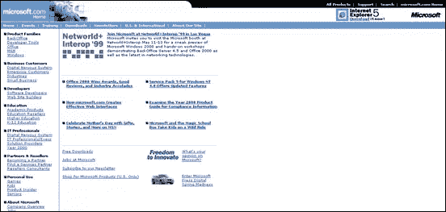
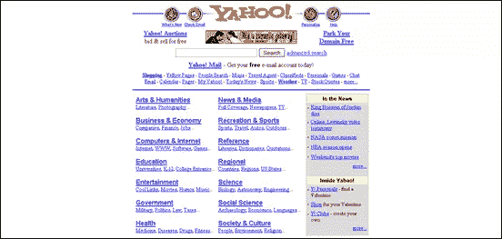
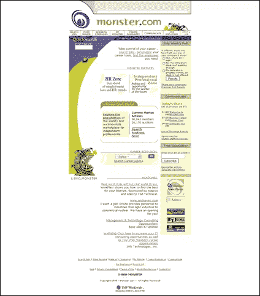
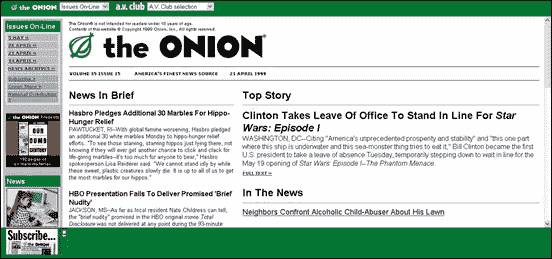
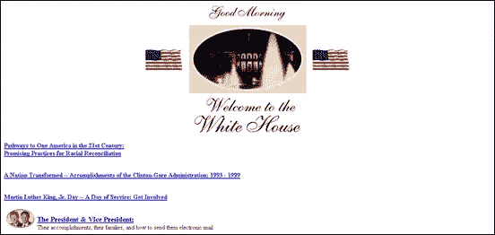
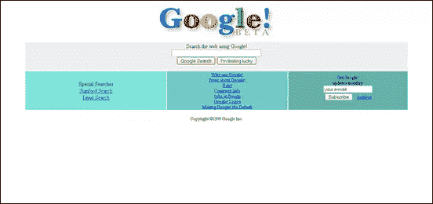

# 十年前，十个网站

> 原文：<https://www.sitepoint.com/ten-websites-ten-years-ago/>

那是 1999 年。世界正准备结束，这要感谢千年虫，它要么把我们都炸飞，要么在新年前夜的午夜从自动取款机里分发免费的钱。

1999 年的一些事件包括建立欧元、T2 科伦拜恩高中大屠杀、海绵宝宝第一集 T4、科索沃战争、纳普斯特首次亮相、兰斯·阿姆斯特朗首次赢得环法自行车赛、鲍里斯·叶利钦辞去俄罗斯总统职务。

我当时是一家挪威电信公司的网页设计师和程序员，负责他们的内部网设计，偶尔也会帮忙做一些营销方面的工作。我不能从纸袋中编程出来(现在仍然不能),但我喜欢网页设计的兴奋感，在记事本中输入 HTML，用 Paint Shop Pro 编辑图像。当公司投资 Macromedia Flash 4 时，我欣喜若狂。网络上的动画！同年，一个朋友“借”给我一份我略有耳闻的东西，叫做 Photoshop 5…

1999 年，网络是一个更小的地方，充满了表格，一些非常不可靠的背景图像和闪烁的文本。但是真正的大男孩在他们的网站上有什么样的设计呢？今天你能认出他们吗？我使用了 Wayback Machine 存档，查看了 10 个今天相当大的网站。这是他们当时的样子。注意:当我抓图的时候，我的屏幕分辨率是 1280 x 800 像素，你会看到当时的设计有多窄。

[Apple.com](http://www.apple.com/)，即使在那时也很好很干净，并为 Power Mac G4 做广告。

Amazon.com 有一个液体布局，看起来和今天非常相似。

英国广播公司正在报道吉尔·丹多的谋杀案。

Microsoft.com 提供了 Internet Explorer 5 的下载。

[连线杂志](http://www.wired.com/)

雅虎！目前正在展示他们的新主页的预览图，但很长一段时间以来都是这个样子。

Monster.com:自 1999 年以来，这里已经收到了很多简历。

用框架建造的[Onion.com](http://www.theonion.com/)，还记得吗？

在这里列出的十个网站中，白宫是变化最大的。

哦看哪！新的[搜索引擎](http://www.google.com/)。

1999 年，你在做什么？你如何看待这些网站设计在十年间发生了(或没有发生)变化。

## 分享这篇文章