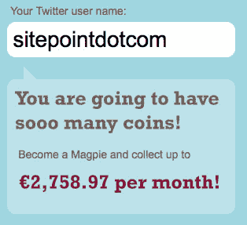

# 可怕的想法:喜鹊推特广告网络

> 原文：<https://www.sitepoint.com/terrible-idea-magpie-twitter-ad-network/>

如果我们在 SitePoint 没有任何顾虑，我们显然可以通过我们的 Twitter 账户打开一个不那么微不足道的收入流。对你来说幸运的是，我们宁愿在 Twitter 上有朋友，而不是敌人。但是如果我们真的那么邪恶，新推出的推特广告网络[喜鹊](http://be-a-magpie.com/)告诉我们，如果我们愿意给他们发广告，我们 12000 多名推特粉丝每月价值超过 3500 美元。

我们不是，但我们想知道有多少人会是。喜鹊是 Twitter 的第三方广告网络，允许人们在他们的账户上出售推文，基于每次放置的出价。该网站表示，它将根据你在推特上发布的内容类型来匹配广告，因此你永远不会发布与你平时聊天内容不匹配的广告。默认情况下，Magpie 计划每 5 条推文发送一条广告，但用户可以调整为每 20 条推文发送一条，或者每隔一条推文发送一条。

喜鹊以 CPM 为基础销售广告客户，CPM 代表收到广告信息的每 1000 名粉丝的成本。他们似乎认为他们能够获得 5-15 美元的 CPM，这就是为什么他们声称 SitePoint 每年可以为我们的 12，000 名粉丝带来 42，000 美元的收入(如果我们增加 tweet 计数，可能会更多)。

在过去的几周里，我们亲眼目睹了排名前 100 的 Twitter 账户所能发送的流量——这不是一个小数目。但我们也知道，Twitter 不仅仅是一个宣传工具，这就是为什么我们重视与我们的追随者互动，并提供内容，而不仅仅是链接到我们自己的博客帖子和文章。Twitter 最重要的是对话，而喜鹊的问题是它广告噪音。

迈克·阿灵顿[将喜鹊比作 PayPerPost](http://www.techcrunch.com/2008/11/23/be-a-magpie-is-payperpost-for-twitter/) 。但在我们看来，这种比较并不公平。PayPerPost 有一些潜在的道德问题，但因为博客通常是相当低的量，它不会增加非常显著的噪音。这就是为什么几周前我们很乐意将它加入我们的[网上赚取额外收入的方法列表](https://www.sitepoint.com/12-killer-ways-to-make-extra-income-on-the-web/)。

另一方面，Magpie 处理的是 Twitter，这比博客发布量要高得多。Twitter 用户每天都会看到成百上千条来自他们关注的人的推文，这并不罕见。想象一下，如果 20%(喜鹊默认)的内容是广告。噪音水平实在是太高了。

Magpie 与 PayPerPost 的不同之处还在于它会自动插入广告，所以你可能会发现自己在为一些你不想做的事情买单。与 Google AdSense 或其他形式的展示广告不同，tweets 发送给你的追随者，附有你的名字和你的隐性认可。

我们猜测有些人会尝试喜鹊，但他们会很快发现自己失去了追随者，他们的帐户价值也在减少。否则，Twitter 将修改他们的服务条款，禁止这项服务。

你怎么想呢?

*记住，你可以关注我们 [@sitepointdotcom](http://twitter.com/sitepointdotcom) 。如果你这样做了，我们会给你一本免费的书“CSS 的艺术和科学”查看我们的 [Twitaway](https://twitter.com/sitepointdotcom) 页面了解更多详情。我们保证，我们不会向您发送任何喜鹊广告！*

## 分享这篇文章