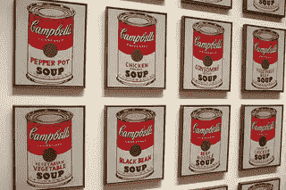
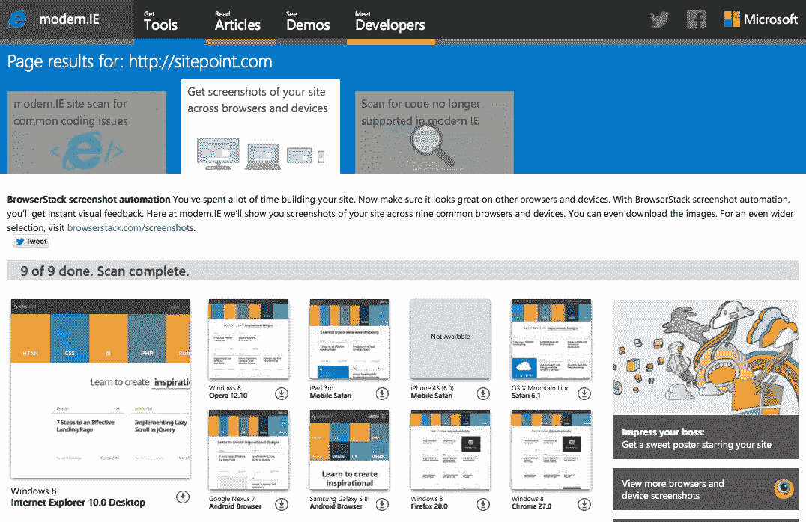
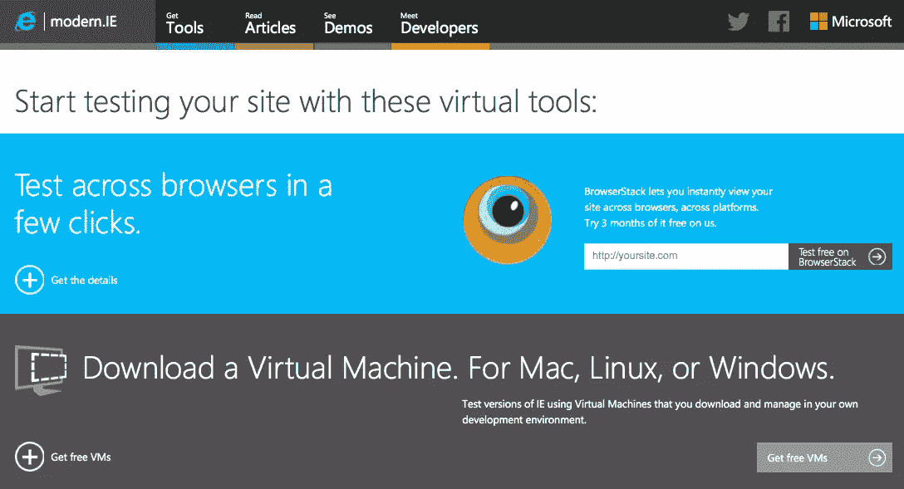
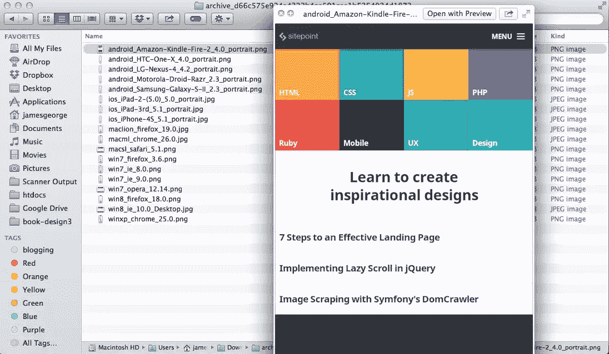

# 用 Modern 进行浏览器测试。工业管理学(Industrial Engineering)

> 原文：<https://www.sitepoint.com/testing-internet-explorer-modern-ie/>

wallyg

*本文由 [Modern.ie](http://modern.ie/) 赞助。感谢您对使 SitePoint 成为可能的赞助商的支持！*

Web 开发是一个非常值得参与的行业。对于那些喜欢解决问题和制作东西的人来说，这可能是一个有回报的职业。

尽管我很喜欢 web 开发，但我们都知道有时候它也有它的问题。

开发人员的长期问题是创建一个跨所有浏览器的一致的网站。令人高兴的是，随着浏览器越来越接近完全的 web 标准支持，为现代浏览器建立一个站点变得越来越容易。

Bootstrap 和 Foundation 等框架也在试图帮助解决这个问题。虽然我们还没有完全做到这一点，但仍然存在支持移动浏览器和旧浏览器的问题。尽管我们希望我们的网站在每台设备上都看起来很棒，但它们并不总是如此。

#### Modern.IE

那就是[现代。IE](http://modern.ie/en-us "Website: Modern.IE") 进来。现代，而不是手头有一大堆设备来测试你的工作。IE 在一个地方模拟了许多流行的浏览器和设备。

你不必担心从一个设备跳到另一个设备。您所需要的只是您想要测试的站点的 URL，一切都准备好了！

Modern.ie 的核心功能是提供你的网站在这些设备上的截图。您可以看到观众看到的内容，无论他们是在运行 Internet Explorer 10 的 Windows 8 桌面上，还是在使用 mobile Safari 的 iPhone 4s 上。无论是哪种情况，您都可以深入了解您的代码和内容在浏览器中是如何显示的。

这对于查找站点中可能丢失的部分或者在某些设备上显示不正确的部分非常有用。

现代社会奇妙的一面。IE 的好处是，一旦它扫描了你的网站，你可以指示它生成一个 PDF 报告，提出如何提高你的网站性能的建议，并提到任何关于你的网站不同方面的已知问题。

9 个视图中的 SitePoint 站点

插上 SitePoint 的网址后，Modern。IE 扫描了网站并生成了截图。能够单独查看每个截图真的很方便。您还可以进行并排比较，这对于故障排除非常有用。

在下面的例子中，我比较了 Windows 8 Internet Explorer 10.0 桌面和 Windows 8 Opera 12.10，发现一切看起来都相当一致。唯一不同的是右上角缺失的广告。

### 其他选项

#### 通过电子邮件发送截图链接

当你与他人合作时，这是很方便的。当你可以向团队成员展示一个问题而不是试图描述它时，事情会简单得多。

#### 在 MSDN 论坛或 StackOverflow 上提问

我很高兴他们链接到这个，因为 StackOverflow 是最有可能找到你的渲染问题的答案的地方之一。能够将您的截图直接链接到 StackOverflow 以获得其他开发专业人员的帮助是非常棒的。

#### 虚拟机库(免费下载)

下载一个虚拟机进行 IE 测试。

虽然截图对于高级测试来说很棒，但是有时候你需要一个真实的工作页面来正确地测试功能。如果您没有现成的浏览器测试实验室，您将需要一套可靠的虚拟机。

谢天谢地现代。IE 现在提供了一个选择虚拟机，所以你可以在你自己的开发环境中测试 IE 的版本。Parallels、Virtual PC、VMWare、VirtualBox 和一系列其他虚拟机播放器都被迎合，将跨平台开发直接带到您的桌面上。

更多截图

在这个屏幕上，您可以更深入地查看您的站点。可以查看更多浏览器和设备截图。他们有一个令人印象深刻的设备库，从不同版本的苹果 iPad 到 HTC One，甚至亚马逊的 Kindle。您一次只能使用 25 台设备，但是您可以从中获得非凡的洞察力。

另一个很棒的特性是，在你为你选择的设备生成了截图之后，你可以下载一个包含截图的 ZIP 文件。在上面的例子中，你可以看到一个文件夹，里面全是按设备分类的截图。说到多做一点，让事情变得简单！

## 网站报告生成器

正如我前面提到的，现代。IE 会为你生成一份报告，里面包含了所有关于你的网站的重要和有用的信息。该报告涵盖以下问题:

#### 已知的兼容性问题

这是为了查看是否存在与 Internet explorer 的兼容性问题，以及您的站点在其中的呈现方式。虽然它不会测试你网站上的每一页，但是他们推荐工具来检查你的整个网站。

#### 兼容模式

这将检查您是否在兼容模式下运行，这对于 IE 是不推荐的。如果不是，那么它是在标准模式下运行，这是 IE 9 和 10 的推荐模式。

#### 框架和库

这将检查你的库和框架，确保它们支持 IE。它会告诉你他们有，或者你根本没有使用框架。

#### 网络标准文档模式

这个测试查看你的站点的文档类型，看它是否支持 html5 和 css3。如果是的话，它在标准模式下渲染，正如我们上面提到的，在 IE 9 和 10 下表现最好。

#### CSS 前缀

该测试检查您是否使用了正确的供应商前缀。厂商前缀有 moz，webkit 等。指定这些可以使功能在浏览器中正确渲染，如果没有指定前缀，则可能无法正常渲染。

#### 浏览器插件

该测试旨在查看您是否有任何依赖浏览器插件运行的内容。flash 就是一个例子，浏览器在显示内容之前必须安装它。

#### 响应式网页设计

这个测试着眼于你的网站，看看你是否正在实施响应式设计。现代 IE 给出了一些建议，比如使用断点来控制你的网站在不同屏幕尺寸下的呈现方式。

#### 浏览器检测

这是一个大的。该测试查看您的站点，看您是否在站点上指定了功能检测。它会查看您的站点是否适合现代浏览器。他们还建议为不能呈现某些功能的旧浏览器设置一个后备方法。

#### 优化页面上的图像

众所周知，为了减少加载时间，您的图像需要高度优化。现代。IE 将评估您的图像，寻找进一步优化的机会。

#### HTML5 输入

这个测试查看你的站点，看看你是否在使用 HTML5 输入，比如表单。如果您的网页上没有表单，则该字段是不相关的。

#### 预渲染+预取

现代。IE 会在他们查看当前可见内容的时候查看你是否提前加载了内容。他们建议这样做，提醒你这个网站会更快，会提供更好的体验。

#### 压缩内容

现代。IE 会在你的网站上寻找压缩内容，因为它可以减少加载时间，帮助你的网站加载更快。像 gzip 压缩这样的方法可以大大减少加载时间。

#### 触摸首次浏览

该测试旨在了解您是否利用 IE 的触控功能来支持触控设备。这一特性使得在触摸设备上与网站进行交互变得更加容易。

#### 向前翻页浏览

该测试查找网站上的“上一页”和“下一页”链接，并查看您是否启用了向前翻页浏览功能，用户可以像翻书一样翻到网站的下一页。

#### IE 11 磁贴+通知

该功能主要针对 Windows 8 和 Windows Surface 设备。它创建了一个更易于用户交互的 Windows 8 磁贴。现代。IE 测试这个特性是否可用，如果不可用，它告诉如何用 2 行代码实现这个特性。

### 与其他服务的比较

现代。IE 不是第一个浏览器测试服务，但老实说，它是最好的之一。

在查看了其他在线测试工具和服务后，我发现许多其他工具和服务都不尽人意。现代。IE 测试一个网站如何在不同的设备、操作系统和浏览器上呈现。许多其他服务只关心屏幕尺寸，这只是其中的一部分。

其他服务不提供下载截图的方法。您可以在浏览器中轻松浏览它们，但是如果您想下载、打印并向同事或客户展示它们，该怎么办呢？让团队成员在现实生活中可以拿着打印出来的东西是很有价值的，这样可以并排比较不同的设备，以及他们的站点在每个设备中是如何呈现的。

但我认为真正提升现代化的是自动报告生成工具。在人群之上。大多数服务根本不提供报告，只是显示屏幕截图，让你做任何修改。事实上，很少有测试站点提供任何有用的改进建议。

### 结论

如果你想在各种设备和浏览器上测试你的网站，深入了解它们的行为，比较和对比如何渲染，并生成一份报告来帮助你优化 IE，那么 Modern。IE 是你的考点。

你可以一次测试多达 25 台设备，而不用花一分钱，最后还会有一个整洁的小 ZIP 包，里面全是截图。现代。IE 是测试和改进你的网站的一个很好的工具，不仅仅是在 IE 浏览器上，在其他设备上也是如此。

[来看看](http://modern.ie/)。

## 分享这篇文章