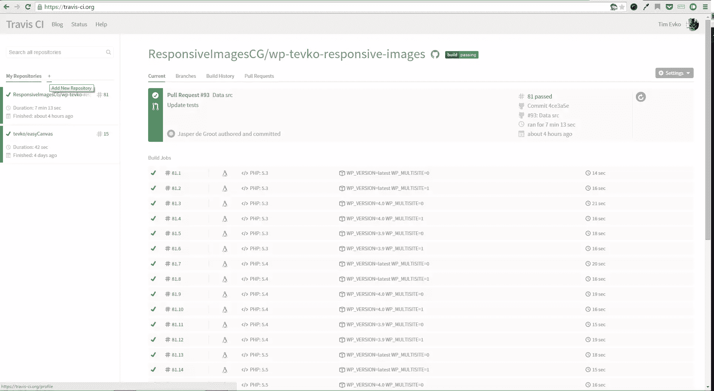
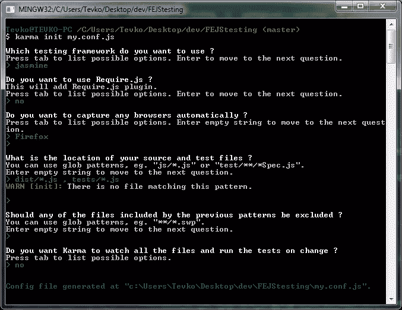

# 用 Jasmine、Travis 和 Karma 测试 JavaScript

> 原文：<https://www.sitepoint.com/testing-javascript-jasmine-travis-karma/>

有人说遗留代码是任何没有经过测试就写出来的代码，我就是其中之一。但我也是前端开发人员，这意味着测试我的代码经常需要浏览器。这使得测试稍微困难了一些，或者至少我认为是这样。实际上，这很简单，在这篇文章中，我将向你展示如何开始！

## GitHub 和 Travis CI

为了测试我们的代码，我们将使用 [GitHub](https://github.com/) 和 [Travis CI](http://docs.travis-ci.com/user/getting-started/) 。GitHub 将托管我们的代码，Travis CI 将充当测试平台。这对于公共存储库来说是完全免费的，并且有大量的文档可以帮助你使用这两种产品。首先要做的是在 GitHub 上创建一个资源库。为了这个教程，我创建了一个资源库，你可以在这里找到。

下一步是访问位于[https://travis-ci.org/](https://travis-ci.org/)的页面，并登录 GitHub。完成后，您需要为 Travis 添加一个存储库来运行测试，如下图所示。



点击“加号”图标会把我们带到一个控制台，在那里我们可以与我们的 GitHub 帐户同步并选择存储库。


我们的存储库的仪表板将是空白的，因为我们还没有设置任何测试。现在让我们进入下一阶段。

## 用 Node.js 做一些事情

就像线粒体是细胞的发电站一样，Node.js 将成为我们甜蜜测试设置的发电站。如果你还没有安装 Node.js，访问[它的网站](https://nodejs.org/)安装。完成后，克隆您在上一节中创建的存储库，这样您的本地机器上就有了所有的文件。至此，我们已经准备好安装 Karma 了！

Karma 是一个测试框架，最初由 AngularJS 团队创建。我们将使用它来帮助我们在 Firefox 的 Travis CI 上运行 Jasmine。我知道这听起来让人不知所措，但别担心！很快我们就会有一些非常酷的测试运行，这一切都是值得的。

如果您的存储库中还没有一个`package.json`文件和`node_module`文件夹，运行`npm init`并完成设置。前面的命令将帮助您创建`package.json`文件。接下来，运行以下命令:

```
npm install karma --save-dev
```

我们还将安装一些必要的 Karma 插件:karma-jasmine 和 karma-firefox-launcher。所以继续跑吧:

```
npm install karma-jasmine karma-firefox-launcher --save-dev
```

现在我们已经安装了所有必要的插件，我们想告诉 Karma 我们的项目，这样它就可以对它进行测试。运行命令:

```
karma init my.conf.js
```

这将引导您完成安装，询问您有关项目及其环境的问题。下面的截图将显示一个简单的 Karma 设置所需的所有问题和答案:



我们还没有创建我们的测试目录。因此，当询问我们的源文件和测试文件的位置时，我们会被警告说`tests/*.js`不存在。至于`dist/*.js`，这是我计划运行测试的文件，对于您的项目可能有所不同。

就是这样！因果报应来了！

## 配置 Travis

到目前为止，特拉维斯还不知道如何处理我们的仓库。让我们解决这个问题。我们需要用下面的代码创建一个`.travis.yml`文件:

```
language: node_js
node_js:
    - "0.10"
script: node_modules/karma/bin/karma start my.conf.js --single-run
before_install:
    - export DISPLAY=:99.0
    - sh -e /etc/init.d/xvfb start
before_script:
    - npm install
```

这告诉 Travis 我们正在使用 Node.js 测试 JavaScript，并将 Firefox 用作浏览器。此外，我们指定在开始测试之前，它应该运行`npm install`来获取所有必要的插件。

## 用 Jasmine 编写测试

到目前为止，我们已经正确配置了 Karma 和 Travis。因此，我们准备为 JavaScript 代码编写一些测试。对于我的示例存储库，我有一个名为`coolLibrary.js`的文件，它向 body 元素添加了一个蓝绿色正方形，并赋予它一个`data`属性。你可以在 [CodePen](http://codepen.io/SitePoint/pen/MwbYQN) 上看到它的运行。

为了测试这段代码，我创建了在`my.conf.js`文件中提到的`tests`目录，从那里我将添加 jasmine 测试文件。我的第一个测试将是一个简单的检查，以确保页面上有一个类为`box`的`div`。Jasmine 用易于理解的函数语法使这变得非常简单。下面是第一个测试(`checkIfDivExists.js`)的样子:

```
describe('getDiv', function() {
    var d = document.querySelector('.box');

    it('Should exist', function() {
        expect(d.nodeName).toBe('DIV');
    });
});
```

这创建了一个 Suite，它搜索一个类为`box`的元素，并期望它的节点名为`DIV`。语法非常简单。

除了前面的测试之外，我还将创建另外两个测试，您可以在 GitHub 资源库中找到这两个测试，并将其复制到您的商品中:

```
describe('getDivBg', function() {
    var d = document.querySelector('.box');

    it('Should be teal', function() {
        expect(d.style.backgroundColor).toBe('teal');
    });
});

describe('getDivAttribute', function() {
    var d = document.querySelector('.box');

    it('Should be bar', function() {
        expect(d.getAttribute('foo')).toBe('bar');
    });
});
```

## 运行测试

代码测试就绪后，我们的最后一步是提交代码。这将添加我们所有的测试逻辑，并触发对 Travis 的构建。不要忘记有一个`.gitignore`文件，确保您的`node_modules`文件夹不会被推入存储库！一旦您提交并推送您的代码，Travis 将自动检测到更改并运行您的测试。这个过程可能需要几分钟，但是一旦构建完成，您会收到电子邮件提醒。

成功！


您可以根据需要创建任意多的测试，GitHub 也会确保根据这些测试检查传入的 pull 请求。

## 结论

在本教程中，我们学习了如何使用 Karma、Jasmine 和 Travis 为我们的 JavaScript 代码建立一个简单的测试环境。欢迎在[https://github.com/sitepoint-editors/FEJStesting](https://github.com/sitepoint-editors/FEJStesting)观看最终结果，并在评论中提出任何问题或疑虑！你可以在 https://travis-ci.org/tevko/FEJStesting[的](https://travis-ci.org/tevko/FEJStesting)查看崔维斯的最新测试

## 分享这篇文章