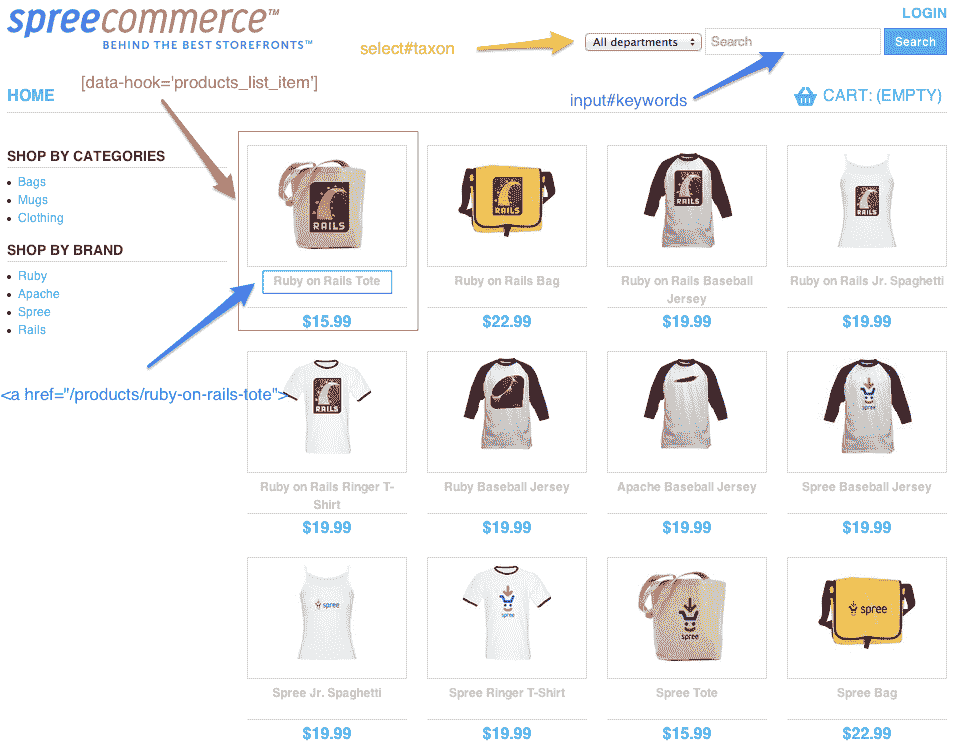

# 用 SitePrism 测试页面对象

> 原文：<https://www.sitepoint.com/testing-page-objects-siteprism/>


在这篇文章中，我将谈论一下 [SitePrism](https://github.com/natritmeyer/site_prism) ，这是一个我最近才了解并喜欢的测试工具。以下是 SitePrism 的创建者对它的描述:

> SitePrism 为您提供了一个简单、清晰和语义化的 DSL，用于使用页面对象模型模式描述您的网站，在自动化验收测试中与 Capybara 一起使用。

在我们进入 SitePrism 之前，让我们先讨论一下*页面对象*，因为页面对象对于理解 SitePrism 背后的哲学至关重要。

### 页面对象初级读本

页面对象封装了页面的实现细节(在我们的例子中，是一个 HTML 文档),并公开了一个特定的 API，允许您(测试人员)测试页面上的元素。这种细节封装使得页面对象作为测试工具特别方便。

让我们用一个例子来说明这一点。这里，我们有一个从`SitePrism::Page`类继承的页面对象:

```
class LoginPage < SitePrism::Page
  element :username_field, "input[name='username']"
  element :password_field, "input[name='password']"
  element :flash, "div.flash"

  def log_in(username, password)
    username_field.set(username)
    password_field.set(password)
    click_on('Log In')
  end
end

class ProfilePage < SitePrism::Page
  element :flash, "div.flash"

  def flash_message
    flash.text
  end
end
```

让我们看看如何使用示例页面对象:

```
feature 'Login' do
  let(:login_page) { LoginPage.new }

  before do
    login_page.load
  end

  scenario 'a successful login' do
    profile_page = login_page.log_in('admin', 'password')
    expect(profile_page.flash_message).to eq("Ohai! Welcome Admin.")
  end
end
```

上面的代码片段说明了我们如何在 RSpec 特性测试中使用 SitePrism 的页面对象。准备好了解更多信息了吗？

### 将 Site Prism 引入您的项目

安装 Site Prism 是一件轻而易举的事情。在你的`Gemfile`:

```
group :test do
  # ...
  gem 'rspec-rails', '~> 3.0.0'
  gem 'capybara-rails'
  gem 'site_prism'
  # ...
end
```

注意，对于示例项目，我们将使用 RSpec 3。另外，你需要水豚来使用 SitePrism。

### 使用示例项目

了解 SitePrism(以及其他任何东西)的最好方法是获得一些实践经验。为此，我准备了一个示例应用程序，您可以使用它来阅读本文。

示例应用程序是一个 [Spree](http://spreecommerce.com/) 电子商务商店。在撰写本文时，我们正在使用最新的 2.3-stable 分支，并在 Rails 4.1.4 上运行。

要获得项目:

```
$ git clone git@github.com:benjamintanweihao/rails_store.git
$ cd rails_store
$ bundle install
```

### 任务:测试搜索

为了用 SitePrism 脏手湿脚，我们准备测试一下商店的搜索功能。

测试的某些部分有特定于 Spree 的代码。别担心，我会指出来的。在大多数情况下，您可以放心地忽略它们。样品大礼包商店为实践我们的测试技能提供了一个现实的平台。

让我们来看一下`HomePage`页面对象的实现。我将所有的页面对象类存储在一个`spec/support/pages`目录中。你可以自由选择你自己的惯例。只需确保该目录包含在测试中。

以下是该页面的外观:



`HomePage`是`SitePrism::Page`的子类。`element`用于指定一个 DOM 元素，而`elements`用于引用一组 DOM 元素。这里，我们传入一个符号(例如，`:products`)，然后 CSS 选择器来定位页面上的各种元素。

下面是`HomePage`页面对象的初始实现:

```
class HomePage < SitePrism::Page
  elements :products,        "[data-hook='products_list_item']"
  elements :product_links,   "[data-hook='products_list_item'] a"
  element  :search_field,    "input#keywords"
  element  :search_dropdown, "select#taxon"
end
```

让我们定义一下`search_for`方法，它包装了一些动作，比如选择下拉菜单、填充搜索字段和点击按钮。我们正在使用水豚的方法，所以如果你不熟悉它们，你一定要查阅文档。

```
# rails_store/spec/support/pages/home_page.rb
class HomePage < SitePrism::Page
  # elements previously defined
  def search_for(query, scope='All departments')
    search_dropdown.select(scope)
    search_field.set(query)
    click_on('Search')
  end
end
```

在我们继续之前，我想在代码中添加另一行:

```
# rails_store/spec/support/pages/home_page.rb
class HomePage < SitePrism::Page
  # elements previously defined
  def search_for(query, scope='All departments')
    search_dropdown.select(scope)
    search_field.set(query)
    click_on('Search')
    SearchResults.new # <--------- Added this! -----
  end
end
```

这能给我们带来什么？让页面对象中的一个方法返回另一个页面对象是一种很好的方式来表达 T2 用户在站点中的旅程。

让我们定义搜索结果页面:

```
class SearchResults < SitePrism::Page
  elements :products, "[data-hook='products_list_item']"
end
```

搜索结果页面有一个单独的`elements`，它返回与`"[data-hook='products_list_item']"`选择器匹配的元素集合。

让我们看看特性规格，了解更多详情:

```
#  rails_store/spec/features/home/search_products_spec.rb
require 'rails_helper'

feature 'Product Search' do
  # factories to load products into the test database
  include_context 'custom products'

  let(:home_page) { HomePage.new }

  before do
    home_page.load
  end

  scenario 'a search term is entered' do
    search_results = home_page.search_for('jersey')
    expect(search_results.products.size).to eq(3)
  end

  scenario 'search limited by dropdown' do
    search_results = home_page.search_for('mug', 'Categories')
    expect(search_results.products.size).to eq(1)
  end
end
```

我们首先像这样设置`HomePage`实例:

```
let(:home_page) { HomePage.new }

before do
  home_page.load
end
```

注意，我们必须调用 other 中的 page 对象上的`#load`来通知 Capybara 在一个无头浏览器中加载页面。接下来，我们的第一个场景:

```
scenario 'a search term is entered' do
  search_results = home_page.search_for('jersey')
  expect(search_results.products.size).to eq(3)
end
```

它测试输入到搜索栏中的搜索词。因为它只接受一个参数(`jersey`)，所以选择框将被设置为`All Departments`。单击搜索按钮。最后，返回一个新的`SearchResult`实例。

这里有很重要的一点。按照用户流程，一旦用户执行搜索，她应该被引导到另一个页面。这由`SearchResult`实例表示。因为我们已经在`SearchResult`类中指定了`:products`，所以我们可以像这样在断言中使用它:

```
expect(search_results.products.size).to eq(3)
```

### 了解更多信息

我只是触及了 SitePrism 的皮毛。SitePrism [文档](https://github.com/natritmeyer/site_prism/blob/master/README.md)写得很好。花 5 分钟阅读这些文件，我打赌你会同意我的观点。

### 更多练习:测试主页

在 GitHub 资源库中，你会找到`rails_store/spec/features/home/list_products_spec.rb`。查看 page 对象使用的方法，并尝试实现自己的 page 对象以通过测试。

```
scenario 'enters home page' do
  expect(home_page.product_permalinks).to include('ruby-on-rails-mug',
                                                  'ruby-on-rails-tote')
end

scenario 'clicks on a product' do
  product_link = home_page.product_links.first
  product_page = home_page.click_on_product_link(product_link)

  expect(product_page).to be_displayed

  expect(product_page.title).not_to be_empty
  expect(product_page.description).not_to be_empty
  expect(product_page.price).not_to be_empty
end
```

如果你卡住了，你可以偷看我在`rails_store/spec/support/pages/home_page.rb`的实现。

### 最后的想法

我从来不喜欢黄瓜。我认为 SitePrism 使得特性测试*方式*更加有趣，并且在可读性和简洁性之间取得了很好的平衡。我特别喜欢用一个对象来表示一个 HTML 页面，其中页面的交互通过方法公开。

我喜欢页面对象的另一点是它们提供的封装。例如，如果我决定将`input#keywords`的 CSS 选择器改为`input#search`，我只需要在各自的`element`方法中修改 CSS 选择器。

也就是说，我认为这主要是个人口味的问题。我很喜欢在几个项目中使用 SitePrism，并鼓励你至少尝试一下。

## 分享这篇文章