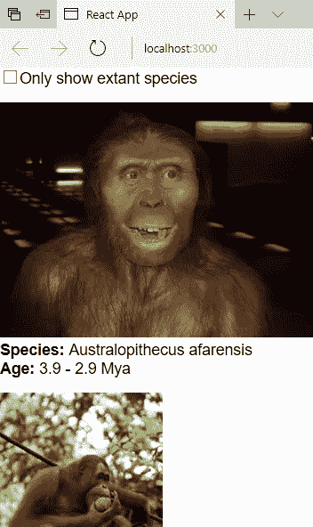

# React 组件测试指南

> 原文：<https://www.sitepoint.com/testing-react-components/>

React 是一个在 JavaScript 开发者社区中取得进展的框架。React 有一个强大的组件设计框架。React 组件是您可以在 web 应用程序中使用的可重用代码。

React 组件不是从 DOM 紧密耦合的，但是它们有多容易进行单元测试呢？在这一次，让我们探索单元测试 React 组件需要什么。我将展示使您的组件可测试的思维过程。

请记住，我只是在谈论**单元测试**，这是一种特殊的测试。(关于不同种类测试的更多信息，我推荐你阅读“ [JavaScript 测试:单元测试 vs 功能测试 vs 集成测试](https://www.sitepoint.com/javascript-testing-unit-functional-integration/)”。)

对于单元测试，我对两件事感兴趣:快速的和令人窒息的反馈。有了这个，我就可以带着高度的信心和代码质量迭代修改。这让你确信你的 React 组件不会死在浏览器上。能够快速获得好的反馈给你一个竞争优势——在当今敏捷软件开发的世界里，你想要保持这种优势。

对于演示，让我们做一个大型类人猿的列表，可以通过复选框过滤。你可以在 GitHub 上找到完整的代码库。为了简洁起见，我将只展示感兴趣的代码示例。本文假设您对 React 组件有一定的了解。

如果您下载并运行演示示例代码，您将看到如下页面:



## 编写可测试的组件

在 React 中，一个好的方法是从组件的层次结构开始。在构建每个单独的组件时，会想到[单一责任原则](https://en.wikipedia.org/wiki/Single_responsibility_principle)。React 组件使用对象组合和关系。

例如，对于巨猿的名单，我有这样的做法:

```
FilterableGreatApeList
|_ GreatApeSearchBar
|_ GreatApeList
   |_ GreatApeRow 
```

看看一个巨猿列表是如何有很多有数据的巨猿行的。React 组件利用了这种组合数据模型，并且它也是可测试的。

在 React 组件中，避免使用继承来构建可重用的组件。如果您来自经典的面向对象编程背景，请记住这一点。React 组件不会提前知道它们的子组件。测试源自一长串祖先的组件可能是一场噩梦。

我会让你自己探索 [`FilterableGreatApeList`](https://github.com/beautifulcoder/test-react-components/blob/master/src/FilterableGreatApeList.js) 。这是一个 React 组件，它有两个单独的组件，我们在这里感兴趣。也可以随意探索它附带的单元测试。

例如，要构建一个可测试的`GreatApeSearchBar`，这样做:

```
class GreatApeSearchBar extends Component {
  constructor(props) {
    super(props);

    this.handleShowExtantOnlyChange = this.handleShowExtantOnlyChange.bind(this);
  }

  handleShowExtantOnlyChange(e) {
    this.props.onShowExtantOnlyInput(e.target.checked);
  }

  render() {
    return(
      <form>  <input
          id="GreatApeSearchBar-showExtantOnly"
          type="checkbox"
          checked={this.props.showExtantOnly}
          onChange={this.handleShowExtantOnlyChange}
        />  <label htmlFor="GreatApeSearchBar-showExtantOnly">Only show extant species</label>  </form>
    );
  }
} 
```

该组件有一个带有标签的复选框，并绑定了一个点击事件。这种方法对你来说可能已经太熟悉了，这是一件非常好的事情。

注意，使用 React，可测试的组件是免费的，开箱即用。这里没有什么特别的——一个事件处理程序、JSX 和一个呈现方法。

层次结构中的下一个 React 组件是`GreatApeList`，它看起来像这样:

```
class GreatApeList extends Component {
  render() {
    let rows = [];

    this.props.apes.forEach((ape) => {
      if (!this.props.showExtantOnly) {
        rows.push(<GreatApeRow key={ape.name} ape={ape} />);

        return;
      }

      if (ape.isExtant) {
        rows.push(<GreatApeRow key={ape.name} ape={ape} />);
      }
    });

    return (
      <div>  {rows}  </div>
    );
  }
} 
```

它是一个 React 组件，具有`GreatApeRow`组件，并且使用对象组合。这是 React 最强大的合成模型。请注意，当您构建可重用但可测试的组件时，缺少继承。

在编程中，[对象组合](https://en.wikipedia.org/wiki/Object_composition)是一种支持数据驱动元素的设计模式。换个方式想，一个`GreatApeList`有很多`GreatApeRow`对象。正是 UI 组件之间的这种关系推动了设计。React 组件内置了这种思维模式。这种查看 UI 元素的方式允许您编写一些不错的单元测试。

在这里，您检查来自复选框的`this.props.showExtantOnly`标志。这个`showExtantOnly`属性通过`GreatApeSearchBar`中的事件处理程序来设置。

对于单元测试，如何对依赖于其他组件的组件进行单元测试？相互交织在一起的组件怎么样？当我们很快进入测试时，这些都是需要记住的重要问题。React 组件可能还有可以解开的秘密。

现在，让我们看一下`GreatApeRow`，它包含了巨猿的数据:

```
class GreatApeRow extends Component {
  render() {
    return (
      <div>    <p className="GreatApeRow-detail">  <b>Species:</b>  {this.props.ape.name}  </p>  <p className="GreatApeRow-detail">  <b>Age:</b>  {this.props.ape.age}  </p>  </div>
    );
  }
} 
```

使用 React 组件，将每个 UI 元素集中在一个关注点上是可行的。当涉及到单元测试时，这具有关键的优势。只要你坚持这种设计模式，你会发现编写单元测试是天衣无缝的。

## 测试实用程序

让我们回顾一下测试 React 组件时我们最关心的问题。我如何独立地对单个组件进行单元测试？事实证明，有一个漂亮的实用程序可以让你做到这一点。

React 中的 [Shallow Renderer](https://facebook.github.io/react/docs/shallow-renderer.html) 允许你渲染一个层次深度的组件。由此，您可以断言关于 render 方法做什么的事实。值得注意的是，它不需要 DOM。

使用 ES6，您可以像这样使用它:

```
import ShallowRenderer from 'react-test-renderer/shallow'; 
```

为了让单元测试快速运行，您需要一种隔离测试组件的方法。这样，你可以专注于一个单一的问题，测试它，并转移到下一个关注点。随着解决方案的增长，这变得越来越强大，您可以随意重构——贴近代码，快速修改，并确信它可以在浏览器中工作。

这种方法的一个优点是您可以更好地考虑代码。这产生了处理手头问题的最佳解决方案。我发现当你不被一大堆干扰所束缚时，这是一种解放。人类的大脑在同时处理多个问题时表现糟糕。

剩下的唯一问题是，这个小工具能用 React 组件带我们走多远？

## 把它们放在一起

比如看一下`GreatApeList`。你想解决的主要问题是什么？该组件基于过滤器向您显示大型类人猿的列表。

一个有效的单元测试是传入一个列表并检查关于这个 React 组件做什么的事实。我们希望确保它根据一个标志来过滤大型类人猿。

一种方法是这样做:

```
import GreatApeList from './GreatApeList';

const APES = [{ name: 'Australopithecus afarensis', isExtant: false },
  { name: 'Orangutan', isExtant: true }];

// Arrange
const renderer = new ShallowRenderer();
renderer.render(<GreatApeList
  apes={APES}
  showExtantOnly={true} />);

// Act
const component = renderer.getRenderOutput();
const rows = component.props.children;

// Assert
expect(rows.length).toBe(1); 
```

注意，我使用 Jest 测试 React 组件。有关这方面的更多信息，请查看“[如何使用 Jest](https://www.sitepoint.com/test-react-components-jest/) 测试 React 组件”。

在 JSX，看一看`showExtantOnly={true}`。JSX 语法允许您设置 React 组件的状态。这为给定特定状态的组件提供了许多单元测试方法。JSX 理解基本的 JavaScript 类型，所以一个`true`标志被设置为布尔值。

单子出来了，`GreatApeSearchBar`怎么样？它在`onChange`属性中有一个可能感兴趣的事件处理程序。

一个好的单元测试是这样做的:

```
import GreatApeSearchBar from './GreatApeSearchBar';

// Arrange
let showExtantOnly = false;
const onChange = (e) => { showExtantOnly = e };

const renderer = new ShallowRenderer();
renderer.render(<GreatApeSearchBar
  showExtantOnly={true}
  onShowExtantOnlyInput={onChange} />);

// Act
const component = renderer.getRenderOutput();
const checkbox = component.props.children[0];

checkbox.props.onChange({ target: { checked: true } });

// Assert
expect(showExtantOnly).toBe(true); 
```

要处理和测试事件，可以使用相同的浅层呈现方法。`getRenderOutput`方法对于将回调函数绑定到带有事件的组件非常有用。这里，`onShowExtantOnlyInput`属性被赋予回调`onChange`函数。

在一个更普通的单元测试中，`GreatApeRow` React 组件怎么样？它使用 HTML 标签显示类人猿的信息。事实证明，您也可以使用浅层渲染器来测试这个组件。

例如，让我们确保渲染一个图像:

```
import GreatApeRow from './GreatApeRow';

const APE = {
  image: 'https://en.wikipedia.org/wiki/File:Australopithecus_afarensis.JPG',
  name: 'Australopithecus afarensis'
};

// Arrange
const renderer = new ShallowRenderer();
renderer.render(<GreatApeRow ape={APE} />);

// Act
const component = renderer.getRenderOutput();
const apeImage = component.props.children[0];

// Assert
expect(apeImage).toBeDefined();
expect(apeImage.props.src).toBe(APE.image);
expect(apeImage.props.alt).toBe(APE.name); 
```

对于 React 组件，一切都以`render`方法为中心。这使得确切地知道您需要测试什么变得有些直观。一个浅层渲染器可以让你在消除噪点的同时聚焦在一个单独的组件上。

## 结论

如图所示，React 组件非常容易测试。没有理由放弃为组件编写好的单元测试。

好的一面是，JSX 在每项个人测试中都为你工作，而不是与你作对。有了 JSX，你可以传入布尔值、回调或者任何你需要的东西。当您冒险自己对 React 组件进行单元测试时，请记住这一点。

浅层渲染器测试实用程序为您提供了良好单元测试所需的一切。它只渲染一层深度，允许你单独测试。您不关心层次结构中任何可能破坏单元测试的任意子元素。

使用 Jest 工具，我喜欢它只给你关于你正在改变的特定文件的反馈。这缩短了反馈回路，增加了激光聚焦。我希望你看到当你处理一些棘手的问题时，这是多么有价值。

## 分享这篇文章