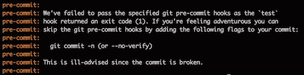
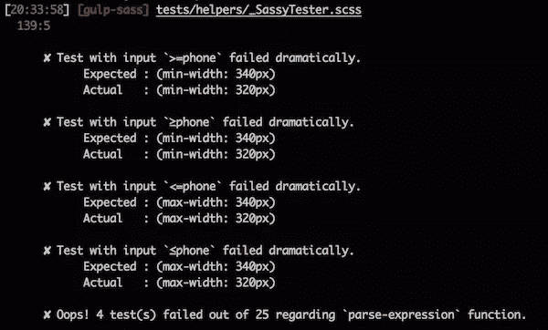

# 测试 Sass 库

> 原文：<https://www.sitepoint.com/testing-sass-library/>

最近，我花了相当多的时间和 Eduardo Bouç as 一起在《T2 包容性媒体》上工作。我们经历了很多重构，所以决定写一些测试，并在每次提交时运行它们，以确保我们没有破坏任何东西。我将在本文中详细介绍这些细节。

如果您还不知道 include-media，它是 Sass 中一个非常轻量级但功能强大的断点管理器。

所提供的公共 API 是一个单独的 mixin，`media(..)`(库名由此而来)，但是整个事情都经过了充分的考虑，因此您实际上可以用它来创造奇迹。开始之前，先举一个简短的例子:

```
.my-component {
 width: 100%;

  // On screens larger or equal to *small* breakpoint,
  // make the component floated and half the size
 @include media('≥small') {
 float: left;
 width: 50%;
  }
}
```

这很棒，不是吗？

总之，我们想出了一个小小的测试系统，我想和大家分享一下。当然，如果你想测试一个完整的框架，你可能想用 Eric Suzanne 的 [True](https://github.com/ericam/true) 来代替，这是一个用 Sass 编写的完整的测试框架，由 David 在 SitePoint 上的[最近的一篇文章](https://www.sitepoint.com/creating-tests-sass-framework)中介绍和解释。

## 有什么想法？

我们希望在提交到存储库时，对库中的主要私有函数进行一些测试。如果任何测试失败，提交将被中止，并且需要修复代码以允许提交通过。这样，我们可以确保在库上安全地工作，而没有破坏它的风险(这通常是一件不好的事情)。

完成这样的事情非常容易:我们设置了一个*预提交* Git 挂钩，在提交之前在 LibSass 和 Ruby Sass 中运行测试。如果测试失败，我们就终止进程。



有不同的方法来运行 Sass 和 LibSass。您可以使用二进制文件，也可以使用包装器。在我们的例子中，我们选择了一个小的 Gulp 工作流，使我们可以轻松地运行 Ruby Sass 和 LibSass。

我们想要非常简单的东西，所以使用 [SassyTester](https://github.com/HugoGiraudel/SassyTester) 用 Sass 编写测试，这是我最近在文章[在 5 分钟内测试一个 Sass 函数](https://www.sitepoint.com/testing-sass-function-5-minutes/)中介绍的。SassyTester 大约有 25 行长。[测试函数](http://hugogiraudel.com/SassyTester/#function-test)仅输出带有测试结果的 Sass 图。从那里，我们可以做任何我们想做的事情。在我们的例子中，我们希望在测试失败时抛出一个错误。为此，我们有来自 Sass 的`@error`指令！

在编译 Sass 测试时，如果 Gulp 任务遇到 Sass 错误，它会退出进程，同时抛出一个错误，这个错误会出现在 pre-commit 钩子上，并最终中止提交。

如果我们总结一下，它是这样的:

1.  一个预提交钩子在提交时运行一个`test`吞咽任务
2.  Gulp 任务编译 LibSass 和 Ruby Sass 中的 Sass 测试
3.  如果测试失败，Sass 抛出一个错误`@error`
4.  Sass 错误被 Gulp 捕获，它自己发出一个错误
5.  咽下错误被中止提交的预提交钩子捕获

到目前为止，一切顺利吗？

## 设置测试架构

建筑这个词听起来很大，但实际上非常简单。这个项目可能是这样的:

```
dist/
|
|- my-sass-library.scss
|
tests/
|
|- helpers/
|   |- _SassyTester.scss
|   |- _custom-formatter.scss
|
|- function-1.scss
|- function-2.scss
|- ...
```

没什么了不起的，是吧？Gulp 任务将简单地对`tests`文件夹中的所有文件运行 Sass 引擎。下面是`function-1.scss`可能的样子:

```
// Import the library to test (or only the function if you can)
@import '../dist/my-sass-library';

// Import the tester
@import 'helpers/SassyTester';

// Import the custom formatter
@import 'helpers/custom-formatter';

// Write the tests
// See my previous article to know more about this:
// http://...
$tests-function-1: ( ... );

// Run the tests
@include run(test('function-1', $tests-function-1));
```

最后但同样重要的是，我们需要重新定义`run(..)`，因为来自 SassyTester 的原始测试输出带有`@error`的测试结果，不管它们是否全部通过。在我们的例子中，我们只想在有错误时抛出。让我们把它放在`helpers/_output-formatter.scss`里。

```
// We overwrite the `run(..)` mixin from SassyTester to make it throw
// an `@error` only if a test fails. The only argument needed by the
// `run(..)` mixin is the return of `test(..)` function from SassyTester.
// You can check what `$data` looks like in SassyTester documentation:
// http://hugogiraudel.com/SassyTester/#function-test
@mixin run($data) {
 $tests: map-get($data, 'tests');

 @each $test in $tests {
 @if map-get($test, 'fail') {
 @error 'Failing test!
 Expected : #{map-get($test, 'expected')}
 Actual   : #{map-get($test, 'actual')}';
    }
  }
}
```

对于一个等价的`run(..)` mixin 的更高级版本，检查[来自 include-media](https://github.com/eduardoboucas/include-media/blob/master/tests/helpers/_SassyTester.scss#L98-L143) 的那个。

## 吞咽工作流程

如果你想对 Gulpy 做一个简短的介绍，请务必阅读我最近的一篇关于它的文章:【Sass 的一个简单 Gulpy 工作流程。对于本节，我假设您熟悉 Gulp。

我们需要三项任务:

*   一个在`tests`文件夹上运行 LibSass(使用 [gulp-sass](https://github.com/dlmanning/gulp-sass)
*   一个在`tests`文件夹上运行 Ruby Sass(使用 [gulp-ruby-sass](https://github.com/sindresorhus/gulp-ruby-sass)
*   一个运行前两个任务

```
var gulp = require('gulp');
var sass = require('gulp-sass');
var rubySass = require('gulp-ruby-sass');

// Run LibSass on the tests folder
// Gulp automatically exits process in case of Sass error
gulp.task('test:libsass', function () {
  return gulp.src('./tests/*.scss')
    .pipe(plugins.sass());
});

// Run Ruby Sass on the tests folder
// Gulp manually exits process in case of Sass error
gulp.task('test:ruby-sass', function () {
  return rubySass('./tests')
    .on('error', function (err) {
      process.exit(1);
    });
});

gulp.task('test', ['test:libsass', 'test:ruby-sass']);
```

理想情况下，当 Sass 抛出错误时(要么是因为内置错误，要么是因为`@error`)，Gulp 应该正确退出。不幸的是，在 gulp-ruby-sass 上有一个关于这个问题的[仍然没有修复，所以对于 Ruby Sass，我们必须自己用`process.exit(1)`提出一个节点*未捕获的致命异常*。](https://github.com/sindresorhus/gulp-ruby-sass/issues/209)

## 添加预提交挂钩

有大量的库可以设置预提交挂钩。我个人喜欢[预提交](https://github.com/observing/pre-commit)，但是你基本上可以选择你喜欢的一个，因为它们都做或多或少相同的事情。

为了给我们的项目添加一个预提交钩子，我们需要在我们的`package.json`中创建一个`pre-commit`键。这个键被映射到一组 *npm 脚本*命令。因此，我们还需要一个`scripts`对象，一个名为`test`的键，映射到 Gulp 命令:`gulp test`。

```
"scripts": {
  "test": "gulp test"
},
"pre-commit": ["test"]
```

提交时，预提交钩子触发并试图执行`test` npm 脚本。这个脚本运行下面的命令:`gulp test`，它通知 Gulp 运行测试。

就这样，我们结束了。

## 最后的想法

正如你所看到的，这个例子非常简单，但是它完成了任务，而且做得很好。下面是它可能的样子:



你觉得怎么样？这是你可能考虑添加到你的库或框架中的东西吗？

## 分享这篇文章