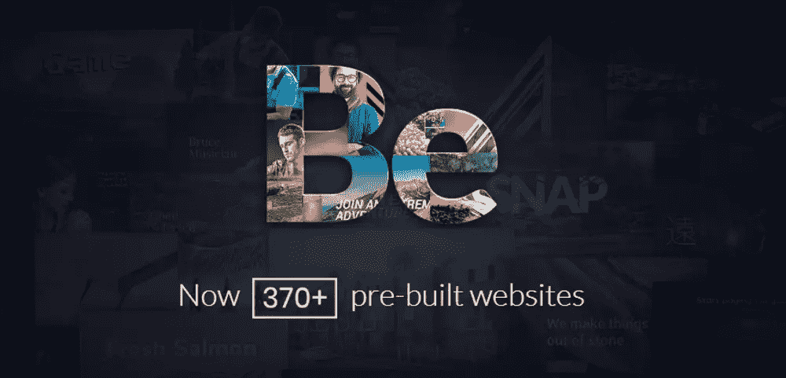
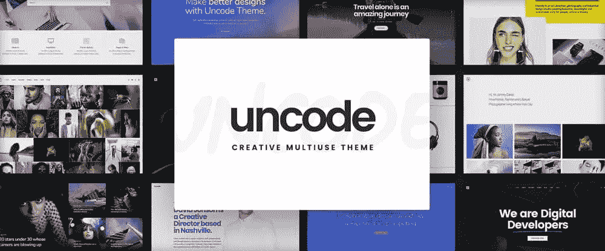
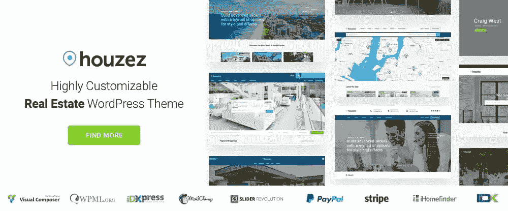
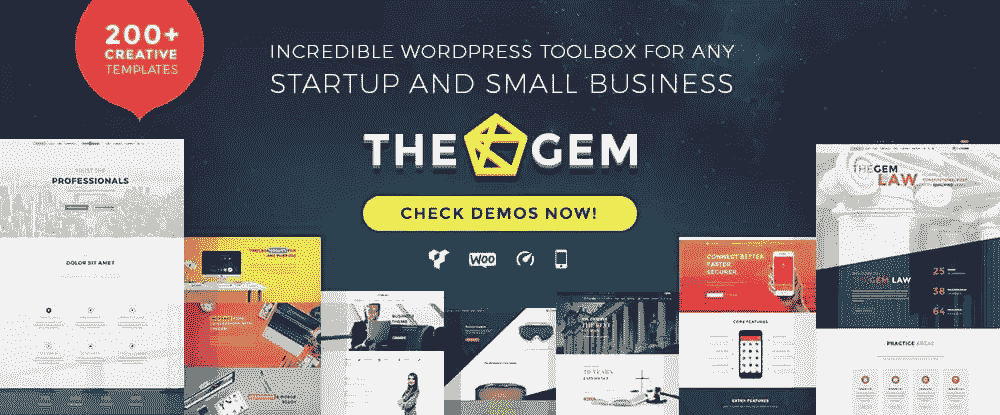
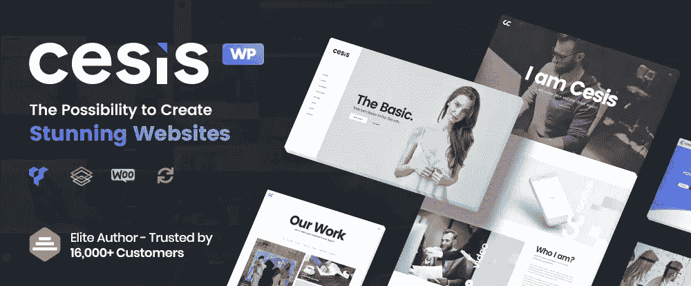
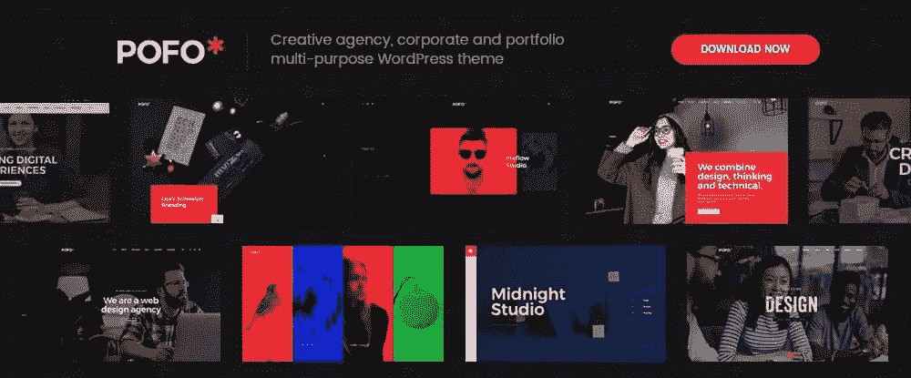

# 小型企业网站的 8 个最佳主题

> 原文：<https://www.sitepoint.com/the-8-best-wordpress-themes-for-small-business-websites/>

*本文是与 [BAWMedia](https://bawmedia.com/) 合作创作的。感谢您对使 SitePoint 成为可能的合作伙伴的支持。*

一个设计良好的网站可以作为一个强大的营销工具。如今，为小企业创建一个一点也不痛苦或昂贵。然而，就在短短几年前。

今天，你可以利用最好的 WordPress 主题所提供的特性。面向小型企业的网站有专门的主题。找到一个与具体业务相匹配的建站主题并不困难。这可能是一家初创公司、一家服务提供商或其他一些企业。

毫无疑问，你只想要最好的商业主题，对吗？看看下面描述的这些。每一款都拥有功能性设计，包含令人惊叹的功能。他们将帮助你创建一个完全吸引人的网站来推广业务。

## 1.[成为主题](http://themes.muffingroup.com/be/splash/?utm_source=sitepoint.com&utm_medium=content&utm_campaign=wpstartups18)

我们将从 Be 主题开始，这是一个反应灵敏的多用途 WordPress 主题，它通过其 370 多个预建网站考虑到了每个小企业的需求。在这个预建的网站集合中有多种小型企业 WordPress 主题——每一个都嵌入了建立有效的在线存在所需的功能，并且完全可定制以满足您的业务和营销需求。

涵盖的商业利基范围令人印象深刻，每个月都有更多的预建网站被添加进来，这注定会变得更加如此。网站设计者喜欢 Be Theme，因为它允许他们在短短四个小时内为大多数小型企业创建一个网站。

客户欣赏他们收到的快速周转，以及他们心目中的改变或增加可以被容纳的容易程度。

Be Theme 是小型企业网站最好的 WordPress 主题之一，是 ThemeForest 前五大畅销书，其核心功能包括易于使用页面构建工具，多种设计功能和选项，以及强大的支持。

## 2.[阿斯特拉](http://bit.ly/2wxuUpA)

Astra 速度快，完全可定制，是商业网站、博客和个人作品集的最佳 WordPress 主题之一。Astra 以 SEO 为理念，响应迅速，并为 WooCommerce 做好了准备——这是当今在线商业环境中的必备功能。它的功能可以很容易地通过额外的插件扩展，Astra 可以和大多数流行的页面生成器一起使用。这个基于 WP 的免费主题绝对值得考虑。

## 3.[第 100 章](http://bit.ly/2oiQkTS)

为 WordPress for small businesses 选择的主题可以是免费的，也可以是需要为你付费的高级主题。市场上有几个优秀的免费主题，其中之一就是 100。虽然它被宣传为具有类似高级的功能，但请记住，像这样的免费主题通常无法与高级主题竞争。然而，100 是一个易于使用的 WP 主题，具有多种布局和大量定制选项。

## 4.[未编码——创意多用途 WordPress 主题](https://undsgn.com/uncode/?utm_source=sitepoint.com&utm_medium=content&utm_campaign=wpstartups18)

Uncode 已经被证明是商业网站最好的 WordPress 主题之一。这是一个多功能主题，包含 30 多个主页概念，旨在让设计师和他们的客户在任何小型商业网站上快速起步。功能包括流行的 Visual Composer 页面生成器的增强版本，以及自适应图像系统，使移动用户能够看到您想要和期望他们看到的内容。

## 5.[Houzez——高度可定制的房地产 WordPress 主题](http://houzez.co/?utm_source=sitepoint.com&utm_medium=content&utm_campaign=wpstartups18)

一些 WordPress 主题是有特定目的的。Houzez 是一个专业主题，提供房地产经纪人和房地产机构寻求的特性和功能，以促进他们的业务和市场。Houzez 的功能包括先进的物业搜索过滤器，IDX 系统，物业管理功能，和坚实的客户支持。

## 6.[the gem–创意多用途高性能 WordPress 主题](http://preview.themeforest.net/item/thegem-creative-multipurpose-highperformance-wordpress-theme/full_screen_preview/16061685?sort_priority_group=meta-smallbusiness-startups&utm_source=baw&utm_medium=listing&utm_campaign=smallbusiness)

毫无疑问，TheGem 是市场上最好的 WordPress 商业主题之一。它的用户喜欢使用作者根据他们对当前 UX 趋势的分析提出的时尚设计概念。Visual Composer 是网站的页面生成器，一组精心挑选的插件为网站设计者提供了满足任何小型企业需求的灵活性。该套餐包括一个现成的网上时装商店。

## 7. [Cesis —响应式多功能 WordPress 主题](https://cesis.co/ts/rs.php?theme=cesis&utm_source=bawmedia&utm_medium=article&utm_campaign=bawmedia_cesis_sep2018&utm_content=post)

当你在为小企业网站寻找最好的 WordPress 主题时，Cesis 绝对值得一试。其易于使用的界面结合了大量的设计元素和选项，让您几乎可以构建任何您想要的东西。在与小企业和初创公司合作时，这是一个重要的属性，它们都有自己独特的商业模式和品牌风格。

## 8.[Pofo–创意作品集和博客主题](http://wpdemos.themezaa.com/pofo/?utm_source=sitepoint.com&utm_medium=content&utm_campaign=wpstartups18)

需要小型企业 WordPress 主题的网页设计师包括那些客户代表创意团队和机构以及艺术家个人的人。Pofo 是一个理想的选择，它拥有投资组合、电子商务和博客功能、捆绑插件和 150 多个预建的设计元素。这个高级主题包还包括一个很好的主页和 200 多个演示页面。Pofo 是完全响应，视觉震撼，高度灵活，搜索引擎优化和加载速度优化。

## 结论

你喜欢这个为小企业网站选择的最佳主题吗？它为你提供了广泛的选择，值得仔细研究。

你真的不能做一个糟糕的选择。稍加努力，你应该可以得到一个完美的 WordPress 主题。它非常适合创建你心目中的小型商业网站。同样，它可以帮助你为小企业创建一系列网站。

## 分享这篇文章