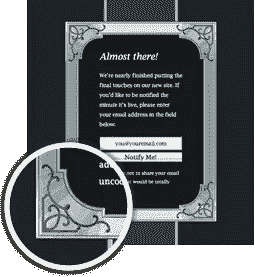
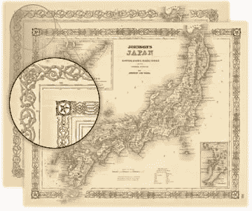
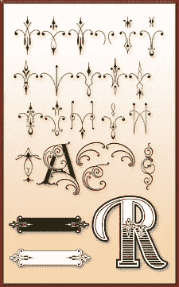
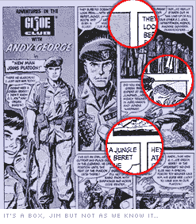

# CSS 圆角的艺术与科学(及其他)

> 原文：<https://www.sitepoint.com/the-art-science-of-css-rounded-corners-and-beyond/>

现在你可能已经注意到了，我们新的高级 CSS 书籍——[CSS 的艺术&科学](https://www.sitepoint.com/books/cssdesign1/)——已经在网站上正式发布，尽管如果你已经看过的话，它已经有一段时间了。

如果你有兴趣，但直到现在还没有购买，你很幸运。使用此链接获得 10 美元的折扣*CSS 的艺术&科学*外加选择一张免费海报(DHTML/CSS/Linux/PHP) 。

*   [CSS 的艺术&科学+免费海报](https://www.sitepoint.com/premium/library)= 29.95 美元+运费

**别搞错:** [此优惠](https://www.sitepoint.com/premium/library)从今天起一周后自动过期，如果您想使用此折扣链接，请不要等太久。

谈到书的内容。

《艺术与科学》(第 6 章)中有整整一章致力于圆角的实现。看看过去 5 年里所有关注这个问题的在线工具、文章、博客帖子、挠头和有时咬牙切齿，这可能并不令人惊讶。

然而，正如纪娜在她的“[打破盒子](https://www.sitepoint.com/article/breaking-out-of-the-box)”专题文章中所展示的，人们有时很容易忘记，许多在“圆角”下提出的技术比普通的老式弯曲盒子更有能力。我很喜欢书中的一个例子是这个(左)仿镀银的新艺术画框。

为了让你在圆形广场之外思考，我想我们可以看看一些替代的*非圆形*角落设计选项，带有一种“*古老世界的感觉* (ey)”。

1)  **地图**

国王和王后总是喜欢好的地图，并乐意为它们支付一大笔钱，所以制图学总是吸引着他们那个时代技能最高的工匠。这些人对他们的成品非常自豪，他们的作品很少缺少迷人的细节或周到的装饰。

还有一批[古董](http://www.antiquemapsandprints.com/JOHNSON62.htm) [地图](https://www.carto.com/cgi-bin/web_store/web_store.cgi?page=asia.html&catagory=yes&cart_id=3626_9726) [古迹](http://www.oldworldauctions.com/Auction086/ow-asia.htm)都摆了出来，蕴含着丰富的潜在灵感。

2). **装饰艺术**

许多艺术装饰的线性似乎使它成为转化为 CSS 布局的完美选择，所以直到现在它在在线设计中被如此保守地使用就有点令人惊讶了。幸运的是，对我们来说，许多装饰艺术/新艺术设计已经被转化为可以直接使用的矢量或字体。Golden Studios 出售一系列令人印象深刻的矢量边框和老美国风格艺术，非常适合转化为在线设计。你也可以在[专业字体](http://www.specialtyfonts.com/deco/dings.htm)找到一个不错的选择，它可能会让你的思维过程发生转变。

3). **漫画和手绘艺术**

虽然漫画书似乎是盒子设计的缩影，但我认为它们松散、不完美的盒子绘制方式也有好处——特别是对于习惯了大多数 HTML 激光般锐利线条的眼睛来说。漫画书的单元格边界不断超过它们的角点，没有什么是完全垂直的。

当然，这就是它的魅力所在，使用一种标准的圆角技术将这种有机的、松散的感觉提炼到灵活的 CSS 布局中并不十分困难。

当使用这些类型的设计技巧时，我试图记住两件事。首先，无论你如何努力，像这样独特的风格元素并不适合每个项目。试图给个人电脑零售商网站一种“维多利亚时代”的感觉可能是行不通的——除非你是一个设计天才。

其次，引用过往作品时尽量不要太过*字面。例如，如果你使用地图图像来为一个新的博客设计增添趣味，不要试图在设计中重新创建整个地图——挑选一些好的元素来增加趣味，然后在设计中淡化它们。*

 *当然，几乎有无穷无尽的可能性。希望这至少能让你头脑清醒。

****附:别忘了:[如果你想要这本书，请确保使用此链接锁定 10.00 美元的折扣](https://www.sitepoint.com/premium/library)。*** 

## *分享这篇文章*