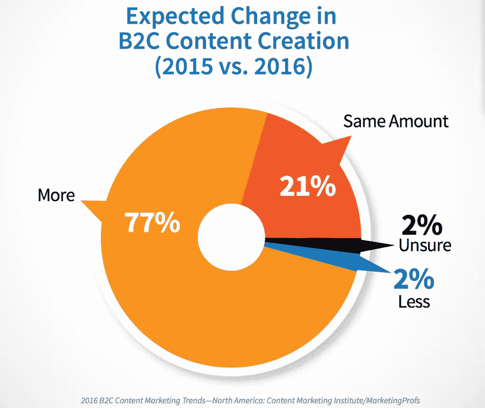
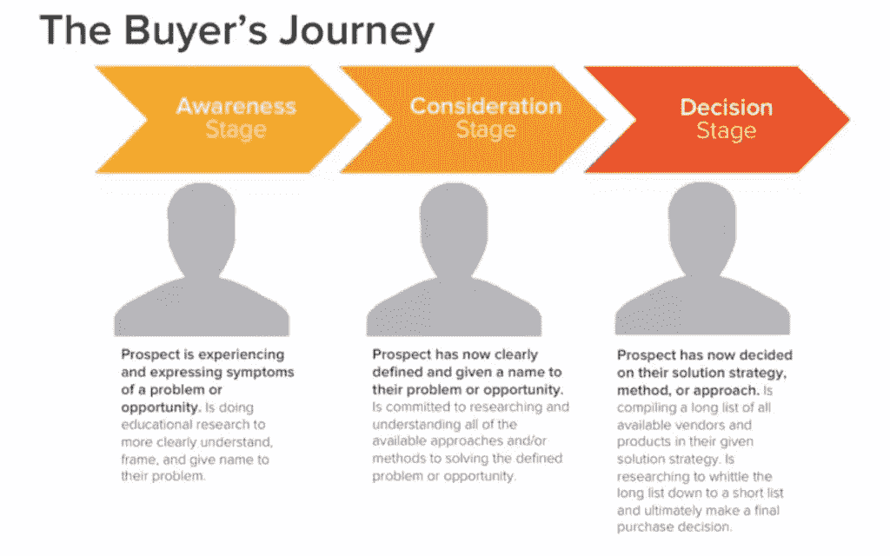
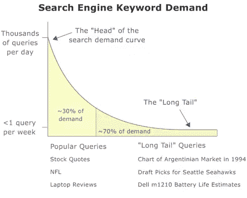
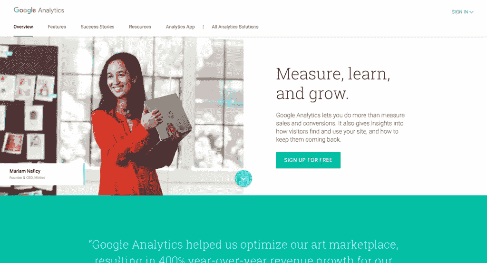
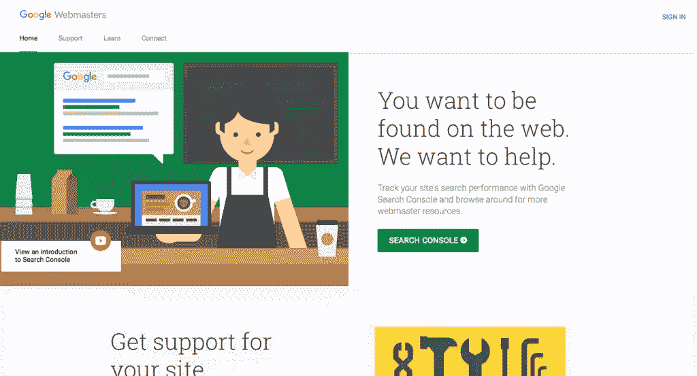
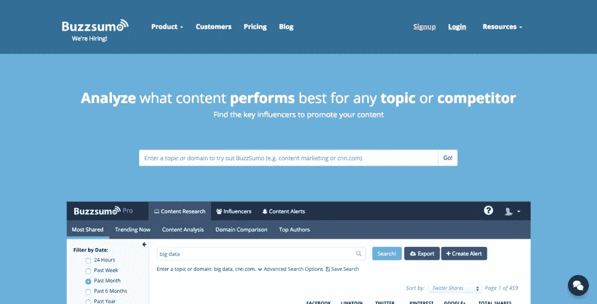

# 内容策略初学者指南

> 原文：<https://www.sitepoint.com/the-beginners-guide-to-content-strategy/>

如今，每个人似乎都爱上了内容营销。从传统行业，到最小和最灵活的初创公司，各行各业的营销人员都表示，他们计划在 2016 年及以后更多地投资内容。

[图像来源](https://contently.com/strategist/2015/12/17/state-of-content-marketing-2016/)

然而，对许多人来说，内容营销仍然令人困惑。理解基本逻辑很容易，但是组织你的努力为你的企业获得切实的结果是一个完全不同的故事。

如果你是一个想探索内容营销的人，但是不知道从哪里开始，我们的内容策略指南将会派上用场。我们将逐步涵盖您开始所需的一切。

首先也是最重要的是，要明白为什么要投资内容。

## 定义业务基本原理

许多人认为做这种类型的营销所需要的是…生产内容。但是在你考虑写你的第一篇博文之前，你必须非常清楚从事内容营销的商业原因。

定义你的商业理念是内容营销和博客的区别。

你必须考虑的一些商业方面是什么？

### 为什么要用内容？

你最初为什么要创作内容，你希望用它来达到什么目的？许多企业主开始认为，他们在制作内容方面的努力将带来直接销售，但当这种情况没有大规模发生时，他们发现自己很失望。

建立信任是内容营销的关键。把它当成一项长期战略，建立你的总体声誉，并与你的观众建立纽带，随着时间的推移，这种纽带会越来越牢固。

### 你的独特主张(竞争优势)是什么？

你的企业所提供的没有一个竞争对手可以复制的东西是什么？它可以是任何东西，从一个优秀的产品到拥有对你的业务非常了解并且总是愿意超越帮助你的客户的员工。

围绕你的竞争优势构建你的内容策略对你的业务是有益的，因为随着时间的推移，你的受众会将你的业务与它联系起来。

想想像 [Buffer](https://buffer.com/) 和 [HelpScout](https://www.helpscout.net/) 这样的品牌，以及他们如何将他们想要出名的东西(卓越的客户服务)与他们制作的内容、他们撰写的主题，甚至他们在沟通渠道中发出的声音和语气联系起来。

### 你的内容营销目标是什么？

最后，在这个阶段，认真思考你想通过内容营销实现的具体商业目标。以下是人们对内容的一些典型目标:

*   提高对公司和产品的认识
*   建立声誉
*   为 salesforce 生成销售线索
*   在销售周期中帮助培养销售线索
*   教育潜在或现有客户如何使用产品/服务，以提高采用/保留水平
*   创造新的销售额

通常，你的内容策略应该集中在这些目标中的一个或两个上。如果你超越了这一点，你的努力就有变得过于分散的风险。

在这个阶段，弄清楚你将如何衡量你的进步是非常重要的。在你提出你的高层次目标后，花些时间用一组你将跟踪的关键绩效指标(或 KPI)来补充它们。

为了感受一下整个步骤在实践中的样子，这里有一个例子:

大多数内容营销策略的目的是为他们经营的业务创造商机。在过去的几年中，人们发现最有效的方法是收集电子邮件，所以我们看到了网络上所谓的“电子邮件收集技术”的激增(你上次访问网站而没有被要求提供电子邮件是什么时候？).

如果你的内容策略属于同一类别，一个很好的 KPI 跟踪是你的电子邮件列表的大小。

现在你已经完成了内容营销策略的初始阶段，你可以开始深入研究它的技术细节了。

## 找出你的目标受众

每一个内容策略都应该从受众开始。作为这一策略的一部分，你创建的每一个内容都将针对特定的受众。如果你不知道这个人是谁，你的努力就白费了，因为没有针对性。

您的内容受众可能与您现有的客户群不同(尤其是如果您想将您的内容瞄准一个新的细分市场)，但您当前的客户是一个很好的起点。

### 创建营销角色

营销人物角色(有时也称为“客户化身”)是营销人员的一个很好的工具。使用它们来创建你的梦想客户/读者的风格化版本，并在创建你的内容时记住它们。

这些头像很棒，因为它们有双重用途:

*   他们让您的整个组织保持在同一页面上，通过查看您的头像，团队的每个成员都知道他们在与谁交谈，这将帮助您在与该客户的所有互动中保持一致的信息和语气。
*   他们帮助你使你的声音人性化——当你清楚地知道你在为谁制作时，像人一样说话就容易多了。

[Buffer 拥有丰富的资源，可帮助您开始使用客户头像](https://blog.bufferapp.com/marketing-personas-beginners-guide)。

### 你的观众的需求是什么？

现在你已经清楚地了解了你的理想听众，弄清楚他们的需求和痛苦是什么。

围绕这些内容创作内容是留下印记、吸引你的观众并与他们建立信任的最可靠的方法(只有当你能证明你有能力解决这些难题时)。

### 对你的读者/客户来说，买家之旅是怎样的？

发现你的受众的最后一个要素是很好地理解你的潜在顾客的购买之旅。由 Hubspot 制定的主要阶段[是**意识、考虑和决策**。](http://academy.hubspot.com/broadcasts/the-buyers-journey)

[来源](http://blog.inalign.com/content-mapping-for-the-buyers-journey)

思考你的听众在每个阶段的话题和问题，以及他们会去哪里得到这些答案。在制定策略的这一阶段，您的发现将指导您决定以什么主题制作内容以及如何分发内容。

现在你知道了你为什么要使用内容营销，以及你想以谁为目标，你可以进入战略的实施阶段了。首先要回顾你已经制作了哪些内容，以及这些内容对你想要接触的受众的服务效果如何。

## 审核您现有的内容

你可能会想，作为一个初学者，这是一个你可以合法跳过的步骤。如果你刚刚开始创业，还没有网站，情况很可能就是这样。

如果你的公司已经存在了一段时间，你有一个网站(即使它不包含'博客'部分)，你已经有一些现有的内容。你需要清楚地了解这些内容在你的总体战略中的位置。

执行[内容审核](https://www.sitepoint.com/how-to-content-audit/)，将您现有的内容与业务目标、您的受众和购买者的旅程联系起来——所有这些我们已经在上面讨论过了。

如果你已经有了内容营销的经验，并在这方面付出了一些努力，那么 Buffer 描述的[内容矩阵](https://blog.bufferapp.com/content-marketing-strategy#existing)这样的工具可能会有助于了解哪些部分表现良好，哪些部分需要改进，哪些部分应该彻底废弃。

## 查找主题以生成内容

太多的营销人员从这里开始，跳过前面章节描述的步骤。接下来，他们发现自己很难找到有意义的话题，或者从他们制作内容的努力中看不到什么好处。

希望，如果你花时间应用发现观众的方法，创造一个策略，并计划实施它，你会发现这一步不那么具有挑战性。

如果你想找到你的观众想要消费的话题，你仍然需要投入时间和精力。

### 了解你的听众的语言

首先，你不仅需要非常清楚你的潜在买家想要解决什么问题，还要知道他们如何谈论这些问题。使用你的听众理解的语言和了解他们关心的话题一样重要。

幸运的是，在网上有很多地方你可以见到你的读者。Quora 是一个很好的地方，也是一个很好的研究工具，但是还有很多热门论坛、 [Reddit](https://www.reddit.com/) 目录等等，你可以用来做研究。

### 做关键词研究

[SEO 和有机流量仍然在内容营销中发挥着重要作用](https://www.sitepoint.com/why-content-is-the-new-seo/)。忽视它们将是一个严重的错误。

许多营销人员仍然犯的另一个错误是只关注最流行的(因此也是最有竞争力的)关键词。大量证据表明，长尾关键词会带来大量流量，也更容易排名:

[图像来源](https://moz.com/blog/rewriting-the-beginners-guide-part-v-keyword-research)

在 Quora、Reddit 和其他类似的论坛上花足够的时间，会让你了解目标受众谈论他们关心的话题时使用的主要术语。它甚至会给你一些关于具体话题和问题的想法，你想用你的内容来回答。

然而，一旦你知道了大致的话题，你就可以使用[谷歌的关键词规划器](https://adwords.google.com/KeywordPlanner)，以及像 [Ubersuggest](https://ubersuggest.io/) 和 [KeywordTool.io](http://keywordtool.io/) 这样的网站来发现围绕相同话题的长尾关键词。

### 监视你的竞争对手

当考虑竞争对手时，你不应该局限于提供与你完全相同的产品(或服务)的其他公司，而是应该关注与你瞄准相同受众并为相同美元而战的每个人。例如，如果你是一家为 WordPress 网站提供支持和调整的公司(例如像 [WPCurve](http://wpcurve.com/) )，你的竞争对手包括几乎所有在 [Upwork](https://www.upwork.com/) 的自由职业 WordPress 开发者。

花时间找出谁是你真正的竞争对手。选择你想在谷歌上排名的前 5-10 个关键词，进行匿名搜索，看看目前表现最好的是谁。仔细分析前 10-20 个搜索结果，看看他们做对了什么，并为你自己的内容获得灵感。

留意你的竞争对手定期发布的内容(使用 [feedly](https://feedly.com/) 将所有内容放在一个地方)。与此同时，创建一个在内容营销方面做得很好的公司的控制组，这样你就可以用你自己的内容来模仿，阅读和分析他们发布的所有内容。

如果你需要一些灵感，这里有一些我最喜欢的:

*   [帮助童子军](https://www.helpscout.net/blog/)
*   [缓冲器](https://blog.bufferapp.com/)
*   尼尔·帕特尔
*   [协同日程](http://coschedule.com/blog)
*   [quick prout](https://www.quicksprout.com/blog/)
*   马特·巴比

### 将您的话题与买家的旅程对应起来

了解你的受众、他们关心的话题和他们使用的语言是很重要的，但是在内容营销的商业方面取得成功意味着你应该能够将这些读者中的一部分转化为付费客户。

为了做到这一点，你应该了解他们在决定为新产品/服务付费时的决策过程，并在每个阶段制作内容。

仅仅关注旨在“达成交易”的内容是一个严重的错误。

首先，如果你没有针对购买周期的前两个阶段(认知和考虑)的内容，你可能没有与你的读者建立关系，所以你必须在短时间内告诉他们关于你的出色解决方案的一切，这意味着你的内容可能听起来很有卖点(不是一件好事)。

第二，正如我们在开始时所讨论的，内容营销是在尝试任何其他目标之前建立信任——只关注购买者旅程的最后阶段意味着你甚至不能开始参与这项活动。

实际上，这看起来像是低绩效和低投资回报率的内容营销。

## 制定你的战略计划

在这一步，你应该计划内容策略的战术方面。确保你考虑周全的一个简单方法是回答以下五个问题。

### 我们什么时候出版？

你多久会努力发布一次内容？是每个工作日发一篇博文比较好，还是一周两次就够了？

在数量和质量之间做出选择时，我的建议是始终首先关注质量。不管你制作了多少内容，也不管你有多擅长分发，质量是内容营销最重要的元素。

此外，一旦你达到了数量，就更容易扩大规模，而不是一旦你走下坡路，每周生产几件，就提高质量。

无论你确定了什么样的时间表，一定要把它记录下来——创建一个日历并坚持下去。最好的工具之一就是[协同日程](http://coschedule.com/blog)，但是你可以使用 [Trello](https://trello.com/) 的完全免费版本来创建一个伟大的内容日历。

### 谁参与了内容战略？

谁拥有整个过程？如果与制定策略的人不是同一个人，如何进行移交，以确保内容经理理解目标、动机等。？

在这个阶段，确定团队的其他成员是否会参与，如果会，如何参与也很重要。向团队明确期望，并回答团队成员可能提出的任何问题。有一个书面的策略将确保所有关于你的观众的知识，他们的需求等。很容易传递给参与内容营销工作的每个人。

有时你可能更喜欢外包你的内容营销，至少是部分外包。在这种情况下，你需要弄清楚你将把什么任务分配给外部贡献者，你需要他们具备什么技能，你将在哪里找到他们，以及你需要留出什么资源来做这件事。在网上有很多地方，你可以找到作家、编辑、图形艺术家，甚至内容战略家。

### 你的内容将放在哪里？

一旦你习惯了你的组织发布的每一个社交媒体更新都是内容的概念，你就会明白它也有许多可以存在的位置。

规划放置内容的位置也很重要，因为这将推动受众对该内容的反应，即一旦他们消费完一条内容，他们会做什么。请这样想:如果你有一段视频内容，如果单个观看者在你的网站和 YouTube 上观看，他们的行为会有什么不同？

无论你的视频质量如何，YouTube 以其他视频的形式提供了如此多的干扰，以至于观众很可能在几分钟后就不记得你的品牌了。

### 你打算关注什么类型的内容？

内容类型是内容营销战略组合中另一个值得仔细考虑的因素。它们应该与您的战略的所有其他方面保持一致，不仅仅是哪种格式最适合每种类型的内容，还包括在购买者的旅程中的哪一步将使用它，以及谁将消费它。

例如，在购买者旅程的认知阶段，博客帖子可能是最合适的(因此也是最常见的)载体，因为它为您提供了可发现性与打动和吸引受众的能力之间的最佳组合。

然而，在买家旅程的后期阶段，这可能看起来非常不同。考虑一家公司的情况，在 B2B 环境下销售一种复杂(且昂贵)的产品。在这种情况下，在客户端进行研究的人(即内容消费者)很可能不是唯一/最终的决策者。他们可能喜欢你的产品，但他们需要帮助说服他们的经理采用它。

您的内容类型是您需要调整以服务于内容的商业目的的基本元素。在本例中，比较功能和/或价格的可下载单页备忘单是一份很好的内容，您的主要内容消费者可以打印出来并交给他们忙碌的经理。

### 你将如何分发你的内容？

推广你的产品应该至少占用你投入内容营销的一半时间/精力/金钱([一些营销人员甚至说应该是 80/20 分割的 80 部分](http://sujanpatel.com/content-marketing/80-20-rule/))。

这听起来可能有点过分，但是请这样想——如果没有人阅读你的内容，那么你花在制作内容上的时间就是 100%的浪费。

投入资源制定扩大计划，并安排团队实施该计划。

## 打造你的内容营销品牌

因为信任和建立关系是内容营销的一个主要目标，所以你也需要花时间去思考让你的内容营销品牌令人难忘的因素。

首先，你需要提供一致的、可扩展的体验。这将需要多个人的参与，有些人可能是你团队的外部成员。

在流程文档和风格指南中记录所有流程和约定。这将允许您快速扩展您的运营，加入内容团队的新成员，并保持所有内容的一致质量水平。

内容品牌的另一个重要元素是你在内容中使用的声音和语气。你的声音是关于你使用的词汇类型、正式/非正式程度等的一系列约定。而你的语气决定了这在不同的读者群(潜在客户、现有客户等)中的变化。)和情况(考虑购买、寻求帮助、因产品/服务出现问题而投诉)。

## 制作您的内容

最后，我们已经到了坐下来为你的网站制作内容的时候了。当然，这是很有象征意义的，因为你可以将整个制作过程外包出去(无论是外包给个人贡献者还是内容营销代理)。

然而，作为内容策略师，对您来说重要的是管理内容制作的过程，以便您能够按时交付高质量的内容。

我不是唯一一个发现 Trello 在这方面特别有用的内容营销者。它不仅可以让您鸟瞰整个运营，而且它还具有一系列支持协作的功能。

Trello 的团队已经就如何使用该工具作为内容日历制作了一份指南。

## 实施你的扩张计划

忘记“建立它，他们就会来”——当你发布内容的时候，你需要开始努力让尽可能多的人看到它。

希望你已经有了一个如何实现这个目标的书面计划。利用你的时间和资源来实施这个计划。

## 衡量成功，调整你的策略，重复

说你需要根据一系列关键绩效指标来衡量你的内容营销工作的成功并不具有开创性，但是很少有营销人员走得够远。

无论数据驱动程度如何，每项战略都依赖于一些假设——关于你的客户是谁，他们的痛点等等。然而，一旦你完成了发布内容的反馈循环，你需要尽最大努力来验证这些假设，并确保你的策略是正确的。

在分析你的表现时，不要局限于网站访问和社交媒体分享。无论你的内容营销目标是什么，你都需要有方法来衡量它们，并用你的分析工具来跟踪这些目标。

然后，您必须跟踪和分析各个方面是如何影响这些内容的—内容类型、资产的长度、发布时间等。

至少，您应该使用以下工具:

### [谷歌分析](https://analytics.google.com/)

分析拥有衡量绩效所需的所有功能。最重要的是，谷歌正在利用它对数百万网站数据的访问权，为你提供其他解决方案无法提供的信息和功能。如果你不知道我在说什么，就看看人口统计报告吧。

而且是免费的。

### [谷歌搜索控制台](https://www.google.com/webmasters/tools/)

你需要这个工具来跟踪你的网站的搜索引擎优化性能。你可以将它链接到你的谷歌分析账户，获得额外的数据，但搜索控制台本身也非常有用，尤其是在跟踪排名、决定改善或建立什么内容资产等方面。

也免费。

### [冰帽](http://buzzsumo.com/)

Buzzsumo 特别适用于研究你感兴趣的主题，并查看哪种类型的内容在每个主题上受到观众的点击，但也可以用于分析你自己的内容。

在免费版上，它会给你在给定时间段内分享最多的内容的信息。有用，因为它包括 Twitter 上的共享数据，而大多数类似的工具都不再支持。

然而，Buzzsumo 的付费计划非常强大(不可否认，每月 99 美元相当昂贵)。您可以下载您的社交共享数据，并将其用于内容性能分析。

您还可以看到哪些人分享了您的内容，哪些人是其中的影响者，并使用这些信息来改进您的推广计划。

## 该是谈正事的时候了

一旦你采用结构化的方法，内容营销看起来就不那么可怕了。你唯一的挑战是花时间制定你的策略并坚持不懈地实施它。

请记住，在您的策略中要始终考虑以下因素:

*   你为什么做内容营销？你的商业目标是什么？
*   你在为谁创作内容？谁是你的观众？
*   你的观众有哪些痛苦？你需要涵盖哪些主题？
*   你将如何把你的内容传达给你的观众？
*   你将如何衡量你的内容营销的成功？

我希望你觉得这本书很有用。我很乐意回答你的问题，听听你对内容的体验——请在评论中告诉我。

## 分享这篇文章