# Linux 的最佳降价编辑器

> 原文：<https://www.sitepoint.com/the-best-markdown-editor-for-linux/>

使用 Markdown 语法是我喜欢的写作方式。我用它来为网络创建内容，并记下简单的笔记。这是一种简单、极简的格式化文本写作方法，效果很好，而且不会把你束缚在一个专有系统中。这与 Linux 的理念非常契合。

它正在流行。自从约翰·格鲁伯在 2004 年创造了它，它已经越来越多地被用在网上和各种类型的应用程序中。值得学习。你会在 Gruber 的 [Daring Fireball](https://daringfireball.net/projects/markdown/syntax) 博客和我们的[免费可打印减价备忘单](https://www.sitepoint.com/grab-our-free-printable-markdown-cheat-sheet/)上找到语法。

有很多针对苹果电脑和 T2 视窗的降价编辑器。Linux 有什么可用的？我将在下面列出你的主要<abbr title="free and open-source software">自由/开源软件</abbr>和非自由/开源软件选项，并在最后提出一些建议。

让我们开始吧。

## 13 个支持降价的文本编辑器

您可以使用您最喜欢的 Linux 文本编辑器来编写 Markdown。您可能会发现它对 Markdown 有本地支持，或者有 Markdown 扩展或插件可用。以下是一些例子:

1.  [Vim](http://www.vim.org/) 拥有 [vim-markdown](https://github.com/plasticboy/vim-markdown) 和 [vim-instant-markdown](https://github.com/suan/vim-instant-markdown) 插件，这些插件具有语法高亮和折叠功能。
2.  GNU Emacs 有一个 Emacs 包的[降价模式，包括快捷键和语法高亮。](http://jblevins.org/projects/markdown-mode/)
3.  Spacemacs 有一个[降价层](https://www.spacemacs.org/layers/+lang/markdown/README.html)来增加降价支持。
4.  [Bluefish](http://bluefish.openoffice.nl/index.html) 包含降价文件的语法高亮显示。
5.  [Eclipse](https://eclipse.org/) 有 [Markdown 文本编辑器](https://marketplace.eclipse.org/content/markdown-text-editor)插件，它包括文档大纲、折叠部分、预览、导出到 HTML、任务标签、自动换行和段落格式。
6.  [Gedit](https://wiki.gnome.org/Apps/Gedit) 包含降价文件的语法高亮显示。
7.  Geany 提供了带有预览和语法高亮显示的 [Markdown](https://plugins.geany.org/markdown.html) 插件。
8.  KDE 文本编辑器 Kate 支持 Markdown 语法高亮显示。
9.  Atom 支持现成的 Markdown，具有语法高亮和预览等特性。这个功能可以通过几个社区生成的包来扩展，包括 [Markdown-Writer](https://atom.io/packages/markdown-writer) 、 [Markdown-Scroll-Sync](https://atom.io/packages/markdown-scroll-sync) 和 [Markdown-Format](https://atom.io/packages/markdown-format) 。
10.  [Notepad++](https://notepad-plus-plus.org/) 允许你使用 [MarkdownViewer++](https://github.com/nea/MarkdownViewerPlusPlus) 插件添加降价支持。
11.  [Sublime Text 3](https://www.sublimetext.com/) (不是 FOSS)可以变成一个全功能的 Markdown 编辑器。[我们在这里向你展示如何](https://www.sitepoint.com/sublime-text-perfect-blogging-6-ways/)。
12.  Visual Studio 代码(不是 FOSS)提供了许多 [Markdown 扩展](https://code.visualstudio.com/docs/languages/markdown)。这些允许您预览和编译 Markdown 文件，并提供一个折叠标题的大纲视图。
13.  [VSCodium](https://vscodium.com) 是 Visual Studio 代码的开源版本，没有遥测和跟踪功能。

## 10 个基于文件的降价编辑器

许多 Markdown 编辑器像文本编辑器和 ide 一样工作，允许您编写或编辑单个文件。这些提供了在大多数文本编辑器中找不到的额外有用功能，包括:

*   语法突出显示和预览窗格
*   快捷键
*   将 Markdown 导出/转换为 HTML、PDF、ODT 等格式
*   不受干扰的写作环境
*   字数统计、文档统计和拼写检查
*   高级格式，包括表格和数学表达式。

### 1.撇号

撇号是一个不受干扰的 Markdown 编辑器，界面优雅简约。它是最初开发者对 [UberWriter](https://itsfoss.com/uberwriter/) 的一个分支，是一个受 iA Writer 启发的应用。

*   执照:GPLv3
*   工具包:GTK+
*   最后更新时间:2021 年
*   其他平台:不适用

> 用 GTK+制作的 GNU/Linux 免费 Markdown 编辑器

**如何安装:**官方网站包括如何使用 GNOME Builder、Git 和 Flatpak 构建撇号的说明。

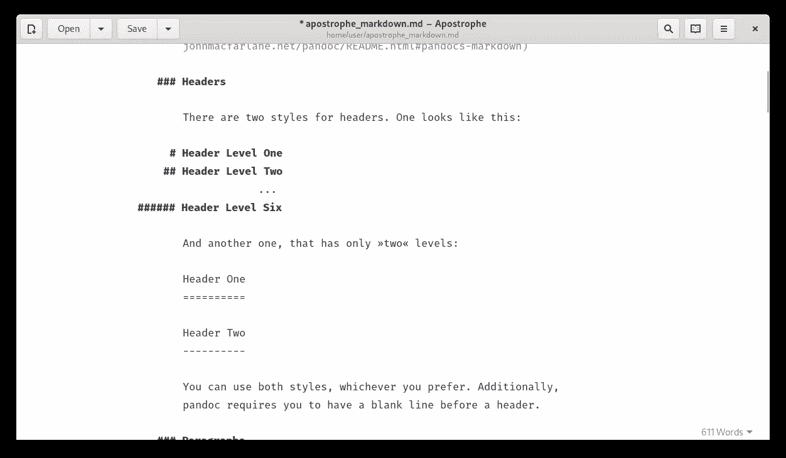

### 2.标记文本

[Mark Text](https://marktext.app) 是一个简单优雅的 Markdown 编辑器，为满足作者自己的写作需求而编写，基于电子框架。扩展支持数学表达式(KaTeX)、front matter 和表情符号，并且可以导出为 HTML 和 PDF 文件。各种明暗主题都有。

*   授权:使用
*   框架:电子
*   最后更新时间:2021 年
*   其他平台:macOS、Windows

> 下一代降价编辑器。一个简单优雅的开源 Markdown 编辑器，专注于速度和可用性。

**如何安装:**该应用的 [Linux 安装说明](https://github.com/marktext/marktext/blob/develop/docs/LINUX.md)页面概述了如何通过 AppImage、Flatpak 和 Tarball 安装 Mark Text。

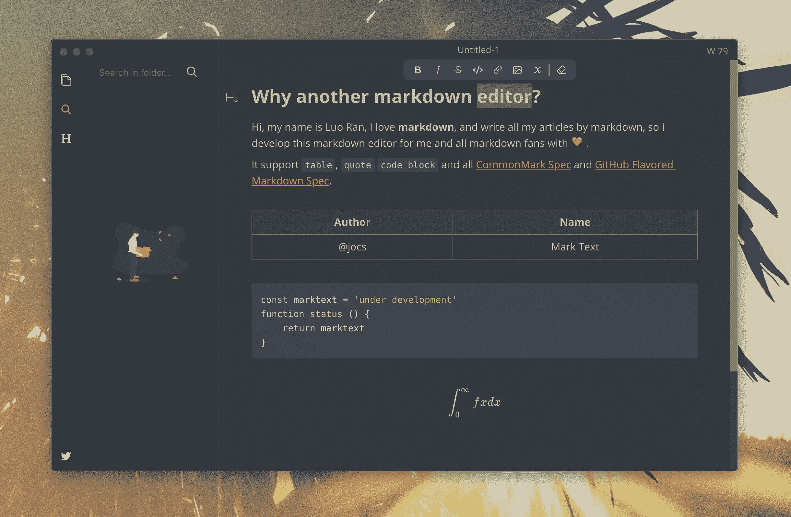

### 3.重新文本

ReText 是一个更强大的工具，能够编辑 Markdown 和 reStructuredText。可以在选项卡中打开多个文件，可以在预览窗格中查看渲染的 Markdown，并且可以从图标栏中使用标签和符号。

*   许可证:GPL
*   语言:Python
*   最后更新时间:2021 年
*   其他平台:不适用

> 简单但功能强大的 Markdown 和 reStructuredText 编辑器。

它包括语法高亮和同步预览窗格，并且支持 MathJax 和 Python-Markdown。有一个表格编辑模式，和 PDF，ODT，和 HTML 导出。

**如何安装:** ReText 包含在 Debian 和 Ubuntu 软件库中，要求首先安装 Python 3.6 或更高版本。官方网站上有完整的说明。

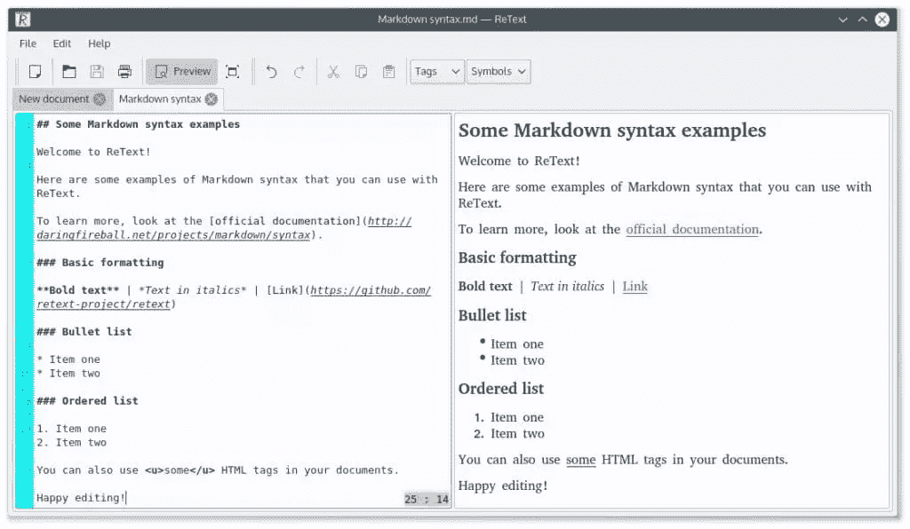

### 4.代笔人

Ghostwriter 有一系列不受干扰的功能，包括全屏模式、干净的界面和黑暗的主题。焦点模式突出显示光标周围的文本，淡化其余部分，海明威模式禁用退格键和删除键，迫使您书写而不是编辑。

*   执照:GPLv3
*   工具包:QT
*   最后更新时间:2021 年
*   其他平台:Windows

> 一个不受干扰的 Windows 和 Linux 的 Markdown 编辑器。时尚。开源。免费。

其他功能包括内置主题、实时预览和拖放图像。还有一个“大纲”HUD，它让您可以概述文稿，以及大量统计数据，包括字数统计。您可以将文档导出为 HTML 和各种其他格式。

如何安装:你会找到如何在 Ubuntu 及其衍生产品上安装 GhostWriter，在 [GitHub](https://github.com/wereturtle/ghostwriter/) 上安装 Fedora 和 OpenSUSE 的说明。

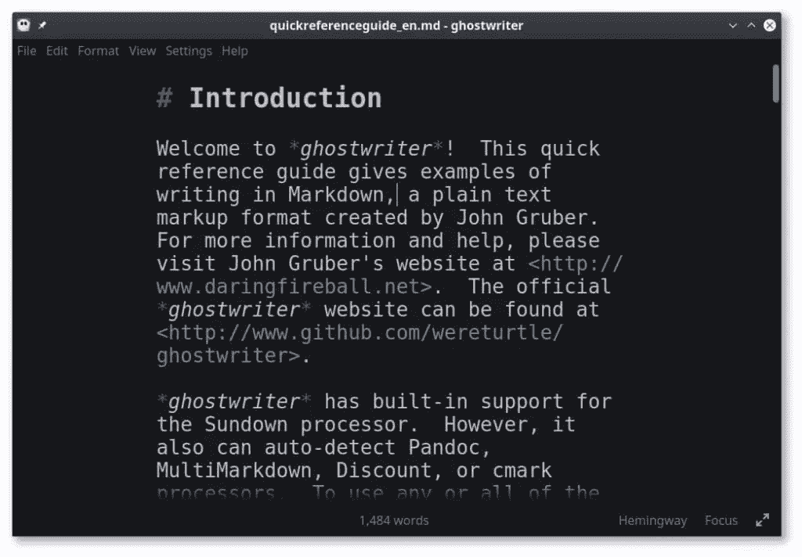

### 5.标记

[Marker](https://github.com/fabiocolacio/Marker) 是一个基本的 Markdown 编辑器，带有语法高亮和预览窗格。它包括对 KaTeX 和 MathJax 数学符号、[美人鱼](https://mermaid-js.github.io/mermaid/)图和[宪章](https://github.com/Mandarancio/charter/)图的支持。

*   执照:GPLv3
*   工具包:GTK+
*   最后更新时间:2021 年
*   其他平台:不适用

> Marker 是用 GTK+-3.0 开发的 Linux Markdown 编辑器

**如何安装:**你会在 [GitHub](https://github.com/fabiocolacio/Marker) 上找到 Fedora、Flathub 和 Arch Linux 的软件包以及依赖项列表。

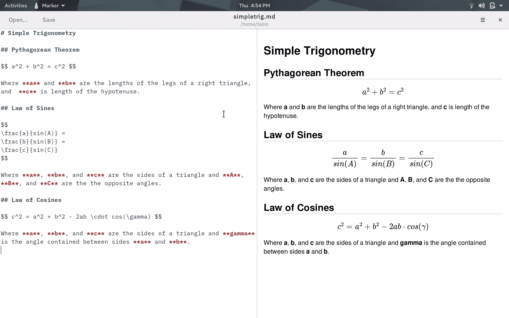

### 6.KeenWrite

KeenWrite 是一个用 Java 编写的高度技术性的 Markdown 编辑器。它提供了用户定义的插值字符串、自动完成的变量名和实时拼写检查。图表可以包含变量，并且可以创建 TeX 数学方程。文档可以在选项卡中打开，文档大纲可以在单独的窗格中打开。

*   许可证:BSD
*   框架:Java
*   最后更新时间:2021 年
*   其他平台:Windows

> 基于 Java 的桌面文本编辑器，带有实时预览、字符串插值和公式

注意:KeenWrite 基于不再维护的 Markdown-Writer-FX。

**如何安装:** KeenWrite 是一款 Java app，官网上有在 Linux 上安装的说明。

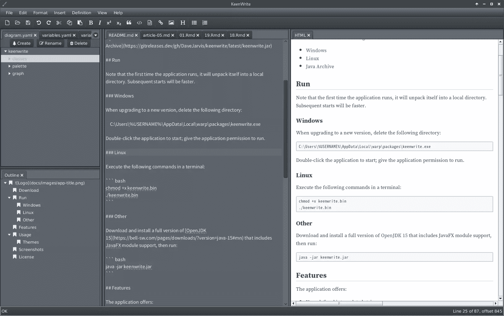

### 7.HedgeDoc

[HedgeDoc](https://hedgedoc.org/) (原名 CodiMD)是一个协作式 Markdown 编辑器。通过笔记链接可以共享文档，还可以创建图形、图表和演示。

*   授权:AGPLv3
*   语言:打字稿
*   最后更新时间:2021 年
*   其他平台:在线

> 撰写和分享 Markdown 的最佳平台

**如何安装:** HedgeDoc 可以从 Docker 镜像、Heroku 或者手动安装。[提供详细的安装说明](https://docs.hedgedoc.org/setup/getting-started/)。

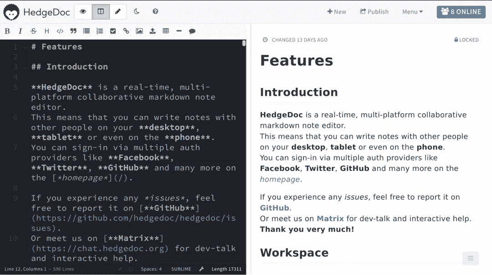

### 8.阿布奎蒂

Abricotine 是一个基于电子的高级 Markdown 编辑器，它在文本编辑器中呈现 Markdown，并带有语法高亮显示。该应用程序支持表格，并能够将图像和嵌入的 YouTube 视频插入到您的文档中。

*   许可证:GPL
*   框架:电子
*   最后更新时间:2020 年
*   其他平台:macOS、Windows

> Abricotine 是一个为桌面构建的开源 Markdown 编辑器。

附加功能包括用 LateX 编写的数学、清单、锚和拼写检查。文档的目录可以显示在侧面板中。

**如何安装:** Ubuntu DEB 包、tarballs 和源代码可以从[下载页面](https://github.com/brrd/Abricotine/releases)获得。

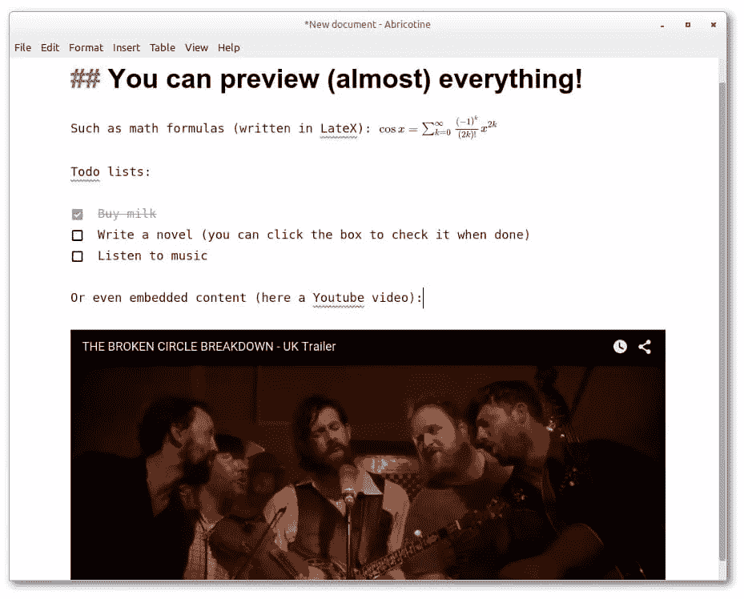

### 9.卓越的

引人注目的是一个易于使用的 Markdown 编辑器，支持语法高亮显示、同步预览窗格和有用的键盘快捷键。支持 MathJax 格式，可以将文档导出为 HTML 或 PDF。

*   许可证:麻省理工学院许可证
*   语言:Python
*   最后更新时间:2020 年
*   其他平台:Windows

> 功能齐全的降价编辑器

**如何安装:**Debian、Ubuntu、Fedora、OpenSUSE 和 Arch 系统的简易安装程序可从官网获得。

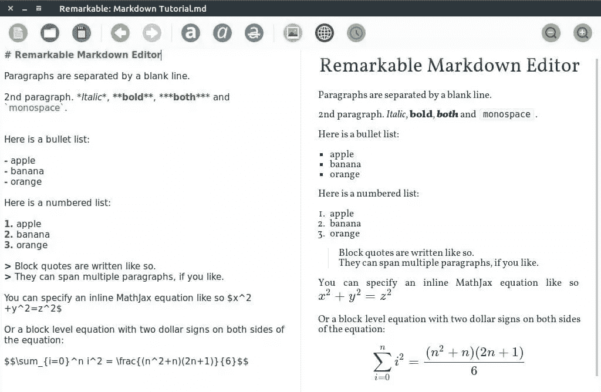

### 10.Typora(非自由/开源软件)

Typora 非常简洁，甚至在你输入时删除了 Markdown 语法，代之以格式预览。所见即所得。它很干净，让阅读变得更容易。

*   许可证:专有，测试期间免费
*   语言:Python
*   最后更新时间:2021 年
*   其他平台:macOS、Windows

> 一个真正最小的降价编辑器。

尽管很简单，但 Typora 功能丰富，支持图像、列表、表格、代码栏、MathJax 块和目录。键盘快捷键做你所期望的，主题是完全可配置的 CSS。

**如何安装:**官网提供了如何访问 Typora 的 Ubuntu 库的详细信息，还提供了一个 tarball。

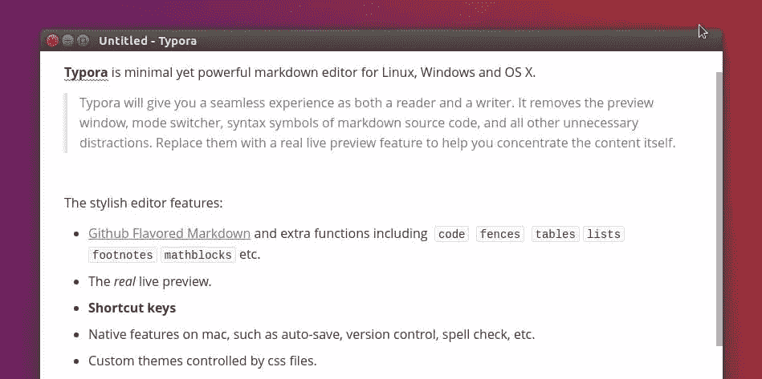

## 8 个基于库的降价编辑器

这里有一些可供选择的应用程序，可以让你管理完整的降价文件库。

### 1.乔普林

[Joplin](https://joplinapp.org/) 是 Evernote 的开源替代品，可以导入 Evernote 的`.enex`文件。所有笔记都是 Markdown 格式，可以通过许多流行的云服务在您的设备之间进行端到端加密同步。

*   许可证:麻省理工学院许可证
*   框架:电子
*   最后更新时间:2021 年
*   其他平台:macOS、Windows、iOS、Android

> Joplin 是一个免费的开源笔记和待办事项应用程序，可以处理大量组织到笔记本中的笔记。笔记是可搜索的，可以直接从应用程序或从您自己的文本编辑器中复制、标记和修改。这些笔记是减价形式的。

**如何安装:**官网提供了一个 AppImage，下载脚本的终端命令，以及一个非官方 Arch Linux 包的链接。

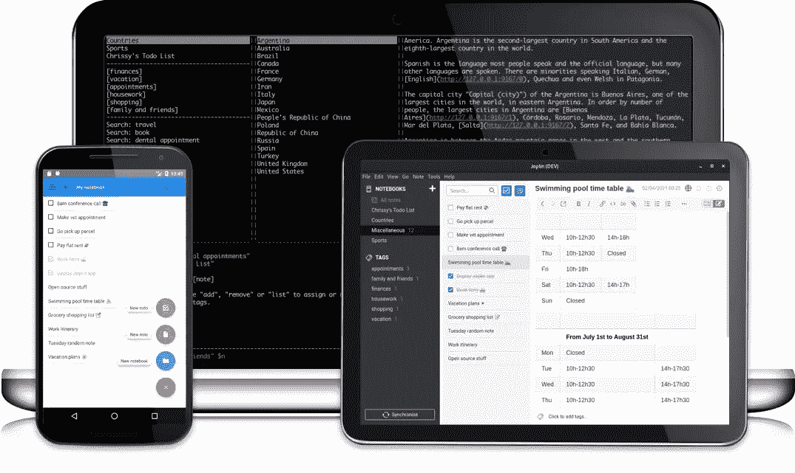

### 2.塞特勒

Zettlr 是一个快速、多功能、基于标签的 Markdown 编辑器，专为撰写专业和学术文本而设计。它允许您使用 Zettelkasten 方法连接笔记，并与 Zotero、JabRef 和 Juris-M 等参考管理器集成。它提供主题、黑暗模式和热图搜索。

*   执照:GPLv3
*   框架:电子
*   最后更新时间:2021 年
*   其他平台:macOS、Windows

> 21 世纪的降价编辑

**如何安装:**[下载页面](https://www.zettlr.com/download)提供 Debian、Fedora 和 AppImage 包。

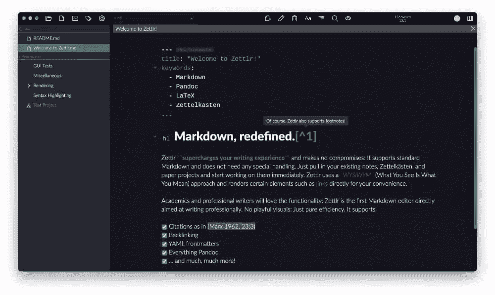

### 3.伪造者

MindForger 是一个笔记本、知识管理工具和 Markdown 编辑器，用于存储和查找你所有的笔记和其他信息。它在您书写时显示相关内容，提供图形化标记导航器，并支持 MathJax 符号。同步可以通过多种方式实现，重点是安全性和隐私性。

*   许可证:GPLv2
*   语言:C++
*   最后更新时间:2020 年
*   其他平台:macOS、Windows

> 你是否淹没在信息中，却渴望知识？

**如何安装:**官网提供了 Ubuntu、Debian、Fedora、Arch Linux 和 Docker 包的链接，以及一个 tarball。

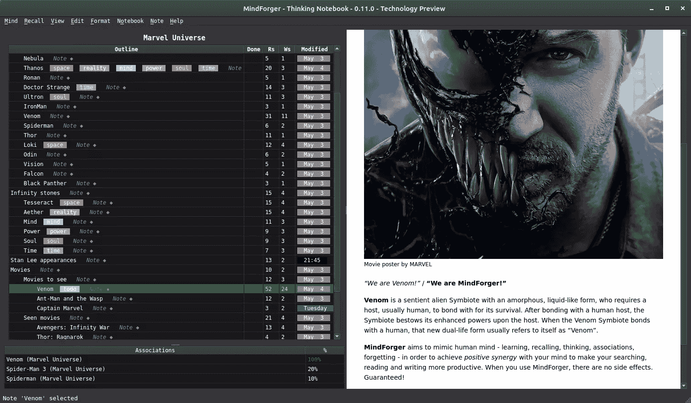

### 4.增强音符

[Boost Note](https://boostnote.io/) 是开发团队基于电子框架的协作式 Markdown 工作空间。您可以实时合作创作，访问控制可用，并提供对图表、公共 API 和 Zapier 的支持。

*   许可:GPLv3，个人免费，团队 3 美元/成员/月起(包括在线存储)
*   框架:电子
*   最后更新时间:2020 年
*   其他平台:macOS、Windows、在线

> Boost Note 是一个面向开发团队的强大的光速协作工作区。

*注:Boost Note 是一款旧的 [Boostnote](https://github.com/BoostIO/Boostnote) 应用的更新版。*

**如何安装:** DEB、RPM、AppImage 包，官网都有。

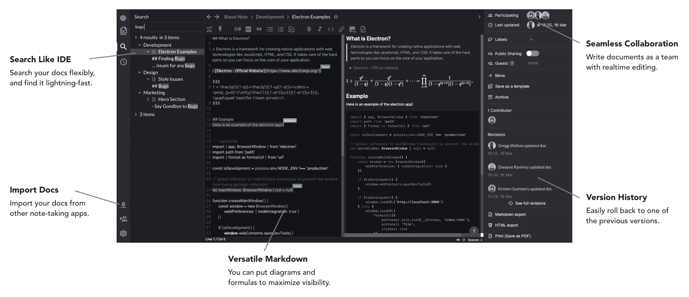

### 5.黑曜石(非 FOSS)

[黑曜石](https://obsidian.md/)可能不是自由/开源软件，但不会产生锁定效应。所有数据都存储在普通降价文件的文件夹中，这些文件可以在任何文本编辑器中打开。它使用它们来创建一个强大的知识库，包括链接、反向链接和数据的图形视图。它可以通过丰富的插件生态系统进行扩展。更多信息，请参考我的[黑曜石指南](https://www.sitepoint.com/obsidian-beginner-guide/)。

*   许可证:私有，个人使用免费
*   框架:电子
*   最后更新时间:2021 年
*   其他平台:macOS、Windows

> Obsidian 是一个强大的知识库，它基于一个本地文件夹的纯文本减价文件。

**如何安装:** AppImage、Snap 和(社区维护的)Flatpak 包可从官网获得，还有一个 DEB 包和 tarball。

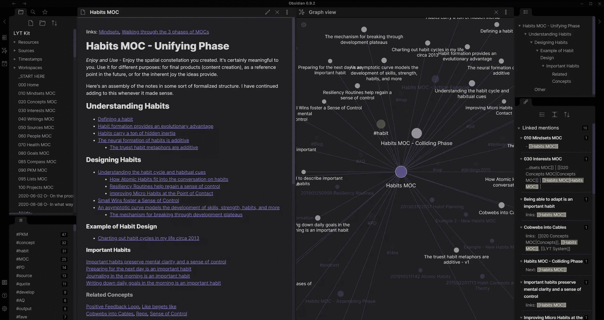

### 6.WordMark(测试版，非自由/开源软件)

WordMark 是一个为博客设计的简约、不受干扰的减价编辑器。Markdown 实时呈现在编辑窗口中，图像可以拖放到应用程序中，并提供发布到 WordPress 和 GitHub 的功能。你甚至可以创建一个可检查的待办事项列表。

*   许可证:专有，测试期间免费
*   框架:电子
*   最后更新时间:2021 年
*   其他平台:macOS、Windows

> 博客的实时降价编辑器。它支持多种平台，并以其漂亮的设计，各种各样的功能，以及对细节的关注而脱颖而出。

**如何安装:**官网有 Ubuntu 16.04(或更高版本)的 DEB 包。

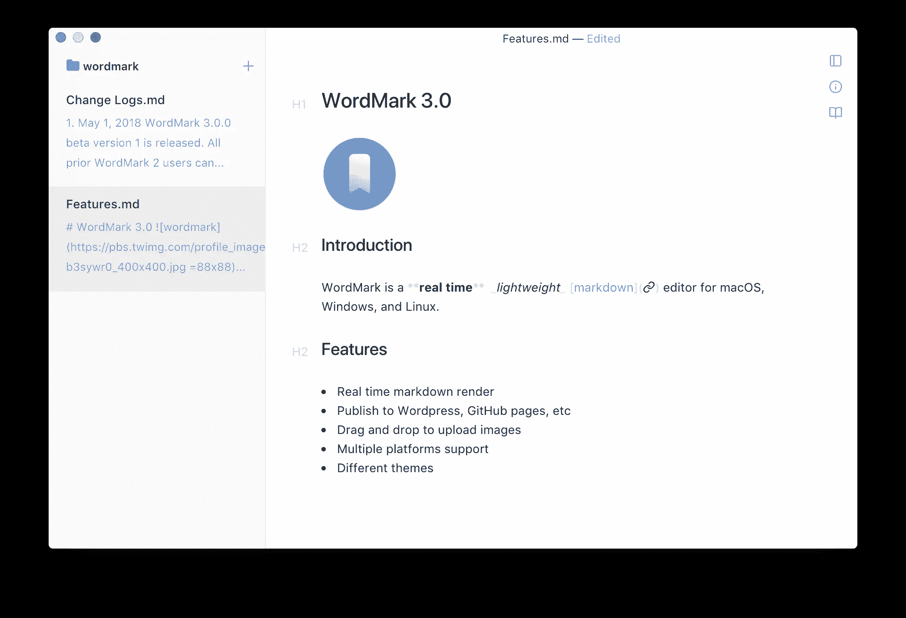

### 7.墨滴(非 FOSS)

InkDrop 是一个可扩展的全功能 Markdown 库，提供计算机和设备之间的云同步以及 10 GB 的在线存储。您可以用主题定制它的外观，用 100 多个插件定制它的特性，如果您愿意，您可以使用 CouchDB 服务器自托管您的数据。

*   许可:专有，每月 4.99 美元
*   框架:电子
*   最后更新时间:2021 年
*   其他平台:macOS、Windows、iOS、Android

> 整理你的减价笔记变得简单。

InkDrop 支持 Vim、Emacs 和 Sublime 文本键绑定，以及数学符号、流程图和序列图。还提供了无干扰模式、任务管理和笔记的公共链接。

**如何安装:** Snap、DEB、RPM 包都有。安装说明可在该应用的[在线用户手册](https://docs.inkdrop.app/manual/#installing-inkdrop-on-linux)中找到。

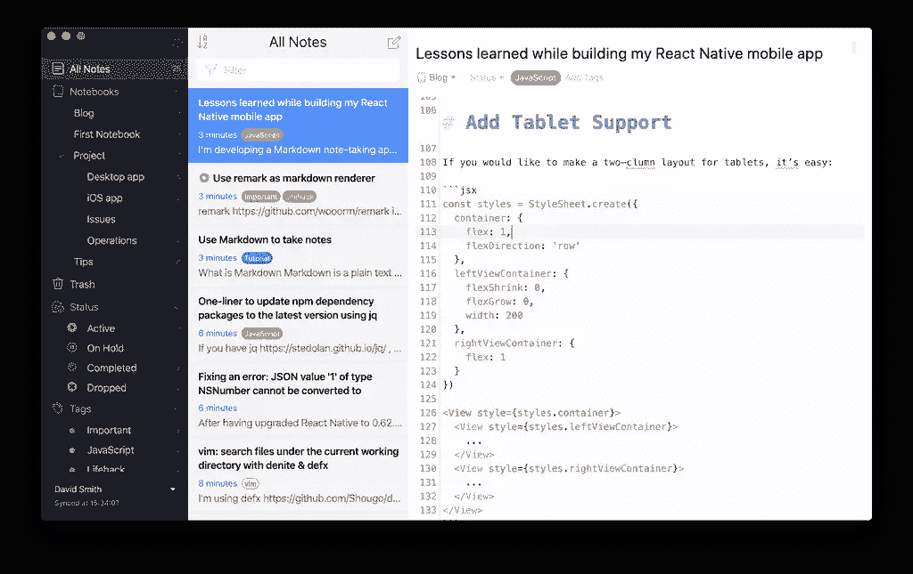

### 8.写！应用程序(非自由/开源软件)

[写！App](https://writeapp.co/) 是一个极简主义的、基于标签的降价写作应用，具有云备份，不需要第三方服务。您可以与其他人协作共享文档，这些文档可以通过公共链接发布在 Web 上。提供拼写检查和字数统计。

*   许可证:专有，24.95 美元
*   框架:不清晰但“原生”
*   最后更新时间:2018 年
*   其他平台:macOS、Windows

> 写！是一个优雅的工作空间，用于创建笔记、待办事项、撰写项目和任何类型的文本。它把一个好的文字处理器的所有功能都打包到一个整洁的界面中。

**如何安装:**这个就不清楚了。官网上没有安装说明(除了“安装使用！”)而且只有在购买之后才能下载。

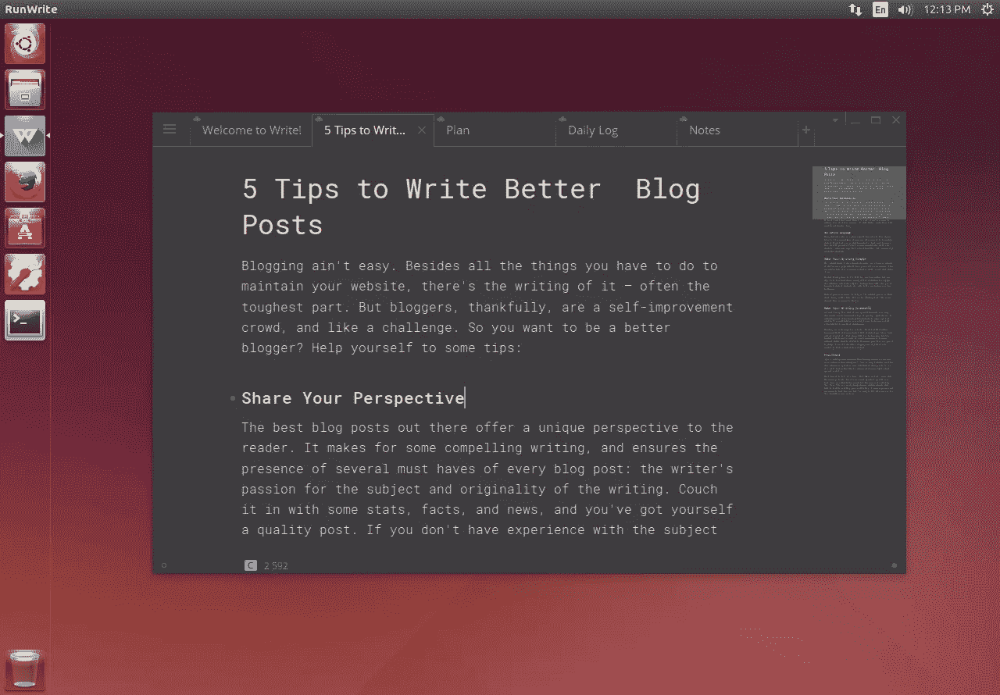

## 那么，对你来说最好的 Markdown 编辑器是什么？

品种还真不少！哪个 Linux Markdown 编辑器最适合你？这取决于你的优先事项，以及你将使用该应用程序的目的。

让我们为您缩小选择范围:

*   如果你已经有了一个最喜欢的文本编辑器，探索你能做些什么来使它更适合降价。
*   如果你喜欢 GPL 许可的软件，可以从撇号、ReText、GhostWriter、Marker、Abricotine、Zettlr、MindForger 和 Boost Note 中选择。
*   如果你重视一个不受干扰的写作环境，那么在撇号、标记文本、代笔、断句、Typora 或 WordMark 之间做出选择。
*   如果你只是在寻找一个支持基本语法并有预览面板的典型 Markdown 编辑器，看看撇号、标记文本、重新文本、标记和显著。
*   如果您需要高级格式选项，包括数学和表格，那么标记文本、标记、KeenWrite、Abricotine、卓越、Typora、MindForger 和 InkDrop 可以满足您的需要。
*   如果你需要协作功能，看看 HedgeDoc，Boost Note，或者 Write！App。
*   这些应用也在 Windows 上运行:Mark Text、Ghostwriter、KeenWrite、Abricotine、卓越、Typora、Joplin、Zettlr、Boost Note、Obsidian、WordMark、InkDrop、Write App！
*   而这些也在 macOS 上运行:Mark Text，Abricotine，Typora，Joplin，Zettlr，MindForger，Boost Note，Obsidian，WordMark，InkDrop，Write！App。

最适合你的应用程序将符合你的需求，并可用于你的发行版。探索愉快！

## 分享这篇文章