# 最佳在线备份和云存储解决方案

> 原文：<https://www.sitepoint.com/the-best-online-backup-cloud-storage-solutions/>

计算机已经渗透到日常生活的几乎所有方面，从社交网络到摄影、金融和约会。这种对技术的依赖带来了从速度到适应性的各种优势。

然而，当你的大部分个人数据和你的整个数字生活都存储在计算机上时，总是有丢失这些数据的风险。硬件故障，病毒感染，数据由于退化而损坏。

这就是云革命对企业和个人如此重要的原因。现在，应用程序不再需要安装在用户机器上，它们可以在云中使用，数据可以在云存储解决方案上实时镜像和备份。

有些云存储解决方案是免费的，有些是付费的。有些允许你无限备份，有些有大小限制，当然总有带宽的考虑，但是云存储是每个电脑用户都应该考虑的。

然而，记住存储在云中的数据的数量和类型是很重要的。云存储在安全性和隐私方面有所不同，因为大公司通常比您的家庭网络具有更好的安全性，但是您将数据和安全性托付给第三方。

因此，考虑哪种类型的数据和解决方案最适合您或您的企业非常重要。为了帮助您完成这一任务，这里列出了最佳在线备份和云存储提供商及解决方案:

### Dropbox

Dropbox 是一项免费服务，可以让你把所有的照片、文件和视频带到任何地方。这意味着你保存到 Dropbox 的任何文件都会自动保存到你所有的电脑、手机甚至是 Dropbox 网站上。

[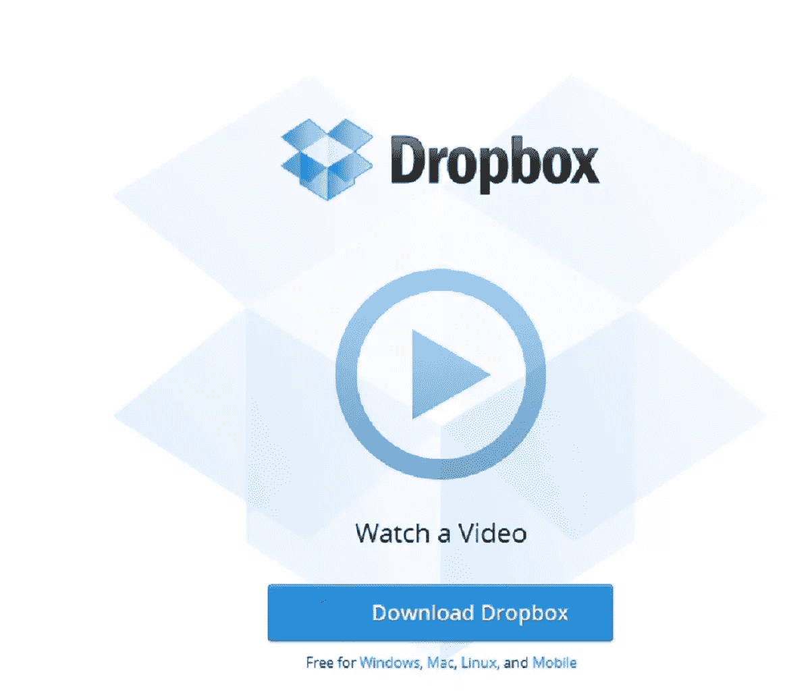](https://www.dropbox.com/)

### 阿德里夫

面向所有人的云解决方案。借助主动云存储和备份解决方案，保护和管理您的个人、业务和企业级数据。

ADrive 为数百万个人、企业和企业级用户提供在线云存储服务。他们的目标是为用户提供一种方便可靠的方式，让他们能够随时随地更好地管理数据。

[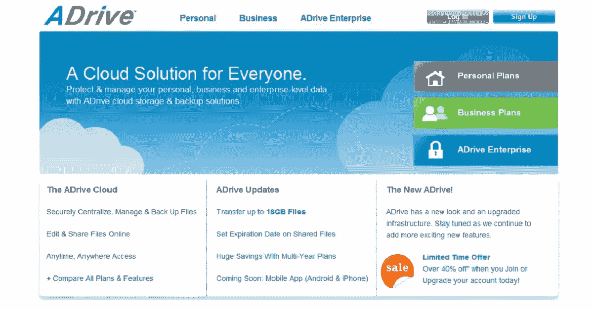](http://www.adrive.com/)

### 坠毁计划

备份个人数据的最佳免费方式。这是在线备份个人数据的最佳方式。使用它，您可以随时随地安全地获取文件。

[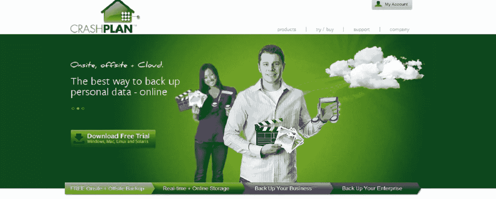](http://www.crashplan.com/)

### CloudApp

CloudApp 可以让你分享图片、链接、音乐、视频和文件。它是这样工作的:选择一个文件，把它拖到菜单栏，剩下的就交给我们了。我们为您提供了一个自动复制到剪贴板的短链接，您可以使用它与同事和朋友分享您的上传内容。

[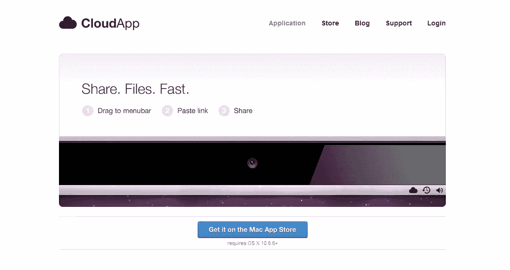](http://getcloudapp.com/)

### 蚊子

Mozy 提供了许多备份解决方案来满足您的个人需求。用于个人文件的非商业备份，包括音乐、照片、家庭视频和个人纳税记录

[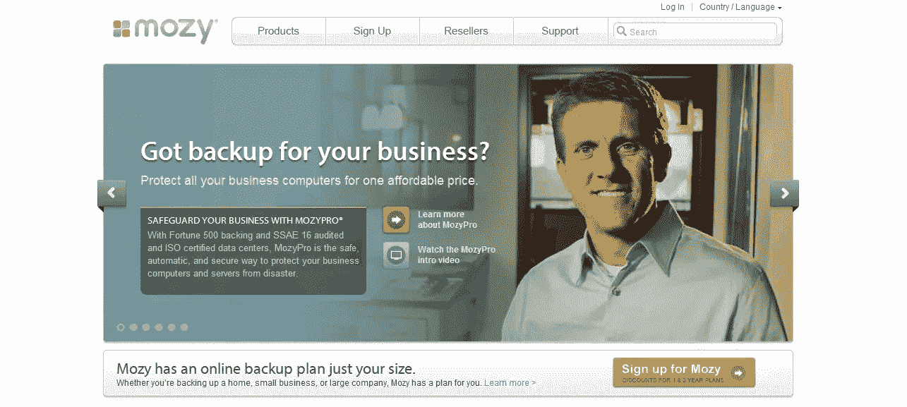](http://mozy.com/)

### 直播驱动

Livedrive 正在创造一种技术，这种技术将彻底改变人们存储和访问文件、照片、音乐、视频和其他数字内容的方式。我们的愿景很简单:不要把文件存储在你的电脑上，而是存储在你的 Livedrive 上。Livedrive 是你在互联网上的个人存储空间。它是无限的，安全的，并且永远存在。Livedrive 管理团队由受人尊敬的行业专家和投资者组成，他们贡献了丰富的经验和财力，以确保 Livedrive 得到良好的管理和充足的资金。

[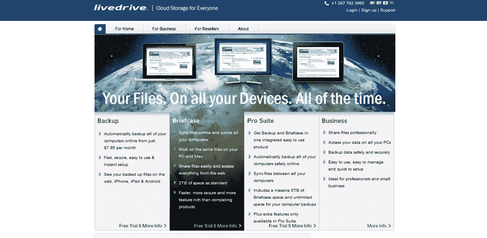](http://www.livedrive.com/)

### IBackup

IBackup 使中小型企业能够以极低的成本获得性能卓越的企业级在线关键数据备份。全球公司、企业和个人都信任 IBackup 来满足他们的存储和备份需求。
IBackup 的在线备份服务包括用于自动计划备份的应用程序，包括压缩、加密、增量/完整备份、版本控制、同步、对 Outlook、MS SQL Server、MS Exchange Server、Oracle Server、MS SharePoint Server 备份等的打开文件支持。

[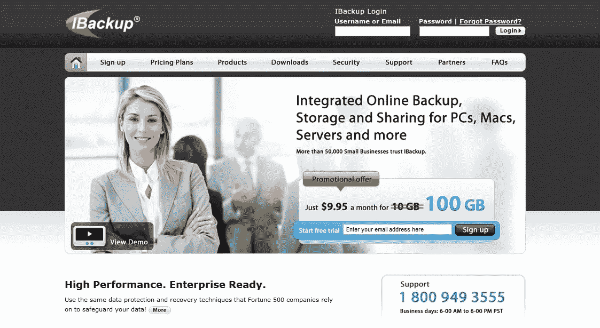](http://www.ibackup.com/)

### 蜘蛛橡树

SpiderOak 为 Windows、Mac OS X 和 Linux (Ubuntu、Debian、Fedora 和 openSUSE)提供简单、安全和统一的免费在线备份、同步、共享、访问和存储解决方案

[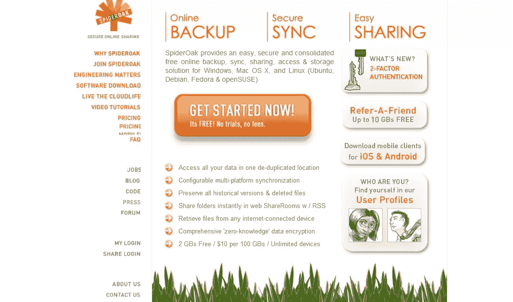](https://spideroak.com/)

### sugarsync

SugarSync 是一项免费服务，可以让你在所有电脑和设备上访问、同步和共享你的文件。我们让您能够备份、同步和共享您所有的文档、照片、音乐和电影，以便您可以从您的笔记本电脑、iPhone、iPad、Android、BlackBerry 或任何其他设备上访问它们。

[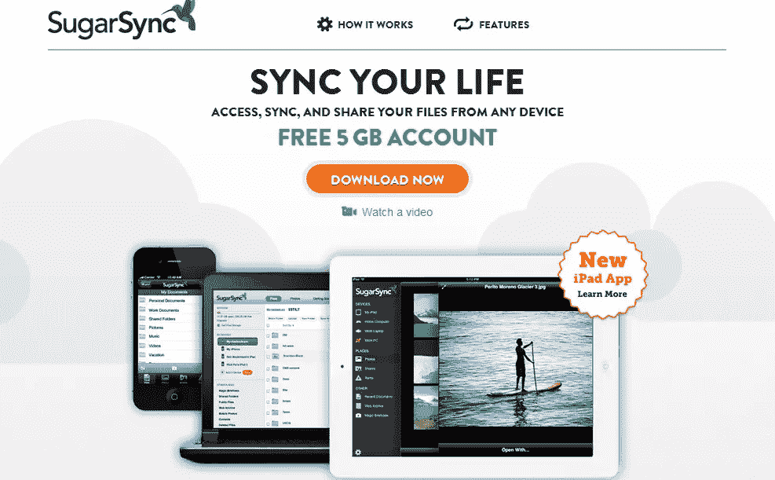](https://www.sugarsync.com/)

### mypc 备份

MyPCBackup 非常重视数据的安全性和隐私性。你所有的文件都用和银行一样的安全措施加密。
与其他在线备份提供商不同，我们不限制您可以备份的文件数量，享受无限制在线备份的自由。

[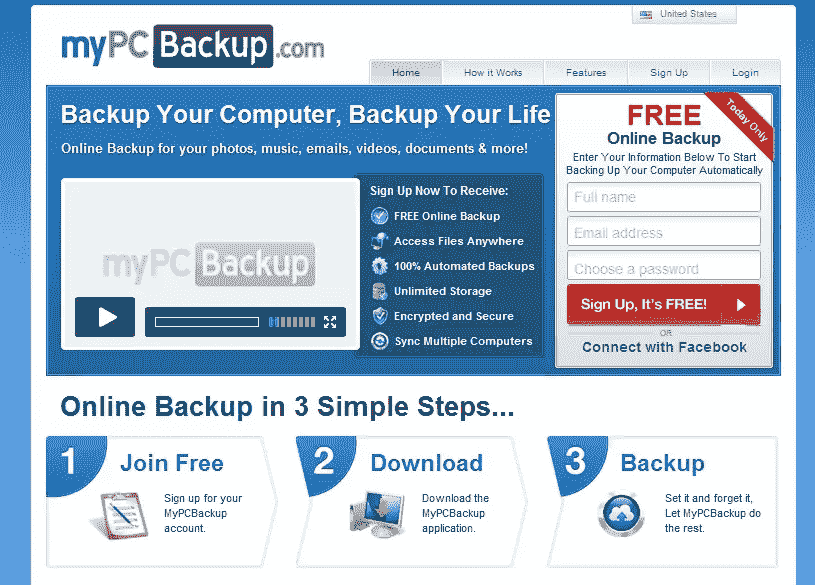](http://www.mypcbackup.com/)

### JustCloud

JustCloud 可以让你在线存储所有文件，这样你就可以随时随地访问它们。
将您的所有文件存储在云端
随时随地通过任何设备访问您的文件。
来自 JustCloud 的专业云存储简单、快速且无限制。
您的 Just Cloud 帐户还将作为计算机备份设备
，完全自动化您所有的云存储需求。

[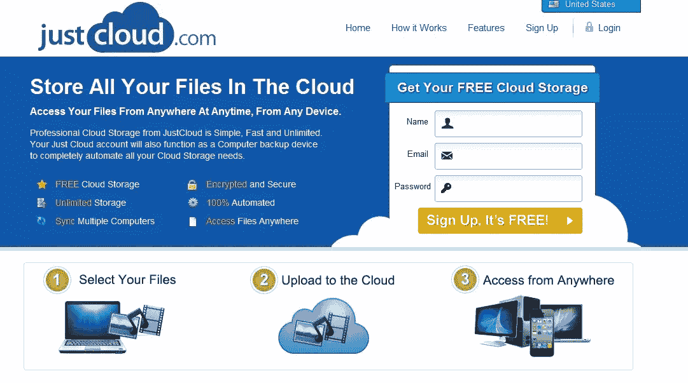](http://www.justcloud.com/)

### 埃及混合云

Egnyte HybridCloud 满足了业务用户的需求，让他们能够以简单方便的方式访问文件并与团队成员共享文件，同时使 IT 部门能够控制和监控所有访问。最新的增强功能创建了一个可扩展以满足企业需求的解决方案。
Egnyte 云文件服务器带来了前所未有的文件共享、大文件传输、协作和备份能力。随着突破性本地云技术的加入，Egnyte 支持快速本地文件访问和离线访问。

[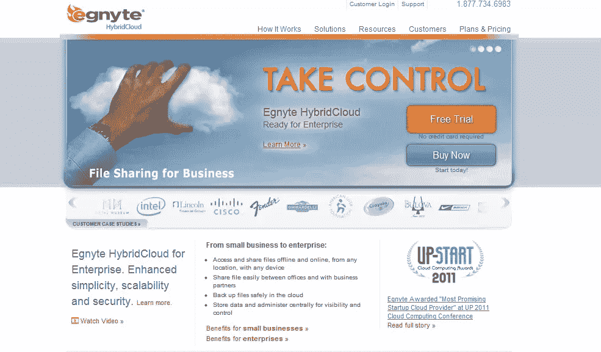](http://www.egnyte.com/)

### 尤森迪特

YouSendIt 提供无限的存储空间和方便的访问，在竞争激烈的在线存储行业中占据坚实的基础。作为电子邮件的替代方案，这种在线存储服务的前提是你应该能够轻松地发送和接收大文件。最近，YouSendIt 在其不断增长的服务中增加了云存储。因此，YouSendIt 是一种多功能的文件共享和数据存储服务，其排名迅速攀升。

[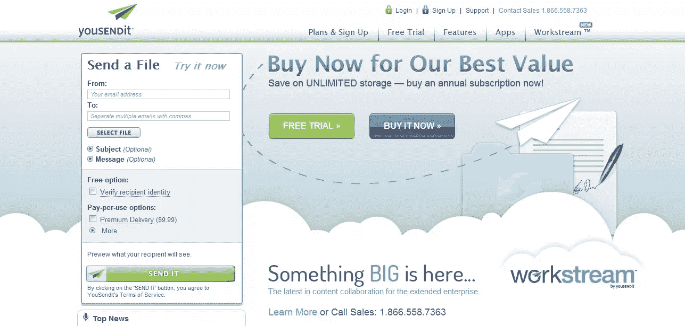](https://www.yousendit.com/)

### OpenDrive

OpenDrive 是加利福尼亚州帕洛阿尔托的一家公司，提供在线软件即服务，帮助个人和企业轻松、安全、专业地存储文件并进行协作。

OpenDrive 的当前版本于 2008 年推出，旨在为个人提供一种简单的备份和共享数字媒体的解决方案。自公司成立以来，OpenDrive 已经发展到每天为超过 100 万用户提供服务，并受到全球超过 20，000 家企业的信任。

[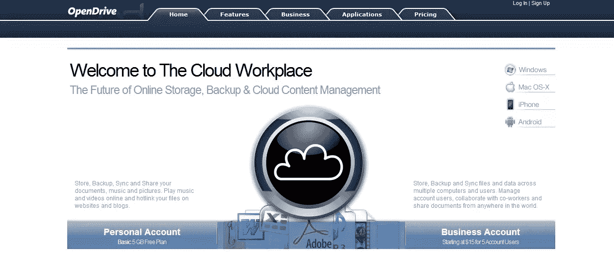](http://www.opendrive.com/)

### 箱子

Box 允许您在线存储所有内容，因此您可以从任何地方访问、管理和共享这些内容。在移动设备上将 Box 与 Google Apps 和 Salesforce 以及 access Box 集成。通过我们屡获殊荣的移动应用程序，您可以在任何地方访问、共享和协作文件。在 tap 中共享文件夹、交换反馈或保存文件以供离线访问。

[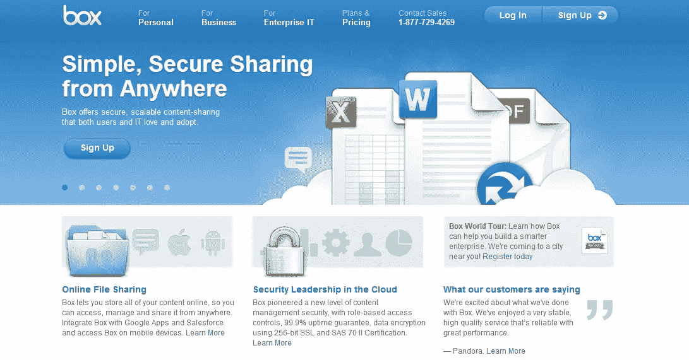](http://www.box.com/)

### 同步性

Syncplicity 的虚拟私有云允许您同步、访问、共享和备份文件，而无需改变您的工作方式。只需设置一次，就大功告成了，剩下的工作由 Syncplicity 来完成。
同步、共享、访问的最简单方式&保护您需要的每个文件。认识您的虚拟私有云。
与您所有的电脑同步文件。从您的所有移动设备访问它们。分享它们而不改变你的工作习惯。确保所有东西都有备份。所有这些都具备您需要的控制力和安全性。

[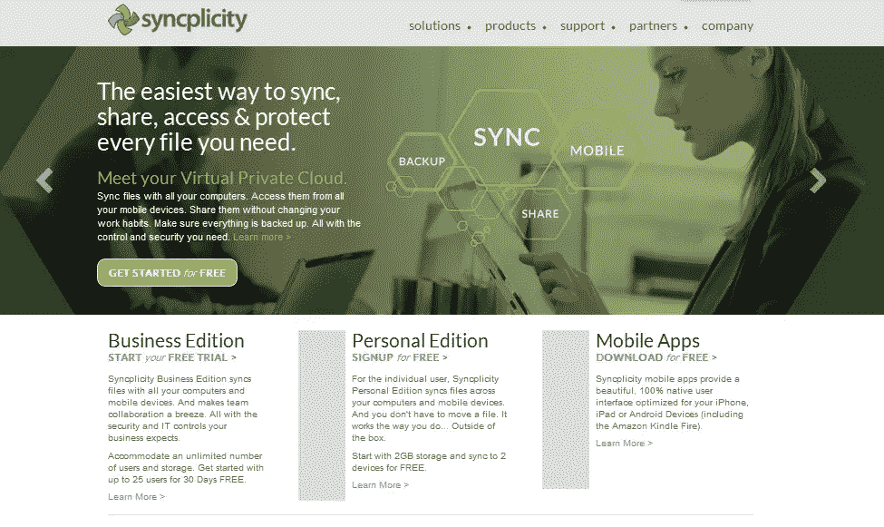](http://www.syncplicity.com/)

### iCloud

iCloud 会储存您的音乐、照片、文稿等，并将它们无线推送至您的所有设备。自动、轻松、无缝——它就是有效。iCloud 不仅仅是天上的硬盘。它让您可以快速、轻松地访问您每天使用的设备上的几乎所有内容。iCloud 会自动安全地储存您的内容，以便您的 iPhone、iPad、iPod touch、Mac 或 PC 始终可以使用这些内容。它让您可以从您碰巧使用的任何设备访问您的音乐、电影、应用程序、最新照片等。此外，它还能让您所有设备上的电子邮件、联系人和日历保持最新。不需要同步。不需要管理。事实上，不需要任何东西。iCloud 为你做了这一切。

[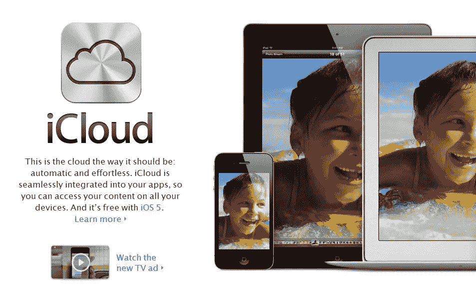](https://www.icloud.com/)

### 阿克罗尼丝

Acronis 软件让虚拟化变得简单；许多工具，一个统一的用户界面。我们的虚拟化解决方案通过单一用户界面提供服务器整合、备份、恢复、数据保护和数据存储节省。我们支持所有主要的虚拟平台以及 Windows 和 Linux 环境。

[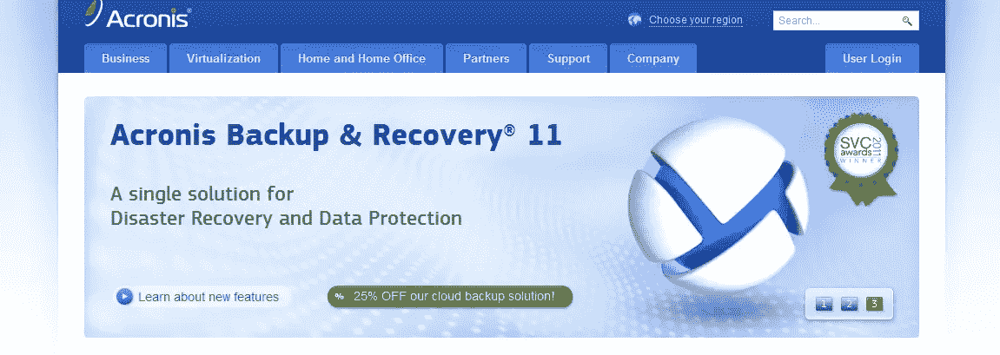](http://www.acronis.com/)

### 武阿拉

Wuala 是一款安全的在线存储设备，由瑞士制造。作为在线存储的瑞士刀，它涵盖了专业和个人使用的所有基本需求:使用 Wuala，您可以安全地在线存储文件，与选定的其他人共享它们，从任何地方访问它们，设置本地数据的自动备份，或将整个文件夹同步到云。Wuala 采用客户端加密来实现独特的安全级别。所有数据在上传之前都在本地加密。您的密码永远不会离开您的计算机。没有您的授权，任何人(包括我们存储提供商)都无法访问您的数据。

[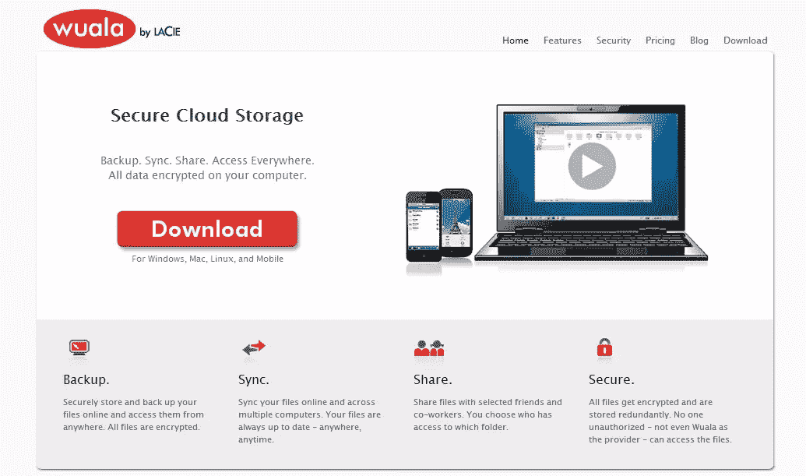](http://www.wuala.com/)

### 丛林磁盘

使用丛林磁盘保护您的文件免受损失，被盗，病毒和自然灾害。在办公室或全球范围内安全、私密地共享业务数据。在所有计算机上同步您的重要工作。从任何网络浏览器访问您的数据。您可以随时随地安全地完成所有这些任务，甚至更多，只需轻轻一点。

### ubuntu one

Ubuntu One 是将您的数字生活整合在一起的个人云，因此您可以随时随地以自己的方式享受您的内容。借助我们的云服务套件，包括存储、同步、共享和流媒体，您可以随时从任何设备即时访问您的音乐收藏、喜爱的照片、视频、重要文档等。

[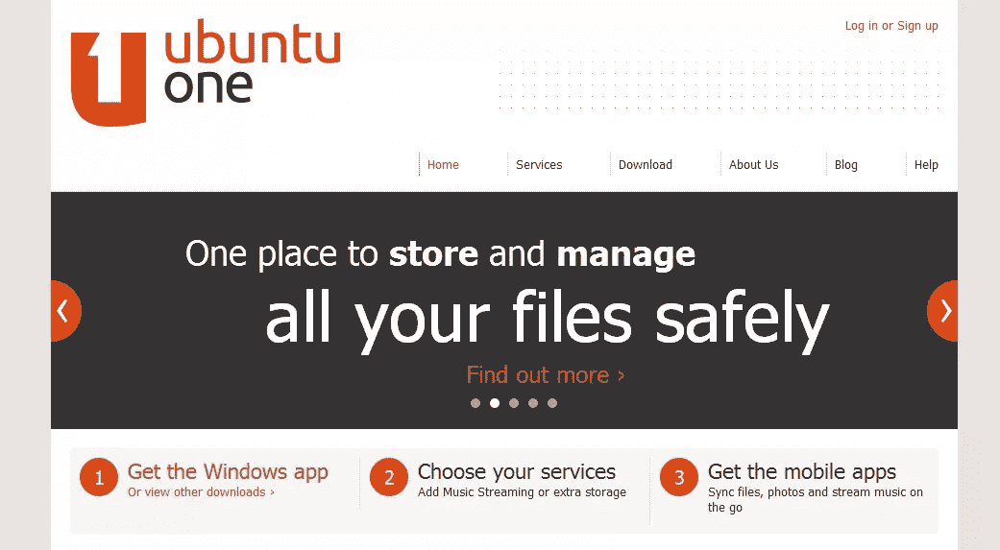](https://one.ubuntu.com/)

### 符号形式

Symform 是一项革命性的云存储和备份服务，以低廉的固定费用提供高达 200GB 的免费无限在线存储。Symform 的分布式全球网络是当今最快、最安全、成本最低的云存储。你通过贡献一些多余的本地存储来加入网络，以换取真正负担得起的云存储。加入革命&今天就尝试 Symform！

[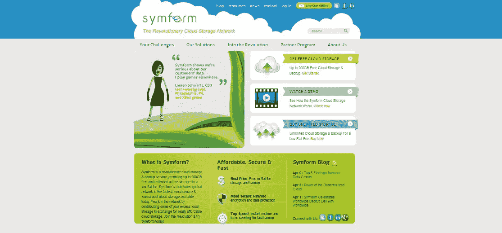](http://www.symform.com/)

### SecurusVault

SecurusVault 的在线备份服务使用可信云
存储技术来确保您的数据得到安全备份。
使用 SecurusVault 访问、共享、备份和管理您的数字生活。
通过 SecurusVault 的在线数据归档，保护您的数据免受硬盘故障或计算机失窃的影响。在你的硬盘上腾出额外的空间，但是将日常不使用的文件归档。

[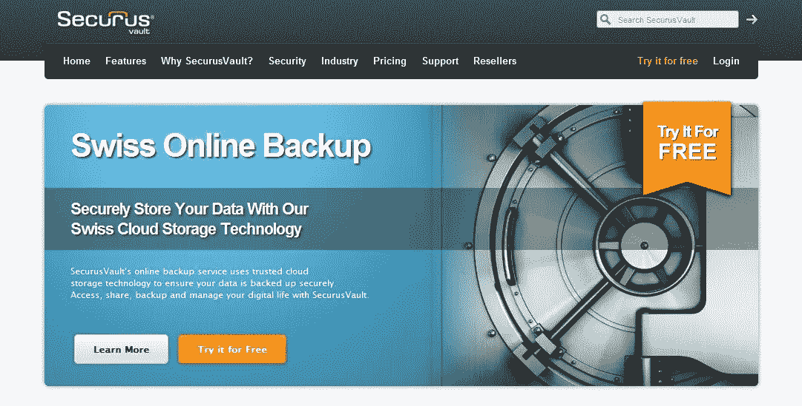](http://www.securusvault.com/)

### 阿西格拉

通过我们的云备份、恢复和还原软件解决方案:Asigra Cloud Backup v11，Asigra 为备份和恢复带来了云模式，包括平板电脑和智能手机等移动设备的备份和恢复。

[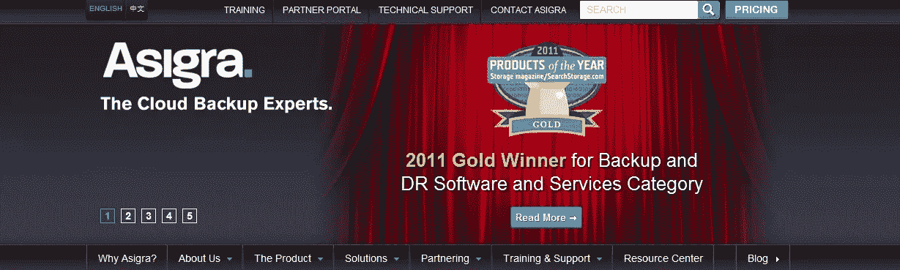](http://www.asigra.com/)

### 微软 SkyDrive

微软 Skydrive 的重点是在线备份和存储文件的能力，而不是让它变得简单。从许多方面来看，Skydrive 只是一个技术选项——一个将文件放在网上的地方。这比听起来更有吸引力:这项服务提供 25GB 的免费存储空间来存放文档、照片或任何你想发布的文件。这里有一种“单点登录”的心态。一旦您注册了 Live，您将自动成为 Skydrive 的新成员，因此没有单独的注册过程。

[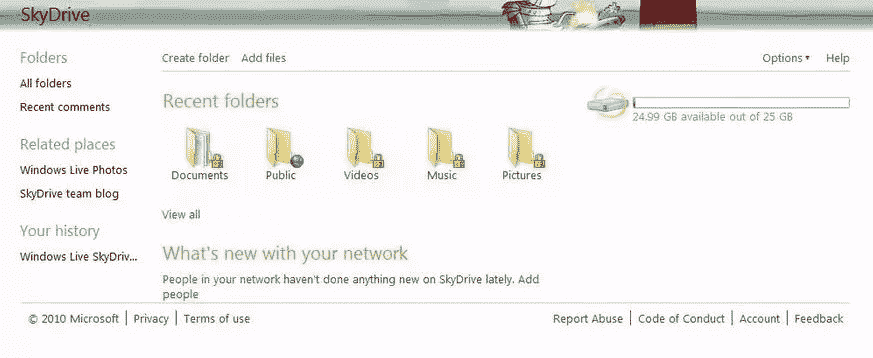](http://skydrive.live.com/)

### 碳元素

在线备份服务在后台安静地持续工作，保护您的文件。如果出了问题或者你不小心删除了一个文件，我们还有一份拷贝。Carbonite 在线备份现在包括远程文件访问！从任何连接互联网的电脑上检索你用 Carbonite 备份的文件。

[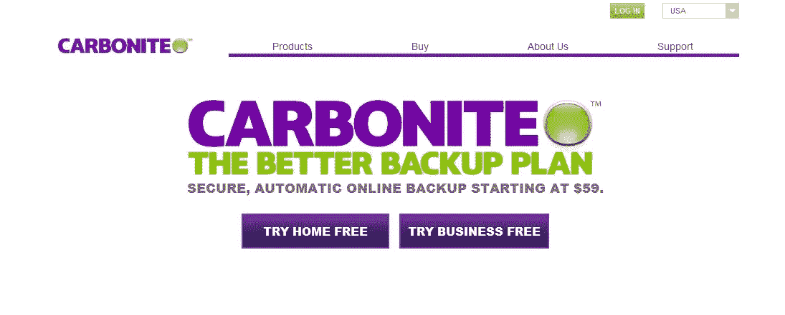](http://www.carbonite.com/)

### intronis

Intronis 提供最安全的在线备份存储服务、在线备份软件和数据恢复服务。Intronis 不仅为 MSP 提供了出色的在线备份和恢复服务，还为 Intronis 员工提供了无与伦比的优势，他们关心、全力以赴，尽一切努力确保每个合作伙伴的在线备份业务取得成功。Intronis 不只是向您销售解决方案，而是确保每个合作伙伴都拥有在业务中取得成功的工具。

[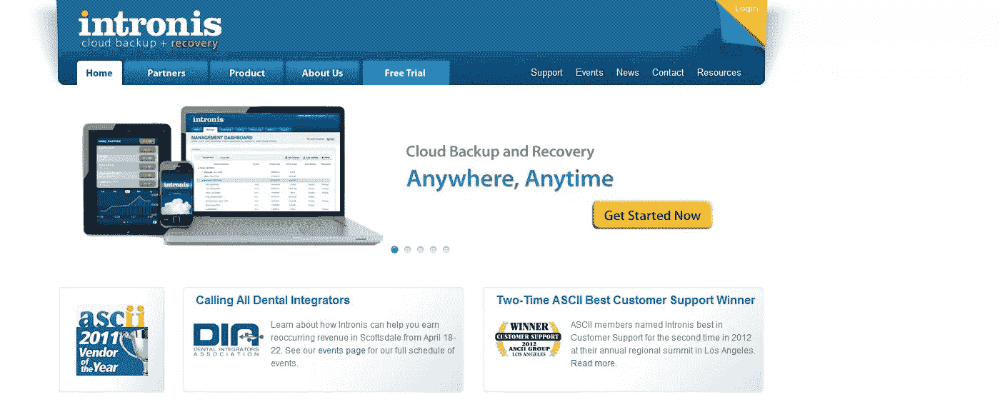](http://www.intronis.com/)

### CoreVault

CoreVault 的服务能够满足您的需求。首先，我们与您一起成长。随着您的数据扩展，我们会无缝地适应其增长。第二，我们灵活调整服务，以保持我们的计划具有成本效益。(例如，我们可以在适当的时间间隔自动将数据从在线保护切换到归档，这个过程由您控制)。最后，可伸缩性反过来起作用；我们的服务可以像恢复整个系统一样轻松地处理单个文件和邮件恢复。

[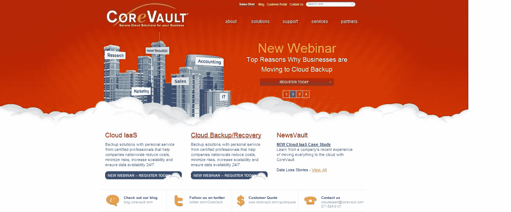](http://www.corevault.com/)

### 兹曼达

Zmanda 云备份(ZCB)是一款简单易用且经济高效的备份和灾难恢复解决方案。ZCB 将 Windows 服务器、桌面和实时应用程序(如 Microsoft Exchange 和 SQL Server)备份到亚马逊高度可靠的在线存储中。

[单手光标](http://www.shutterstock.com/cat.mhtml?lang=en&search_source=search_form&version=llv1&anyorall=all&safesearch=1&searchterm=cloud+backup&search_group=&orient=&search_cat=&searchtermx=&photographer_name=&people_gender=&people_age=&people_ethnicity=&people_number=&commercial_ok=&color=&show_color_wheel=1#id=79406047&src=fdb1c657b728eae43ac8b4b1655693c3-1-47)图像通过 Shutterstock

## 分享这篇文章