# 2022 年网页设计师的最佳工具和资源

> 原文：<https://www.sitepoint.com/the-best-tools-and-resources-for-web-designers-in-2022/>

*这篇赞助文章由我们的内容合作伙伴 [BAW 媒体](https://baw.agency/)创作。感谢您对使 SitePoint 成为可能的合作伙伴的支持。*

每个设计师都有一个工具箱，里面有他们在每个项目中会用到的行业技巧和窍门。每天都有数不清的新的网页设计和网页开发工具发布，很难放弃旧的最爱，跟上最新的(最好的)网页设计资源。

为自己或整个创意机构管理创意工作流程是复杂的。对于任何试图手动完成任务的人来说，这也很容易变得难以应付。创造性的管理软件和设计工具有助于简化您的工作流程，并且更加直观。

网页设计不断地用令人兴奋的当代技术开拓新的领域——比如高级交互、动画和视觉效果。许多设计师喜欢使用无代码工具，这使得他们做任何事情都比以前更快更容易。

有这么多的选择，很难从成百上千的网页设计工具中做出选择——这就是为什么我们把这个指南放在一起。

## 1.[流量](https://trafft.com/pricing/?utm_source=baw&utm_medium=posts&utm_campaign=besttools2022)

Trafft 预订解决方案正在全球范围内被用于自动化和管理商务约会。Trafft 的实现很简单，不需要任何技术支持就可以快速投入使用和运行。

Trafft 提供一个免费计划和三个付费计划，可以根据您的业务量身定制，因为您可以选择仅激活您需要和想要使用的功能。

*   Trafft 可以管理无限数量的约会。
*   Trafft 可以支持多个地点的预约。
*   Trafft 可以与 Google 日历、Google Meet、MailChimp、SendFox、Zoom meetings、Zapier 和其他服务顺利集成。
*   预订页面可以根据您的业务进行定制，通过更改字体、颜色和添加定制代码来适应您的品牌。
*   所有 Trafft 计划都带有短信和电子邮件通知、团体预订功能、员工分配、日程安排和特殊日子跟踪，以及包括税收在内的在线支付功能。

Trafft 软件符合 GDPR 标准，为其用户提供高度安全的端到端加密。
点击上面的图片，了解 Trafft 提供的更多信息。

## 2. [Be:最大的 WordPress 和组合 WordPress 主题](https://be-theme.com/portfolio-wordpress-theme?utm_source=baw&utm_medium=content&utm_campaign=tools-resources22b)

三个 BeTheme 的关键功能——BeBuilder、管理面板和 650 多个可定制的预建网站——加上这个主题的 40 多个其他核心功能，给 Be 的用户提供了无限的设计机会。

*   650 多个预建的网站给了设计者一个跳跃的起点，它的用户可以使用节、包装、短代码和样式选项创建任何布局。
*   管理面板消除了编码的需要。
*   快速灵活的 BeBuilder 提供了广泛的新页面构建功能，允许您通过从 Be 的预建网站的 3000 多个页面导入来创建无限的布局可能性。您可以导入、导出、保存和检索内容块和设计修订，并创建您一直想要的页面背景。

主题选项 3 是另一个新功能。它在某种程度上增强了管理面板，因为它允许用户设置投资组合、商店和博客页面样式，并修改设计元素及其布局。

点击上面的图片，了解更多关于 BeTheme 及其新的 BeBuilder。

## 3.[总主题](https://total.wpexplorer.com/?utm_source=baw&utm_medium=blog&utm_campaign=tools2)

当选择一个多用途的主题时，你要寻找的是不受任何约束或限制的建立你想要的任何页面布局的能力。总的 WordPress 主题允许你这样做。

Total 使网页设计对初学者、高级设计者和开发者来说都很容易，它允许他们做以下事情:

*   使用 90 多种版块模板、75 多种预先设计的文章入口卡和 45 多种快速导入的示例演示快速构建网站。
*   创建和定制任何网页设计的拖放前端页面生成器，500+现场定制设置，内置字体管理器。
*   使用带有内置挂钩和过滤器、600 多个代码片段和自定义插件的普通 JavaScript，在任何开发过程中实现完全控制。

Total 完全兼容流行的插件，包括 WooCommerce、bbPress、WPML、Toolset、LearnDash、Sensei、TablePress 等。

点击上面的图片，看看 Total 是否适合你。

## 4.[滑块旋转](https://www.sliderrevolution.com/examples/?utm_source=BAWpromotion&utm_medium=banner&utm_campaign=top15tools2022)

[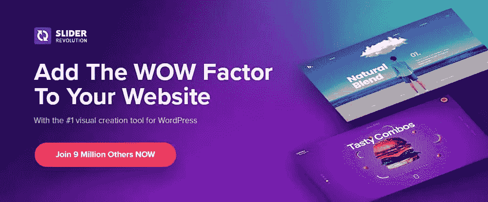](https://www.sliderrevolution.com/examples/?utm_source=BAWpromotion&utm_medium=banner&utm_campaign=top15tools2022)

Slider Revolution 是一个多功能的 WordPress 插件，帮助初级和中级设计人员用专业级的网页视觉效果打动他们的客户。

Slider Revolution 可以让你快速、高效、有效地完成这项工作，而不是花费大量精力试图将一个无聊的网站变成一个至少可以称得上令人敬畏的网站。

*   200 多个令人印象深刻的网站和滑块模板和 25 个以上的附加组件。
*   使用来自社交媒体网站的动态内容。
*   WebGL 幻灯片动画。

## 5.[WP 数据表](https://wpdatatables.com/pricing/?utm_source=baw&utm_medium=posts&utm_campaign=besttools2022)

[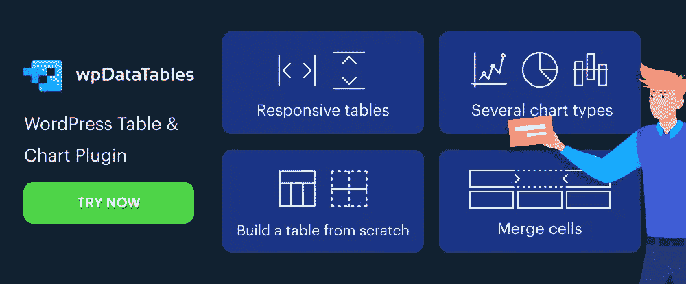](https://wpdatatables.com/pricing/?utm_source=baw&utm_medium=posts&utm_campaign=besttools2022)

wpDataTables 插件使得从大量复杂数据中创建表格和图表变得相对快速和容易。

*   wpDataTables 使用四种图表构建引擎——Google Charts、Highcharts、Chart.js 和 Apex Charts——来创建响应迅速、交互式、前端可编辑且易于维护的图表。
*   wpDataTables 可以处理来自多个数据库的多种格式的数据。
*   条件格式允许用户突出显示或着色关键数据。
*   wpDataTables 可以与 Elementor、Divi 和 Avada 顺利集成。

## 6.阿米莉亚

[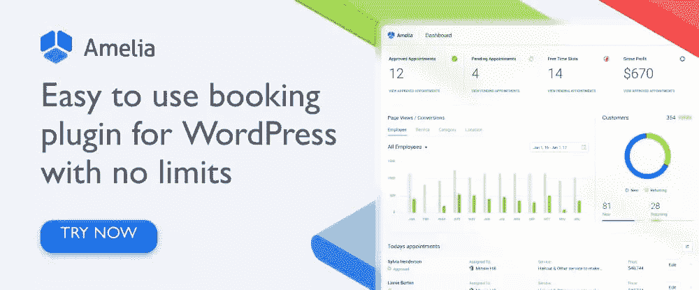](https://wpamelia.com/pricing/?utm_source=baw&utm_medium=posts&utm_campaign=besttools2022)

Amelia 易于使用的插件可以自动管理预约和活动预订，这样可以为企业和客户节省大量时间。

*   可以 24/7 在线预约、更改或取消。
*   Amelia 管理单个和团体约会，以及多个地点的活动预订。
*   可以跟踪和管理员工分配和时间表。
*   Amelia 可以与 Zoom 和 Google Meet 集成，以进行咨询或培训。

## 7.[基本网格](https://www.essential-grid.com/?utm_source=BAWpromotion&utm_medium=banner&utm_campaign=top15tools2022)

[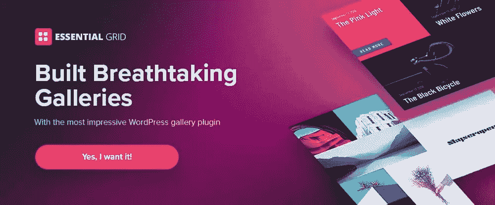](https://www.essential-grid.com/?utm_source=BAWpromotion&utm_medium=banner&utm_campaign=top15tools2022)

Essential Grid 是由 Slider Revolution 的开发者创建的一个 WordPress gallery 插件。它拥有 900 万用户的客户群，你可以用它来创建令人惊叹的图库，保证为你的网站注入新的活力。

Essential Grid 使以下操作变得简单:

*   分享你发人深省、引人入胜的博客和引人注目的作品集。
*   创建吸引人的产品展示。
*   分享您的视频和音频宝石。

还有更多！

## 8\. [LayerSlider](https://layerslider.com/?utm_source=baw&utm_medium=content&utm_campaign=baw202203-2)

[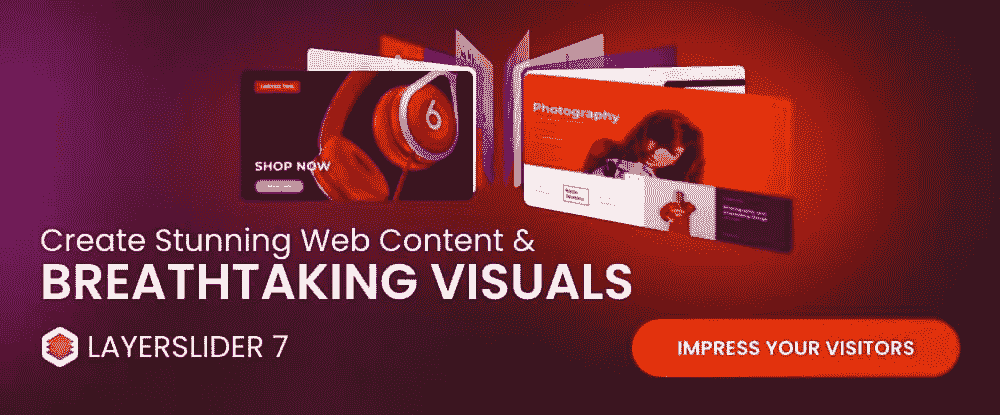](https://layerslider.com/?utm_source=baw&utm_medium=content&utm_campaign=baw202203-2)

LayerSlider 是一个动画和网站建设工具，它可以通过用现代图形、引人注目的动画和交互式功能改变网站的外观和感觉，使枯燥的网站变得令人兴奋和迷人。

*   LayerSlider 拥有 150 多个网站、滑块和弹出模板，并带有一个易于使用的现代编辑器界面，类似于专业的桌面应用程序。
*   任何人都可以使用 LayerSlider 创建图库、弹出窗口、登录页面、动画页面块，甚至完整的网站。

## 9. [Uncode:创意和 WooCommerce WordPress 主题](https://undsgn.com/uncode/?utm_source=adv&utm_medium=baw&utm_campaign=tools-resources22b)

[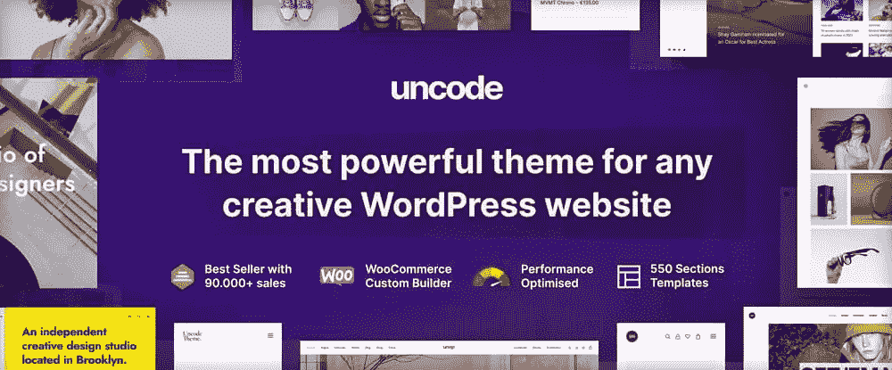](https://undsgn.com/uncode/?utm_source=adv&utm_medium=baw&utm_campaign=tools-resources22b)

超过 95，000 的销量使 Uncode 成为自由职业者、博客、企业和机构的像素级完美多用途主题，并且是 Envato 的最畅销产品。

*   Uncode 的线框插件的 550+节模板使你能够创建任何你能想到的布局。
*   WooCommerce Custom Builder 及其单一产品构建器使 Uncode 成为电子商务网站构建的理想选择。
*   Uncode 的“必看”用户创建网站展示强调了向你开放的网站建设机会。

## 10.[什么是字体](https://www.whatfontis.com/?utm_source=baw&utm_medium=baw&utm_campaign=baw2)

[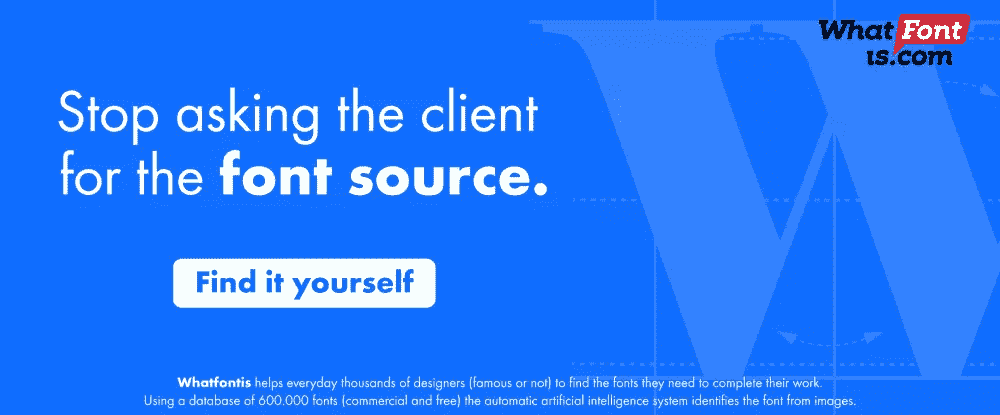](https://www.whatfontis.com/?utm_source=baw&utm_medium=baw&utm_campaign=baw2)

WhatFontIs 是字体标识符世界中一颗隐藏的宝石。他们拥有 850，000 种免费和商业字体的数据库，可以帮助设计师找到他们需要的字体。通过专业版订阅(39 美元/年)，您可以获得以下内容:

*   字体识别准确率超过 90%。
*   当人工智能算法给出令人尴尬的结果时，为这些特殊情况提供额外支持。

WhatFontIs 是专业设计师使用的头号字体查找工具。

## 11.[获取插图股票插图捆绑](https://www.getillustrations.com/)

[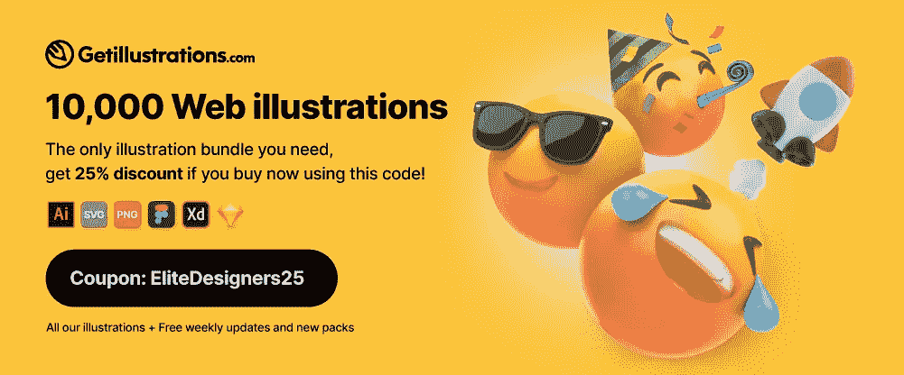](https://www.getillustrations.com/)

获取插图是一个优质插图库，可以改变你的网站用户界面，应用程序和演示设计的方法。

*   它拥有 10，000 幅插图，是世界上同类插图中最大的。
*   插图有矢量 AI、SVG、PNG、Sketch、Figma 和 Adobe XD 格式

购买的插图带有商业许可证，您可以无限制地保留。

## 12.石印:一个多用途的元素

[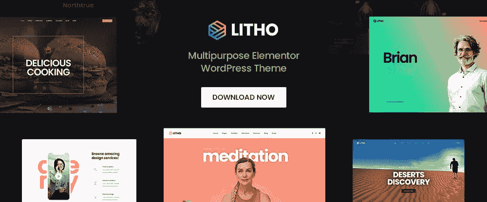](https://litho.themezaa.com/?utm_source=baw&utm_medium=content&utm_campaign=toolsresources22b)

Litho 是一个现代的，多用途的 WordPress 主题元素，是建立利基，投资组合，博客和电子商务网站的理想选择。

*   Litho 使用 WordPress 定制工具和 Elementor 定制工具来给用户最大的灵活性。
*   支持功能包括 37+主页、300+设计模板和 200 多个创意元素。

Litho 的高评级支持包括详细的在线文档。

## 13. [Mobirise 网站构建软件](https://mobirise.com/?utm_source=baw&utm_medium=baw_article&utm_campaign=baw_2022-2)

[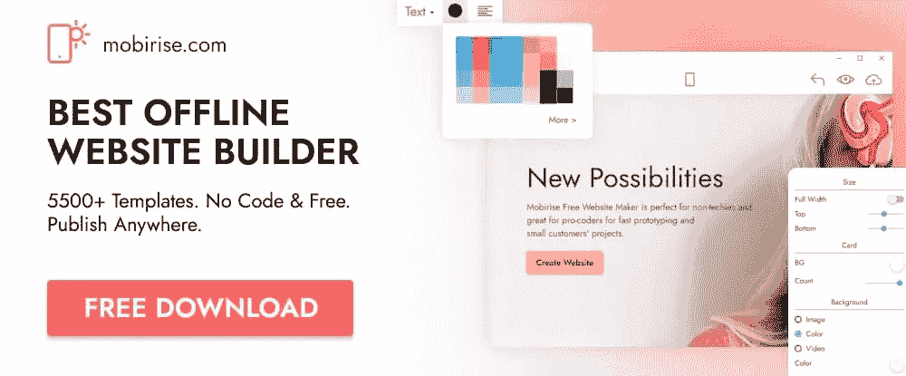](https://mobirise.com/?utm_source=baw&utm_medium=baw_article&utm_campaign=baw_2022-2)

Mobirise 是一款免费的离线网站构建工具，非常适合创建中小型网站。对于通常喜欢视觉工作的非技术人员来说，这也是一个很好的选择。

*   你不依赖于任何平台，可以在任何你希望的地方托管你的站点。
*   该软件包包括 4000+网站块，100+高级 HTML 主题和 300+主页模板。
*   其他页面构建功能包括滑块、图库、图像、视频、谷歌地图、图标等等。

## 14.[8 Bio:Bio 工具中的一个链接](https://8b.io/?utm_source=baw&utm_medium=baw_article&utm_campaign=baw_2022_2)

[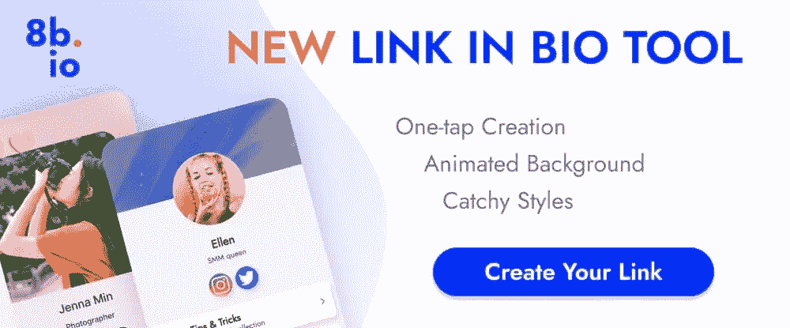](https://8b.io/?utm_source=baw&utm_medium=baw_article&utm_campaign=baw_2022_2)

当你可以使用 8Bio 在 Instagram 和抖音上创建一个链接来推广你自己或你的产品时，为什么还要花费时间和金钱来建立和维护一个网站呢？

*   只需输入您的社交用户名，就会自动创建一个 8Bio 链接。
*   你的链接可以有漂亮的皮肤、吸引人的动画背景、你的照片、另一张图片和一条信息。
*   使用您自己的域名或链接到`*.bio.io`。

## 15.XStore:电子商务的最佳主题

[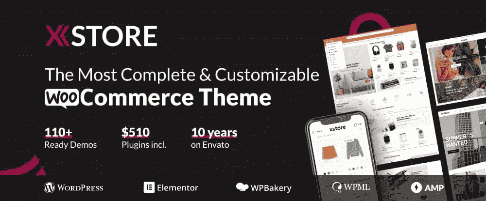](https://xstore.8theme.com/)

说出一个受欢迎的 WooCommerce 主题，这个主题价格便宜，有 110 多个可以定制的商店，让你开始。答案是:XStore。

*   当您的内容唾手可得时，您可以快速启动并运营在线商店。
*   价值 520 美元的高级插件让 XStore 更加划算。
*   支持 WPBakery 和 Elementor，以及精心挑选的产品设计元素和页面布局选项的时尚集合。

## 包扎

你需要手头有合适的设计工具来做好你的工作。

您使用的工具对您自己或您的机构的成功起着至关重要的作用。合适的设计工具帮助您高效工作，按时完成项目，并超越客户的期望。

借助这些强大而高效的工具，更好、更智能、更快速地工作。为了节省您的时间，我们创建了这篇文章(一种小抄！)提供大量工具和资源，帮助 2022 年的设计师。

## 分享这篇文章