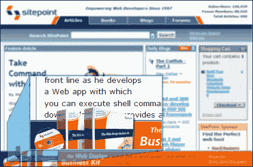

# 鲶鱼——第一部分

> 原文：<https://www.sitepoint.com/the-catfish-part-1/>

如果你在过去的两个月里访问过这个网站，你很可能会注意到我们的新鲶鱼书横幅不时贴在页面底部。自从他们发布以来，我们每周都会收到大约 3-4 条评论/电子邮件，询问他们是如何做到的。因此，我们认为，对于感兴趣的人来说，这可能是一个向你展示细节的好地方，而不是单独回复每封电子邮件。



当然，代码一直存在于公众视野中，但是如果你曾经浏览过它，你会知道 SitePoint 有许多深度交织的 CSS 和脚本，所以我们将把鲶鱼的精简版本放入一个容器中。

首先，一些基础知识。是的，鲶鱼是“零”,而是一个“普通”的 DIV，用一些 CSS 和一点 JavaScript 使它闪闪发光——不需要疯狂的技术。

第一个“概念证明”是与[无动画和纯 CSS](/examples/catfish/) 一起被黑的。在那个阶段，我们的想法只是对它在页面上的外观有一个感觉，所以我们使用“position:fixed”CSS 属性和一点 JavaScript 快速设置它，让它在被请求时消失。

DIV 被放在最后，就在结束 BODY 标记之前。我们还填充了 HTML 元素的底部，以确保页脚不会被鲶鱼遮住。

##### [鲶鱼. css](https://www.sitepoint.com/examples/catfish/catfish.css)

```
 #catfish {
position:fixed;
bottom:0;
background:transparent url(images/catfish-tile.gif) repeat-x left bottom;
padding:0;
height: 79px;  /* includes transparent part */
cursor: pointer;
margin: 0; 
width:100%;
}
html {
padding:0 0 58px 0; /* 58px = height of the opaque part of the Catfish */
} 
```

“DIV #鲶鱼”的内容完全由你决定。可以想象，你可以用它来导航、发布网站公告、登录面板或者做很多事情。空间明显有限，建议保持东西相对简单。

在和这里的一些人演示之后，我们都同意这个想法是有根据的。在这一点上，大问题变成了小问题，它在 Internet Explorer 中根本不工作。如果你在 IE 中查看演示，你会看到 DIV 的行为就好像它是' *position: static 【T1 '(默认)。我们最大的挑战是让 IE 玩得“像好人”——这也是我在这里要专注的。*

已经有很多关于这个“固定”问题的好作品，来自(其他人)斯图·尼科尔斯(T0)、[西蒙·杰西(T3)和](http://jessey.net/simon/articles/007.html)[彼得·皮西·斯坦尼塞克(T5)。虽然每个人在细则上有所不同，但他们似乎在一些主要原则上基本一致——使用“position:absolute”定位*“wanna be fixed DIV”*,然后将*所有其他内容*包装在“position:relative”DIV 中以使它们分开。听起来是个不错的起点。](http://www.pixy.cz/blogg/clanky/css-position-fixed/)

在这一点上，我们还做了另一个决定。既然 FireFox、Opera 和 Safari 在 W3C 标准“位置:固定”方面做得很好，为什么还要对它们做额外的标记呢？—只有 IE 会得到额外的加价。

在这个“沙盒”版本中，我将使用“条件注释”附加我们的 IE 特定样式和脚本，尽管我们实际上使用“对象嗅探”来针对现场版本的 IE。我认为条件注释是目前很好的方法，因为它们调用 IE 中专门构建的功能，而不是依赖于可修复的和可能短暂的浏览器错误。随着 IE7 的出现，依赖 bug 是比以往任何时候都更危险的职业。

##### 条件注释

```
 <!--[if IE]>
<link rel="stylesheet" href="IEhack.css" type="text/css" />
<![endif]--> 
```

上述标记将允许我们只向 IE 提供不同的风格。其他浏览器会把它看做“bog 标准”HTML 注释，这意味着 HTML 验证者也会觉得它有益和令人满意。如果 IE7 支持‘position:fixed’，那么更改注释使其仅针对 IE6 和更旧版本(例如，如果小于 IE7，则为'`<!--[if lt IE 7]> ...`')将是微不足道的。

那么，我们应该发送 IE 什么额外的 CSS 呢？

不是很多。我们需要将鲶鱼的定位切换到'`absolute`'，将它的 z-index 设置为'`100`'以保持它在前面，并将它的溢出设置为'`hidden`'。

##### [IEhack.css](/examples/catfish/IEhack.css)

```
 #catfish {
position: absolute;
z-index: 100;
overflow: hidden;
} 
```

现在我们有了正确定位的鲶鱼(T2)，也就是说，直到我们试图滚动，在这一点上，它滚到了页面上。问题是浏览器计算出“`bottom:0`”作为视窗底部*与主体重叠的精确点——当主体滚动时，该点随之移动。*

因此，理论上，我们可以通过采取相当激烈的行动*来解决这个问题，强制阻止我们的`BODY`在任何情况下滚动*。使用'`overflow:hidden`'和'`height:100%'`,我们可以强制视窗、`HTML` 元素和`BODY` 元素获得完全相同的尺寸。没有滚动意味着鲶鱼保持不动。

##### [IEhack.css](/examples/catfish/IEhack.css)

```
 html, body {
height:100%;
overflow: hidden;
width:auto;
} 
```

当然，令人遗憾的是，这个小小的胜利已经变质了，因为我们现在无法访问我们视口之外的任何内容。现在我们调用其他方法中提到的包装器 DIV。我把它叫做“T0”，因为我们把所有非鲶鱼的内容都“压缩”到了里面。在标记中，它看起来像这样。

##### [catfish-ie.php](/examples/catfish/catfish-ie.php)

```
 <body>
<div id="zip">
<div id="masthead...

...</div>...<!-- close zip -->
<div id="catfish">...

...</div><!-- close catfish-->
</body> 
```

这个新的'`div#zip`'现在被页面上的大部分内容填满了，所以如果我们把它的溢出设置为'`auto`'，它会很乐意给我们一些漂亮的新滚动条。这些滚动条将和`BODY`自己的默认滚动条几乎没有区别。这个 DIV 的 CSS 非常普通。

##### [IEhack.css](/examples/catfish/IEhack.css)

```
 div#zip {
width: 100%;
padding:0;
margin:0;
height: 100%;
overflow: auto;
position: relative;
} 
```

好了，现在 [IE 表现不错](/examples/catfish/catfish-ie.php)，很好地模仿了知道什么是固定定位的浏览器，…只要我们给它额外的 DIV 就可以了。

但是，正如我上面所说的，为什么要让更好的浏览器负担他们不使用的东西呢？这是一个更有可能阻碍而不是帮助他们的 DIV，所以让我们使用 DOM 把它只注入 IE。

我们将添加一个名为'`wrapFish`'的新函数。剧本是这样的。

##### [鲶鱼. js](/examples/catfish/catfish.js)

```
 function wrapFish() {
 var catfish = document.getElementById('catfish'); 
   // pick the catfish out of the tree
 var subelements = [];
  for (var i = 0; i < document.body.childNodes.length; i++) {
  subelements[i] = document.body.childNodes[i]; 
  } 
    // write everything else to an array
 var zip = document.createElement('div');    
   // Create the outer-most div (zip)
 zip.id = 'zip';                     
   // give it an ID of  'zip'
 for (var i = 0; i < subelements.length; i++) {
  zip.appendChild(subelements[i]);  
    // pop everything else inside the new DIV
  }
  document.body.appendChild(zip); 
   // add the major div back to the doc
  document.body.appendChild(catfish); 
    // add the Catfish after the div#zip
 }
 window.onload = wrapFish;  
    // run that function! 
```

这些评论详细介绍了它在做什么，但是，简言之，它:

*   把鲶鱼从文档中去掉，
*   创建新的`DIV#zip`，
*   将所有其他内容复制到新的 DIV 中，
*   将该 DIV 附加到文档，并
*   将鲶鱼钉在尾部

现在我们需要做的就是在中调用这个来自*的脚本作为我们的条件注释。IE 现在有了它需要的额外的“支持”,所有其他的小浏览器都不会知道。*

##### 条件注释

```
 <!--[if IE]>
<link rel="stylesheet" href="IEhack.css" type="text/css" />
<script type="text/javascript" src="catfish.js">
<![endif]--> 
```

所以，[你就有了](/examples/catfish/catfish-final.php)。我在'【T0]'上留了一个红色的虚线边框，以表明只有 IE 在渲染那个额外的 DIV。我们已经修补了 IE，没有干扰任何其他人。

那么，这就是让一个类似鲶鱼的系统运行所需要知道的全部内容吗？

不完全是。很可能您只想在特定的页面、特定的时间运行鲶鱼，因此我们需要一个智能系统，知道是否以及何时通过 DOM 注入鲶鱼。这也将是很好的，能够从不同的横幅库进行选择。

汤姆将在第二部分处理这些和其他令人兴奋的问题——很快。

## 分享这篇文章