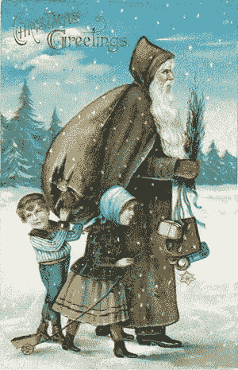
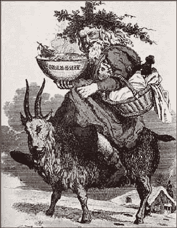
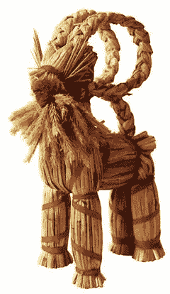
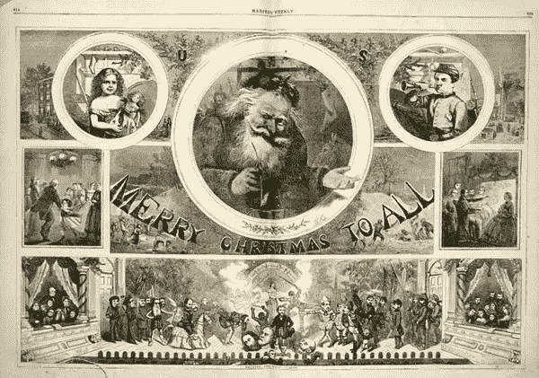
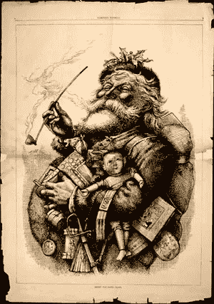
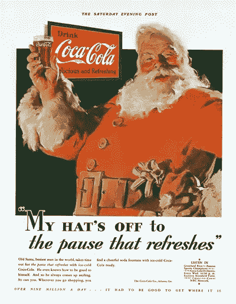

# 圣诞老人不断变化的设计

> 原文：<https://www.sitepoint.com/the-changing-design-of-santa-claus/>

因为快到圣诞节了，我想这可能是一个很好的时间来看看圣诞老人的外观和感觉是如何随着时间的推移而变化的。

今天的圣诞老人被认为是受到了 4 世纪希腊基督教主教迈拉的圣尼古拉斯的启发。圣尼古拉斯因他给穷人的礼物而出名。早期艺术家的印象把他描绘成一个穿着规范长袍的大胡子。有点像这样:

图片来源:维基百科

挪威的异教之神奥丁也与圣诞老人联系在一起。根据民间传说，奥丁被记录为在圣诞节期间带领一支狩猎队穿越天空。奥丁的长相在冰岛故事中被描述为*Sígrani*、*Sískeggr*、*langbar r*，都是“长胡子”的意思， *Jólnir* 是“尤尔身材”的意思。

当孩子们把他们装满糖、胡萝卜或稻草(给奥丁的飞马)的靴子放在烟囱附近时，他们的好心被奥丁用礼物回报了。这种想法在德国和欧洲低地国家延续了下来，当时圣尼古拉斯和基督教被采用，现代的做法是在烟囱胸上挂袜子。再次有许多艺术家对奥丁的印象，这里有一个他留着胡子，穿着红色外套骑在他的飞马上。

图片来源:维基百科

在更近的时期，圣·尼古拉斯和圣诞老人(荷兰的圣·尼古拉斯)与英国的圣诞老人的概念融合成为圣诞老人。在 17 世纪，圣诞老人穿着一件长长的绿色毛皮衬里的长袍出现，并传递快乐和圣诞节的精神。

图片来源:[明信片图片](http://www.postcardimages.net/)

大约在这个时候，在斯堪的纳维亚国家，圣尼古拉斯开始作为圣诞山羊的礼物带来者出现。在接下来的一个世纪里，北欧民间传说描述了一个叫做“Tomte”或“Nisse”的精灵，一个身材矮小，留着胡子，穿着灰色衣服，戴着红色帽子的人。圣诞山羊作为礼物带来者的传统在斯堪的那维亚已经几乎消失了，但是稻草山羊仍然是一种受欢迎的圣诞装饰品。

 

图片来源:左边[维基百科](http://wikipedia.com)，右边[斯堪的纳维亚-南方](http://www.scandinavian-south.com)

从 18 世纪后期开始，圣诞老人开始出现在英国和美国更多的故事中。随着作家们用各种方式描述他(包括一个穿着绿色冬装、大腹便便、叼着烟斗的荷兰水手)，艺术家们也开始描绘圣诞老人，并定义我们已经熟悉的风格。《时尚芭莎》的托马斯·纳斯特被认为是第一个定义现代圣诞老人的艺术家。

图片来源:[南方之子](http://www.sonofthesouth.net/Nast_Santa_Claus.htm)

从这一点上来说，圣诞老人已经被描绘成我们所知道和喜爱的那个圆肚子、快乐的老人。可口可乐发明了现代圣诞老人的神话是不真实的，但他们确实在广告中使用了他的形象。他们根据自己的品牌发明了他的红白服装，这也是不真实的。下面你可以看到可口可乐 1931 年的一则广告，刊登在《周六晚邮报》上。多年来，可口可乐公司雇佣艺术家来创造一个新的，但传统的圣诞老人，现在我们许多人都接受是“的”圣诞老人。

图片来源:[可口可乐](http://www.thecoca-colacompany.com/presscenter/img/imageheritage/downloads/lg_santa_1931.jpg)

我的一个朋友周末带她的孩子去看圣诞老人。他穿着绿色的衣服，给孩子们一些小植物作为礼物。有没有回到 18 世纪穿着绿色毛皮衬里长大衣的真正的老派圣诞老人？也许有一个远离商业主义的微小运动正在进行中？

你如何看待圣诞老人的外貌在这些年的演变？

## 分享这篇文章