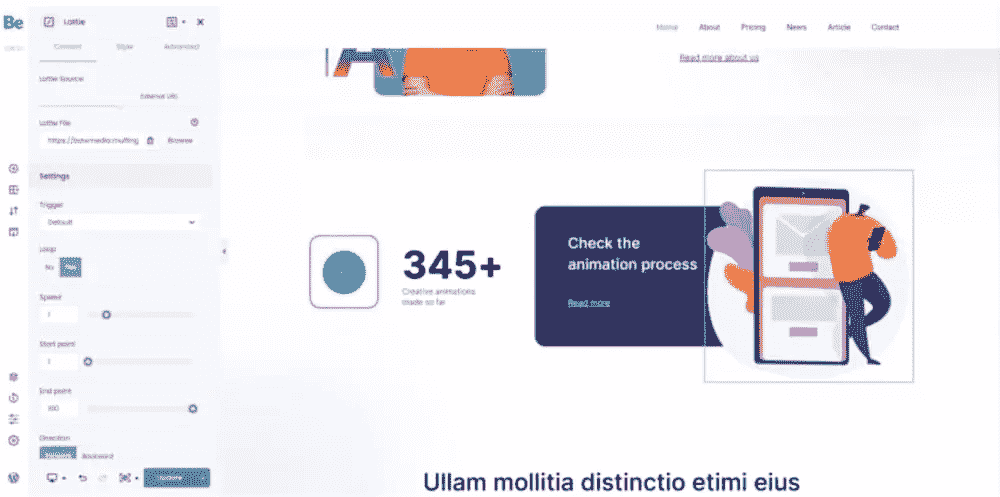
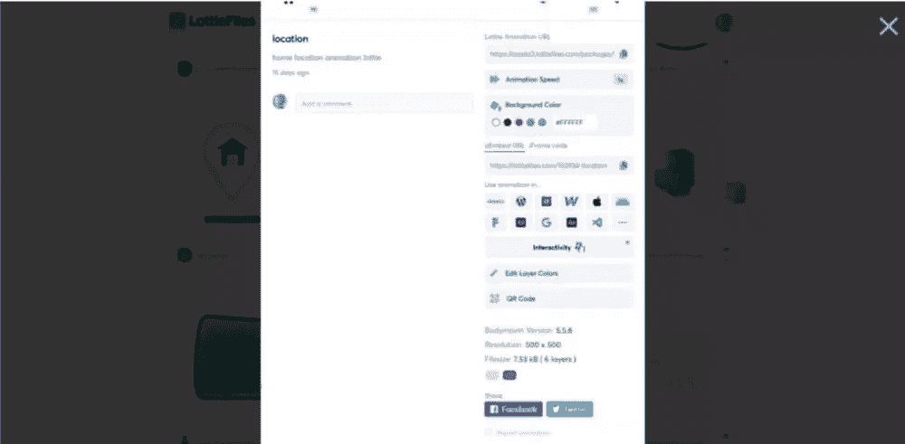
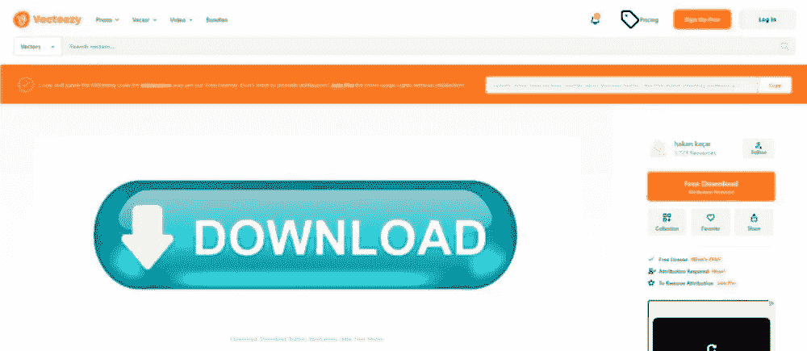
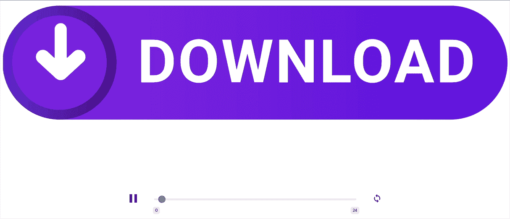
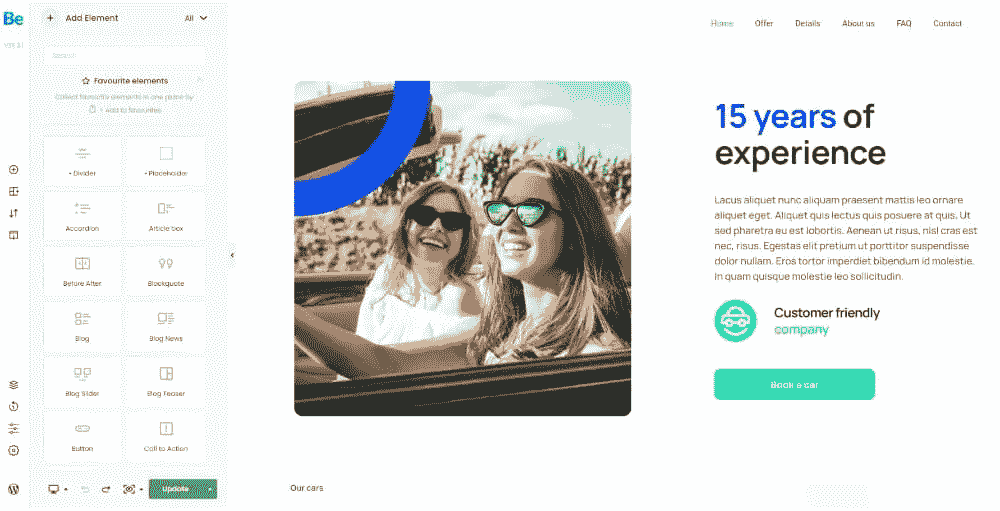

# 激活 WordPress 网站最简单的方法:BeBuilder + Lottie

> 原文：<https://www.sitepoint.com/the-easiest-way-to-animate-wordpress-websites-bebuilder-lottie/>

*这篇赞助文章由我们的内容合作伙伴 [BAW 媒体](https://baw.agency/)创作。感谢您对使 SitePoint 成为可能的合作伙伴的支持。*

动画并不像其他网页设计趋势一样来去匆匆。在过去的几年里，这种趋势已经证明了它在改善用户体验方面是多么的有用。从参与到娱乐，网站上的动画可以做很多事情。

网页设计师目前有很多方法来制作 WordPress 网站的动画，比如 CSS 动画和嵌入式 gif。那么，为什么 BeTheme 在其 BeBuilder 中添加了一个新的 Lottie 动画功能呢？

与其他方法相比，使用 Lottie 创建动画有很多优势。在这篇文章中，我们将探讨为什么 Lottie 是当今创作有吸引力和引人入胜的动画的最佳方式，以及它与 [BeBuilder](https://be-theme.com/be-builder?utm_source=baw&utm_medium=content&utm_campaign=may22) 和 [BeBuilder](https://be-theme.com/be-builder?utm_source=baw&utm_medium=content&utm_campaign=may22) 的集成如何让 WordPress 用户更容易使用它。

## 为什么洛蒂动画是制作 WordPress 网站动画的最佳方式

Lottie 是为你的 WordPress 站点创建动画的最新和最有效的方法之一。到底是什么让它比其他动画方式更好？先来看看洛蒂动画的核心好处。

### 1.洛蒂不需要任何代码

你看着它永远也不会知道，但是你不需要写一行代码来创建 Lottie 动画。例如，下面是洛蒂动画在 [BeLottie](https://themes.muffingroup.com/be/lottie/?utm_source=baw&utm_medium=content&utm_campaign=may22) 预建网站上的样子。

[<video style="width: 100%;" preload="metadata" controls=""><source type="video/mp4" src="https://uploads.sitepoint.com/wp-content/uploads/2022/05/1652752781belottie.mp4"></video>](https://themes.muffingroup.com/be/lottie/?utm_source=baw&utm_medium=content&utm_campaign=may22) 

首先，你不需要知道如何使用 Adobe After Effects 来创建或编辑 Lottie 动画文件。你可以从像[洛蒂文件](https://lottiefiles.com/)和[图标侦察](https://iconscout.com/)这样的资源中获得预先制作的洛蒂动画。

一旦你有了你的 Lottie 动画，BeBuilder 可以很容易地把它们添加到你的 WordPress 站点。

只需从 UI 元素列表中找到 Lottie 元素。将其拖放到可视化构建器中。然后，使用左边的**内容**设置将 Lottie 文件上传到你的 WordPress 媒体库，或者从外部链接获取动画。

为 WordPress 创建高级动画不需要学习 HTML、CSS 或 After Effects。BeBuilder 的无代码页面构建器和 Lottie 动画功能让设计人员和非设计人员使用直观的工具轻松创建动画。

### 2.洛蒂动画很容易定制

有很多原因可以让你定制你的 Lottie 动画。首先，你希望动画与你网站的品牌相匹配。

如果您从 LottieFiles 获得 Lottie，它会附带一个编辑器，使您能够自定义:

*   动画速度
*   背景颜色
*   图层颜色
*   交互性

因此，您可以直接从源代码编辑洛蒂动画的内容。

此外，您可以使用 BeBuilder 的设置来自定义 Lottie 动画的工作方式。例如，您可以调整与以下内容相关的设置:

*   动画触发器
*   起点和终点
*   向前或向后方向
*   对齐
*   背景
*   响应可见性

Lottie 变得和 BeTheme 中的其他 UI 元素一样容易编辑。

### 3.洛蒂更适合表演

有时当我们制作网站动画时，我们不得不以牺牲其他东西为代价。

例如，一些动画方法是资源密集型的，会导致网页加载速度变慢。其他的动画制作方法可能会导致效果不佳或看起来粗糙的动画，这会损害网站的整体外观。

Lottie 是一个基于 JSON 的动画文件。它很像 SVG，因为两者都是矢量文件格式——尺寸和重量都很小，同时还完全可伸缩。这使得 Lottie 成为性能的理想动画文件格式。

让我们看一个简单的例子。这是一个 JPG 的“下载”按钮，可以在免费资源网站上找到。

类似设计的[按钮可以在 LottieFiles](https://lottiefiles.com/4342-download-button) 上找到，只是它是动画的。

这两个文件之间的差异超越了美学。来自 Vecteezy 的 JPG 是 57KB。LottieFiles 的 JSON 是 15KB。

当然，其他因素也会影响文件的大小，比如输出大小。然而，这些是相似的图形，尽管洛蒂中有动画，但它的重量明显更轻。

此外，Lottie 与 WordPress 最快的页面生成器 [BeBuilder](https://be-theme.com/be-builder?utm_source=baw&utm_medium=content&utm_campaign=may22) 无缝集成。因此，当你将两者结合使用时，你不必担心缓慢的主题或页面生成器插件会干扰 Lottie 的原生速度和质量。

### 4.洛蒂完全有反应

虽然 BeBuilder 给用户提供了在某些设备上隐藏 Lottie 元素的选项，但这是一个你不需要使用的设置。

洛蒂文件是基于矢量的，这意味着它们可以缩放到任何尺寸的屏幕。例如，假设我们将一个[行走的墨西哥卷饼](https://lottiefiles.com/62265-walking-taco)嵌入到[beforodtruck 2](https://themes.muffingroup.com/be/foodtruck2/?utm_source=baw&utm_medium=content&utm_campaign=may22)的主页中。

[<video style="width: 100%;" preload="metadata" controls=""><source type="video/mp4" src="https://uploads.sitepoint.com/wp-content/uploads/2022/05/1652752971fresh.mp4"></video>](https://themes.muffingroup.com/be/foodtruck2/?utm_source=baw&utm_medium=content&utm_campaign=may22) 

当我们打开响应模式并将视图从桌面切换到平板电脑再切换到移动设备时，动画文件会相应地响应新的屏幕大小。不需要在你的末端调整大小或重新定位。

考虑到响应式设计对当今品牌和消费者的重要性，洛蒂是响应式设计中极其有用的动画工具。当你将它与 BeTheme 的预建响应网站以及 BeBuilder 的响应页面生成器配对时，你将拥有 WordPress 的完整响应动力。

### 5.洛蒂/贝瑟姆组合提升了用户体验

一个行走的玉米卷动画看起来肯定很有趣，但是我们可以用动画做更多的事情，而不仅仅是娱乐游客。通过编写微型动画在正确的地点和正确的时间回应游客，我们可以激励他们采取行动。

让我们以 [BeCarRental3](https://themes.muffingroup.com/be/carrental3/?utm_source=baw&utm_medium=content&utm_campaign=may22) 网站上的行动号召模块为例。

“客户友好型公司”字样旁边有一个绿色汽车/笑脸图标，就在行动号召按钮的上方。虽然这个信任标记很醒目，但有些访问者可能会因为浏览整个静态部分太快而没有注意到它。

你能做的就是给这个部分增加动感。一种选择是将**订车**按钮换成动画洛蒂。这种微型动画会将访问者的注意力直接吸引到按钮上，让更多的人停下来考虑“预订汽车”的邀请。

另一种选择是用滚动触发的洛蒂图形替换信任标志。

[<video style="width: 100%;" preload="metadata" controls=""><source type="video/mp4" src="https://uploads.sitepoint.com/wp-content/uploads/2022/05/1652753133becarrental.mp4"></video>](https://themes.muffingroup.com/be/carrental3/?utm_source=baw&utm_medium=content&utm_campaign=may22) 

在这里，我们看到当[汽车保险提供加载页面动画](https://lottiefiles.com/93387-car-insurance-offers-loading-page)被重新用于我们的行动号召模块时会发生什么。

动画不是循环播放，而是放慢速度，与游客的动作同步移动。我们可以通过改变 BeBuilder 内部的一个设置来做到这一点，在滚动条上将**触发器**从*默认*更新为*。*

虽然按钮保持不变，但在这一部分——按钮正上方——增加移动将有助于提高参与度。

## 洛蒂动画只是让 BeTheme 成为你的 WordPress 主题的又一个原因

谈到网站动画，洛蒂是一个真正的游戏改变者。这还仅仅是它自己。

当你将 Lottie 与 [BeTheme](https://be-theme.com/?utm_source=baw&utm_medium=content&utm_campaign=may22) 和 [BeBuilder](https://be-theme.com/be-builder?utm_source=baw&utm_medium=content&utm_campaign=may22) 整合在一起时，你将拥有将你的设计和用户体验提升到下一个水平所需的所有工具。更重要的是，你不需要增加成本，启动时间，或者制作 BeTheme 网站动画所需的努力。一切都为你做得尽可能直观和无缝。

## 分享这篇文章