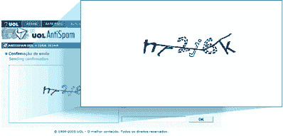
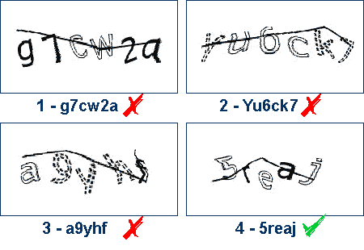

# 验证码的终结？

> 原文：<https://www.sitepoint.com/the-end-of-captcha/>

旁白:经过短暂的休息后重新回到工作岗位感觉很好——有了一个小女儿，但少了一点多余的睡眠；)

我们大多数人都曾在某个时候使用过“验证码”，即使我们不知道它叫什么。根据维基百科，“T0”CAPTCHA 是“**C**completely**A**automated**P**public**T**在测试中告诉 **C** 计算机和 **H** 人类 **A** 部分”的首字母缩写——好吧，他们藐视了“首字母缩写规则”，但你必须承认，这可能比技术上更正确的“首字母缩写规则”更吸引人

验证码用于从各种旨在利用基于网络的反馈渠道的机器人、爬虫和蜘蛛中过滤“有血有肉”的用户。它们在电子邮件和垃圾评论过滤系统等领域尤为常见。

这个想法是设定一种人类可以轻松通过，但机器人却很难通过的测试。虽然有其他选择，但是如果你是一个网站开发者，想要实现一个没有评论的网站，“验证码”通常是你的第一选择——但是这能持续多久呢？

我今天早上想到“验证码”的原因是，上周五我发送了设计视图，这总是意味着我第二天早上要回复评论、问题和最常见的反垃圾邮件验证系统。虽然有些仍然很简单——点击回复——但其他的变得很难，我发现自己要试三四次才能通过。

UOL.com.br 的‘挑战/响应’系统似乎是我见过的最糟糕的冒犯者。下面是一些我失败的“简单测试”的例子。

你甚至没有机会从错误的答案中吸取教训。通常你的错误只是简单地选择了大写字母而不是小写字母，但这是“回到绘图板”，每次你出错时都要进行新的测试。

我可以想象，如果我不得不努力让这个系统工作，许多其他人会更快地失去信心——事实上，我会暗示，在第二次被拒绝后，我的父母都会认为他们在做错事。

那么，这仅仅是简化测试的问题吗？

有可能，但不幸的是机器人正在反击。据 CAPTCHA.com 报道，加州大学伯克利分校的研究人员开发了一种人工智能软件，能够与雅虎的验证码系统达到 83%的准确率。这只会有所改善。

当你考虑到可访问性的缺点时(视力受损的用户阅读普通字体已经很困难了)，验证码方法看起来有点麻烦。

## 分享这篇文章