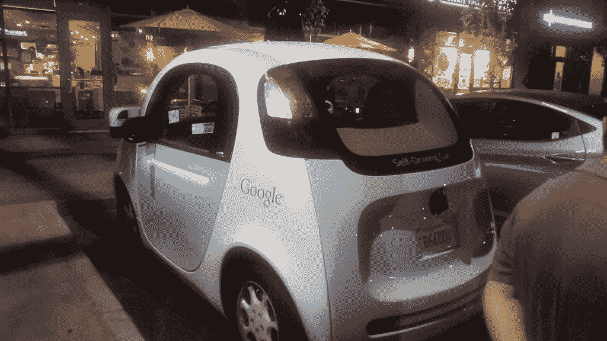

# 编程汽车背后的伦理和用户体验

> 原文：<https://www.sitepoint.com/the-ethics-and-use-experience-behind-programming-cars/>

自福特 t 型车时代以来，汽车已经取得了很大的进步。虽然过去一辆汽车拥有蓝牙和电话集成就足够了，但现在软件控制了整个驾驶体验。从娱乐系统到发动机操作、安全系统等等。科技带来了智能巡航控制、平行泊车辅助甚至自动超车等创新，但这些都不如自动驾驶功能[谷歌](https://www.google.com/selfdrivingcar/)和一些[特斯拉](http://fortune.com/2015/10/23/tesla-autopilot-goes-global/)汽车运动那样令人印象深刻。

编程汽车过去仅限于在汽车行业有多年经验的工程师。今天，有了先进的编程接口，汽车编码变得更加容易。这仍然不像编写网站代码那么容易，但至少你不需要掌握嵌入式系统编程来修改汽车。不幸的是，这是一个完全不同的主题，超出了本文的范围。相反，我们将关注编程汽车的一些非技术性挑战。

## 编程判断

无人驾驶汽车应该比传统汽车更安全，然而最近一批谷歌汽车被证明过于谨慎。从骑自行车的人导致汽车失控到汽车在红绿灯处被追尾，编程让汽车像人类一样驾驶是这些机器的一个主要障碍。

自动驾驶汽车面临的最大挑战之一是技术无法解决的。生活中没有什么是万无一失的，随着自动驾驶汽车越来越受欢迎，最紧迫的问题之一是汽车应该如何处理最糟糕的情况。麻省理工科技评论使用了一辆无人驾驶汽车失去控制并驶向人群的例子。汽车可能会冲进人群或突然转向撞到墙上。说牺牲司机来拯救生命是最好的，这很容易，但如果你是司机，你可能不会有这种态度。

人们不会买会让他们成为烈士的汽车，然而人们也不想在失控时被车撞死。在传统汽车中，这个决定已经足够艰难了，但自动驾驶汽车意味着程序员决定谁生谁死。现在这个问题还没有答案，但是它说明了代码对生活的影响有多大。

## 有意隐藏缺陷

汽车制造商现在能够通过在系统中添加额外的代码来掩盖安全漏洞。大众汽车最近受到抨击，因为他们的[柴油发动机检测排放测试设备](http://www.bbc.com/news/business-34324772)并为这些机器调整性能。虽然排放不是直接的安全问题，但是如果你可以给汽车编程来欺骗排放系统，那么什么能阻止程序员隐藏引擎传感器准确性的缺陷呢？[线控](http://auto.howstuffworks.com/car-driving-safety/safety-regulatory-devices/drive-by-wire.htm)意味着现代汽车中几乎所有的机械都由代码控制。从油门到刹车，一切都通过数字信号控制。

无论汽车是自动驾驶还是传统车辆，在为车辆编写代码时都不能偷工减料。在一个[滑动地垫](http://mashable.com/2014/03/19/toyota-lied-aceleration-recall/)导致汽车失控加速的世界里，修复代码并不会变得更容易。这是这里最重要的事情。汽车的物理缺陷已经够麻烦的了。修复错误代码可能比安装一个钩子来固定汽车脚垫需要更多的努力。

## 技术领先于时代

自动驾驶汽车可能比人类司机更安全，但最近推出的特斯拉自动驾驶功能表明，如果司机未经适当培训就被赋予强大的功能，会发生什么。例如，如果自动转向导致你[差点驶出高速公路匝道](http://www.theverge.com/2015/10/21/9589724/tesla-autopilot-videos-youtube-safety-advice-ignored)，那么它就没用了。这不是编程出错的情况。这是一个司机被新技术淹没的例子。仅仅因为你能编码一些东西并不意味着它值得去做。

当谈到传统应用程序时，新功能带来的最糟糕的情况是困惑的用户转向其他东西。另一方面，当你在为一辆汽车编程时，压倒性的用户会带来致命的后果。甚至车内娱乐系统的[用户体验也在分心驾驶中发挥着巨大作用。当谈到汽车技术时，最好只添加必要的功能，而不是加入半生不熟的代码(或新奇的功能)来让你的车更性感。](https://www.sitepoint.com/automotive-trends-app-developers/)

## 一线希望

当然，汽车变得越来越先进也有很多好处。自动驾驶汽车几乎可以消除车祸，而汽车中的先进传感器可以带来更强大的安全系统。技术不是一件坏事。这是一个全新的领域，以前从未被开发过。在这个领域变得更加成熟之前，最好让你的开发周期保持适度的速度，尤其是驾驶辅助技术。谷歌汽车表明自动驾驶汽车是实用的。这实际上是一个培训驾驶员的问题，正如特斯拉 Autopilot 的案例所示。

你有什么想法？

## 分享这篇文章