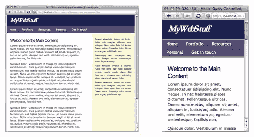

# 缩放布局越来越多的应用(第 1 部分)

> 原文：<https://www.sitepoint.com/the-ever-increasing-uses-of-a-zoom-layout-part-1/>

如果我指着一个页面，把它描述成一个<dfn>缩放布局</dfn>——你知道我在说什么吗？

这个术语是由 Joe Clark 推广的，他是可访问 web 开发的最重要的倡导者之一，用来描述一个被格式化(或重新格式化)的页面，以方便弱视用户——那些使用超大文本或放大软件导航的人。

缩放布局的关键特征是它**将页面格式化为单列**，而不是两三个浮动列**，这样文本就有更多的空间来缩放**，而不会产生水平滚动条。这种布局也可能以简化的导航、更大的默认字体或提供更高对比度的配色方案的变化为特色。

这里有两个相同页面设计的例子:

*   [标准的两列布局](https://www.sitepoint.com/examples/queryzoom/columns.html)
*   [与缩放布局相同的页面](https://www.sitepoint.com/examples/queryzoom/zoom.html)

## 这不仅仅是缩放！

描述这些布局的另一种方式是称它们为<dfn>线性化</dfn>或<dfn>序列化</dfn>页面。它们类似于支持 <abbr title="Cascading Style Sheets">CSS</abbr> 的串行访问设备(比如基于浏览器的屏幕阅读器)以及根本不应用 <abbr title="Cascading Style Sheets">CSS</abbr> 的设备(比如纯文本浏览器和搜索引擎机器人)看到的页面。它们也非常类似于短暂鼓励但最终被摒弃的“纯文本”版本的概念，因为它们强调内容的可读性，而不是更好的设计美学。

重点是，不需要太多的想象力就可以想到一个更简单的线性页面布局的一大堆不同用途:

*   iPhones、智能手机和游戏设备内置的浏览器等小屏幕设备更好。
*   它更适合打印,因为它不会试图将一个固定的、宽的布局放入一个狭窄的、灵活的空间。
*   它能更好地与旧浏览器兼容，比如 T2 IE5 甚至网景 4！这些早期的 <abbr title="Cascading Style Sheets">CSS</abbr> 实现通常对实现核心设计的基本颜色、字体和背景相当满意；如果我们能把这些风格从高级布局和框定位风格中分离出来，这些风格往往会让浏览器窒息，那么我们仍然可以给它们一些有吸引力和品牌的东西，作为一方面混乱或者另一方面没有风格的替代。
*   这对于屏幕分辨率低的旧电脑来说更好，就像它对小屏幕电脑的好处一样。
*   这是一个**有用的类比，类似于串行访问设备看到的**，帮助你理解和联系屏幕阅读器如何查看你的页面，以及在较小程度上，搜索引擎机器人如何查看你的页面(关键区别在于机器人不解析 <abbr title="Cascading Style Sheets">CSS</abbr> ，而屏幕阅读器会)。

因此，我们真正谈论的不仅仅是一种增强可访问性的方式，而是一种从根本上将您的受众分为两种不同使用情形的方式*——一方面为小屏幕和线性设备提供布局，另一方面为大屏幕桌面和笔记本电脑设备提供布局:*

 *
**适用于不同窗口大小的大小屏幕布局。**

## 让它发生…

那么，我们需要做些什么来实现这一目标呢？所有的都在结论部分揭示了:

*   [<cite>【第二部分】</cite>](https://www.sitepoint.com/the-ever-increasing-uses-of-a-zoom-layout-part-2/)

*缩略图鸣谢:[凯尔梅](http://www.flickr.com/photos/kylemay/1473447770/)*

## 分享这篇文章*