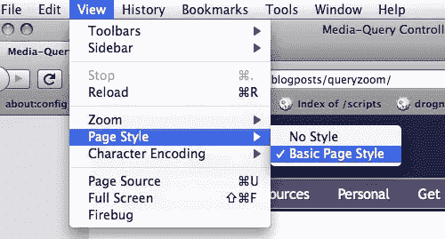
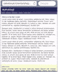
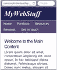

# 缩放布局越来越多的应用(第 2 部分)

> 原文：<https://www.sitepoint.com/the-ever-increasing-uses-of-a-zoom-layout-part-2/>

在本文的第一部分中，我们看到了旨在使弱视用户受益的辅助功能技术如何也有许多其他用途，例如为手持设备、串行设备、印刷媒体、老式计算机和 IE5:

*   [](https://www.sitepoint.com/the-ever-increasing-uses-of-a-zoom-layout-part-1/)缩放布局的日益增多的用途(上)

## 让它发生…

那么，我们需要做些什么来实现这一目标呢？归结起来就是两件简单的事情:

*   CSS 的基本划分——在一个样式表中定义结构布局的规则，在另一个样式表中定义所有其他内容
*   用于控制是否启用结构样式的**切换机制**

### 划分 CSS

CSS 的这种划分很难重新整合到现有的网站上，但是如果你从一开始就这样做*那么这根本不是问题。您只需在一个样式表中编写结构样式(浮动、固定宽度，诸如此类)，而在另一个样式表中编写其他样式；在两者都启用的情况下进行测试，然后不时地关闭该结构，以确保页面在没有它的情况下仍然可以工作。*

 *在某些情况下，您可能需要在设计样式表中定义特殊规则，然后在结构样式表中用*覆盖*。但在很大程度上，这只是一个定义结构规则的问题，要么启用，要么不启用。

一旦我们有了样式表，我们就可以进入真正有趣的部分——实现切换！

## 实现切换机制

Joe Clark 提出的实现标准和缩放布局之间切换的机制是将`rev="zoom"`添加到设计样式表的`<link>`元素中，以表明它只包含缩放布局规则(因此，任何包含没有的*，即`rel`可以被视为结构化样式表)。浏览器工具，最终是浏览器本身，可以利用这些语义来提供一个 <abbr title="User-Interface">UI</abbr> 开关——Jeremy Keith 为它写了一个[bookmarklet](http://adactio.com/journal/1010)，并且曾经有一个 Greasemonkey 扩展。*

但是这些从来没有以一种大的方式流行起来，并且可能是为什么缩放布局的使用没有像它应该或者可能的那样流行的部分原因；这一点，以及它们一直被描绘成纯粹的可访问性增强的事实，而事实上——我希望我最终会证明——它们远比这有用得多。即使它们没有提供任何可访问性的好处，我仍然会推荐它们。

无论如何——普通用户永远不会从需要一个极客专用的 Firefox 插件来使这该死的东西工作的东西中受益！我们需要的是一种实现开关的方法，这种开关**与现有的浏览器机制**挂钩，即使可能，在适当的时候**会打开*本身***。

我们可以用 <abbr title="Cascading Style Sheets">CSS</abbr> <dfn>媒体查询</dfn>。

### CSS 媒体查询

[媒体查询](https://www.w3.org/TR/css3-mediaqueries/)是一个 <abbr title="Cascading Style Sheets Level 3">CSS3</abbr> 机制，它扩展了基本的`media`属性，这样除了指定媒体*类型*之外，您还可以进一步指定媒体环境的 ***特性*；比如窗口的宽度、屏幕分辨率、长宽比，或者媒介是彩色的还是黑白的。**

这是苹果推荐给针对移动 Safari 的[的机制，因此你可以针对(或隐藏)针对 iPhone 和 iPod touch 等 iOS 设备的 <abbr title="Cascading Style Sheets">CSS</abbr> 规则。例如，你可以使用下面的查询来**隐藏一组规则**:](http://developer.apple.com/library/safari/#documentation/appleapplications/reference/safariwebcontent/OptimizingforSafarioniPhone/OptimizingforSafarioniPhone.html)

```
@media screen and (min-width:481px)
{
}
```

苹果称这是一种添加特定于 iOS 的样式表的机制——这根本不是它的本来面目！因为它不仅仅针对 iOS 设备，它还会针对*任何符合媒体档案的*设备。换句话说，任何页面宽度小于或等于 480 像素的屏幕媒体设备都不会应用该条件中的规则。

但当然在这种情况下，这正是我们想要的。

由于所有主流浏览器的最新版本都支持媒体查询，它们都将实现这一切换，最终结果将是:**当您将窗口大小调整到 480 或更小时，结构样式将消失，缩放布局将占上风**。

### 应用媒体查询开关

因此，随着我们的样式被分成两个不同的样式表，我们用两个不同的`<link>`include 来应用它们。

第一个包含实现缩放布局的设计样式，应用于`"screen"`、`"print"`、`"projection"`(由某些浏览器以全屏模式使用)和`"handheld"`(以便由兼容的手持媒体设备使用):

```
<link rel="stylesheet" type="text/css" 
      href="design.css" media="screen,print,projection,handheld" />
```

第二个包含结构样式，通过一个`"min-width"`媒体查询应用于`"screen"`,因此只有当它有足够的空间时才适用:

```
<link rel="stylesheet" type="text/css" 
      href="structural.css" media="screen and (min-width:481px)" />
```

### 附加用户控制

如果我们可以将开关扩展到用户控制，并且以浏览器*已经*实现的方式来实现，这不是很好吗？事实上，至少在某些浏览器中，我们可以利用**替代样式表语义**。如果我们给结构化样式表添加一个`title`属性，那么具有内置样式表切换机制的浏览器(Opera、Firefox 和 Konqueror)将使该样式表可供用户随意禁用:

```
<link rel="stylesheet" type="text/css" 
      href="structural.css" media="screen and (min-width:481px)" 
      title="Large-screen layout" />
```

例如，在 Opera 中，它会出现在<cite title="The “Style” sub-menu of the main “View” menu">“视图→样式”</cite>菜单中，命名为您为`title`放置的任何内容(在本例中为<cite>“大屏幕布局”</cite>)。在 Firefox 中，它将在<cite title="The “Basic Page Style” menu-item, in the “Page Style” sub-menu of the main “View” menu">“视图→页面样式→基本页面样式”</cite>菜单项中得到认可，该菜单项现在将控制结构样式表并允许您关闭它:


**使用 Firefox 的“页面样式”菜单控制结构化样式表。**

为了更好地衡量，让我们也将`rev`语义应用到缩放样式表，这样任何人的*已经*使用兼容的切换工具，将能够控制我们的缩放布局:

```
<link rel="stylesheet" type="text/css" 
      href="design.css" media="screen,print,projection,handheld" 
      rev="zoom" />
```

我们甚至可以添加一个手动样式表切换器。基于页面的开关不能真正被认为是可靠的辅助工具，因为你永远不知道一个网站是否会有一个。但是扔一个出来作为奖励也没什么坏处，这就是我在我的网站上做的事情。

### 陷阱和设备怪癖

我们差不多完成了，但是还有几个设备问题需要考虑。

[](https://www.sitepoint.com/wp-content/uploads/2011/05/queryzoom-ipod-nometa.png "The zoom layout on an iPod using default layout metrics.") 首先是关于**iPhone 如何返回其屏幕尺寸**的问题——因为其实际屏幕分辨率远远高于其外观尺寸。默认情况下，较高的度量用于计算页面尺寸，以便 Safari 能够以微小的细节呈现为桌面设备设计的完整页面。

[](https://www.sitepoint.com/wp-content/uploads/2011/05/queryzoom-ipod-meta.png "The zoom layout on an iPod using device-width layout metrics.") 但如果你是专门为移动 Safari 设计的，我认为最好使用较低的指标，这样它会像手持设备一样呈现页面，并给你提供*实际可读的内容*——文本大小适中，页面布局合适。您只需将这个元标记添加到页面中，就可以进行更改:

```
<meta name="viewport" content="width=device-width" />
```

另一个问题是(是的，你猜对了)**旧版本的 Internet Explorer** 。 <abbr title="Internet Explorer 9">IE9</abbr> 很好地支持我们所做的一切，所以不用担心，但是 <abbr title="Internet Explorer 8">IE8</abbr> 和旧版本不支持媒体查询。当然，旧版本的 Firefox、Webkit 和旧版本的 Opera 也不支持它们，但是因为它们理解了`"screen"`声明，所以它们仍然会应用样式表。不是这样的，IE8 和更早的版本会阻碍整个事情，因此如果不检查的话，根本不会应用结构风格。

因此，要解决这个问题，我们需要在针对错误的<abbr title="Internet Explorer">即</abbr>版本的[条件注释](http://msdn.microsoft.com/en-us/library/ms537512(v=vs.85).aspx)中*重新实现*结构样式表。我们还可以借此机会添加一些最小的 JavaScript，在脚本可用时重新创建查询开关:

```
<!--[if (IE 7)|(IE 8)]>

   <link rel="stylesheet" type="text/css" href="structural.css" media="screen" />

   <script type="text/javascript">

      var structure = document.styleSheets[document.styleSheets.length - 1];
      function doQuery()
      {
         structure.disabled = document.documentElement.offsetWidth < 481;
      }
      window.attachEvent('onresize', doQuery);
      doQuery();

   </script>

<![endif]-->
```

我在那里使用了内部脚本，所以你可以看到什么是什么，但是实际上(在最后的演示中)我会使用一个*外部*脚本；这段代码还依赖于这样一个事实，即`<script>`紧跟在结构样式表`<link>`之后**(因为它在`document.styleSheets`集合中的引用方式)。如果脚本不可用，它将一直显示大屏幕布局，但这无疑比一直显示缩放布局更好。**

还要注意我只包括了 <abbr title="Internet Explorer 7">IE7</abbr> 和<abbr title="Internet Explorer 8">IE8</abbr>——对于 <abbr title="Internet Explorer 6">IE6</abbr> 我让它降级为一个老浏览器，所以它只能得到缩放布局，和 <abbr title="Internet Explorer 5">IE5</abbr> 一样。如果需要，您可以通过编辑条件注释来进行更改:

```
<!--[if (IE 6)|(IE 7)|(IE 8)]>
```

## 最终实现

就是这样！完成所有工作后，下面是最终的实现:

```
<meta name="viewport" content="width=device-width" />

<link rel="stylesheet" type="text/css" href="design.css" 
      media="screen,print,projection,handheld" rev="zoom" />

<link rel="stylesheet" type="text/css" href="structural.css" 
      media="screen and (min-width:481px)" title="Large-screen layout" />

<!--[if (IE 7)|(IE 8)]>
   <link rel="stylesheet" type="text/css" href="structural.css" media="screen" />
   <script type="text/javascript" src="min-width.js"></script>
<![endif]-->
```

这是最后一个演示页面，展示了它的全部功能:

*   **[媒体-查询切换缩放布局](https://www.sitepoint.com/examples/queryzoom/)**

这样，你就可以告诉你的客户，你不仅改善了他们网站的可访问性，还改善了它在移动设备、串行设备、印刷媒体、旧机器和传统浏览器中的外观。所有这些都是免费的！

嘿——从来没有人因为做免费的事情而被解雇！

*缩略图鸣谢:[凯尔梅](http://www.flickr.com/photos/kylemay/1473447770/)*

## 分享这篇文章*