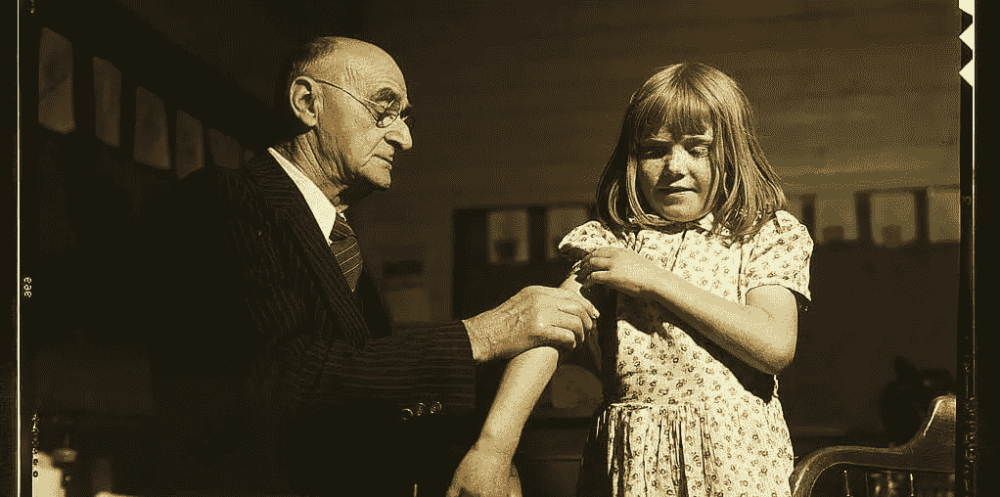
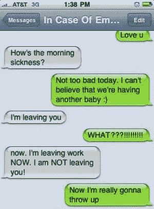
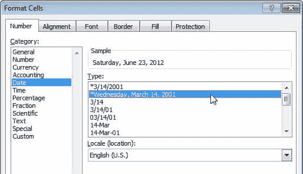
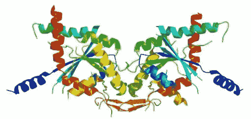

# 优秀软件设计的第一条规则？第一，不伤害！

> 原文：<https://www.sitepoint.com/the-first-rule-of-good-software-design-first-do-no-harm/>

我们当中有谁没有被自动更正小精灵诅咒过？

你敲出一条“字母完美”的信息，用拇指猛按“发送”，却只能以慢动作恐惧地看着自动更正小精灵断定你不是那个意思，对吗？过了一会儿，它用一些可笑的东西覆盖了你的话，然后在你可以反对之前把它发送出去。

就像口袋里有一个小憨豆先生。

我特别喜欢下面这个例子——主要是因为它没有发生在我身上。

这是产品设计师试图帮助我们，却意外地做了相反的事情的例子之一。一个拼错的信息“我要离开 noo ”可能会被认为是可以原谅的草率，但不会像“我要离开你”那样引发心脏病。也不好笑。

尽管“自动更正”失败了，但我怀疑“自动更正”的总体影响是成功的。修复的好处大于失败。

有时这些帮助的尝试可能更具破坏性。

### 这是约会吗？

在过去的十年中，我们看到的一个较新的“UI 助手”是应用程序能够以纯文本的形式识别日期。虽然，作为人类，我们可以相对容易地在日期格式之间切换，但直到最近，软件才变得足够成熟，可以理解以下都是指同一个时间点:

*   1 月 25 日星期三
*   25–1–2017
*   2017 年 1 月 25 日星期三
*   1/25

事实上，Gmail、MS Word 和 Slack 等应用程序甚至聪明到可以理解“明天”或“下周五”这样的日期，你可以点击它们，将它们变成事件或约会。

这真的很有帮助，直到它不再…

## 请停止帮助

虽然微软不再像过去那样是全球巨头，但他们能够以非常低廉的价格向学校、大学和学术界提供软件，这使他们在教育和研究领域保持了主导地位。世界上绝大多数的大学研究和论文都是综合使用 MS-Word、Excel 或 Access 编写的。MS caps 的羽毛。

不幸的是，去年有报道称，自 2004 年以来，微软的办公套件破坏了约 20%的遗传学研究或使其无效。

### 这是怎么发生的？

和大多数科学一样，遗传学有自己的语言和词汇，我们大多数人都不会遇到。例如，你可能不知道…

SEPTIN2 看起来像一个派对面具。

### Septin 2(或 SEPT2)

*   是一种蛋白质，似乎用于跟踪和分析肿瘤和癌症(是的，我在这里力不从心)。在研究中它通常被称为“九月二日”。它看起来像一个小小的化妆舞会面具。

### 膜相关环指(C3HC4) 8(或 MARCH8)

*   是一种在从老鼠到鳟鱼到人类的生物中发现的基因。它可能具有抗病毒的特性，而且它经常——有充分的理由——被缩短为“3 月 8 日”。

这些研究中有许多长达数十页，甚至数百页，单个 Excel 表格可能会数千次列出“9 月 2 日”、“3 月 5 日”或“3 月 8 日”。

### Excel 是如何处理这些基因名称的？

你可能已经猜到了——Excel 和 MS Word 试图将这些基因中的每一个都转换成一个有用的日期。事实上，总共至少有 25 种不同的已知基因名称在导入 Excel 时会自动重命名。

“那不是基因，先生——那是日历事件！!"

真正的踢球者？当 Excel 自动将基因转换为日期时，它会永久忘记原始状态。你可以将其转换成 25 种不同格式的 9 月 2 日，但“撤销”只是删除文本，而不是将其恢复为原始的“9 月 2 日”。

当然，如果您知道在导入数据之前关闭默认设置，就不会有问题。许多研究人员知道这样做。尽管如此，自 2004 年以来，这个问题已经在 3600 篇遗传学论文中的 720 篇中被发现，所以这不是“反常现象”。

我们永远不会确切知道这对遗传学和医学研究有什么影响。但是被破坏的数据只会削弱结果的质量。科学家建立在其他科学家的数据之上，我们知道这些数据是有缺陷的。

如果所有这些腐败的数据都是干净的，我们可能更接近治愈癌症或抗生素耐药超级细菌吗？很可能——尽管我们永远不会知道到底有多近。

## 第一，不伤害任何人

这一理念是医学的核心原则之一。换句话说:

> "你最好什么都不做，而不是做一些可能让事情变得更糟的事情。"

我们在设计软件时没有一套通用的原则，但是，哎呀，…这是一个很好的首要设计原则，不是吗？

> “设计新功能时，首先，不要造成伤害。”

## 分享这篇文章