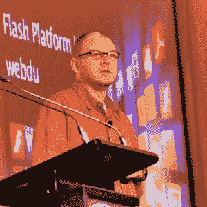

# Flash 的未来和 ColdFusion 的回归

> 原文：<https://www.sitepoint.com/the-future-of-flash-and-the-return-of-coldfusion/>

Kay Smoljak 在最近的 WebDU 会议上报道，SitePoint 是该会议的赞助商。

作为一个会议， [WebDU](http://www.webdu.com.au/) 深受澳大利亚 Flash、Flex 和 ColdFusion 开发人员的喜爱——直到最近，它还是唯一一个专门迎合他们所选平台的活动。总部位于悉尼的[守护进程](http://www.daemon.com.au/)从 MXDU 开始，七年来一直围绕 Macromedia/Adobe 产品举办为期两天的活动。他们做得非常好。

然而，近年来，WebDU 团队增加了针对一般网络开发和在线用户体验的附加流(并相应地更改了名称)，以及关于团队工作的会议和一些标有“管理者安全”的会议。这让我们回到了 2009 年的 WebDU，回到了星城赌场，有五个独立的流:团队/UX，Web I，Web II(不像有些人可能建议的那样，Web two-point-oh)，Flash/Flex 和 ColdFusion。两天内总共有 46 次会议——对于多面手与会者来说，选择 12 个人亲自参加是一项艰巨的任务。

**第一天主题演讲**

Adobe 员工有两种不同类型的开场白:一种是“看看人们在用我们的产品做什么”，另一种是“看看你能用我们产品的下一个版本做什么”。随着 CS4 最近的发布，今年的主题演讲中，Adobe Flash 平台开发者关系首席产品经理迈克·钱伯斯(Mike Chambers)做了前一件事——展示了一些时髦的前沿事物。借助增强现实和 Papervision 3D，一只 3D 大脚野人在麦克风屏幕上跳舞，在他放在摄像头前的一张纸上保持平衡；在更实际的方面，有许多基于 AIR 的 Twitter 客户端，超过 12%的推文来自一个 AIR 应用程序 Tweetdeck《纽约时报》使用 Flash 和 AIR 向付费用户提供专业内容和增强的体验。AIR 与脸书 API 的集成无疑会带来一些有趣的应用——展示的“恶作剧”游戏绝对值得一看。

当地的 Adobe 办公室得到了安德鲁·斯波尔丁展示当地制作的网络/空中混合音乐商店的机会，这是由当地开发商**安德鲁·穆勒**在几周而不是几个月的时间内建造的——令人印象深刻。Andrew Muller 后来用他在 bandit.fm 和其他项目中的经验，展示了整个关于 AIR 应用程序开发的会议。

**肉**

*Adobe’s Mike Chambers*
(photo by Pete Ottery @webdu)

随后，全体会议转向了主题演讲的另一个“类型”:即将推出的产品的秘密高峰，这是房间里每个开发者都在等着看的。Adobe 的 Steven Heintz 展示了 Flash Catalyst，这是一款 Flex 皮肤工具，Adobe 已经展示了相当长一段时间的 alpha 版本。Catalyst 是一款面向 Flex 的设计编码工具，分层元素可以从 Illustrator、Fireworks 或 Photoshop 中导入，并作为皮肤应用于 Flash 组件。Steven 展示了一个非常快速但完整的演示，他在几分钟内构建了一个基本但功能正常的应用程序，没有编写任何代码——观众中有许多 ooh 和 ahhhs。

Catalyst 将是一个工具，它将使 Flex 应用程序不再看起来像 Flex 应用程序，并开始给设计者一些创新的自由，毫无疑问，它将在 RIA 领域引起巨大的轰动。有趣的是，到目前为止，我还没有意识到 Catalyst 是基于 Eclipse 的——从我在屏幕上看到的来看，它的外观或行为当然不像 Eclipse IDE，而是像 Creative Suite 的一部分。很明显，在不久的将来会有一个公开的测试版，所以每个人都可以尝试一下。

**ColdFusion，东山再起的小子**
然而，基调并不都是 Flash。接下来， **Terry Ryan** ，ColdFusion 福音团队的新成员，但肯定不是 ColdFusion 的新成员，展示了期待已久的基于 Eclipse 的 cold fusion IDE Bolt，以及即将发布的 ColdFusion 9 中将包含的一些新功能。他首先承认 Adobe 在 CF 上有点形象问题，但这个平台远没有停滞不前，全球有超过 700，000 名开发人员。然后，他很快演示了 Bolt 中的一些代码生成特性，这些特性与 CF9 和 Hibernate 中的 ORM 特性相结合。

时间不多了，但主题演讲的要点很清楚:Adobe 的目标是通过 Flash player 将丰富的互联网应用程序部署到浏览器，或通过 AIR 部署到桌面:从 Photoshop、Fireworks 和 Illustrator 等设计工具；通过 Catalyst，这是一种快速成型工具；导入 Flash Builder(已更名为 Flex Builder ),用于编写核心 ActionScript 和 Bolt，用于编写后端服务代码以与 ColdFusion 服务器接口。

**极客的放纵:网络服务、依赖注入、雅虎管道和更多的热空气**

*Andrew Muller*
(photo by Pete Ottery @webdu)

一天中的其他会议为这位开发人员提供了滋养和放纵她内心极客的机会: **Kai Koenig** 思考 web 服务的状态(结论:互操作性仍然很糟糕！)、 **Dennis Clark** 演示使用 ColdFusion 的 ColdSpring 框架进行依赖注入，以及 **Phillip Tellis** 向我们展示如何使用 Yahoo pipes，在一个相当枯燥但例子很多的会话中重新混合和重新发布 RSS 提要。特别酷的是 Andrew Muller 的 98 杯茶，这是一个有趣的会议，讨论了开发 AIR 应用程序的提示和技巧，这些提示和技巧来自于已经构建了一些非常成功的应用程序的人。从 Andrew 的演讲中，我最喜欢的收获是从一开始就在应用程序中包含自动更新——它只需要几行代码，并确保在整个开发过程中，您的客户和测试人员始终拥有最新版本的应用程序。思维敏捷！

这一天以关于 AIR、移动开发和 ColdFusion 的“一丘之貉”会议结束，在其中一位演讲者的带领下，志同道合的开发人员就感兴趣的主题进行了随意的讨论。然后去了奥斯卡酒廊酒吧，走一小段路就到了，那里有格鲁登赞助的饮料。

敬请关注第二天的总结！

## 分享这篇文章