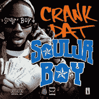

# 音乐产业的未来:酱爆弟弟？

> 原文：<https://www.sitepoint.com/the-future-of-the-music-business-soulja-boy/>

真的吗？！那个的家伙？18 岁的美国说唱歌手酱爆弟弟·泰尔姆(迪安卓·雷蒙·韦饰)在过去几年里迅速成名，人们可能很容易把他视为一种时尚或本周的流行，但这将是一个错误。通过展示对社交媒体如何运作以及如何向网络一代营销的卓越知识，酱爆弟弟实际上已经为不景气的音乐行业奠定了一个相当令人印象深刻的成功蓝图。

今天，在消费电子展的 Billboard 数字媒体直播活动上，酱爆弟弟告诉了一屋子的音乐高管他是如何策划成名的，以及他打算如何保持领先地位。

从 2004 年~~2005 年~~开始，当他刚刚 ~~16~~ 15 岁的时候，酱爆弟弟开始上传他的音乐到【Soundclick.com】的。他告诉音乐高管们，他成功的关键是网站的社交媒体功能，允许粉丝将他的歌曲标记为最爱，并将其病毒式传播给其他用户，然后积极跟踪这些歌曲的受欢迎程度。这让用户感到对他的成功投入，并感到与他的音乐紧密相连。

不到一年，酱爆弟弟在他堂兄的帮助下推出了 MySpace，当时该网站在 2005 年发展迅猛，成为网络音乐的主要目的地。从那以后，酱爆弟弟的 MySpace 页面已经积累了超过 5900 万的浏览量。

他真正的成功是在他上传了一个音乐视频到 YouTube 上，是关于他的单曲“Crank That”，其中的的[润色版本是该网站上有史以来最受欢迎的版本之一，还有一个后续的教学视频，教观众视频中的舞蹈。这位年轻的嘻哈音乐经理人在与 Interscope Records 达成协议后，利用他庞大的互联网优势，获得了格莱美提名。](http://www.youtube.com/watch?v=LpocrqvP2Yg)

然而，让酱爆弟弟与众不同的是，他知道如何与他的粉丝沟通。当大多数音乐产业都在关注阻止粉丝在他们想去的地方、想去的方式、想去的时间播放音乐时，酱爆弟弟却反其道而行之——他在粉丝们在线生活的地方联系他们。

可能因为他自己也是青少年，酱爆弟弟很早就意识到音乐正在社交网络和手机上被播放、交易和讨论。所以这就是他攻击计划的重点——YouTube、MySpace、Bebo 等。

在今天的 CES 上，移动和音乐高管宣称，音乐产业唯一可用的新资金是在移动领域，所以猜猜酱爆弟弟下一步打算在哪里积极推广自己？没错，莫比尔，他已经在那里建立了另一个粉丝网络。

他的 MySpace 页面显著地列出了他新的 SayNow 电话号码，酱爆弟弟在那里又积累了一个庞大的粉丝群(他现在是该网站第二大最受欢迎的客户)。这个电话号码允许这位崭露头角的音乐大亨通过手机(酱爆弟弟实际上已经在手机上很活跃了，已经卖出了超过 500 万个铃声)与粉丝联系，并通过促销和特殊的广告信息直接向他们营销。

“我现在有 100 万用户，我接到了来自世界各地的 3000 多万个电话，”[酱爆弟弟今天](http://www.moconews.net/entry/419-ces-soulja-boy-tell-em-looks-beyond-the-music-with-kiss-me-thru-the-pho/)谈到他的移动战略时说。“它在中国、意大利——它在世界各地……它的作用是，我们有一种方法来利用这种收入。”

酱爆弟弟最近还推出了一个卡通鞋系列，并正在开发一款视频游戏。“专辑销量现在正在下降，”他今天说。酱爆弟弟明白互联网的经济正在将录制音乐的价格推向免费，但 T2 建立“真正的粉丝”基础仍有大量的钱可赚，这些粉丝将吞噬基于艺术家个人品牌的其他营销信息。音乐行业的其他人应该注意了:酱爆弟弟的方法代表着未来。

## 分享这篇文章