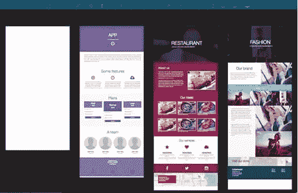
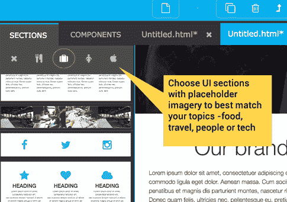

# 伟大的原型辩论:软件 vs 手工编码

> 原文：<https://www.sitepoint.com/the-great-prototyping-debate-software-vs-hand-coding/>

我们都知道原型是一种非常有用的技术，但是有时候很难找到平衡点。关于最佳方法，似乎有两种主要的“思想流派”。

### 学派 1:

#### "*我们爱 vision/marvel app/Adobe XD/etc*"

这些可视化原型制作工具非常适合快速制作坚如磐石的原型，而且最大限度地减少了麻烦。您经常将外部生成的布局导入其中，并将用户流和行为附加到 UI 组件上

然而，如果你想建模一个稍微超出标准动作的 UI 行为，你的选择可能是有限的。

### 学派 2:

#### "*我们总是从头开始用 HTML 编写我们的原型* "

这种方法为您的原型设计决策提供了完全的灵活性和权力。但是它不可避免地要慢一些，并且需要代码和设计技巧的不同寻常的结合。

也许你可以两全其美？最近我一直在使用一款名为 [Pingendo](http://pingendo.com/v4-beta/) 的应用。

## 什么是平根多？

Pingendo 是一个免费的可视化原型开发工具。你可以下载桌面版本(OSX、Win 和 Linux ),但也有一个非常有用的基于 Chrome 的版本。

您可以从一个预设模板或空白画布开始。选一个。

左侧部分面板列出了较大的预构建 UI 部分。这些包括顶级页面元素，例如:

*   英雄面板
*   脚注
*   3 列布局
*   图片集

一个不错的提示:Pingendo 有主题占位符图像——食物、技术、人物等——这样你就可以更好地匹配最终内容的感觉。单击面板顶部的图标可以切换主题。

组件面板包含一个较小的 UI 组件目录，如标题、文本字段、地图、按钮和列表。

沿着顶部边缘，你可以找到基本的格式工具来添加斜体、粗体和链接。您还会看到媒体查询开关，允许您在不同的视口中测试原型。

在右边，你会发现一个“属性”类型的面板，让你编辑你从左边添加的 UI 组件。

**页面:**允许您设置“项目级”属性，如标题、主要颜色、字体等。

**选择:**允许您控制在主窗口中选择的 UI 元素的属性。这些属性包括背景颜色、对齐方式、边距和填充。

大多数 UI 元素都有吸引人的默认设置，但是你几乎可以修改任何东西。

## 大揭秘？都是自举 4

是的，提供给您的所有组件都是 stock Bootstrap 4 组件。您的最终原型可以在任何带有 web 浏览器的设备上以 HTML 格式运行。单击底部边缘的 HTML 选项卡以查看标记。旁边的 Sass 选项卡提供了对 SASS 变量的访问，这些变量控制着整个项目的排版、调色板和大小。

您可以随时在这些面板中对代码进行直接编辑。选择面板允许你给任何元素添加类和 id，这样就可以调用任何标准的 [Bootstrap 4 UI 类](http://v4-alpha.getbootstrap.com/getting-started/introduction/)并知道它会在那里。

## 回报

对我来说，Pingendo 的真正优势是它给你的原型完全的自由。你永远不会局限于一个预先滚动互动的“菜单”。虽然我可能不会为生产站点选择 Bootstrap，但是一个好的工作原型不需要通过同样的审查。你也知道 Bootstrap 的“默认”将是经过深思熟虑的、健壮的和现代的。

但是，如果你*需要*你的原型以不同的方式工作——移动、动画、反应、收缩或以某种非标准的方式变得特别——你所能实现的没有任何限制。如果你能编码它，你的原型就能拥有它。

它为你的大形状提供了广阔的笔触，为关键细节提供了精细的笔触。

### 我可以用 Pingendo 建立一个完整的网站吗？

你当然可以。您可能会在某个时候遇到功能限制，但是——假设您乐于使用 Bootstrap 4 作为基础 Pingendo 没有理由不能提供至少一个坚实的布局基础。

我不确定 Pingendo 是否会永远免费，但我认为在它免费的时候非常值得去看看。

它有很多让人喜欢的地方。

[原载](https://go.sitepoint.com/t/ViewEmail/y/BC45DCBE445BB161)于 [Sitepoint 设计简讯](https://www.sitepoint.com/newsletter/)。

## 分享这篇文章