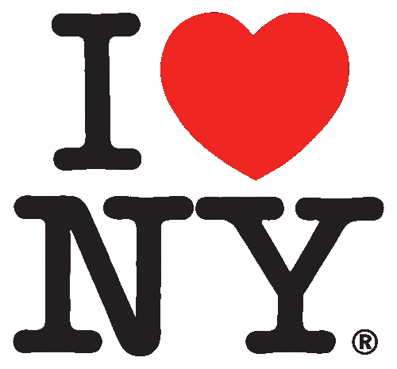
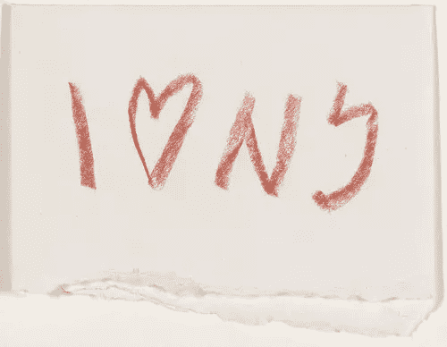
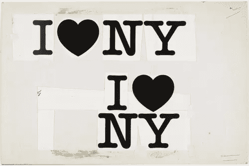
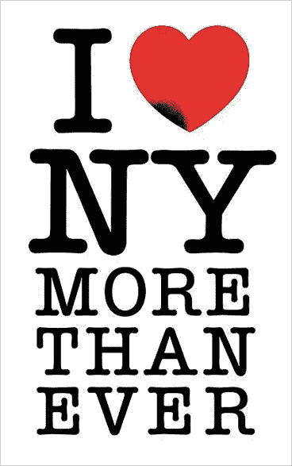

# 其中最伟大的爱情标志:I♥NY

> 原文：<https://www.sitepoint.com/the-greatest-love-logo-of-them-all-iny/>

祝大家情人节快乐。因为是在那一天，我想看一看这个世界上最容易识别的标志之一的简要概述可能会很有趣，它包含了爱的心形符号。当然，我指的是设计师 Milton Glaser 设计的 I♥NY 或“我爱纽约”。这个标志是作为广告活动的一部分设计的，目的是为了促进纽约市的旅游业，后来是为了促进整个纽约州。

关于这个商标的受欢迎程度，梅顿·戈拉瑟在一次采访中说，他对“为什么它会在人们的意识中存在这么长时间”感到惊讶，认为它“完全是个奇迹”。

和所有最好的标志一样，这个标志有效是因为

a)很简单(几乎看似简单)

b)引人注目

c)它用一个符号和几个字母传达了一个大概念

下面你可以看到 1976 年用红铅笔绘制的商标草图，这证明了那些认为他们最初的草图没有价值是因为他们“不擅长绘画”的人，所有的草图都有潜在的价值，不仅仅是金钱上的价值。

图片来自 [MOMA](http://www.moma.org/collection/browse_results.php?criteria=O:AD:E:2188&page_number=10&template_id=1&sort_order=1) ，通过大卫·艾雷的[标志设计发现爱情](http://www.logodesignlove.com/i-heart-ny-logo-sketch)。

另一张来自 MOMA 的图片展示了两个布局概念。

使用的字体是一种叫做“美国打字机”的平板衬线字体(你可以[购买](http://www.linotype.com/187537/itcamericantypewriterbold-font.html)并在这里下载)。字母的大胆与红心形状完美契合，创造出独特而简单的东西，在一个大城市看起来像在家里一样。这个标志是世界各地使用心形符号代表“爱”这个词的一系列标识和口号的先驱。

格拉泽说过，设计的目的是“告知和愉悦”他创建了这个标志，作为一个公益项目，令人难以置信的是，他没有从中获得一分钱，但毫无疑问，作为它的创造者，他获得了许多非财务奖励。911 恐怖袭击后，格拉泽设计了他著名商标的第二个修改版本，上面写着“我比以往任何时候都更爱纽约”。心脏上的一个小黑点象征着世界贸易中心和它在曼哈顿的位置。可以在这里购买作为[海报。](http://www.miltonglaserworks.com/product.php?productid=16279)

你觉得这个著名的标志怎么样？

## 分享这篇文章