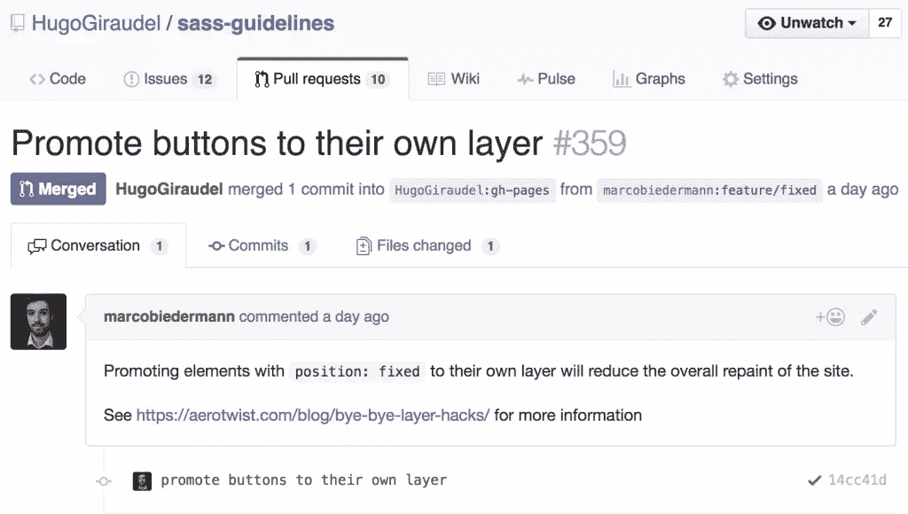
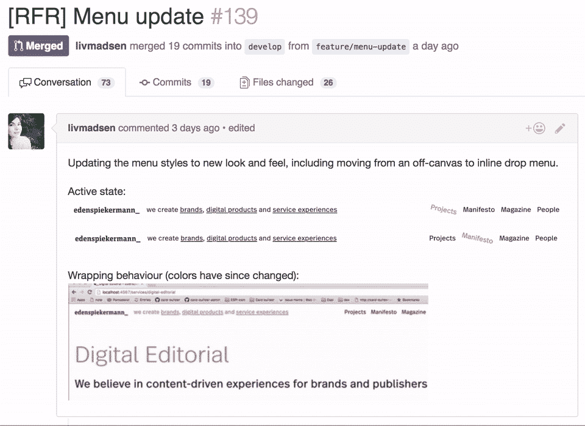

# 代码审查的重要性

> 原文：<https://www.sitepoint.com/the-importance-of-code-reviews/>

我最近在推特上读到了这篇文章:

> 可悲的是，对于许多学生、自由职业者和机构来说，代码审查似乎是一种陌生的实践。[翻译]

显然，并不是每个人都清楚代码评审真的有帮助。说我幼稚吧，但我真的以为这是所有 it 公司都用的流程。显然我错了，这让我很害怕。

在这篇文章中，我想给出我对代码评审的想法，为什么我相信它们是代码交付过程的重要部分，以及如何开始它们。如果你不做代码审查，或者如果你觉得你可以做得更好，我希望这篇文章会有所帮助！

## 什么是代码审查？

我们生活在维基百科的时代，所以请允许我引用 [Code review](https://en.wikipedia.org/wiki/Code_review) 条目中给出的定义:

> 代码审查是对计算机源代码的系统检查(有时也称为同行审查)。它旨在发现在初始开发阶段被忽略的错误，提高软件的整体质量。评审以多种形式完成，如结对编程、非正式走查和正式检查。

顾名思义，代码审查是审查一些代码的过程，以确保其工作正常，并在可能的地方对其进行改进。

## 进行代码审查的方法

正如维基百科的定义所指出的，有各种方法来执行代码审查。然而，在一个如此多的代码存在于 [GitHub](https://github.com) 上的世界里，代码审查通常与我们所说的“拉请求”密切相关。

“拉”请求是使用分布式版本控制系统(Git、SVN、Mercurial 等)对代码库进行变更的请求。).它的工作方式是“拉”原始代码，应用变更，然后提交一个请求来合并变更。

由于 GitHub 友好的用户界面，抽象了大部分的 Git 知识需求，GitHub 使得这个过程变得特别简单和高效。

## 为什么审查代码很重要

那么，为什么代码审查很重要呢？毕竟我们在这里都是称职的。毫无疑问，我们可以在没有人监督的情况下发布代码，监视我们所做的一切。

理论上，是的。但是在实践中，有很多原因可以解释为什么建立一个代码评审过程是有帮助的。让我们来看看其中的几个。

### 它限制了风险

这可能是最重要的原因。让某人仔细检查我们的工作从来没有坏处，并且限制了未被注意到的错误的风险。即使是优秀的开发人员有时也会目光短浅。

确保不忘记任何事情总是好的。例如，适当的键盘导航、屏幕阅读器的可访问性、国际化的灵活性和友好的非 JavaScript 行为在前端世界中经常被遗忘，仅举四个例子。

### 它极大地提高了代码质量

让我们弄清楚一些事情:这不是关于标准和代码林挺(至少不是唯一的)。而是让代码更高效。

在一个团队中，每个人都有自己的背景和强项，要求改进(因为这就是它的意义)总是一个好主意。有人可能会建议一个更聪明的解决方案，一个更合适的设计模式，一种降低复杂性或提高性能的方法。

### 这让每个人都变得更好

通过联合起来，每个人都可以学习并变得更好。代码提交者可能会收到对他们工作的反馈，让他们意识到可能的问题和需要改进的地方。评审人员可以通过阅读代码很好地学习新的东西，并找出适用于他们自己工作的解决方案。

### 熟悉这个项目很有帮助

当一个团队在一个项目中工作时，每个开发人员都在处理应用程序的每个部分是非常不可能的。有时候，一个开发人员会在一段时间内专注于一个大的部分，而另一个人则完全在做其他的事情。

进行代码评审有助于人们熟悉他们还没有编写但将来可能会被要求维护的代码。它促进了整个团队对代码库的了解，并有可能加速未来的开发。

## 如何正确地做它

同样，建立一个代码审查过程是非常有用和重要的。每个开发代码的团队都应该以某种方式进行一些代码审查。

也就是说，进行有意义和有帮助的代码审查并不总是像看起来那样简单。别担心，如果做得不好，它不会咬你的。这根本没用，而且感觉像是浪费时间。

最近在我的工作场所，我们对代码审查过程进行了回顾。当我们意识到 12 个开发人员中只有 3 个从事代码审查时，我们知道有些事情是错误的。

为了帮助我们改变这一点，我们的一位 Scrum 大师组织了一次回顾会，以确定哪里有改进的空间，以及我们如何实现它。

### 提前计划

证明缺乏对代码评审的参与的最常见的论据是它需要时间——人们不能或不愿意花时间。

我必须说，我自己并不真正理解这个论点，因为我是这样描述的:如果一个同事直接找到我，让我帮他们做点什么，我不会说——“没时间，没兴趣。”我会找时间帮忙的。也许不是现在，也许一个小时后——但我显然会为他们花时间。为什么？因为

*   这就是成为团队一员的意义
*   如果他们想要我的意见，那是因为他们以这样或那样的方式重视它，因此给他们意见是有意义的。

> "你为什么不参与代码审查过程？"
> 
> “我没时间。”

对我来说，拉式请求和同事寻求帮助没什么不同。不时地说你没有时间是很好的，但是通过系统地拒绝帮助，你正在主动地把自己从团队中抽离出来。这种行为既不友好也不积极。花时间去帮忙。

为了让开发人员有可能找到时间，我们开始考虑每个开发人员每天都会花一点时间(可能 30 分钟)审查代码。当我们最终花半个小时在大型代码评审上时，没什么好惊讶的:这是一天的一部分。

我们还试图大幅减少构成拉请求的代码量。我们曾经有过巨大的拉取请求——跨越几十个文件的数千个更改。

我们试着不再那样做。通过提出更小的拉取请求，我们使它们更容易审查，反馈更相关，开发人员更愿意参与这个过程。“小规模运输，经常运输。”

### 给出上下文

我们发现的第二大问题是，我们通常缺乏对代码上下文的理解，如果你要提供有用的反馈，这是需要的。当缺少上下文时，我们通常只做语法检查——这虽然在某种程度上有用，但还不够。你就变成了我们所说的“人肉棉绒”。

幸运的是，这个问题的解决方案相对简单:向拉请求添加一个描述，解释目标是什么，以及如何到达那里。它不一定是一堵文字墙；通常只要几行就够了。这也有助于添加问题和/或故事的链接。我们的开发人员之一丽芙·麦德森(Liv Madsen)甚至还添加了截屏——或者相关的截屏——来说明她所做的事情，这真是太棒了。

### 实际上是在问

我们指出的第三个问题是，我们有时根本没有意识到有什么要回顾的。让我们面对现实吧，我们每天都被大量的电子邮件和通知淹没——如此之多，以至于很难保持跟踪。毕竟，我们只是凡人。

这里，同样，解决方案非常简单:实际上要求别人进行审查。有很多方法可以做到这一点，从在办公室里按喇叭到在空闲时给某人打电话；给每个团队他们自己的。

我们基于我们的活动在 GitHub 上创建了组，当提交一个拉请求时，我们总是 ping 一个组。这个组的成员将会收到一个通知，一旦他们有时间，就可以自由地处理它。有时，我们会直接联系一个(或几个)开发人员，因为他们的工作更具体。这也行得通。

在那里，pinged 用户可以查看代码并留下评论。即使没有什么具体的报告，我们也尽量留下注释——如果只是为了表明代码已经准备好被合并。

因为我们不顾给定的评论盲目地合并了一些拉请求，所以我们建立了一个严格的“回复或修复一切”策略。当收到反馈时，你要么解决它，要么回复解释为什么没有解决。在任何情况下，您都不会留下未处理的注释，当然也不会将您的 pull 请求与未处理的注释合并。

## 包装东西

拥有一个定期且高效的代码审查流程对于维护高质量的代码标准、团队成长以及开发人员之间共享知识至关重要。

要求代码审查并不是软弱的表现。寻求帮助没有什么尴尬的，当然不是以代码审查的形式。接受给你的所有反馈，并向提交拉动式请求的人提供建设性的(最好是积极的)意见。

找到适合你的方法。审查代码应该是代码运输过程的一大部分，所以您应该为您的团队量身定制。按照你想要的方式去做，这样对每个人都有帮助和积极的意义。

复习愉快！

## 分享这篇文章