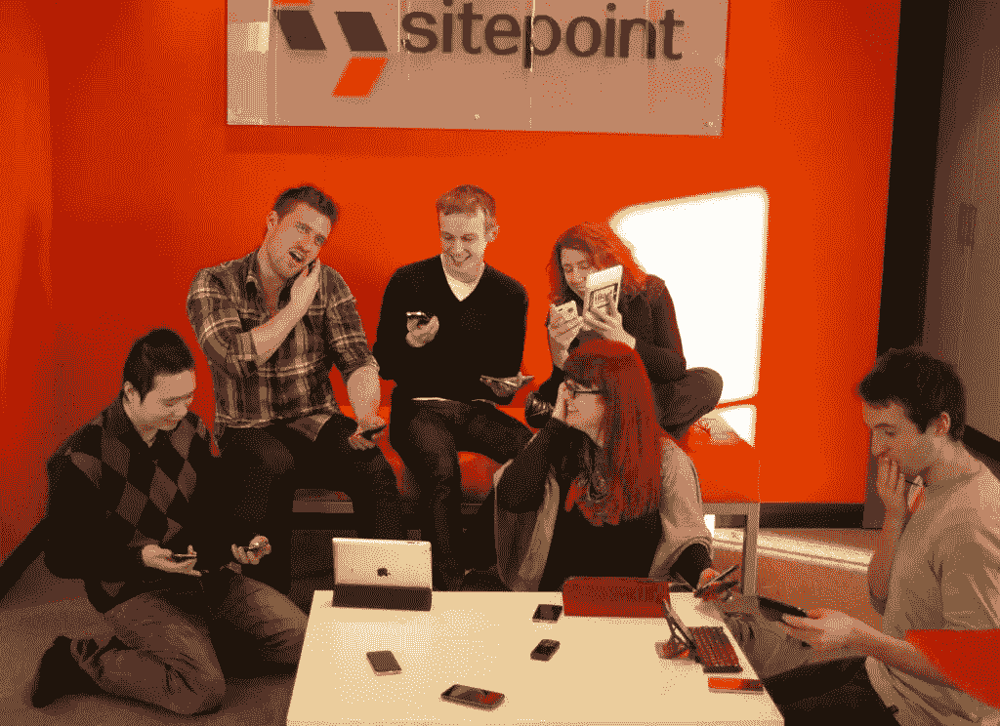

# 移动网络:发现可能性

> 原文：<https://www.sitepoint.com/the-mobile-web-discover-the-possibilities/>

移动网络是自互联网以来网络世界最重要的发展。由于更好的服务和更小、更便宜的设备，移动技术出现了巨大的爆炸，远远超过了任何其他计算周期的增长。

你准备好了吗？

我们全新的标题 *[为智能设备构建移动网站和应用](https://www.sitepoint.com/books/mobile1/)* 是创新的前端网页设计者和开发者的实用指南。你会发现一种有趣且容易实现的[移动网络](https://www.sitepoint.com/2011-is-the-year-of-mobile-really/)设计和开发方法，其中蕴含着巨大的机会。

如果你需要确信移动网络的影响，只要看看你的周围。无论你走到哪里，人们都可以通过他们的设备访问网络。看看这些统计数据:

*   到 2014 年，消费者购买的智能手机将超过个人电脑和笔记本电脑。[【1】](#_ftn1)
*   自 iPhone 发布以来，已有超过 40 亿个应用被下载，平均每个用户有 47 个应用。Android 和 iPad 应用程序的统计数据也达到了数百万。[【2】](#_ftn2)
*   仅在一年内，全球移动浏览量就增长了 148%。[【3】](#_ftn3)
*   通过移动设备访问脸书和推特的用户数量在一年内翻了一倍多。[【4】](#_ftn4)[【5】](#_ftn5)

显然，为移动设备开发的需求是非常活跃的，并且随着时间的推移只会变得更加必要。这本书将带你从一个基本的网站变成一个性感的移动网站，从酷的移动应用程序到有利可图和诱人的本地应用程序。

有史以来第一次，您可以获得一个多媒体包，包括电子包、印刷书籍和一个全面的在线课程。该课程来自我们的姐妹网站，由本书的作者之一迈尔斯·埃夫托斯教授。

您可以[在这里](https://www.sitepoint.com/books/mobile1/)购买套装，仅需 49.95 美元(节省 50%！)并参加这次全面的学习体验！

带着玩具的船员

* * *

[<ins cite="mailto:Kelly%20Steele" datetime="2011-06-17T14:40">[1]</ins>](#_ftnref) <ins cite="mailto:Kelly%20Steele" datetime="2011-06-17T14:40">Internet Trends – Presentation from CM Summit, Morgan Stanley, June 2010</ins>[<ins cite="mailto:Kelly%20Steele" datetime="2011-06-17T14:40">[2]</ins>](#_ftnref)CM Summit, June 2010[<ins cite="mailto:Kelly%20Steele" datetime="2011-06-17T14:40">[3]</ins>](#_ftnref) <ins cite="mailto:Kelly%20Steele" datetime="2011-06-17T14:40">[https://gs.statcounter.com/#mobile_vs_desktop-ww-monthly-201005-201105](https://gs.statcounter.com/#mobile_vs_desktop-ww-monthly-201005-201105)</ins>[<ins cite="mailto:Kelly%20Steele" datetime="2011-06-17T14:40">[4]</ins>](#_ftnref) <ins cite="mailto:Kelly%20Steele" datetime="2011-06-17T14:40">[http://www.facebook.com/press/info.php?statistics](http://www.facebook.com/press/info.php?statistics) and</ins>
<ins cite="mailto:Kelly%20Steele" datetime="2011-06-17T14:40">[http://www.slideshare.net/kleinerperkins/kpcb-top-10-mobile-trends-feb-2011](http://www.slideshare.net/kleinerperkins/kpcb-top-10-mobile-trends-feb-2011)</ins>

## 分享这篇文章