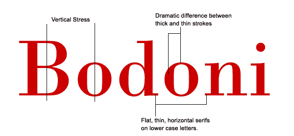
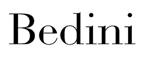
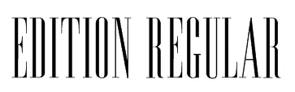
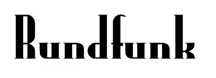
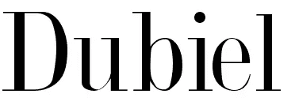
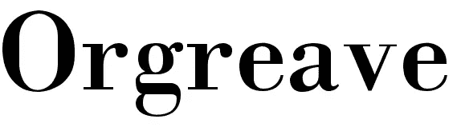
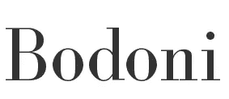
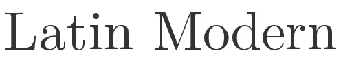

# 现代字体

> 原文：<https://www.sitepoint.com/the-modern-typeface/>

随着新的网络技术的出现，比如 sIFR T2，Cufon T4 和 Typekit T6，我们可以更大胆地选择字体。今年早些时候，我写过关于 [Slab Serif](https://www.sitepoint.com/big-bold-and-sometimes-beautiful-serif-slab-fonts/) 字体的文章。在本帖中，我们来看看现代字体。

尽管它的名字是“现代”字体，也被称为 Didone，并不新鲜。在 18 世纪，纸张质量的提高与更先进的印刷方法相结合，带来了字体创造方式的变化。

现代是一个术语，用于对当时创建的字体或当时的风格进行分类。

现代字体可以通过其细长的水平衬线和笔画中清晰的粗细过渡来识别。重音是垂直的，即字母没有倾斜。

它们往往看起来很有结构，可以被认为是冷的。话虽如此，现代字体在大尺寸时看起来确实很醒目，而且非常优雅。它们不适合大量的正文文本，无论是在网上还是在印刷品上。当用于印刷中的正文复制时，会出现一种称为“炫目”的效果，粗线变得非常突出，而细线几乎消失。最好把它们留着做标题和副标题。你可能不会经常使用现代字体，但作为一名设计师，能够挑选和识别字体类别是很好的。

你的电脑上可能已经有很多现代字体了。一些例子是迪多特，缟玛瑙和时代大胆。我挑选了另外七个可以免费下载。

贝迪尼

[普通版](http://www.searchfreefonts.com/free/edition.htm)

[Rundfunk](http://www.searchfreefonts.com/free/rundfunk.htm)

[重复](http://www.fontspace.com/david-rakowski/dubiel)

[Orgreave](http://www.fontspace.com/roger-white/orgreave)

[博多尼](http://www.fontsquirrel.com/fonts/BodoniFLF)

[拉丁现代罗马](http://www.fontsquirrel.com/fonts/latin-modern-roman)

这是免费现代字体的一个小选择。如果你喜欢这种风格，有很多可以买，如果你认为你完全是在寻找其他东西，试试我们的免费字体指南。

## 分享这篇文章