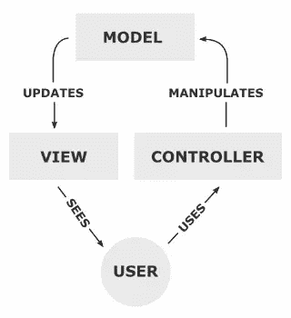

# MVC 模式和 PHP，第 1 部分

> 原文：<https://www.sitepoint.com/the-mvc-pattern-and-php-1/>

模型-视图-控制(Model-View-Control，MVC)模式最初是在 20 世纪 70 年代末形成的，它是一种软件架构模式，建立在将数据的表示与和数据交互的方法分开的基础上。理论上，一个开发良好的 MVC 系统应该允许前端开发人员和后端开发人员在同一个系统上工作，而不会干扰、共享或编辑任何一方正在工作的文件。

尽管 MVC 最初是为个人计算而设计的，但由于它强调关注点的分离，因而间接地强调代码的可重用性，它已经被 web 开发人员广泛采用。该模式鼓励模块化系统的开发，允许开发人员快速更新、添加甚至删除功能。

在本文中，我将介绍 MVC 的基本原理，浏览模式的定义，以及 PHP 中 MVC 的一个快速示例。对于以前从未用 MVC 编码过的人或者那些想重温以前的 MVC 开发技巧的人来说，这绝对是一本读物。
[](https://www.sitepoint.com/premium/books/php-mysql-novice-to-ninja-7th-edition/)

## 理解 MVC

该模式的名称是对其三个核心部分的整理:模型、视图和控制器。完整而正确的 MVC 模式的可视化表示看起来[如下图](http://en.wikipedia.org/wiki/File:MVC-Process.png "MVC-Process")所示:



该图显示了数据的单流布局，数据如何在各个组件之间传递，以及各个组件之间的关系如何工作。

### 模型

模型是对总体设计中使用的数据的永久存储的命名。它必须允许访问要查看或收集和写入的数据，并且是整个模式中视图组件和控制器组件之间的桥梁。

该模型的一个重要方面是，它在技术上是“盲的”——我的意思是，当数据被传递到视图或控制器组件时，该模型与数据没有任何联系，也不知道数据会发生什么。它既不要求也不寻求其他部分的响应；它的唯一目的是将数据处理到它的永久存储器中，或者寻找和准备要传递给其它部分的数据。

然而，这个模型不能简单地归结为一个数据库，或者一个通向另一个处理数据过程的系统的网关。该模型必须充当数据本身的看门人，不问任何问题，但接受所有的请求。模型组件通常是 MVC 系统中最复杂的部分，也是整个系统的顶点，因为没有它，控制器和视图之间就没有联系。

### 视角

视图是查看模型请求的数据并确定其最终输出的地方。传统上，在使用 MVC 构建的 web 应用程序中，视图是生成和显示 HTML 的系统的一部分。这个视图也激发了用户的反应，然后用户继续与控制器交互。最基本的例子是一个由视图生成的按钮，用户单击它会触发控制器中的一个动作。

对于视图组件有一些误解，尤其是使用 MVC 模式构建应用程序的 web 开发人员。例如，许多人错误地认为视图与模型没有任何联系，视图显示的所有数据都是从控制器传递过来的。实际上，这个流程完全忽略了 MVC 模式背后的理论。Fabio Cevasco 的文章[The CakePHP Framework:Your First Bite](https://www.sitepoint.com/application-development-cakephp/ "The CakePHP Framework: Your First Bite")展示了 CakePHP 框架中这种混乱的 MVC 方法，这是许多可用的非传统 MVC PHP 框架的一个例子:

> 需要注意的是，为了正确应用 MVC 架构，模型和视图之间不能有交互:所有的逻辑都由控制器处理

此外，将视图描述为模板文件是不准确的。然而，正如汤姆·巴特勒指出的，这不是一个人的错，而是大量开发人员的大量错误，导致开发人员错误地学习 MVC。然后他们继续错误地教育别人。视图实际上不仅仅是一个模板，然而现代受 MVC 启发的框架已经把视图贬低到几乎没有人真正关心一个框架实际上是否符合正确的 MVC 模式的程度。

同样重要的是要记住，控制器永远不会给视图部分提供数据。正如我在讨论模型时提到的，视图和控制器之间没有模型就没有直接的关系。

### 控制器

三元组的最后一个组件是控制器。它的工作是处理用户输入或提交的数据，并相应地更新模型。控制者的生命血液是用户；没有用户交互，控制器就没有意义。这是用户应该与之交互的模式的唯一部分。

控制器可以简单地概括为一个信息收集器，然后将信息传递给模型进行组织存储，除了收集输入所需的逻辑之外，不包含任何其他逻辑。控制器也只连接到单个视图和单个模型，使其成为单向数据流系统，在每个数据交换点都有握手和签字。

重要的是要记住，只有当用户首先与视图交互时，控制器才被赋予要执行的任务，并且每个控制器功能都是一个触发器，由用户与视图的交互触发。开发人员最常犯的错误是将控制器混淆为网关，并最终将视图应该具有的功能和职责分配给它(这通常是同一开发人员将视图组件简单地混淆为模板的结果)。此外，一个常见的错误是给控制器函数，让它单独负责处理、传递和处理从模型到视图的数据，而在 MVC 模式中，这种关系应该保持在模型和视图之间。

## PHP 中的 MVC

用 PHP 编写一个架构基于 MVC 模式的 web 应用程序是可能的。让我们从一个简单的例子开始:

```
<?php
class Model
{
public $string;

public function __construct(){
$this->string = "MVC + PHP = Awesome!";
}
}
```

```
<?php
class View
{
private $model;
private $controller;

public function __construct($controller,$model) {
$this->controller = $controller;
$this->model = $model;
}

public function output(){
return "<p>" . $this->model->string . "</p>";
}
}
```

```
<?php
class Controller
{
private $model;

public function __construct($model) {
$this->model = $model;
}
}
```

我们的项目从模式的每个部分的一些非常基础的类开始。现在我们需要建立它们之间的关系:

```
<?php
$model = new Model();
$controller = new Controller($model);
$view = new View($controller, $model);
echo $view->output();
```

正如你在上面的例子中看到的，我们没有任何特定于控制器的功能，因为我们没有为我们的应用定义任何用户交互。该视图拥有所有的功能，因为该示例仅用于显示目的。

现在，让我们展开示例，展示我们如何向控制器添加功能，从而向应用程序添加交互性:

```
<?php
class Model
{
public $string;

public function __construct(){
$this->string = “MVC + PHP = Awesome, click here!”;
}

}
```

```
<?php
class View
{
private $model;
private $controller;

public function __construct($controller,$model) {
$this->controller = $controller;
$this->model = $model;
}

public function output() {
return '<p><a href="mvc.php?action=clicked"' . $this->model->string . "</a></p>";
}
}
```

```
<?php
class Controller
{
private $model;

public function __construct($model){
$this->model = $model;
}

public function clicked() {
$this->model->string = “Updated Data, thanks to MVC and PHP!”
}
}
```

我们用一些基本功能增强了应用程序。现在，设置组件之间的关系如下所示:

```
<?php
$model = new Model();
$controller = new Controller($model);
$view = new View($controller, $model);

if (isset($_GET['action']) && !empty($_GET['action'])) {
$controller->{$_GET['action']}();
}

echo $view->output();
```

运行代码，当你点击链接时，你将能够看到字符串改变了它的数据。

## 结论

我们已经介绍了 MVC 模式背后的基本理论，并且已经开发了一个非常基本的 MVC 应用程序，但是在我们进入任何本质功能之前，我们还有很长的路要走。

在本系列的下一篇文章中，我们将讨论当你试图用 PHP 在 web 上创建一个真正的 MVC 应用程序时所面临的一些选择。敬请期待！

图片 via[Fotolia](http://us.fotolia.com/?utm_source=sitepoint&utm_medium=website_link&utm=campaign=sitepoint "Royalty Free Stock Photos at Fotolia.com")

对本文的评论已经关闭。有一个关于 MVC 模式和 PHP 的问题？为什么不在我们的[论坛](https://www.sitepoint.com/forums/forumdisplay.php?34-PHP?utm_source=sitepoint&utm_medium=link&utm_campaign=forumlink)上问呢？

## 分享这篇文章