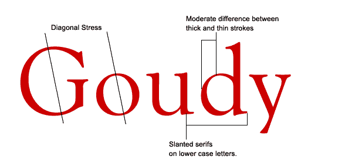
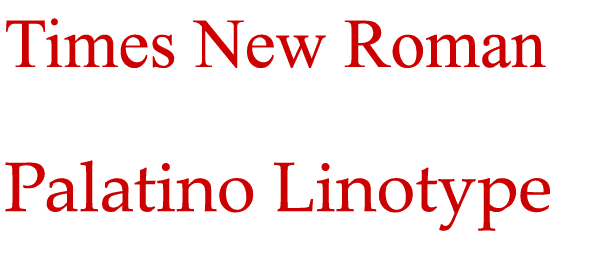
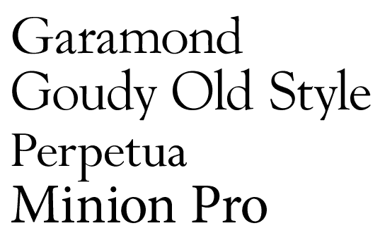

# 旧式字体

> 原文：<https://www.sitepoint.com/the-old-style-typeface/>

上周，我们看了一下[现代字体](https://www.sitepoint.com/the-modern-typeface/)，为了继续这个关于字体类别的系列文章，今天我们来看看漂亮的老式字体。我认为对我们所有人来说，我们的设计工作只有当我们更加了解不同类别的字体，它们的特点和相似性，以及它们最适合什么目的，无论我们是从事网页设计还是印刷设计，才能得到改进。

旧式字体(有时被称为人文主义字体)是基于抄写员的手写字体，它们最早出现在 15 世纪晚期，比现代字体早。他们与书法的关系可以在由粗到细的弯曲笔画和字母中看到，看起来有点像用钢笔和墨水画的字母。与现代字体不同，粗细过渡适中，不那么明显。旧字体的衬线总是有角度的，如果你在字母最细的部分画一条线，你会发现重音在对角线上。

最早的斜体字是在 16 世纪早期用老式字体产生的。

旧式字体被认为是纸张上大量正文的最佳字体。这就是为什么你会发现它们在报纸、杂志和书籍中被大量使用。它们在网络上也能很好地工作，两种旧风格的字体被认为是网络安全的:Times New Roman 和 Palatino Linotype。旧的风格不会以任何古怪的方式跃然纸上，这就是为什么它们看起来很容易。有一种观点认为，对于基于印刷的作品，衬线字体是最好的，而对于网络/屏幕，无衬线字体是最容易阅读的。如果你发现是这样，你可以考虑使用下面的字体作为标题和副标题。

其他著名的旧风格字体的例子包括 Garamond，俗气的旧风格，Perpetua 和 Minion Pro。注意下面所有的文字都是 80 磅，行距 80 磅。

你可能会认为这些字体乍一看几乎一模一样。当你开始仔细观察它们的相似之处时，你会开始注意到让每一个都独一无二的细微差别。提高对字体的意识的一个方法是努力更仔细地看字体。听起来很明显我知道。下次你阅读杂志或书籍，或者浏览网站时，花点时间弄清楚使用的是哪种字体。当你站在公共汽车站时，看看这些广告。使用的字体是衬线、无衬线、装饰性的吗？你对字体越熟悉，你会发现你开始尝试，你也会开始发现哪些字体可以很好地配合使用。(这是我将在 Sitepoint 的未来帖子中写的内容)。

**相关阅读:**

*   [**现代字体**](https://www.sitepoint.com/the-modern-typeface/)
*   [**大而粗的漂亮石板衬线**](https://www.sitepoint.com/big-bold-and-sometimes-beautiful-serif-slab-fonts/)

## 分享这篇文章