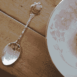
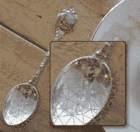
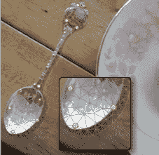
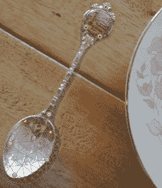

# Photoshop CS5 中另一个非常酷的功能

> 原文：<https://www.sitepoint.com/the-other-really-cool-feature-in-photoshop-cs5/>

当亚瑟·C·克拉克第一次提出他的预测三定律时，他承认他的最后一个定律实际上只是一个填充符。

有趣的是，这是人们最容易记住的第三条定律:*任何足够先进的技术都无法与魔法区分开来*。

Adobe 在 Photoshop CS5 中的内容感知填充功能可能是这一想法的完美表达。YouTube 上的视频演示感觉像是大卫·科波菲尔的绝技。

简单的点击一下鼠标，删除键就变成了终极的创作工具。全新的世界出现了——树木、草地、岩石和道路就好像它们一直都在那里一样。坦率地说，它惊人的惊人，毫不奇怪，吸引了 CS5 马戏团的大部分喧闹。

但是老狗实际上有一些新的技巧，很容易被你忽略。《木偶奇遇记》是我的新宠。

**什么是傀儡经线？**

Puppet Warp 是一种完全不同的图像操作工具——超越了我们都熟悉的传统的克隆、缩放、旋转、剪切和扭曲工具。木偶给你的形象一个可弯曲、可摆姿势的骨架。

这是一个艰巨的任务，但我会完成的。木偶扭曲比内容感知填充对你更有用。

它是这样工作的。

 1。首先，你需要准备一个单独图层的图像。为了向尤里·盖勒致敬，我将在这张照片中弯曲最近一次周六早餐中的勺子。

顺便说一句，如果你已经有了 CS5 并且想在家玩，可以在这里找到 PSD 工作文件。

2.在 Photoshop 的编辑菜单中，你会发现新的木偶扭曲选项。选择它，你的图像(在我的例子中的勺子)将暂时被一个三角形网格覆盖。

这个三角测量过程通常不到一秒钟，并且是完全自动化的。

3.接下来，是时候给我们的骨骼一些活动关节了。悬停在网格上，光标会变成图钉。单击网格上的任意位置，您将创建一个锚点。在我的勺子上，我在两端都做了锚，以允许颈部弯曲。

4.现在是时候弯曲勺子和*你的思想*了——同时！按住 Shift 键并单击以选择手柄上的所有黄色锚点，然后左右拖动光标。你的勺柄变得像可弯曲的吸管一样柔韧。

最令人印象深刻的是，网格可以将扭曲均匀地分布在弯曲部分，使图像看起来尽可能自然。您可以随时自由添加和移除锚点，以帮助锁定或释放特定区域。

**总结会**

当一个应用程序已经存在了 20 年，想出新的和引人注目的功能一定是一项艰巨的任务。一般来说，新花样往往是高度专业化的:比如 3D、HDR 和消失点。确实是聪明的东西，但不太可能影响你的日常工作流程。

内容感知填充和木偶扭曲都是这个规则的极好的例外。两者都很容易理解，并且立即有用。

事实上，完美的证明了 Puppet Warp 的真正效用:我需要在上面的勺子图像演示中添加我自己的半透明阴影。首先，我做了一个和勺子一模一样的阴影。但是，众所周知，勺子是弯曲的，而不是平的，所以我需要一种方法来手动重塑阴影，使它看起来更可信。

很明显，《傀儡曲速》现在是最好的方法。这实际上是 Adobe 实验室小白鼠的功劳，当然也是我升级的一个重要原因。

###### 来自设计视图#73。

## 分享这篇文章