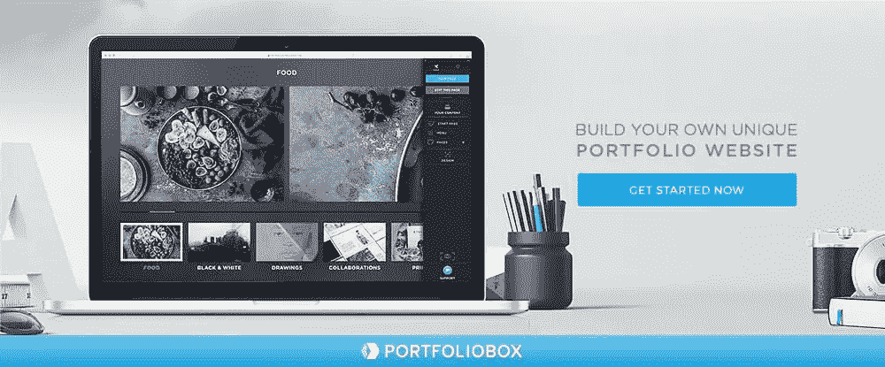
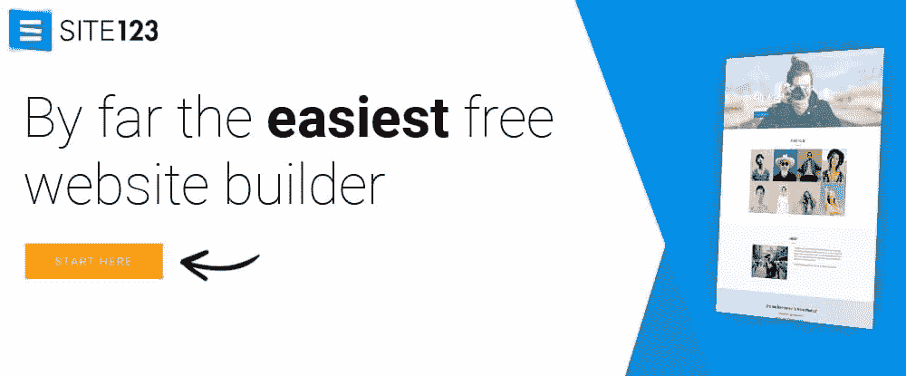

# 完美的组合网站建设者:5 个例子

> 原文：<https://www.sitepoint.com/the-perfect-portfolio-website-builder-5-examples/>

*本文是与 [BAWMedia](https://bawmedia.com/) 合作创作的。感谢您对使 SitePoint 成为可能的合作伙伴的支持。*

创建投资组合网站比以前容易多了。你不需要学习 HTML 和 CSS，也不需要依赖别人来展示你或你的企业。现在，你可以在几分钟内创建一个非常专业的投资组合。你只需要用你的鼠标。

你努力创造一种产品或服务，努力做到最好。那是必然的。然而，这并不意味着你必须额外努力来展示你的作品。

如果你有东西要炫耀，那么这么做几乎是轻而易举的。试试下面描述的投资组合构建工具。他们中的任何一个都会给你你所寻求的光芒。只需点击几下鼠标，你就可以看到一个引人注目、引人入胜的投资组合网站。

## 1.[元素或页面生成器](https://elementor.com/?utm_source=baw&utm_medium=pr&utm_campaign=top10)

Elementor 解决了一个主要的网站建设问题——感觉被某个主题设计束缚住了。这是一个伟大的消息，为设计师与投资组合网站谁想要改善他们的视觉呈现。

使用 Elementor，您将从前端构建您的投资组合网站。无论是作品集页面、图库页面、博客帖子还是任何其他页面，您都可以完全控制网站的每个部分。

这个免费的开源页面生成器速度超快，按照最严格的编码标准构建。它可以和你选择的任何主题或模板一起工作，并且有超过 130 个设计师制作的模板。Elementor 对开发者友好，有一个庞大的开发者社区支持它。

虽然免费版可能是为了开始，你也应该看看专业版提供了什么。Pro 的功能包括卓越的工作流程、营销集成和可视化表单生成器。这些特性使得 Elementor Pro 成为任何 WordPress 专业人士的首选。

看看它最近的 WordPress 自定义帖子类型功能，它允许你创建自己独特的动态组合网站。

使用 Elementor 中的许多小部件来最好地展示您的成就，并为您的企业创建一个独特的投资组合。

## 2.[移动网站建设者](https://mobirise.com/)

Mobirise 将是另一个很好的选择。因为它是一个线下的建设者，你不依赖于任何平台，你可以完全控制如何选择去建立一个完美的在线投资组合，或任何其他类型的网站。

使用 Mobirise 的一切都很直观。这一切都是拖放式的，所以你永远不需要编码，它也快如闪电，而且你的网站或作品集保证是 100%移动友好的。

无论您构建的投资组合是供自己使用还是供客户使用，Mobirise 都可以免费用于商业和个人用途。

两者都不缺少工具。该软件包包含 7000 个图标，850 种谷歌字体，50 万左右的免费图片，以及大量流行的预制网站。

Mobirise 可以在 Windows 和 Mac OS 上运行。安卓版本也有售。

## 3.[组合框](https://www.portfoliobox.net/?utm_source=baw&utm_medium=articles&utm_campaign=portfolio%20builders%202018)

Portfoliobox 是为摄影师/设计师/艺术家和其他创意专业人士而设计的。这并不意味着，如果你不完全符合这些类别之一，你就不能用它来建立一个在线投资组合。

它只是意味着，在整理一个面向商业的文件夹或个人文件夹来补充你的简历时，这些工具可以帮助你尽可能好地展示你是谁或你做过什么。

使用 Portfoliobox，您可以在几个小时内创建展示，并且不需要编码。

选择免费计划或专业计划。前者拥有创建一个优秀组合网站所需的一切，但你应该仔细考虑一下专业计划，尤其是如果你心里有几个网站的话。

## 4. [Pixpa](https://www.pixpa.com/?utm_source=bawmedia&utm_medium=cpc&utm_campaign=bawmedia)

Pixpa 让您轻松创建一个令人惊叹的专业投资组合网站。这可能就是你需要知道的全部，但是一个集电子商务、博客功能和客户画廊于一身的投资组合网站怎么样？

由于一切都是拖放式的，你永远不必担心编码，Pixpa 精选的漂亮的移动友好网站将帮助你开始。您可以免费开始，然后从他们的价格合理的计划中选择，起价仅为 5 美元/月。

## 5.[地点 123](https://www.site123.com/)

SITE123 是一个现代化的免费网站构建器，具有 WYSIWYG 编辑器、丰富的响应设计选择和直观的界面，鼓励您使用模块化方法创建自己的作品集网站。

您可以使用的其他功能包括多语言工具。这个工具可以让你用不同的语言创建作品集网站！该系统还具有内置的应用程序市场，使您能够提高网站的可用性，还具有免费托管功能。

## 为什么你需要专业的投资组合

我们通常将作品集与艺术家或其他创造性的专业类型联系在一起。今天，每个专业人士都可以从中受益。

展示漂亮的图片对艺术家来说很有效。然而，其他专业人士也有很多方法可以让投资组合发挥作用。工作样本和以前的经验，客户评论，和推荐信。所有这些也可以在投资组合中找到一个好归宿——也就是说，任何有意义的东西。

每个求职者都应该拥有在线作品集的三个理由:

### 1.能见度提高

投资组合可以是一个强大的营销工具，拥有一个投资组合是推销自己的最佳方式之一。在当今竞争激烈的就业市场上，你需要一切你能得到的工具。人脉、简历、求职信和网上作品集是最好的四个。

### 2.组织

拥有投资组合的另一个好处是它能帮助你变得有条理。并非所有的文件和其他信息都需要放在文件夹中。但是当你有一个投资组合时，任何支持信息都会被更好地组织起来。这是一个未来雇主会寻找和欣赏的东西。

### 3.工作申请的附加值

拥有文件夹的另一个好处是它可以作为你求职信和简历的延伸。这将使它们更容易保持简洁明了。在你的简历中不要展示一份详细的成就清单。你可以简单地邀请收件人浏览你的作品集。

## 结论

市场上有各种各样的主题和工具可以用来创建一个像样的投资组合网站。然而，你不会真的想满足于“体面”吧？

创建一个吸引人的投资组合相当困难。如果没有您正在使用的工具来为您的设计添加约束，那就更难了。

这五个工具让你享受用最少的努力把事情做好的体验。此外，您始终可以完全控制整个过程。

## 分享这篇文章