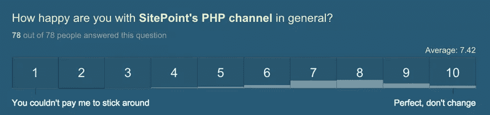
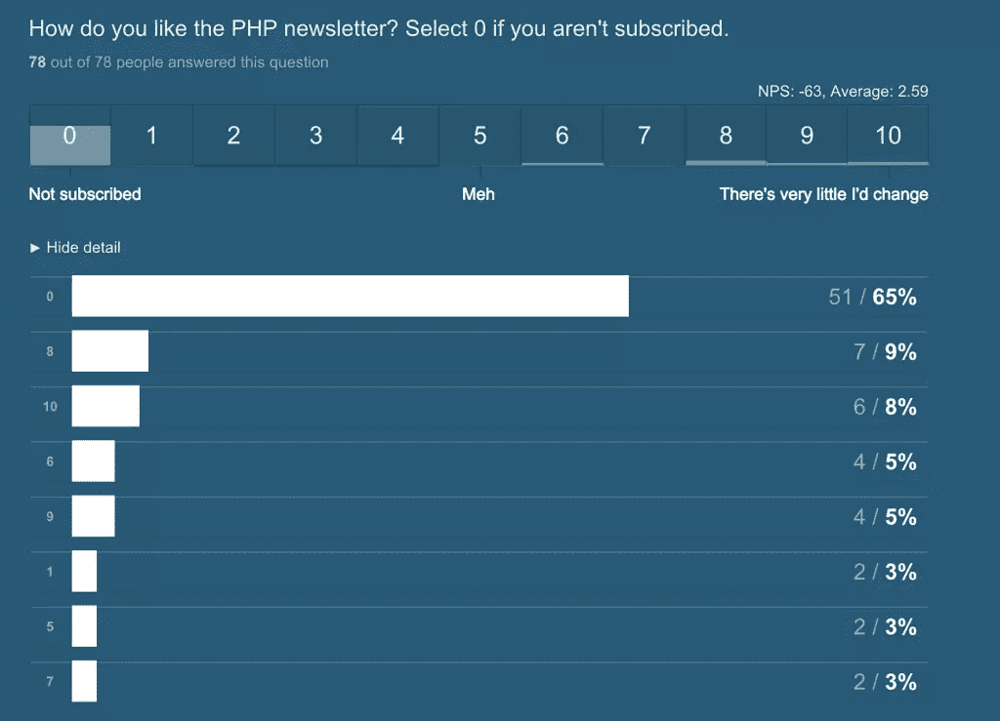
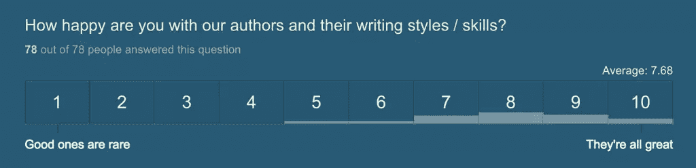
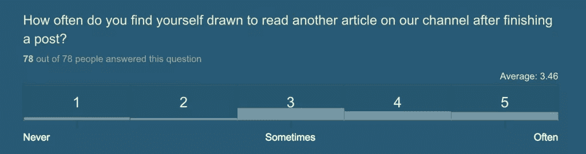
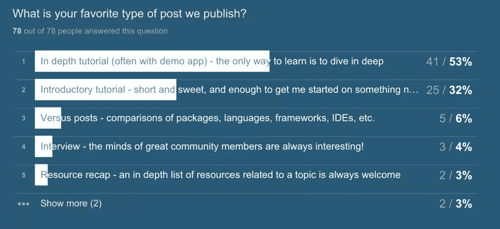
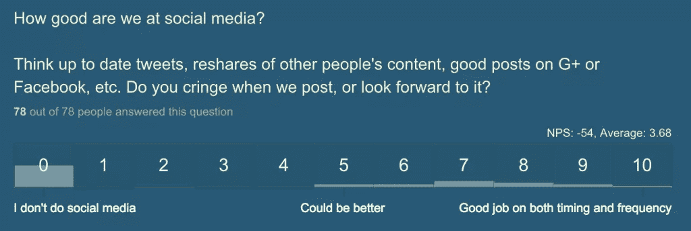
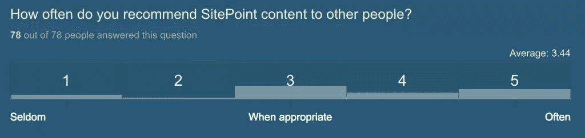

# PHP 频道的调查结果和 2016 年计划

> 原文：<https://www.sitepoint.com/the-php-channels-survey-results-and-2016-plans/>

在 2015 年的最后一天，我们发布了一项调查，询问读者们对 PHP 频道的看法。这是一个相当开放的调查，允许自由回答，所以你可以告诉我们任何事情。总之，到目前为止，我们收集了 78 份回复(调查将无限期开放，以防有人想给我们更多反馈)。

在平均满意度量表上，我们得到了 7.42 分(满分 10 分)，这还不包括潜在的投了 1 分的巨魔。这是一个很好的结果，但我们决心进一步提高。

在提供书面反馈的人中，大多数人希望每月有更深入、更先进的内容和/或更多帖子。一些人抱怨很多“无用的产品植入”，我认为这意味着广告，因为我们不经常做赞助帖子。

现在，我们希望更频繁地发布——我们已经为它排好了队。见鬼，我们的作者正在夜以继日地工作，创作出令人惊叹的东西。但是我们的预算有限，我们必须让这个预算与进来的内容量相匹配——记住，我们发布的每个帖子都是有报酬的！所以广告是必需品——我们用它们来支付作者的辛勤劳动。

关于更多的内容和更高级的话题，我听得很清楚。我们将在未来开始委托制作更多此类内容——我们将尽最大努力发布涵盖某个主题的完整“从头开始”指南，并且我们将尝试解决一些高级的特定主题。此外，根据另一位读者的反馈，我们将开始在帖子的底部列出进一步阅读的清单——为那些被这个话题迷住的人。

如果你有其他建议，请在下面的评论中提出！

* * *

至于时事通讯，结果是大多数人要么对订阅它不感兴趣，要么不知道它的存在——大多数是后者。

这是我们打算纠正的。第一步是提醒你时事通讯存在于每期文章的顶部。第二步是在时事通讯中加入有趣的非 SitePoint 资源，甚至是有吸引力的开源项目的链接。第三步将是更精细和更像文章的时事通讯社论，以使时事通讯对更广泛的读者更有吸引力。

如果您有任何其他改进建议，请告诉我们——我们最希望的是简讯对您有用，而不仅仅是您自动存档的另一个东西。

* * *

当谈到对我们的作者群的满意度时，我们也得分很高:

没有任何具体的重复投诉，但有一个回答提到我们应该让作者在他们的帖子中更加个性化——让他们发展幽默和观点，而不是像我们现在这样写非个人化和非常技术化的帖子。在过去的一年里，我们实际上有意远离了个人帖子，以使我们的帖子听起来更专业，但我想知道，你们中是否有更多人认为我们应该让作者更多地表达他们的个人经历和观点，或者保持“冷漠和专业”。

* * *

一个看起来有问题的领域是读者保持:

显然，让读者去阅读其他帖子对每个出版物都是最有利的。我们试图依靠你的求知欲，并把你正在阅读的主题与以前发表的类似材料相匹配。诚然，这需要一些工作。我们将继续努力，在接下来的几个月里，我们将加大努力(非侵入性地)为替代内容和后续内容提供相关的最新建议。

* * *

到目前为止，频道上最受欢迎的帖子似乎是深度教程:

第二名是介绍性教程，这是有意义的-新技术需要在深入介绍之前介绍。与帖子相比，我们将工具、框架和 ide 相互比较或进行基准测试似乎完全不受欢迎，鉴于这些发现，我们将大幅改变已发布帖子的比例，以反映您的愿望。

* * *

在社交媒体上，大多数人似乎都不为所动，完全不在乎:

少数人认为我们可以做得更好。一个重复的抱怨是我们发推特不够频繁——我们倾向于发一次推特(为了不显得垃圾),人们似乎在繁忙的时间表中错过了那条推特。我们会努力做到这一点，并尝试更经常地发布。

* * *

最后，关于向其他人推荐 SitePoint，我们处于中间位置，倾向于积极的一面:

解决以上所有问题应该会自动解决这个问题——至少我们希望如此。

在最后一个自由形式的问题中，主要的愿望是:

*   文章缩略图(我们会努力做到这一点)
*   更多演示和实际示例(计划中)
*   更多 PHP 7(计划中)

## 结论

我衷心感谢所有抽出时间参与本次调查的人。每一个贡献都是有价值的，我们将把每一个答案作为一次学习的经历。我们的目标是让 SitePoint 成为您最好的资源，我希望我们在 2016 年不辜负您的期望。向前向上！

## 分享这篇文章