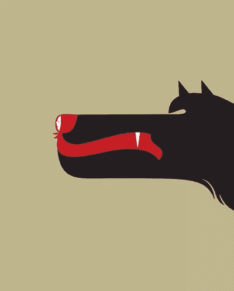
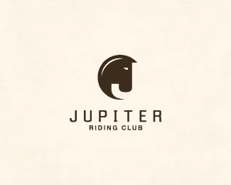

# 标志设计中负空间的力量

> 原文：<https://www.sitepoint.com/the-power-of-negative-space-in-logo-design/>

标志设计师的工作是，在其他事情中，创造有吸引力的醒目标志。这是通过使用各种设计元素和概念实现的。有些设计师有一种奇妙的技巧，可以利用负空间创造出巧妙且令人难忘的标志。通常标志的负空间部分最初看起来是隐藏的，但仔细观察就会发现一个图标或信息。一旦被注意到，以前隐藏的元素就成为标志设计中最明显的部分，引起微笑或点头表示感谢。负空间给观众的眼睛一个休息的地方。

**负空间到底是什么？**

负空间是图像主体周围和主体之间的空白空间。例如，在双色调黑白图像中，主体通常用黑色描绘，其周围的空间留白(白色)，形成轮廓。如果您反转颜色，使主体周围的空间为黑色，主体本身为空白，则负空间会在主体周围形成一个形状。负空间可以通过展示主题周围的一切而不是主题本身来描绘主题。

标志设计中负空间的一个很好的例子是联邦快递标志中字母 E 和 X 之间的隐藏箭头。

我最喜欢的插画家之一， [Noma Bar](http://www.dutchuncle.co.uk/illustrators/noma-bar/portfolios/portfolio) 在利用负空间创作杰出作品方面有着惊人的技巧。

**如何在标志设计中运用负空间**

看看 Noma Bar 的作品，我想你会同意它并不像看起来那么简单。如同任何类型的标志设计，草图和实验是必要的。

这里有一些提示，在创建一个以负空间为主要设计元素的标志时要考虑。

*   简单是最好的。保持图标或符号简单，以避免混淆观众。请记住，联邦快递标志中的诀窍是一个简单的隐藏箭头。
*   负空格不一定是白色(或黑色)。
*   如果徽标主要由文本组成，请尝试在文本后面添加一个形状并反转颜色。
*   将两个对称的形状靠得很近可以在中间的负空间产生完整的图像。

现在，为了让你看得开心，这里有一个小的徽标集合，它们以巧妙而艺术的方式利用负空间来创建视觉上吸引人的徽标。

**你怎么看待这些负面的空间标识？这是你在自己的设计工作中使用的设计元素吗？**

## 分享这篇文章