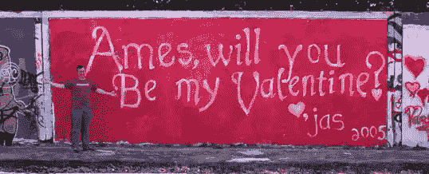
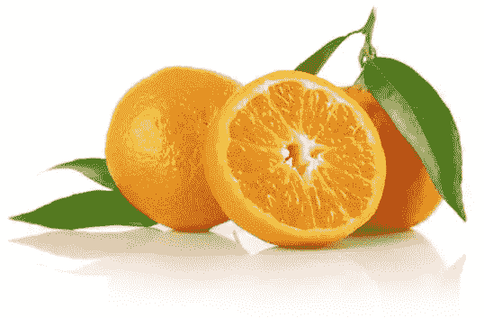
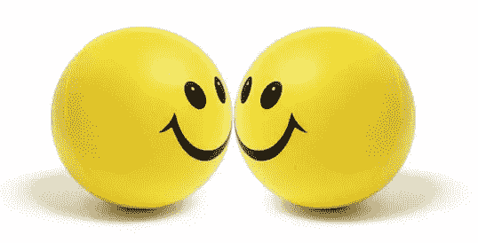

# 色彩心理学

> 原文：<https://www.sitepoint.com/the-psychology-of-color/>

无论你是在拆除一个定时炸弹，还是试图设计一个看起来不错的网站，如果你选择了错误的颜色，你就完了。好吧，所以客户网站错误的颜色选择可能不会导致你的死亡，但它可能会缩短你作为一名网页设计师的萌芽期。选择颜色不是一件简单的事情。有美学，身份和可用性的考虑要考虑。更糟糕的是，大多数现代显示器可以呈现超过一千六百万种颜色。无数可怕的颜色组合就等着发生呢！

幸运的是，没有必要成为一个带着笔记本的色彩顾问来做出好的色彩选择。从感性的(我喜欢称之为感性的)心理学指南到屡试不爽的色彩理论，有大量的知识可以帮助你在色彩方面做出正确的选择。

色彩心理学是一个研究领域，致力于分析颜色和颜色组合产生的情感和行为效果。电子商务网站所有者想知道哪种颜色会让他们的网站访问者花更多的钱。家居装饰者正在寻找一种能把卧室变成宁静禅境的颜色。快餐店老板非常想知道哪些颜色组合会让你想加大你的餐点。可以想象，色彩心理学是一门大生意。

虽然知道你的颜色选择会如何影响大众很重要，但是对特定颜色有单一、统一的心理反应的想法是错误的。许多颜色心理学家认为对某些颜色的反应是基于个人经验的。有趣的是，许多文化对颜色有完全不同的联想和解释。记住这些警告，让我们探索一些西方文化中大多数人对特定颜色的一般心理联系。

## 颜色联想

描述人们与颜色之间的情感联系可能是一个非常嬉皮士式的话题。如果你觉得难以置信，那就去你最喜欢的在线音乐商店，试听肯·诺丁的《色彩》中的一些歌曲。尽管大多数设计师不会仅仅依赖特定颜色的含义、特征和个性，但了解一些主要颜色组的情感属性仍然很方便。

### 红色

红色以刺激肾上腺素和血压而闻名。除了这些生理效应，红色还被认为可以增加人体新陈代谢；这是一种令人兴奋的、戏剧性的、丰富的颜色。红色也是激情的颜色。没有什么比在情人节给心上人刷一面鲜红色的墙更能表达爱情了，如图 1.1，“红色，爱情的颜色(两加仑！)".暗红色，比如勃艮第和栗色，给人一种丰富、放纵的感觉——事实上，它们可能相当自负。为葡萄酒爱好者或精致生活的鉴赏家设计任何东西时，想想这些颜色。更朴实的棕红色让人联想到秋天和收获的季节。

*图 1.1。红色，爱情的颜色(两加仑！)*

### 柑橘

像红色一样，橙色是一种非常活跃和充满活力的颜色，尽管它不能像红色那样唤起激情。相反，橙色被认为能促进幸福，代表阳光、热情和创造力。与红色相比，橙色是一种更随意、更没有企业感的颜色，这可能是基于位置的服务背后的设计师选择它作为他们的标志的原因。因为橙色在自然界中不常出现，所以当我们看到它时，它往往会跳出来。因此，它经常被用于救生衣、路锥和狩猎背心。因为橙色也能刺激新陈代谢和食欲，所以它是促进食物和烹饪的绝佳颜色。这可能就是为什么图 1.2 中的橘子图片，“橘子你高兴我没说香蕉？”让你感到饥饿，即使你不喜欢柑橘类水果。

*图 1.2。橘子你高兴我没说香蕉吗？*

### 黄色

像橙色一样，黄色是一种活跃的颜色，非常显眼，常用于出租车和警示标志。它也与快乐联系在一起，如图 1.3 所示，“黄色，微笑的颜色”是微笑的标志性颜色。运动能量饮料佳得乐最初的橙子和柠檬-酸橙口味仍然是该品牌最畅销的产品；这可能至少部分是由于与橙色和黄色相关的能量特征。

 
*图 1.3。黄色，笑脸的颜色*

### 格林（姓氏）；绿色的

绿色通常与自然联系在一起。这是一种舒缓的颜色，象征着成长、新鲜和希望。毫无疑问，为什么颜色与环境保护如此紧密地联系在一起。从视觉上看，绿色对眼睛来说更舒服，而且远不如黄色、橙色或红色有活力。虽然许多网站设计使用绿色来吸引访问者的自然感，但绿色是一种多功能的颜色，也可以代表财富、稳定和教育。当亮绿色以黑色为背景时，它真的很流行——给设计一种科技感。对我来说，它让我想起了我的第一台电脑，一台可靠的老式苹果电脑。这是我最近设计的 MailChimp 加载屏幕的灵感，如图 1.4 所示，“Freddie Von Chimpenheimer IV 的 ASCII 版本”。

*图 1.4。弗雷迪·冯·钦彭海姆四世的 ASCII 版本*

### 蓝色

当我还是个孩子的时候，我最喜欢的颜色是蓝色。不是普通的蓝色，而是克雷奥拉蜡笔的天蓝色。虽然大多数孩子不那么特别，但蓝色经常被认为是最受欢迎的颜色。在感性层面上，蓝色象征着开放、智慧和信仰，并被发现具有镇静作用。另一方面，蓝色也被发现可以降低食欲。这可能部分是由于蓝色在真实食物中的稀有性。除了蓝莓，你能数出多少天然蓝色的食物？看起来，蓝色被排除在自然的诱发食欲的调色板之外；因此，它不太适合推广食品。

此外，蓝色有时被视为厄运和麻烦的象征。这种情感色彩的联系在蓝调音乐中很明显，在毕加索抑郁引发的“蓝色时期”的绘画中也是如此。然而，这并不全是关于不自然的食物颜色和忧郁的艺术形式；蓝色具有普遍的吸引力，因为它与天空和海洋联系在一起。对我来说，在图 1.5“平静的石头、天空和大海”中，蓝色的存在让我感觉更自在。

*图 1.5。平静的石头、天空和大海*

这种视觉联系使得蓝色成为与航空公司、空调、泳池过滤器和游轮相关的网站的明显选择。你有没有注意到蓝色是 IBM、戴尔、惠普和微软商标的主色？那是因为蓝色也传达了一种稳定感和明确的目标…也就是说，直到你经历了死亡的蓝屏！

### 紫色

历史上，紫色与皇室和权力联系在一起，如图 1.6 中的邮票，“挪威邮票上的紫色盾形纹章”。紫色的辉煌历史背后的秘密与生产紫色服装所需染料的难度有关。直到今天，紫色仍然代表着财富和奢侈。这种奢侈被带到了大自然中。紫色通常与鲜花、宝石和葡萄酒联系在一起。它平衡了红色的刺激和蓝色的镇静效果。根据《网页设计师的想法书、的作者 Patrick McNeil 所说，紫色是网页设计中最少使用的颜色之一。他解释说，找到以紫色为特色的网站设计的好例子是如此困难，以至于他几乎不得不从他的书中删掉这一部分。如果你想创建一个鹤立鸡群的网站设计，可以考虑使用浓郁的紫色。

*图 1.6。挪威邮票上的紫色盾形纹章*

### 怀特（姓氏）

你可能认为图 1.7 中风力涡轮机的颜色没有什么特别，“这些风力涡轮机可能是白色的，但它们也是绿色的”，但使用白色实际上有助于推广这是清洁能源的理念。在西方文化中，白色被认为是完美、光明和纯洁的颜色。这就是为什么清爽的白色床单会出现在洗涤剂广告中，为什么新娘会在婚礼当天穿白色婚纱。要了解白色在我们文化中的根深蒂固，请阅读罗伯特·弗罗斯特的诗 *Design* 。在这部电影中，弗罗斯特用白色代表死亡和黑暗，这与我们的联想相矛盾。有趣的是，在中国文化中，白色传统上与死亡和哀悼联系在一起。这种文化差异应该提醒你去研究你的目标受众的颜色联想，因为它们可能与你自己的感知有很大的不同。

在设计中，白色经常被忽视，因为它是默认的背景色。尽管如此，不要害怕动摇它。试着用深色背景搭配白色文字，或者在米色画布上放一个白色背景块，让它看起来很流行。以意想不到的方式使用颜色可以做出大胆的声明。

*图 1.7。这些风力涡轮机可能是白色的，但它们也是绿色的*

### 黑色

尽管黑色经常带有死亡和邪恶等负面含义，但它也可以是权力、优雅和力量的颜色，这取决于如何使用它。如果你正在考虑使用一种特定的颜色，并且想知道这种颜色的联想是什么，问问自己，“当我想到这种颜色时，首先想到的三件事是什么？”例如，当我想到黑色时，我会想到约翰尼·卡什、晚礼服和蝙蝠侠。当我想到约翰尼·卡什时，他深色的衣服、低沉的声音和悲伤的歌曲赋予了我在这个人和肤色之间的心理联想一种切实的意义。

*图 1.8。黑色，代表力量、优雅，在这种情况下，代表过度*

如果你以这种方式对待你所有的颜色选择，为每一种颜色建立三个词的联系，你就有机会很好地了解这种颜色在你的观众中是如何被广泛感知的。

即使颜色心理学在访问者浏览你的网站的方式中扮演了一个角色，请记住没有错误的颜色可以使用。虽然心理推理可能有助于开始你的调色板，一个配色方案的成功取决于所有选择的颜色之间的和谐。为了达到这种和谐，我们需要注意颜色的其他一些属性。

## 参考

1.  帕特里克·麦克尼尔，网页设计师的创意书籍，如何书籍，Cincinatti，美国，2008 年
2.  这可以在很多好的诗集里找到，但我用的是诺顿诗选(第五版)，玛格丽特·弗格森、玛丽·乔·索尔特和乔恩·斯托尔沃西编辑，WW 诺顿公司，纽约，2004 年。

## 美丽网页设计的原则

这篇文章来自杰森·比厄德的 [*《美丽网页设计的原则》*一书](https://www.sitepoint.com/books/design2/ "SitePoint.com: The Principles of Beautiful Web Design, 2nd Edition")(第二版现已出版！).请务必在设计节上关注这本书的更多文章。

## 分享这篇文章