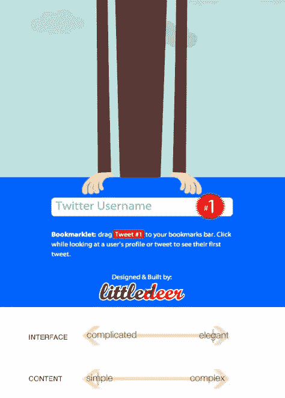
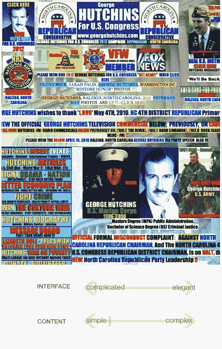
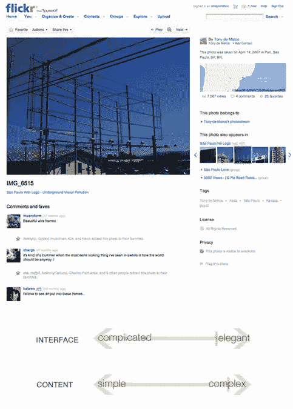
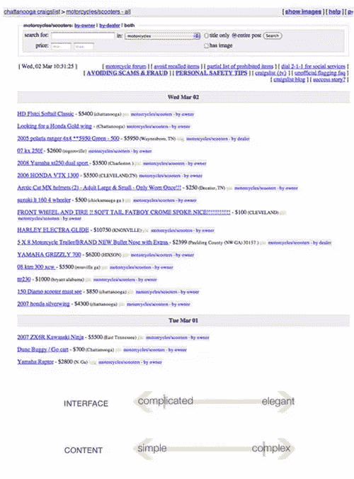

# 简单中的复杂

> 原文：<https://www.sitepoint.com/the-sophistication-of-simplicity/>

如果事情很简单，就很容易理解或做。但正如达芬奇所说，“简单是终极的复杂。”很难让网站界面简单，尤其是内容复杂的时候。

这就是优雅的来源。在这种情况下，优雅意味着“令人愉快的巧妙和简单”——对一个具有挑战性的问题的聪明的解决方案。不优雅的界面是复杂的，制造了更多的困难和混乱，而不是清晰。

让我们来看看内容的复杂性和界面的优雅性的一些交集:

## 界面优雅，内容简单

很难有比这更简单的内容了。该网站“ [Tweet #1](http://www.tweet1.com "Tweet 1") ”主要是一个用于输入 twitter 地址的文本字段。它们的内容简单，界面优雅。但是，不要被愚弄了——这并不意味着像这样的网站总是容易的。

回到我们对优雅的定义，它需要令人愉快的巧妙和简单。将简单的内容转换成简单的界面很容易，但是当你看起来没什么可做的时候，让它变得有趣就更难了。

## 复杂的界面，简单的内容

位于上方的[站点是一个界面的例子，它可以很容易地变得优雅。内容本身并没有那么复杂；主要是链接、导航项、照片和文本。然而，布局和设计最终变得非常复杂，从而损害了整个网站。](http://www.georgehutchins.com/ "George Hutchins for Congress")

尽管这是一个极端的例子，但是如果没有从一开始就建立内容的层次结构，任何网站都可以朝着这个方向发展。这一页上的所有东西都渴望得到关注，所以什么都得不到。

## 界面优雅，内容复杂

或者，复杂的内容可以在优雅的界面中处理。Flickr 处理数十亿的图片上传和相应的数据，以及提供照片组织和社交管理，所有这些都以一种感觉简单的方式进行。

不过，我相信 Flickr 的开发者和设计者会告诉你，达到这一步并不是一项简单的任务！这是创造优雅最具挑战性(也最有回报)的场景。

## 复杂的界面，复杂的内容

Craigslist 网站上有很多空白区域，所以乍一看可能并不复杂。然而，这种情况下的复杂化会造成更多不必要的混乱。

他们不是利用列来帮助扫描信息，而是将所有的文本塞在一起，有时使用文本的粗细和颜色来区分。尽管所有的设计师都建议改变并提供帮助，但他们的界面发展一直以这种方式顽固不化。然而，许多 Craigslist 建议的重新设计都是短视的，并成功地使其更具吸引力但不优雅。

美学上的吸引力和彻底的美经常左右我们对网页界面的想法，但是美本身并不是一种追求。如果我们在复杂面前追求优雅，美丽就会从那份努力中流淌出来！

## 分享这篇文章