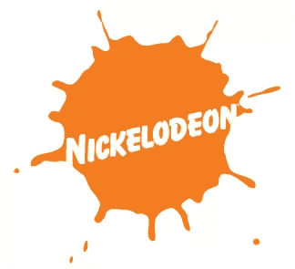
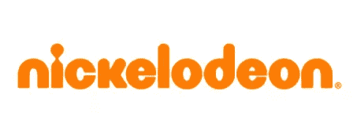
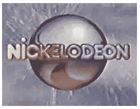
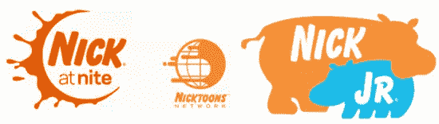

# Splat 不见了:Nickelodeon 的标志得到了更新

> 原文：<https://www.sitepoint.com/the-splat-is-gone-nickelodeons-logo-gets-an-update/>

Nickelodeon 将其广为人知的“splat”徽标更新为基于文字的新徽标。它仍然是橙色的，人物对他们有一种圆形气球般的友好，但 splat 不见了。

*旧 Logo*

*新 logo*

 *新的标志是一个圆形的字体，字母 I，看起来像一个小人，是焦点。

新的标识将在秋季接管，届时所有的尼克国际频道和网站都将展示该标识。该公司本身已经存在了大约三十年，五年后的 1984 年引入了 splat 标志。

*原始标志*

all things Nick 的总裁 Cyma Zarghami 表示，更改徽标的主要原因是将 Nickelodeon、Nick at Nite、Nicktoons、Nick Jr .(一位朋友今天向我描述为蹒跚学步的海洛因)和 TeenNick 连接起来，所有这些都将使用新的徽标。

*一些种类繁多的尼克标识*

她说；

> 我们想清理它，让尼克成为所有这些频道的印记，这最终意味着抛弃熟悉的五分钱电影院“啪嗒”
> 
> 在问自己是否所有的东西都可以生活在 splat 下时，我们决定 splat 已经过时了。(经由[综艺杂志](http://www.variety.com/article/VR1118006659.html?categoryid=14&cs=1)

最初 splat 标志是由斯科特·纳什和汤姆·科里在弗雷德/艾伦公司为弗雷德·西伯特设计的，因其多样的变化而闻名。

我不能假装我是和 Nickelodeon 一起长大的(它没有在爱尔兰电视上播出，但现在可以在有线电视上看到)，但我当然很了解它的标志，并有点喜欢它。它既有趣又明亮，还有点淘气。我认为新标志缺少了一些东西。splat 肯定是最容易识别的标志之一，出现在盒子的上角，是两个孩子和时间紧迫的父母的朋友。我喜欢新标志的简洁，但它取代了一点经典，这似乎令人难过。

你觉得这个新设计怎么样？喜欢，厌恶，无所谓？* 

## *分享这篇文章*