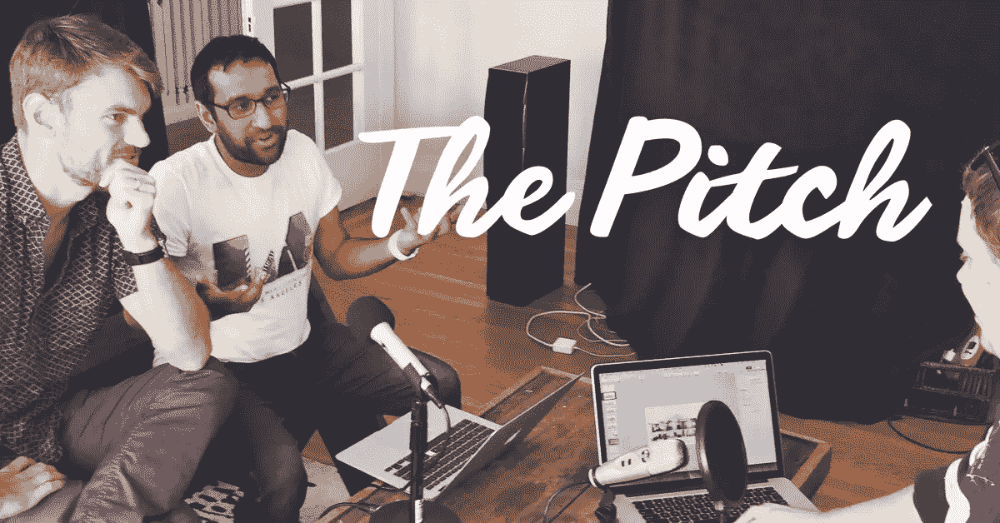

# 斗争是真实的:球场背后的故事

> 原文：<https://www.sitepoint.com/the-struggle-is-real-the-story-behind-the-pitch/>

凌晨 3 点，你被自己的想法激励得睡不着觉。当你的愿景成为现实，生活变得更好，你的目标实现，反对者沉默时，你花 15 分钟来踱步和想象未来。

然后现实开始了。

你醒了。你强迫自己回到现实中来，不要做白日梦了。

你已经完成了第一步的一半，接下来是 99 个更艰难的步骤——甚至比第一步更具挑战性。每一步都需要数月甚至数年才能完成。

你肯定回到现实了。

## 斗争是真实的

我不知道你怎么样，但是我总是做白日梦。

目前，我正在做我热爱的事情，所以我有时会对未来过于乐观。

我会经常推迟其他工作，因为我陷入了另一个白日梦。想想 10 年后我会在哪里，然后今天做些什么来真正到达那里，这要容易得多。

## 故事是这样的

我从大学毕业，获得了商业金融学位，然后我得到了我的第一份会计工作，我讨厌这份工作，所以一年后，当这家羽翼未丰、现已倒闭的公司解雇我时，我非常激动。

当时，我和妻子正期待着我们的第一个孩子，而我同时着手建立我的第一家企业，那是在电子商务和电子维修行业。

我们非常幸运，它立即起飞了。

三个月后，我们雇佣了第一名员工。事情就从那里开始了。这几乎很容易。

快进三年后。

现在是 2014 年，我在一个我开始鄙视的行业里精疲力竭。

我不喜欢客户，我开始避开办公室，选择远程管理运营。

我是星巴克里的那个人，你会问:“这个人每天都做些什么？”

最后，我承认是时候去做我真正喜欢做的事情了，所以我们在 2014 年 10 月卖掉了我们的公司，不知道接下来会发生什么。

我又回到了三年前开始的地方，但这次有了两个孩子，一笔房款和车库里的两辆车，没有稳定的收入。

## 寻找“它”

起初，我想建立一个 WordPress 托管公司(好像这个世界需要另一个这样的公司)。

然后我想修理电子邮件。

我甚至考虑过创办一家零售咖啡公司。

然而，这些似乎都不是正确的想法。你知道你不能放弃的想法吗？

因此，当我在寻找合适的东西时，我开始咨询那些需要数字广告预算帮助的初创公司。

再说一次，我在做我并不热爱的事情，在我并不真正热爱的行业里帮助别人。

虽然我不能挑剔，但我需要有逻辑，养活我的家人…或者搬到哥斯达黎加，靠更少的钱生活。

然后在二月，我做了一件可笑的事。因为一个偶然的梦想，我决定开始一个关于[产品搜寻](http://producthunt.com)的每日播客，叫做每日搜寻。

产品搜索社区喜欢它，但是它的市场空间非常小。我拼命工作却一事无成。

我在应付这个新的利基秀、我的咨询客户的工作量以及和家人在一起的时间。

我和妻子每周至少有一次这样的对话:

**我:**“真的是这个东西吗？每日狩猎还没有开始，但看起来我正在建立良好的关系。我应该继续走下去吗？”

妻子:“是的，在我们找到下一步之前，你应该继续前进。”

**我:**“好吧，你说得对。我会一直走下去。”

## 支点

但后来，一些经典的事情发生了——“支点”发生了——感觉就像那个东西的支点。

其他人对此感到兴奋。我们用通过 55 集《每日追捕》获得的新知识计划了完美的发射。然后我们就彻底杀了它。

我们启动了[推介活动](http://thepitch.show),取得了我见过的播客发布活动中最大的成功。

今天，我们仍然在消灭它，但我们还没有到那一步。

播客从广告商和赞助中赚钱，这真的很难，尤其是当你不是罗曼·马尔斯、莎拉·柯尼希或亚历克斯·布隆伯格的时候。

我没有公共广播的背景，所以我真的不知道我到底在做什么。

每个人对我们节目的看法是我们是摇滚明星。我们拥有创业播客空间。但即使这样，也真的很难。

> 感觉没有成功过。

我们是一个分布式团队，这很好，但往往很孤独。

我的联合创始人谢尔(Sheel)花时间在其他公司上，而我做了大部分繁重的工作，尽管我仍在通过咨询赚钱。所以对一些人来说，我并不真正致力于我的创业。非常感谢，保罗·格拉厄姆。)

具有讽刺意味的是，我们的节目都是关于帮助早期创业公司获得资金，但我们自己并没有寻求资金(因为我们还没有找到如何盈利的方法)。

**评论家说:**“你甚至是一家创业公司吗？你不就是个播客吗？”

对此我想回应:“你这个天真的混蛋。闭上你的臭嘴，去做你自己的创业，而不是成为另一个网络巨魔”。

但我守口如瓶。

我通常不会这样写或说，但这并不意味着我大部分时间没有这种感觉。这是每天的斗争，坚持我对未来的愿景，并意识到我不会知道这是否成功，除非我给它足够的时间来成长。

> 一夜成功不会在一夜之间到来…或者至少我是这么告诉自己的。

所以我会继续努力，在 Twitter 上表现出无限的乐观。

请在评论中告诉我你的想法。你能理解这场斗争吗？

## 分享这篇文章