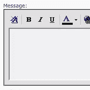

# 网络上丰富文本编辑的悲剧喜剧

> 原文：<https://www.sitepoint.com/the-tragic-comedy-that-is-rich-text-editing-on-the-web/>



问题是这样的:客户想要一个文字处理器，但是开发者想要干净的语义 HTML。网页富文本编辑器应该是答案。早在 IE4 时，微软就提供了丰富的文本编辑组件；Mozilla 也实现了一个类似的编辑器，其他浏览器现在也这么做了。这些内置的编辑组件没有用户界面，只能通过 JavaScript 访问；因此，在 Mozilla 实现之后出现了大量的 JavaScript 富文本编辑器。

因此，我们在浏览器中进行富文本编辑已经超过十年了。问题解决了？我们一点都不亲近。您见过这些编辑器输出的 HTML 吗？让我们从一个非常简单的任务开始:将文本加粗。在 IE 和 Opera 中，您将生成以下 HTML:

```
<STRONG>some text</STRONG>
```

在 Mozilla、Safari 和 Chrome 中，结果如下:

```
<b>some text</b>
```

在 Mozilla、Opera、Safari 和 Chrome 中，有一个名为`styleWithCSS`的可脚本化属性。虽然在 Opera 中没有区别，但是如果启用了这个，Mozilla 将生成:

```
<span style="font-weight: bold;">some text</span>
```

Safari 和 Chrome 将生成:

```
<span class="Apple-style-span" style="font-weight: bold;">some text</span>
```

但是，情况变得更糟了。如果在 Mozilla、Safari 或 Chrome 中启用`styleWithCSS`将文本加粗，IE 和 Opera 将无法移除加粗。如果你用 IE 或 Opera 把文本加粗，然后试着在 Firefox 中去掉加粗，难以置信的是`<STRONG>`标签会变成`<strong style="font-weight: normal;">`。

有太多可怕的 HTML 的例子了，很难知道要拿出什么作为例子。在[浏览器范围](http://www.browserscope.org/)上访问富文本测试，测试一堆浏览器；很有启发。您将看到字体标签的使用，在同一个标签中混合了大写和小写字母，一些属性被引用，一些没有，`<br><br>`用于分段符，块引号用于缩进。你会发现浏览器的实现大相径庭。甚至有一些情况会导致这种无法形容的恐惧:

```
<SPAN style="BACKGROUND-COLOR: rgb(255,0,0)" class=Apple-style-span><FONT style="BACKGROUND-COLOR: #0000ff">foo bar baz</FONT></SPAN>
```

为了克服这种不兼容性，现代的 JavaScript 富文本编辑器，比如 [TinyMCE](http://tinymce.moxiecode.com) ，采用了暴力方法。他们编写了大量的 JavaScript，只是为了获取浏览器产生的垃圾 HTML，并将其处理成一种类似健全的状态。他们做得这么好是值得称赞的，但这也可能是为什么浏览器制造商没有动力清理他们自己的编辑器。

2010 年处于这种状态令人震惊。HTML5 打算对此做些什么？以下短语在`contentEditable` 一节中反复出现:

> 确切的行为取决于 UA，但是用户代理不得在响应请求时将语义包裹在某些文本周围，或者插入或删除语义元素，从而生成与请求前的 DOM 不一致的 DOM

虽然标准强调用户代理首先不应该造成伤害是好的，但它仍然非常模糊，实现细节仍然依赖于 UA。我会满足于浏览器之间的一致性。可以在标准表单控件列表中添加一个“富文本字段”,用户代理可以为标准编辑任务显示一个默认工具栏。

你怎么想呢?富文本字段应该成为标准的一部分，还是应该依靠 JavaScript 来解决？富文本编辑器是编辑网络内容的正确方法吗？

## 分享这篇文章