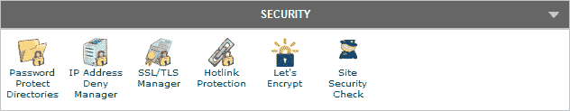
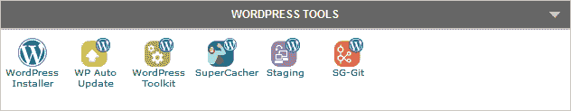
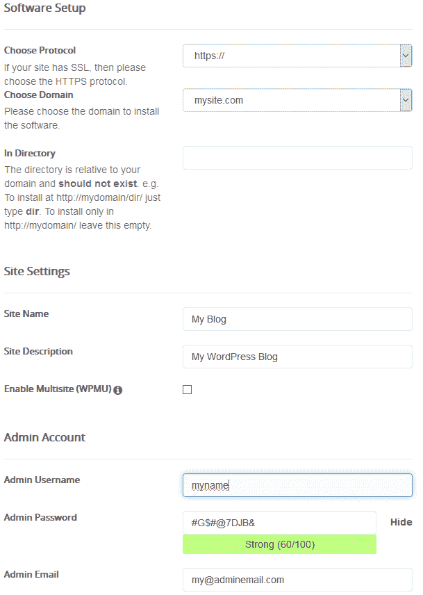
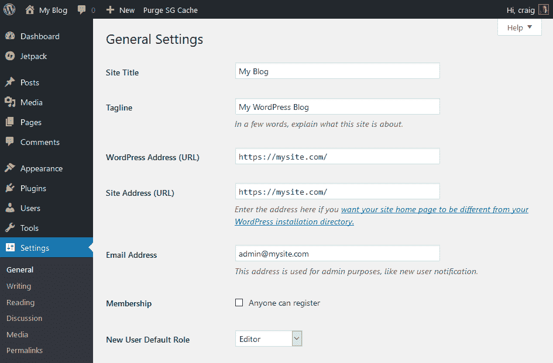
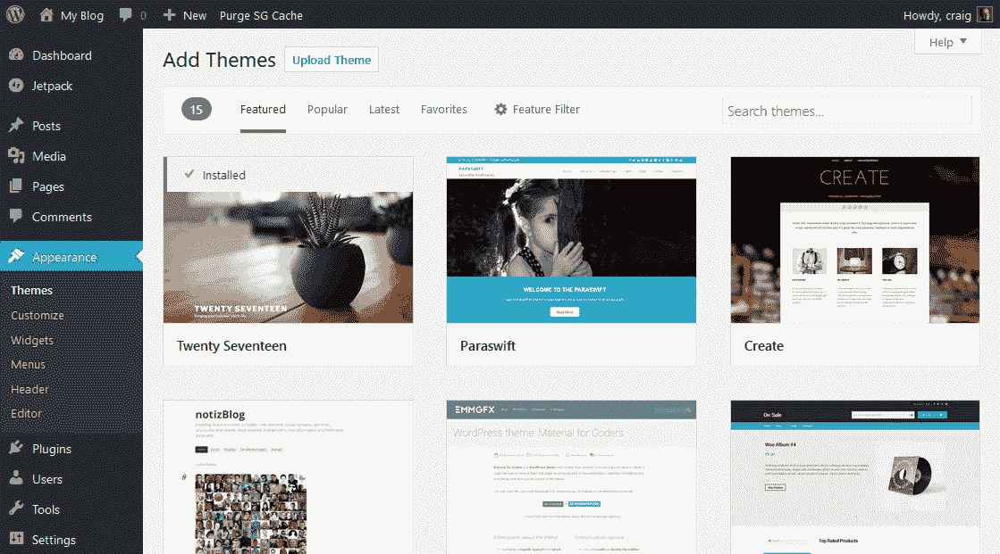

# 建立和运行 WordPress 网站的终极初学者指南

> 原文：<https://www.sitepoint.com/the-ultimate-beginners-guide-to-setting-up-running-a-wordpress-site/>

所以你决定经营一个 WordPress 网站，但是不知道从哪里开始？本教程是针对绝对初学者的。一些 IT 知识会有所帮助，但我认为你想在几个小时内学会基本知识。让我们开始吧。

## 第一步:你想实现什么？

一点点计划会有很大帮助。对自己诚实:*你为什么考虑 WordPress？*你想:

*   创建商业网站？
*   记录你的生活、爱好或兴趣？
*   开一家了不起的网页设计机构？
*   学写代码？
*   做点别的？

WordPress 很灵活，几乎占据了网络的三分之一— *,但是它并不适合所有情况*。一个网站或文章库是完美的。创建一个社交网络或网上商店是可能的，但可能有更好的选择。使用 WordPress 学习 PHP 可能是一次令人沮丧的经历。

假设 WordPress *和*是合适的，你是对技术感兴趣还是更喜欢写内容？如果是后者，SiteGround 的托管 WordPress 计划或 WordPress.com的账户会让你运行起来，而没有安装和服务器管理的麻烦。

寓意:*在选择解决方案之前先定义问题！*

## 第二步:规划你的内容

理想情况下，你应该在建立网站之前写好所有的内容。这是规划一个结构的最好方法，会影响你的设计。从来没有人这样做过，但是至少计划一些一般的概念，这样你就有了开始的地方。

## 第三步:购买域名

域名是您的主要网址，例如 www.mysite.com。保持简短，使用适合你内容的关键词。这可能比听起来更难；大多数好名字都是几年前注册的。

使用有信誉的域名注册商，比如 Hover。价格因国家和顶级域名类型而异。com，。网，。组织，。ninja 等)，但预计在几年内为一个新域名支付大约 25 美元。从别人那里购买一个像样的预注册域名可能会贵得多。

### 推荐域名注册

HoverStraight forward domain name registration and helpful support. No Hidden Fees. Name Your Idea Today. **Get 10% off now.**

*   [如何为自己的企业选择域名](https://www.sitepoint.com/how-to-choose-a-domain-name-for-your-business/)
*   [如何选择、注册并充分利用你的域名](https://www.sitepoint.com/choose-register-make-domain-name/)
*   [帮助你购买完美域名的 12 个工具](https://www.sitepoint.com/12-name-generators-availability-checkers-help-buy-perfect-domain-name/)
*   你的域名:你是不是 www？

## 第四步:购买托管计划

你的网站需要被托管在某个地方。它的文件必须放在一个懂得如何处理网络请求的设备上:一个网络服务器。你可以从你的台式电脑上提供一切，但这很快就变得不切实际了。

从 [SiteGround](https://www.sitepoint.com/go/recommended-hosting-siteground) 等受人尊敬的主机购买合适的方案。一个兼容 WordPress 的共享主机计划每月花费几美元，你可以随着流量的增长升级磁盘空间和带宽。

### 推荐的虚拟主机

[Fast. Scalable. Managed Hosting. 65% Off Today.](https://www.sitepoint.com/go/recommended-hosting-siteground)SiteGroundNeed a host that offers fast performance, fantastic tools for web geeks, best in class support and incredibly reliable hosting? Go for SiteGround. **Get up to 65% off now.**

然后，您需要将您的域名“指向”您的新网络空间。这通常是通过登录到您的域注册商的控制面板，然后:

1.  将主机设置为 DNS 名称服务器，或者
2.  将域的 DNS A 记录更改为指向主机的 IP 地址。

所有的主机和域名注册服务商都会提供指导，但是你可能需要寻求专家的帮助。域更改可能需要 48 小时才能传播，因此您可能需要等待一段时间才能进入下一步。

*   [虚拟主机&域名](https://www.sitepoint.com/web/web-hosting-domains/)
*   [选择托管服务提供商的终极指南](https://www.sitepoint.com/ultimate-guide-choosing-hosting-provider/)
*   我应该为我的网站选择什么样的主机？
*   关于托管，我需要知道些什么？

## 步骤 5:设置 SSL

安全套接字层(SSL)证书在您的网站上启用加密协议，因此它是通过 **https://** 地址而不是 http://提供的。你的服务器和用户的浏览器之间的所有通信都是加密的，所以它不能(轻易地)被第三方截获。

配置 SSL 是一个可选步骤，但强烈推荐:

1.  当网站不安全时，浏览器会发出警告，尤其是在填写表单或发送数据时。
2.  搜索引擎对安全网站的排名高于非安全网站。
3.  如果你最终想要一个允许你的网站“安装”和离线工作的渐进式网络应用程序，SSL 是必不可少的。
4.  稍后添加 SSL 要困难得多。您可能需要重新安装 WordPress，搜索引擎索引可能会受到影响。
5.  没有缺点。HTTPS 可以免费添加，并且比未加密的 HTTP 慢得可以忽略不计(当与 HTTP/2 一起使用时，它可以[快得多)。](https://www.httpvshttps.com/)

主机通常允许您安装在其他地方购买的证书，但是使用它们自己的服务更容易。例如， [SiteGround](https://www.sitepoint.com/go/recommended-hosting-siteground) 在你网站 cPanel 的安全部分提供了一个免费的**让我们加密**选项。点击那个，点击**安装**，SSL 被启用。

*   [为什么每个网站都需要 HTTPS](https://www.sitepoint.com/why-every-website-needs-https/)
*   [如何用 SSL 保护 WordPress】](https://www.sitepoint.com/secure-wordpress-with-ssl/)
*   [什么是 HTTP/2？](https://www.sitepoint.com/what-is-http2/)

## 第六步:安装 WordPress

WordPress 是一个复杂的应用程序，需要:

1.  一个后端 MySQL 数据库，其中保留了您的配置、帖子、评论和其他信息。这必须首先安装和配置。必须定义数据库用户 ID 和密码，以便应用程序可以存储和检索数据。
2.  构成 WordPress 应用程序的一大组 PHP 文件。在运行设置程序之前，必须将这些文件复制到服务器。这将在创建数据库表和初始数据之前请求数据库凭证。
3.  安装后，WordPress 使用 ID 和密码与数据库进行通信，以便编辑和显示页面。

大多数主机都提供了 cPanel(一种流行的网站管理工具)。你可以创建你的数据库，上传 WordPress 并手动安装。完整的说明请参考[如何在 cPanel](https://www.sitepoint.com/how-to-create-wordpress-mysql-databases-on-cpanel/) 上创建 WordPress MySQL 数据库。

幸运的是，有一个更简单的选择。在 cPanel 中搜索或浏览 WordPress 选项:

点击 **WordPress 安装程序**打开安装面板:

定义以下设置:

*   **https://** 用于**协议**如果您在步骤 5 中启用了 SSL。(您也可以选择域是否使用首字母“www”)。
*   您的主**域名**。(只有一个选择，除非你有多个域名指向托管计划)。
*   为了在根文件夹中安装 WordPress，**目录**应该留空。只有当你想从另一个文件夹运行它时，例如 https://mysite.com/blog/，才改变它
*   新址的**名称**和**描述**。
*   保持**多站点**未选中，除非你打算在同一个空间运行多个 WordPress 站点。
*   输入**管理员用户名**和**密码**。你将使用这些来登录 WordPress，以确保它们是强的(*而不是*‘管理’和‘密码’)！)你把它们放在一个安全的地方。
*   输入您的**电子邮件**。WordPress 用这个在必要的时候给你发送通知。

其他选项通常可以保留为默认设置。点击**安装**，等待几分钟，安装过程完成。你会得到一个到主网站(https://mysite.com/)和 WordPress 控制面板(https://mysite.com/wp-admin)的链接，在那里你可以用你的管理用户名和密码登录。

## 步骤 7:初始 WordPress 配置

现在还不要开始发布内容！在进一步操作之前，最好从**设置**菜单中配置 WordPress:

下面的部分描述了基本的 WordPress 设置，但是注意安装的主题和插件可以覆盖这些选项。

### 一般

此窗格允许您更改安装的各个方面。要更改的主要设置包括:

*   **时区**。这可能默认为 UTC，因此请选择一个合适的城市。
*   **日期格式**。选择一个合适的选项或者使用 [PHP 的日期格式](http://php.net/manual/en/function.date.php)输入一个自定义字符串
*   **时间格式**。同样，选择一个选项或输入您自己的选项。

完成后，记得点击**保存更改**。

### 写作

此面板中要更改的主要设置有:

*   **默认的帖子类别**。岗位类别在**岗位** > **类别**中定义。
*   **默认帖子格式**。WordPress 主题通常提供不同的文章类型，比如标准文章、图库和视频页面。选择你最常使用的。

### 阅读

**首页显示**设置允许您设置是否在主页上显示您的最新帖子或静态页面。

其他默认设置通常是好的，尽管你可能想在建立你的网站的初始阶段暂时禁用**搜索引擎可见性**。*不要忘记在上线前启用它！*

### 讨论

此面板控制注释。主要设置是**允许人们对新文章发表评论**，如果你不需要评论，你可以禁用它。

### 媒体

该窗格允许您设置大图像、中等图像和缩略图的默认尺寸。默认值是合理的，但是，你的图像尺寸越小，文件就越小，你的网站下载就越快。

### 永久链接

永久链接是 WordPress 文章的 URL。默认往往是一个普通的 https://mysite.com/?p=123，这将不会帮助您的关键字丰富的搜索引擎优化的努力！

将永久链接设置为**帖子名称**或适合你网站的名称。

## 步骤 7:设置用户帐户

在安装过程中，WordPress 创建了一个单一的管理员帐户，可以不受限制地访问所有控制面板功能。永远不要共享这些凭证:为每个需要访问的人设置单独的帐户。

用户是任何系统中最薄弱的一点——尤其是当他们可以选择自己的简单密码，并愉快地将凭证传递给任何询问的人时！WordPress 提供了一系列的[角色和功能](https://codex.wordpress.org/Roles_and_Capabilities)，并且很少需要给任何人管理权限。即使您是唯一的内容编辑者，建议您专门为日常写作和发布任务创建另一个帐户。

在大多数情况下，用户应该是:

*   一个**编辑**:可以发布和管理自己和他人帖子的人
*   作者:可以发布和管理自己帖子的人，或者
*   a **投稿人**:可以撰写和管理自己的帖子但不能发布的人。

这些角色都不能配置 WordPress 或者安装插件。

要创建新用户，点击菜单中的**用户**选项，然后点击**添加新用户**。输入用户的凭据，记住要设置强用户名和密码。

## 第八步:开始写作！

默认的 WordPress 安装提供两种类型的内容:

*   **帖子**:文章和博客帖子通常按时间倒序显示。帖子可以被分配到类别、标签，并且可以有其他格式，如图库和视频。
*   **页面**:通常以菜单层级显示的静态网站页面——*首页*、*关于我们*、*联系我们*等。可以为页面分配父页面和顺序，以确保正确创建菜单。

这两种内容类型都可以从菜单中访问，看起来非常相似。仔细检查你编辑的内容是否正确。你可能会找到初始站点的默认页面、帖子和评论——记得删除它们！*(删除的项目会被放入垃圾桶，如有必要还可以取回)。*

在这一点上，我希望你有第 2 步中计划的所有内容的最终副本。从来没有人这样做过，但是尽可能多的添加页面是值得的。这可以让你在决定布局和主题之前看到菜单和文章列表是如何形成的。

### WordPress 编辑器

WordPress 提供了一个可视化的文本/代码编辑器。大多数用户更喜欢可视化编辑器，因为它允许他们像在文字处理器中一样输入和格式化文本。WordPress 通常做得很好，但是:

1.  对于更复杂的布局，可视化编辑器可能会变得困难。不可避免的是，用户会要求表格或列等功能，这些功能可能很难编辑，或者在站点主题中不被直接支持。
2.  当用户可以无限制地更改字体、颜色和格式时，HTML 代码会变得混乱。

理想情况下，使用文本编辑器或考虑诸如 markdown(可能需要一个插件)之类的选项:

*   [作家&博主如何充分利用 WordPress 的 Markdown](https://www.sitepoint.com/writers-bloggers-can-make-markdown-wordpress/)
*   WordPress 的最佳降价插件

## 第九步:立即备份！

如果你已经做到这一步，你现在已经有了一个包含几页内容的 WordPress 安装程序。花了多长时间？几个小时？几天？现在想想失去一切会有多痛苦。

磁盘出现故障。数据库损坏。用户会犯错。网站被黑了。一个流氓插件可能会造成大破坏。主机倒闭。你精心创建的网站可能会消失，原因有很多。

像 [SiteGround 这样的主机提供免费的每日备份](https://www.sitepoint.com/go/recommended-hosting-siteground)。至少，在继续下一步之前，请确保备份所有内容。有几个简单的选项:

1.  WordPress 的**工具** > **导出**工具允许你下载所有内容作为一个单独的 XML 文件。
2.  cPanel 提供了一个**创建备份**选项。从这里你可以下载一个完整的网站备份，只有文件或数据库。

除非你有复杂的定制代码或配置，否则很少需要备份所有的 WordPress 文件。但是，数据库包含所有内容和设置— *确保您下载了一份副本*。

从长远来看，确保您有一个强大的自动化备份解决方案:

*   [如何备份你的 WordPress 系统](https://www.sitepoint.com/backup-wordpress-site/)
*   用于备份和迁移的 5 个 WordPress 插件

## 第十步:安全，安全，安全

不幸的是，WordPress 的成功让它成为了众矢之的。如果你能访问一个网站，你就能访问网上三分之一的网站。

永远不要低估你的脆弱。你的小博客之所以吸引人，是因为与大公司不同，你不太可能拥有挫败攻击的知识或资源。有些人会攻击你的挑战或造成恶意破坏。然而，最糟糕的罪犯会将链接偷偷放入您的内容中，将钓鱼网站放入您的文件夹结构深处，或者使用您的服务器发送垃圾邮件。一旦您的安装被破解，可能需要删除所有内容并从头重新安装。

有许多技术选择，但意识到风险是最重要的。永远不要相信你的用户。千万不要相信第三方的主题和插件。永远不要避免实施后备计划！

*   [WordPress Security](https://www.sitepoint.com/wordpress/security-wordpress/)
*   [10 个简单的安全提示](https://www.sitepoint.com/10-easy-wordpress-security-tips/)

## 步骤 11:安装主题

WordPress 迅速流行的一个原因是主题开发的简单性。它迅速获得了数以千计的免费和商业主题。很多都很神奇。许多都是臃肿不堪的烂摊子。

立即安装一个主题很诱人，但这可能是一个错误。只有当你有合适的内容可以观看时，你才能判断一个主题是否合适。如果你需要为定制开发付费以使你的菜单适合或修复移动布局问题，一个免费的主题会很快变得昂贵。此外，在安装运行第三方代码的主题之前，最好备份你的站点。

主题是从管理员可用的外观菜单安装和管理的。点击**添加新的**，可以浏览和搜索[WordPress.org 主题目录](https://wordpress.org/themes/)上的数百个主题。任何主题都可以预览，安装和激活使用按钮时，出现在一个主题上。

还有许多其他网站提供免费和商业的 WordPress 主题。这些可以通过点击**上传主题**按钮上传到 ZIP 文件中。

*   [WordPress 主题](https://www.sitepoint.com/wordpress/themes/)
*   WordPress 的 SitePoint 基本主题初学者指南
*   在高级 WordPress 主题中寻找的 10 个特征

## 步骤 12:安装插件

类似地，WordPress 有一个蓬勃发展的插件生态系统，提供各种各样的附加功能。你可以将 WordPress 转变成一个社交网络、在线商店或者 CRM 系统。你是否应该是另一回事…

为每个潜在的用例安装一系列插件是很诱人的，但是:

*   插件运行第三方代码。大多数都很好，但是不能保证每一个都是安全的或者与你的安装兼容。
*   你的关键插件会继续得到更新和支持吗？
*   每次安装都会导致性能下降。行为不端的插件会给 WordPress 的编辑带来痛苦。

只有在绝对必要的时候才安装插件。许多人选择安装几个必需品:

*   像 [WP 超级缓存](https://wordpress.org/plugins/wp-super-cache/)或 [W3 总缓存](https://wordpress.org/plugins/w3-total-cache/)这样的缓存插件可以显著提高 WordPress 的性能。像 [SiteGround 这样的主机提供了自己的缓存解决方案](https://wordpress.org/plugins/sg-cachepress/)。
*   如果你正在使用评论，垃圾邮件检查器如 [Akismet](https://wordpress.org/plugins/akismet/) 是如此重要，它是大多数新安装的软件都提供的。你只需要启用它。
*   JetPack 提供了许多免费和商业选项，以改善分析、SEO、安全性、cdn、嵌入式媒体和支持。
*   Yoast SEO 有助于改善内容、可读性和搜索引擎索引。

要安装插件，以管理员身份登录，然后从 WordPress **插件**菜单中选择**添加新的**。您可以使用适当的按钮浏览、安装和激活插件。在提交安装之前，记得检查详细信息、版本兼容性和评论。

现在，您应该有一个包含几页内容的 WorkPress 安装。很多人很乐意止步于此，但你可以进一步进化…

## 额外步骤 13:你自己的发展系统

到目前为止，您一直在进行一个单独的、实时的 WordPress 安装。当你测试主题、插件和你自己的代码时，这个过程很快变得不切实际。一个简单的流氓命令就可能破坏你的整个系统；网站和管理面板都可能崩溃。

更好的选择是在将代码部署到实时服务器之前，在您自己的本地 PC 上运行测试代码。您至少需要安装:

1.  Web 服务器软件，如 [Apache](https://www.apache.org/) 或 [NGINX](https://nginx.org/) 。
2.  启用了 MySQL 和其他适当扩展的 PHP 语言运行时。
3.  MySQL 数据库服务器。
4.  一个本地安装的 [WordPress](https://wordpress.org/download/) 。
5.  安装在您的实时服务器上的主题和插件的副本。
6.  理想情况下，当前内容的快照会很有用。

幸运的是，有一些更简单的单机安装程序可以帮你完成这项艰巨的工作，包括 [MAMP](https://www.mamp.info/) 、[WAP server](http://www.wampserver.com/)和 [XAMPP](https://www.apachefriends.org/) 。

一个更好的选择可能是一个独立的虚拟机，它在你的电脑“内部”运行 Linux 和所有的依赖项。这将更接近你的主机环境，避免跨平台开发的问题。受欢迎的选项包括 [Docker](https://www.docker.com/) 和[vagger](https://www.vagrantup.com/)——两者都提供预配置的 WordPress 系统。

其他考虑因素包括:

*   WP-CLI-WordPress 的命令行界面，允许你安装更新和插件。
*   [version press](https://versionpress.net/)——基于 Git 构建的 WordPress 版本控制插件。
*   主机特定的选项。例如，SiteGround 提供了 [Git 库管理](https://www.siteground.co.uk/tutorials/siteground-git/)和[暂存环境](https://www.siteground.com/tutorials/staging/)，它创建了你的 WordPress 安装的快照，你可以更新和推送。

最后，您将需要许多其他开发工具和实用程序，包括:

1.  代码编辑器或 IDE，如 [VScode](https://code.visualstudio.com/) 或 [Atom](https://atom.io/) 。
2.  MySQL 管理客户端，如 [Adminer](https://www.adminer.org/) 或 [phpMyAdmin](https://www.phpmyadmin.net/) 。
3.  图形处理软件。
4.  [Git](https://git-scm.com/) 用于源代码控制。

构建本地环境有无数种方法，您可能需要考虑由两个或更多开发人员同时进行修订。从一个简单的工作系统开始，然后随着时间的推移发展和改进你的工作流程。

*   [终极 WordPress 开发环境](https://www.sitepoint.com/ultimate-wordpress-development-environment/)
*   [使用 Gulp 更快地开发 WordPress 主题](https://www.sitepoint.com/fast-gulp-wordpress-theme-development-workflow/)

## 额外步骤 14:开发你自己的 WordPress 主题

为什么你的网站要看起来像其他 101 个网站？考虑开发你自己的 WordPress 主题。你需要一些 HTML、CSS 和 PHP 的知识，但是自定义主题比任何现成的选项提供了更多的灵活性和更好的性能。

有两种可能的方法:

1.  改编一个基本主题。诸如 [HTML5 空白](http://html5blank.com/)、[下划线](https://underscores.me/)、[空白板](https://wordpress.org/themes/blankslate/)和[骨骼](https://github.com/eddiemachado/bones)等选项提供了简约风格的简单主题。
2.  从头开始。创建最少数量的文件( **style.css** 和【index.php】T2)，然后从那里开始发展。

你可以使用两者的结合，也就是将工作主题中的代码片段复制到你自己的文件中。

WordPress 主题开发对于任何具有适当开发知识的人来说都是非常容易和有趣的。也就是说，对于编程新手来说，这可能是一次令人沮丧的经历。学习编码有更简单的选择——比如 [SitePoint 课程、书籍和视频](https://www.sitepoint.com/premium/)。

*   [WordPress 主题开发](https://codex.wordpress.org/Theme_Development)
*   [如何提高你的 WordPress 主题的性能](https://www.sitepoint.com/improve-wordpress-theme-performance/)
*   [如何优化 WordPress 以获得更好的性能](https://www.siteground.com/tutorials/wordpress/optimize_wordpress.htm)

## 额外步骤 15:开发你自己的 WordPress 插件

你的主题的**functions.php**文件可以包含增强 WordPress 功能的 PHP 代码。例如，参见 [7 种让 WordPress 对用户更简单的方法](https://www.sitepoint.com/make-wordpress-simpler-users/)。但是，对于您希望在另一个站点上使用的大型开发或功能，该文件可能会变得不切实际。

答案:*开发自己的插件*。同样，假设你懂一点 PHP，WordPress 使开发变得非常容易。从一个简单的例子开始，比如[如何定制 WordPress 工具栏](https://www.sitepoint.com/customize-wordpress-toolbar/)，然后当你扩展你的知识时，构建你自己的插件。

*   [WordPress.org 写插件](https://codex.wordpress.org/Writing_a_Plugin)
*   [面向初学者的 WordPress 插件开发](https://www.sitepoint.com/wordpress-plugin-development-beginners/)
*   [WordPress 插件开发简介](https://www.sitepoint.com/an-introduction-to-wordpress-plugin-development/)
*   [WordPress 插件开发的真实世界示例](https://www.sitepoint.com/real-world-example-wordpress-plugin-development/)

## 放松点。

恭喜你走到这一步。现在你已经有足够的知识来安装、配置和增强任何 WordPress 系统。对于三分之一选择部署 WordPress 的在线公司来说，你的技能已经变得无价。祝你好运！

## 分享这篇文章