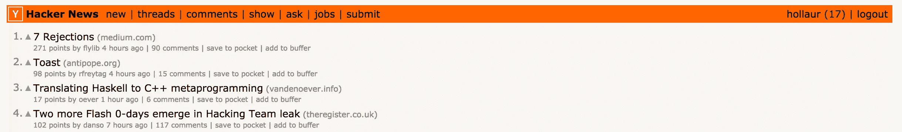
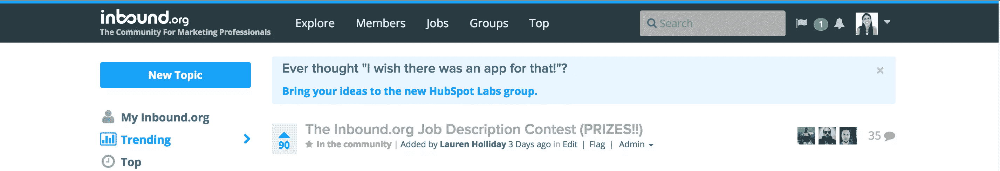
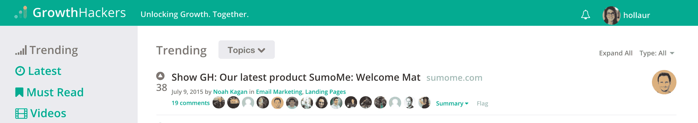
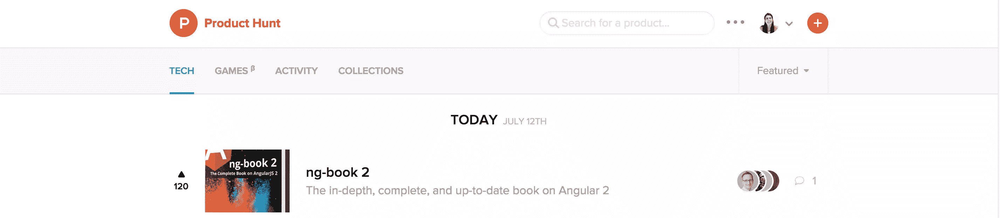
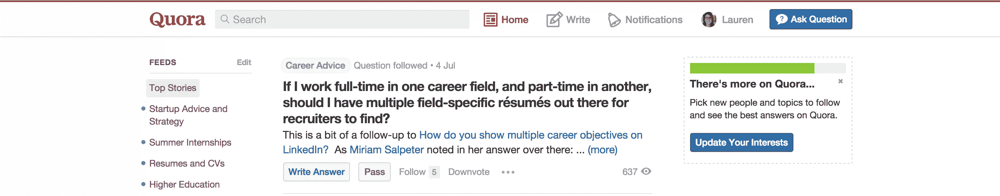

# 企业家在线社区终极指南

> 原文：<https://www.sitepoint.com/the-ultimate-guide-to-online-communities-for-entrepreneurs/>

人类天生就是部落的。与那些自命不凡的海龟不同，我们两足动物会被有相似兴趣、特征和背景的同类所吸引。

幸运的是，这种生物学上的怪癖并没有因为网络空间的匿名性而受挫。现在有难以想象数量的在线社区在你愚蠢的人类头脑中浮动，其中一些可以证明对你的职业生涯是无价的。

但是哪些值得加入呢？

## [黑客新闻(HN)](https://news.ycombinator.com/)

从 2007 年开始，按照互联网的标准，HN 已经是个老人了。但是年龄是仁慈的。HN 社区比以往任何时候都更加敏锐，与它那些充斥着迷因的社交新闻竞争对手形成了可喜的对比。

如果这个网址不是一个显而易见的指标的话，HN 是由创业孵化器 [Y Combinator](http://ycominator.com) 运营的，其设计和八年前差不多。

像 Reddit 一样，HN 是一个社交新闻平台，致力于“任何满足个人求知欲的事情”与 Reddit 不同，它更倾向于文明。

如果你正在开发一个产品或者开始一项业务，HN 是一个接收真实的、建设性的反馈的好地方，同时还能避开网络流氓和危险。

### 总之，如果你符合以下条件，HN 值得加入:

*   寻找一个文明、聪明、乐于助人的思想家和创造者社区。
*   对最新最棒的营销、技术和政治新闻和事件感兴趣。

## [设计师新闻](https://www.designernews.co/)

记得 LayerVault 的请举手。有人吗？

直到今年 4 月，LayerVault 还是一款为设计师提供版本控制的初创应用。Designer News 是它的姐妹网站，当 LayerVault 关门时，金属实验室的创始人 Andrew Wilkinson 买下了 Designer News 并让它继续生存。谢谢安德鲁！

《设计师新闻》之于设计师，就像 Inbound.org 之于营销人员一样，并且采用了与其营销前身相似的格式。或许是受到该网站濒死体验的激励，设计师新闻社区非常文明和热情。用户来自全球各地，使该平台成为各种意见和观点的集散地。

Designer News 非常了解其受众，并为他们提供各种有趣的功能。

例如，一些帖子在包含某个关键词时会收到徽章。曾几何时，提到“扁平化设计”就会自动被贴上“打死马”的标签。

用户还可以通过该网站的浏览器内像素艺术编辑器创建自己的头像。

### 总的来说，如果你符合以下条件,《设计师新闻》值得加入:

*   寻找一个简单的、设计良好的、具有一系列有趣且有用的功能的平台。
*   对最新最棒的设计新闻、技术和讨论感兴趣。
*   希望推广您自己的内容。
*   渴望与一个由乐于助人的同龄人组成的多元化、知识化的社区建立联系。

## [Inbound.org](http://inbound.org/)

在营销人员和营销爱好者聚集的所有虚拟饮水机中，Inbound 独占鳌头。

Inbound 由 Moz 的 Rand Fishkin 和 HubSpot 的 Dharmesh Shah 于 2012 年创立，目前拥有超过 78000 名会员。该网站的格式借鉴了 Reddit 等其他用户管理的平台，允许用户对提交的内容投赞成票或反对票。

它还将帖子分为热门、讨论最多和阅读最多。这使得信息迷很容易找到最引人注目的内容。

此外，有了一个由营销专家组成的社区，Inbound 也是一个提问和讨论的好地方。

作为 Inbound 的一员，你将有机会接触到一大袋巧妙的技巧。这里有几个宝石。(点击[此处](http://inbound.org/post/view/26-things-you-didn-t-know-you-could-do-with-inbound-org)查看完整列表)

*   您可以更改讨论中批注的顺序。
*   你可以把你最喜欢的话题分组放在一个流里。
*   你可以得到一个免费的登陆[页面评论](http://inbound.org/group/the-pit-landing-page-critiques)

### 总之，如果您符合以下条件，Inbound 值得加入:

*   对最新最棒的集客营销新闻、策略和技术感兴趣。
*   希望推广您自己的内容
*   渴望与一个由乐于助人的同龄人组成的多元化、知识化的社区建立联系。

## [成长黑客](https://growthhackers.com/)

早在 2006 年，肖恩·埃利斯就创造了“增长黑客”一词，指的是“结合传统营销和分析技能与产品开发技能，获取并吸引用户”的过程

顾名思义，GrowthHackers 是一个由分享者、学习者、教师和内容制作者组成的社区，他们都对 growth hackers 的艺术感兴趣。

对 GrowthHackers 和 Inbound.org 做一个简单的对比，你会发现两个网站在设计和网站架构方面都非常相似。

像 Inbound 一样，GrowthHackers 基于用户投票系统对其内容进行分类，让你看到什么是趋势，什么是新的。它还为您提供了按主题排序的选项。

关于增长黑客的文章和讨论通常涉及关键的增长黑客工具，如 SEO、CRO、SEM、链接构建和 API 集成。

Growth Hackers 背后的团队坚决反对不道德的增长策略，并努力建立一个由依赖白帽增长黑客流程的实验营销人员组成的前瞻性社区。

### 总之，如果你符合以下条件，GrowthHackers 值得加入:

*   寻找一个实验营销人员的智能社区。
*   对抗黑帽黑客。
*   感兴趣的最新和最大的增长黑客新闻，技术和讨论。

## [产品搜寻](http://www.producthunt.com/)

LinkyDink 上的一个小型链接分享小组迅速成长为产品爱好者和制造商的互联网首选目的地。

每天，Product Hunt 都会分享一批最具创新性的产品，并邀请用户投票和评论。为了防止垃圾邮件，燃烧和乏味的内容，你必须由社区成员邀请，然后才能提交和评论。

由于网站的封闭性，产品搜索有时会像一个回音室，缺少不同的人和意见。

然而，总的来说，这个网站充满了一个蓬勃发展的社区，他们渴望解决一切问题，从教女孩编程的友谊手镯到创业记者的 T2 搜索引擎。

值得注意的是，产品搜索并不是销售你自己产品的最佳场所。

虽然像[shut up 和 TakeMyMoney](http://shutupandtakemymoney.com/) 这样的网站更多地迎合了你的日常网上购物者，但初创公司和企业家构成了产品搜索的大部分受众。

因此，虽然让你的产品参与产品搜索可能在短期内对你的销售没有太大帮助，但这是吸引有影响力的人和潜在利益相关者注意的好方法。

### 总的来说，如果你符合以下条件，那么产品搜索是值得加入的:

*   对最新最好的产品感兴趣。
*   寻求吸引潜在的利益相关者。
*   渴望与知识渊博、专注于创业的用户社区建立联系。
*   搜索对你的产品的反馈。

## [创业要求](http://www.requestsforstartups.com/)

尽管这是一份时事通讯，而不是留言板，但《创业需求》( RFS)就像是寻找创意的产品。

RFS 的订阅者每周都会收到一份由投资者、公司和有影响力的人精心策划的时事通讯。

是的，真正的风险投资家使用 RFS 告诉世界他们想投资什么。

例如，在最近的一篇时事通讯中，帝国天使的克里斯蒂娜·贝克霍尔德写道，她对“那些专注于从互联和可穿戴设备中获取大量数据并将其转化为可操作的见解的公司”感到特别兴奋

她继续写道，“我还没有找到一个完美的工具或工具集来跟踪、分析和利用我的个人和职业网络来帮助自己和他人。”她引用了像 [Refresh](https://www.linkedin.com/company/refresh-inc-) 这样的应用程序和像 [Evercontact](http://www.evercontact.com/) 这样的插件作为接近她所寻找的产品，但最终还是失败了。

给你什么建议吗？

### 总之，如果您符合以下条件，RFS 是值得加入的:

*   寻找风险资本家有兴趣投资的创业想法。
*   对创业社区的趋势感兴趣。
*   了解关键投资者和有影响力的人。

## [Quora](https://www.quora.com)

如果你曾经在谷歌上输入过一个问题，Quora 的搜索结果很可能会出现在第一页。

Quora 是一个问答网站，以专业建议和外交用户互动为荣。像大多数经历快速增长的社区一样，Quora 在过去几年中质量有所下降，但它仍然是企业家的无价资源。

这部分是因为每天都有很多受人尊敬的主题专家为 Quora 做贡献。一些更知名的用户是美国在线的联合创始人史蒂夫·凯斯、脸书的联合创始人达斯汀·莫斯科维茨和维基百科的联合创始人吉米·多纳尔·威尔士。

Quora 还要求用户实名注册。这有助于防止垃圾邮件、多个帐户和钓鱼。由于他们的名字在网上，用户对他们写的东西采取了更深思熟虑的方法，因为它很容易回来咬他们。

### 总之，如果你符合以下条件，Quora 是值得加入的:

*   从负责任的专家社区寻求建议、见解或反馈。
*   有兴趣与知名行业领袖交流。
*   舒适地使用你的真实身份，以及随之而来的责任。

## [站点点的版本](https://www.sitepoint.com/versioning)

如果我们没有包括版本控制，这将是不负责任的。

去年，SitePoint 创办了一份名为“版本控制”的时事通讯，汇集了当天最重要的链接。它很受欢迎，截止到今天已经有超过 10，000 人注册了。

时事通讯的成功促使一些 SitePoint 人员将版本控制提升到一个新的水平。本月早些时候，他们推出了版本控制社区:“一个让善良的网民分享不可思议的互联网事物的地方。”跳出来分享你发现的东西或你制作的东西，仔细阅读大量的新链接，或者只是和你的用户朋友们一起玩。

总之，如果您符合以下条件，版本控制是值得加入的:

*   寻找一个新的社区的分享者和制造者，但尚未被时间的蹂躏所玷污。
*   搜寻 web 开发、web 设计和市场营销领域的趋势。
*   对提供反馈感兴趣，以使社区变得更好。

## 结论

无论你渴望得到反馈、精神刺激还是低调的内容，这七个社区中的一个将提供一个出口。

与你所在领域的其他人互动有助于拓宽你的思维，让你适应新的机遇。

你会学到新的策略，遇到优秀的人，对你所在的行业有更细致入微的了解，以及你适合做什么。

#### 让我们把评论变成投票…这些社区中你最喜欢哪一个，为什么？！请在下面的评论中告诉我们。

## 分享这篇文章