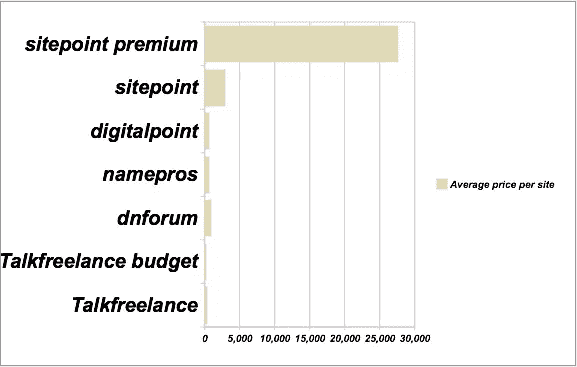

# 价值 1 亿美元的网络秘密经济

> 原文：<https://www.sitepoint.com/the-webs-100-million-secret-economy/>

 **在一个 2008 年将达到 1 亿美元的市场中，[的 SitePoint Marketplace](https://www.sitepoint.com/marketplace/) 已经独立排名为网络房地产买卖的头号来源。**

乔恩·惠特利已经开始制作[关于一些更活跃的在线市场上销售的网站平均价格的月度统计数据](http://www.j0n.org/2008/02/25/marketplace-stats-february/):

> 我开发了一个脚本，抓取一些最活跃的网站市场的内容，并抓取每笔出售的网络资产的销售价格。然后我利用这些信息创造了一些平均数字。

惠特利比较了网站市场的平均标价和总交易额，SitePoint Marketplace 的排名**比其最接近的竞争对手**高出 900%。

分析显示，sitepoint.com 在 2 月份的 495 次单独拍卖中，总共有价值 3，911，992 美元的物品，每次拍卖的平均价格为 7903 美元，而第二大竞争对手为 805.73 美元。事实上，仅在二月份，SitePoint Marketplace 的挂牌价就高达 390 万美元，超过了所有其他竞争对手的总和。

如果你还没有开始涉足网上房地产，这是最好的时机去阅读和尝试一下。

## 分享这篇文章