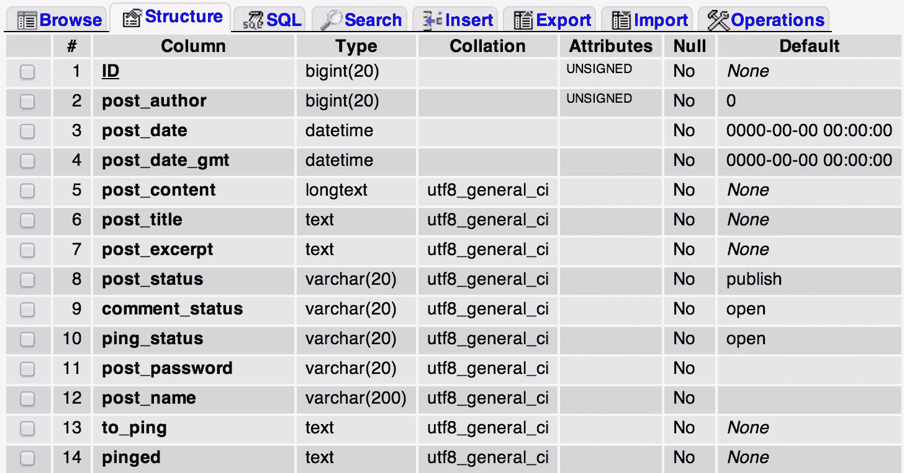

# 去神秘化的 WordPress 数据库

> 原文：<https://www.sitepoint.com/the-wordpress-database-demystified/>

自从十多年前发布以来，WordPress 已经成为初学者和专家最受欢迎的 CMS 选择。虽然 WordPress 的安装和数据的添加不需要任何底层结构的知识，但是你可能[会发现自己处于一种需要一些数据库知识的情况下](https://wordpress.org/support/topic/sql-table-structure)。



虽然用户在使用数据库时最喜欢的选择通常是 phpMyAdmin，但是我们将把重点放在原始 SQL 查询上，请记住，每个人可能都不习惯使用 phpMyAdmin(在 phpMyAdmin 中，您也可以选择运行原始 SQL 查询！).

## 探索数据库

你可能知道，WordPress 使用 MySQL。要登录 MySQL，请在您的终端中运行以下命令:

```
mysql -u [username] -p -D [database_name] 
```

一旦您登录到 MySQL 中的 WordPress 数据库，您就可以通过运行以下命令来检查 WordPress 创建的表:

```
show tables; 
```

要检查任何表的结构，请运行:

```
desc [table_name]; 
```

请注意，我将描述 WordPress 在全新安装时创建的表格。安装新的插件可能会创建新的表格，我不会在这篇文章中讨论。

另外，我将假设您的表前缀是“wp *”。如果您使用了不同的表前缀，请在表名中用您的前缀替换“wp* ”。

我将按照逻辑顺序解释这些表格，而不是按照大多数教程中的字母顺序。

### wp _ 选项

`wp_options`表格存储了你的 WordPress 站点的所有设置，比如标题、标语和时区。您在仪表板的设置中设置的所有选项都存储在此表中。

### WP _ 用户，WP _ 用户元

顾名思义，`wp_users`存储了你的 WordPress 站点上所有注册用户的列表。它包含用户的基本信息，如登录、密码(加密)、电子邮件、注册时间、显示名称、状态和激活密钥(如果需要)。

`wp_usermeta`存储用户的元数据(或“关于数据的数据”)。例如，用户的`last_name`保存在`wp_usermeta`表中，而不是`wp_users`表中。

这个表中有两个字段您应该知道— `meta_key`和`meta_value`。插件可以通过使用新的`meta_key`值在元表中存储关于用户的自定义元数据值。

### wp _ posts，wp_postmeta

`wp_posts`存储您网站的所有帖子相关数据。所有的文章(和页面)以及它们的修改都可以在`wp_posts`表中找到。甚至导航菜单项也存储在该表中。

条目的类型(文章、页面、菜单项或修订)通过表格中的`post_type`栏来区分。在这篇文章的后面，我们将看到如何利用这个表中的查询。

`wp_postmeta`，就像用户元数据表一样，包含了关于帖子的元数据。

如果你使用 SEO 插件，所有为文章生成的元标签数据都存储在这个表中。

### WP _ 术语，WP _ 术语 _ 关系，WP _ 术语 _ 分类

文章、页面或链接的类别和标签存储在表`wp_terms`中。该表包含的一列是一个`slug`——它是一个唯一标识术语的字符串，因此在术语的 URL 中使用。这有助于搜索引擎优化，因为谷歌机器人也搜索搜索词的网址。

将这些术语链接到对象(帖子、页面或链接)。它充当这些对象和术语之间的映射。

`wp_term_taxonomy`详细描述术语。为了简单起见，你可以把它想象成术语的元数据，只是插件不能把自定义值添加到这个表中。

### wp_comments，wp_commentmeta

`wp_comments`存储您帖子和页面上的评论。此表还包含未批准的注释以及关于注释作者和注释嵌套的信息。`wp_commentmeta`包含关于评论的元数据。

需要注意的一点是，如果你使用的是第三方评论系统，比如 [Disqus](https://disqus.com/) ，你的评论不会存储在你的 WordPress 数据库中，而是存储在评论服务的服务器中。

### wp _ 链接

此表包含有关添加到您的站点的自定义链接的信息。它已被弃用，但可以通过使用[链接管理器](https://wordpress.org/extend/plugins/link-manager/)插件再次启用。

这是数据库的图形视图，表之间相互链接。


来源:【WordPress.org】T2

## 利用 SQL 为您带来优势

结构化查询语言(SQL)是一种计算机语言，用于管理关系数据库管理系统(如 MySQL)中的数据。您可以使用 SQL 从数据库表中检索或操作数据。我们将尝试使用一些查询来帮助我们完成某些任务，否则用 WordPress 仪表盘很难或不可能完成这些任务。

#### 提醒一句

如果您计划执行我将要讨论的 SQL 查询，您应该知道它们所做的更改是不可逆的。因此，你必须使用`BEGIN`、`COMMIT`和`ROLLBACK`。

如果您在执行 a 命令之前`BEGIN`了一个会话，那么您总是可以通过使用`ROLLBACK`返回到该命令之前的状态。

```
BEGIN;
// Some Query
ROLLBACK; 
```

然而，如果你想保持这些改变，你可以`COMMIT`这些改变，它们会变成永久的。

```
BEGIN;
// Some Query
COMMIT; 
```

在运行这些命令之前，你也可以使用数据库转储或者像 [DB Backup](https://wordpress.org/plugins/wp-db-backup/) 这样的插件来备份你的 WordPress 数据库。

现在，让我们来看看一些可以让我们的工作变得更简单的技巧。

### 更改默认用户名

你可能知道一旦你创建了一个用户，WordPress 不允许你改变用户名。但是，您可以通过运行一个简单的命令，通过 SQL 来实现这一点。

```
UPDATE wp_users SET user_login = '[new_username]' WHERE user_login = '[old_username]'; 
```

WordPress 中默认的管理员用户名是“admin ”,由于它的流行，黑客们经常使用这个用户名。出于安全考虑，建议将其更改为其他名称。

更新:这在撰写本文时有效，但在最近的更新中无效。更多信息请见下面的评论。

### 更改你的 WordPress 密码

假设你是管理员，你忘记了你的密码。如果您可以访问数据库，您可以很容易地更改它。

```
UPDATE wp_users SET user_pass = MD5( '[new_password]' ) WHERE user_login = '[username]'; 
```

我们需要使用`MD5`,因为密码不是以明文格式存储的，而是加密的。

### 批量更改帖子作者

如果您想将文章从一个作者转移到另一个作者，您可以用一个简单的 SQL 查询来尝试。

```
UPDATE wp_posts SET post_author = [new_author_id] WHERE post_author = [old_author_id]; 
```

你需要首先从`wp_users`表中检查作者的`ID`。但是，如果你很懒，你可以试试这个查询，它看起来很复杂，但是不需要你检查作者 ID。

```
UPDATE
    wp_posts
SET
    post_author = (SELECT ID FROM wp_users WHERE user_login = '[new_author_login]')
WHERE
    post_author = (SELECT ID FROM wp_users WHERE user_login = '[old_author_login]'); 
```

### 处理垃圾评论

如果你不使用外部服务来处理评论，你很可能会收到很多垃圾评论。如果你有很多垃圾邮件，你可以尝试使用 [Akismet](https://akismet.com/) 来检查垃圾邮件。但是，如果您已经有大量垃圾邮件，您可以尝试对它们进行一些 SQL 查询。

您可以使用以下方法一次性删除所有垃圾邮件评论:

```
DELETE FROM wp_comments WHERE comment_approved = 'spam'; 
```

如果你想检查垃圾评论的来源，你可以试试这个:

```
SELECT   comment_author_IP as ip_address, COUNT(*) AS count 
FROM     wp_comments
WHERE    comment_approved = 'spam'
GROUP BY ip_address 
ORDER BY count DESC 
```

它会给你一个列表，显示每个 IP 地址有多少垃圾评论。

### 删除所有帖子修订

正如我之前解释的，每当你点击“保存”时，`wp_posts`就会保存文章的当前版本。因此，如果你在写文章的时候点击了十次“保存”,那么你的数据库中就会有十次重复的文章。所有修订版都有`post_type`作为“修订版”。

如果您想知道到目前为止已经生成了多少个修订，请运行以下命令。我确信这个数字会很大。

```
SELECT COUNT(*) FROM wp_posts WHERE post_type = 'revision'; 
```

如果要删除已发布帖子的所有此类修订，请运行以下命令:

```
DELETE p, t, m FROM wp_posts p
LEFT JOIN wp_term_relationships t ON (p.ID = t.object_id)
LEFT JOIN wp_postmeta m ON (p.ID = m.post_id)
WHERE p.post_type = 'revision' 
```

我使用`LEFT JOIN`的原因是为了移除元数据及其与标签和类别的联系。

### 更新帖子中的链接

如果你要迁移到一个新的域名，很可能你的帖子里有很多链接，链接到你的旧域名。手动更改它们可能是一项乏味的工作。然而，一个简单的 SQL 命令可以用于此目的。

```
UPDATE wp_posts SET post_content = REPLACE (post_content, '[old_domain]', '[new_domain]'); 
```

该查询在表的`post_content`列中搜索旧域的出现，并用新域替换它们。

## 结论

至此，本教程到此结束。我们希望这篇文章能改变你对 WordPress 后台工作方式的看法，并帮助你对数据库结构有更清晰的理解。即使现在什么都有插件，你在安装它们之前也应该三思，尤其是当你有一个更简单更快捷的选择的时候。

你还知道 WordPress 的其他 SQL 技巧吗？我们错过了什么重要的事情吗？请在下面的评论中告诉我们吧！

## 分享这篇文章