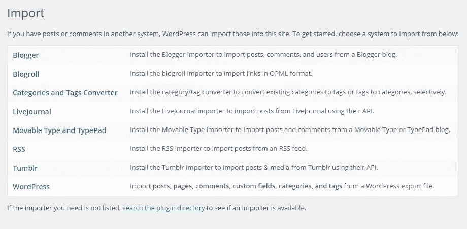
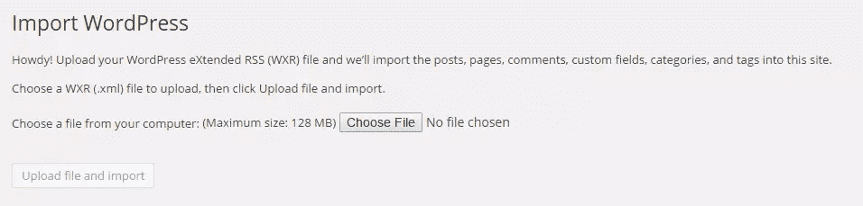
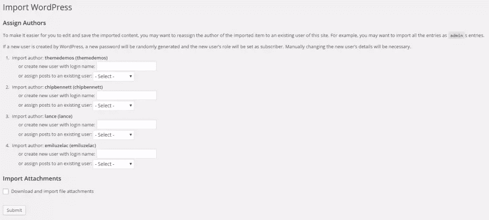
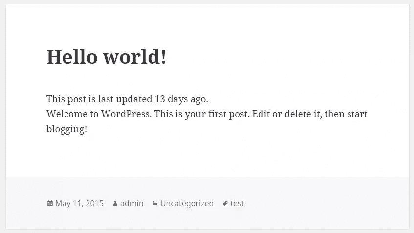
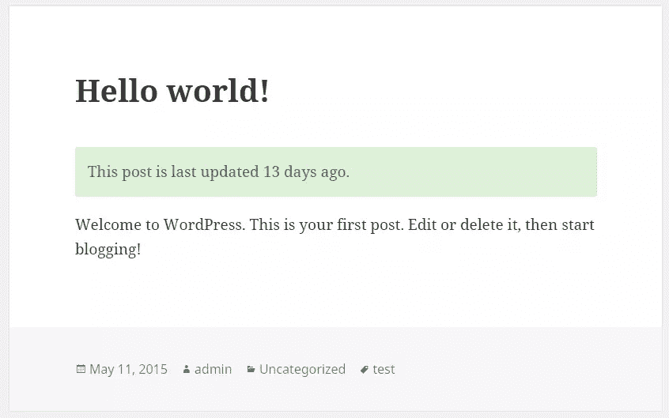
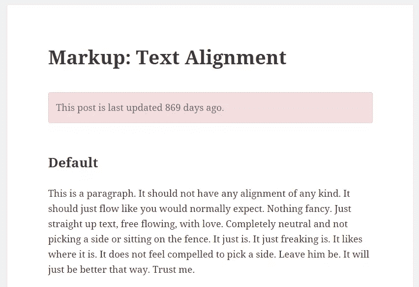

# WordPress 插件样板文件第 3 部分:最后的步骤

> 原文：<https://www.sitepoint.com/the-wordpress-plugin-boilerplate-part-3-the-last-steps/>

在本系列的第二部分，我们为插件准备了简单的面向管理员的功能。我们为用户提供了一个选项页面，他们可以根据自己的喜好调整插件。

如果您错过了第 1 和第 2 部分，请在下面找到它们:

*   第 1 部分:使用 WordPress 插件样板加速开发
*   第 2 部分:开发一个 WordPress 插件

对于本文，我们将实现插件的面向公众的功能。这意味着我们将检索用户偏好，确定该特定帖子是否过期，并相应地在其单个帖子视图上显示通知。我们开始吧！

## 准备主题

我们需要准备我们的主题，以便我们可以稍后测试它。我们将使用 WordPress 默认附带的[Twenty fifth](https://wordpress.org/themes/twentyfifteen/)主题。我们将使用主题评审团队提供的[主题单元测试数据](https://codex.wordpress.org/Theme_Unit_Test)来填充帖子，而不是手工填充帖子。

我们需要下载上面的 Codex 页面上提供的`theme-unit-test-data.xml`,并将其导入到我们的 WordPress 安装中。WordPress 内置的导入功能可以通过从侧边栏导航到工具>导入找到。



我们将看到各种选择，因为我们正在导入 WordPress 导出文件，所以我们将选择 WordPress。根据 WordPress 的安装，如果我们没有安装 WordPress 导入器插件，将会显示一个插件弹出窗口。如果你还没有插件，先安装它，一旦完成，我们将继续实际的导入过程。



这是默认的 WordPress 导入页面，所以我们需要选择之前下载的`theme-unit-test-data.xml`,然后点击“上传文件并导入”按钮。



然后将出现第二个屏幕。不要太担心“分配作者”部分，因为我们可以将其保留为默认设置。在“导入附件”部分，确保勾选“下载并导入文件附件”复选框，这样所有外部附件都将被下载并导入到媒体库。

按下“提交”按钮，等待导入过程成功完成。

现在我们准备编写显示通知的代码。

## 钩住`the_content`过滤器

使用`the_content`过滤器是改变显示给用户的帖子内容的最佳方式。按照之前的教程，我们将把钩子添加到样板类加载器中，唯一的不同是将使用`define_public_hooks`方法代替`define_admin_hooks`。

将这行代码添加到方法中:

```
$this->loader->add_action( 'the_content', $plugin_public, 'the_content' );
```

这意味着，我们需要在我们的`Outdated_Notice_Public`类中实现一个公共的`the_content`方法。打开`public/class-outdated-notice-public.php`并对其进行相应的修改。

### 有条件地修改内容

因为`the_content`过滤器被各种插件使用，以及内部的 WordPress 核心，我们需要谨慎的将我们的自定义内容插入其中。

我们需要确保我们只在显示单个帖子时插入过时的通知文本，而不是在博客帖子索引上。为了做到这一点，我们可以使用 [`is_main_query`](https://codex.wordpress.org/Function_Reference/is_main_query) 函数对其进行过滤。每当我们需要确定正在运行的查询是主查询还是辅助/自定义查询时，这个函数就非常有用。

我们需要考虑的另一件事是，我们将只为帖子类型`post`的单个视图显示通知文本，因此`is_singular( 'post' )`验证将非常适合这项工作。

这是包含在`Outdated_Notice_Public`类中的更新后的`the_content`方法。

```
public function the_content( $post_content ) {

		if ( is_main_query() && is_singular('post') ) {
			// do something
		}

        return $post_content;
	}
```

### 计算天数差

在我们开始之前，让我们将通知的位置设置为显示在帖子的“前面”，并将天数阈值设置为 30。

首先，我们需要检索插件的存储设置。 [`get_option`](https://codex.wordpress.org/Function_Reference/get_option) 函数将完成这项工作，为了安全起见，我们将传递一个默认值作为第二个参数给`get_option`。

```
$position  = get_option( 'outdated_notice_position', 'before' );
	$days      = (int) get_option( 'outdated_notice_day', 0 );
```

为了计算当前时间和 post 最后修改时间之间的天数差，我们将实例化两个`DateTime`对象。我们可以使用内置在`DateTime`类中的`diff`方法来精确测量时差。注意`DateTime`类只在 PHP > = 5.3.0 上可用。

```
$date_now  = new DateTime( current_time('mysql') );
	$date_old  = new DateTime( get_the_modified_time('Y-m-d H:i:s') );
	$date_diff = $date_old->diff( $date_now );
```

`$date_diff`是 [`DateInterval`](https://php.net/manual/en/class.dateinterval.php) 类的一个实例，所以我们将有一系列关于时差的可用数据。如果我们要对变量`$date_diff`进行`var_dump`，这就是我们应该得到的结果，这取决于你当前正在查看的帖子。

```
object(DateInterval)#286 (8) {
	  ["y"]=>
	  int(0)
	  ["m"]=>
	  int(0)
	  ["d"]=>
	  int(12)
	  ["h"]=>
	  int(23)
	  ["i"]=>
	  int(17)
	  ["s"]=>
	  int(22)
	  ["invert"]=>
	  int(0)
	  ["days"]=>
	  int(12)
	}
```

我们只对`days`值感兴趣，因为它将用于与我们的天数阈值进行比较。正如我之前说过的，我们将比较它们，这样我们就可以将特定的类应用到我们的 notice `div`元素中，以在不同的帖子之间设置不同的样式。

```
if ( $date_diff->days > $days ) {
		$class = 'is-outdated';
	} else {
		$class = 'is-fresh';
	}
```

这个简单的比较块足以决定为我们的`div`使用哪个类。现在唯一剩下的事情就是实际构建要添加到文章内容中的 HTML。

为了更好地翻译文本，我们将使用 [`_n`](https://codex.wordpress.org/Function_Reference/_n) 功能，根据帖子上次更新后的天数，有选择地选择合适的文本。然后，我们将把通知文本包装在它自己的`div`中，以便我们可以稍后对其进行样式化。请随意调整通知文本，使其符合您的喜好。

```
// Filter the text
	$notice = sprintf(
				_n(
					'This post was last updated %s day ago.',
					'This post was last updated %s days ago.',
					$date_diff->days,
					'outdated-notice'
				),
				$date_diff->days
			);

	// Add the class
	$notice = '<div class="outdated-notice %s">' . $notice . '</div>';
	$notice = sprintf( $notice, $class );
```

`$notice`变量现在应该包含我们将要插入到文章内容中的标记。剩下唯一要做的就是把它加进去。

```
if ( 'after' == $position ) {
		$post_content .= $notice;
	} else {
		$post_content = $notice . $post_content;
	}
```

概括地说，这就是`Outdated_Notice_Public`中的`the_content`方法最终的样子。

```
public function the_content( $post_content ) {

		if ( is_main_query() && is_singular('post') ) {
			$position  = get_option( 'outdated_notice_position', 'before' );
			$days      = (int) get_option( 'outdated_notice_day', 0 );
			$date_now  = new DateTime( current_time('mysql') );
			$date_old  = new DateTime( get_the_modified_time('Y-m-d H:i:s') );
			$date_diff = $date_old->diff( $date_now );

			if ( $date_diff->days > $days ) {
				$class = 'is-outdated';
			} else {
				$class = 'is-fresh';
			}

			// Filter the text
			$notice = sprintf(
						_n(
							'This post was last updated %s day ago.',
							'This post was last updated %s days ago.',
							$date_diff->days,
							'outdated-notice'
						),
						$date_diff->days
					);

			// Add the class
			$notice = '<div class="outdated-notice %s">' . $notice . '</div>';
			$notice = sprintf( $notice, $class );

			if ( 'after' == $position ) {
				$post_content .= $notice;
			} else {
				$post_content = $notice . $post_content;
			}
		}

        return $post_content;
	}
```

试着浏览几页，看看我们的插件是否如预期的那样工作。这是我在 url `<site-url>/2015/05/11/hello-world/`上浏览“Hello World”帖子时看到的内容。



## 设置通知文本的样式

我们将对`.outdated-notice` div 应用一些简单的样式，这将与整体主题设计很好地匹配，而不会造成干扰。为了做到这一点，我们不打算改变已经使用的字体大小或字体系列。另外，我们现在将借用[引导配色方案和样式](http://getbootstrap.com/components/#alerts)。

打开包含在`public/css`文件夹中的`outdated-notice-public.css`文件，并添加这条规则。

```
.outdated-notice {
	    border: 1px solid transparent;
	    border-radius: 4px;
	    margin-bottom: 20px;
	    padding: 15px;
	}
```

我们还需要两种不同的风格来代表后清新，一种风格用于`.is-fresh`，另一种用于`.is-outdated`。这个代码片段应该可以完成这个任务，给我们一个漂亮的绿色配色方案来显示一篇新文章，给一篇过时的文章提供一个红色配色方案。

```
.outdated-notice.is-fresh {
	    background-color: #dff0d8;
	    border-color: #d6e9c6;
	    color: #3c763d;
	}

	.outdated-notice.is-outdated {
	    background-color: #f2dede;
	    border-color: #ebccd1;
	    color: #a94442;
	}
```

让我们刷新文章视图，看看它是如何设计的。新帖子和过时帖子的示例:





就是这样！我们现在有了基于 WordPress 插件样板开发的全功能插件。

## 丰富

在我们目前所做的基础上，有很多事情可以改进。其中包括:

*   不同上下文的动态文本，在这里我们可以为过时的通知使用不同的文本。
*   由于未使用脚本`outdated-notice-public.js`,请删除其入队。
*   可忽略的通知，以便它不会中断用户阅读帖子时的体验。

## 结论

WordPress 插件样板为从头开发任何插件提供了一个完美的起点。在这个系列的最后一部分，我们开发了插件的面向公众的功能。这些修改虽然非常简单，但是在很短的时间内就完成了，同时仍然保持由样板文件本身建立的 OOP 模式，并遵循标准和最佳实践。

像往常一样，在 [GitHub](https://github.com/fsylum/outdated-notice/tree/part-3) 的`part-3`分支上可以获得完整的代码副本。

## 分享这篇文章