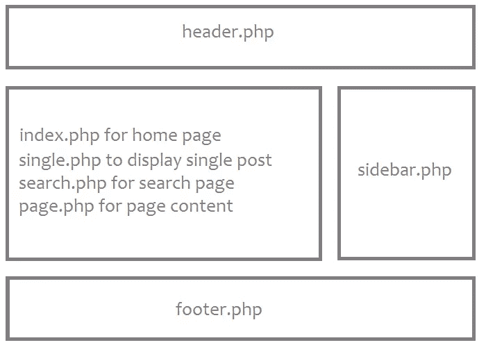
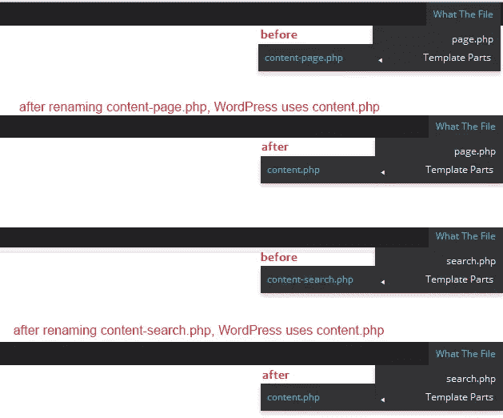

# WordPress 模板层次结构

> 原文：<https://www.sitepoint.com/the-wordpress-template-hierarchy/>

WordPress 主题允许你改变网站的设计，提供对外观和感觉的控制。它们本质上是不同模板文件的集合，这些模板文件一起工作并产生网站的整体设计。

在你深入 WordPress 主题之前，重要的是你要了解 WordPress 是如何运作的，以及你的网站的不同页面是如何创建的。WordPress 与数据库交互来存储你的内容。这意味着每当你创建一个新的帖子或页面时，你的帖子或页面的内容都保存在数据库中，只有当访问者要求特定内容时，它才会使用模板显示出来。

WordPress 主题是 WordPress 用来显示数据库内容的模板(CSS 和 PHP 文件)的集合。WordPress 将在一个主题中寻找文件，用于以特定的顺序呈现当前页面。这被称为“模板层级”，用于创建和扩展 WordPress 主题。

WordPress 主题决定了你的内容应该如何在你的网站上显示。WordPress 中的模板是一个单独的文件，它决定了一个特定的页面或一组页面在你的网站前端是什么样子。当你改变你的主题时，你是在改变内容的显示方式，而不是改变内容本身。

WordPress 主题使用不同的模板文件来生成一个完整的网页。例如，当你访问一个 WordPress 网站时，你实际上可以看到多个不同的模板文件组合在一起创建一个完整的页面。

例如，如果你查看一个索引页面，比如一个博客的首页，你通常会看到一个由`header.php`模板创建的标题，由`index.php`创建的内容，由`sidebar.php`创建的侧边栏和由`footer.php`创建的页脚

。

然而，如果你访问一个单独的页面，你仍然会看到相同的标题，相同的侧边栏和相同的页脚，但是内容将由`single.php`创建。问题是，您如何知道这些模板文件中的哪一个起作用，以及在什么时候起作用？这就是 WordPress 模板层次的由来。

WordPress 模板层次结构决定了你的模板文件在你的 WordPress 主题中的加载顺序。WordPress 搜索这些文件，以决定如何加载你的网站。

如果你打开“Twenty fifth”(WordPress 默认主题之一)主题文件夹，会有超过 15 个模板文件。这些包括 404 的模板文件，存档，作者简介，评论和内容链接等等。WordPress 将使用网站上每个链接中包含的[查询字符串](http://codex.wordpress.org/Glossary#Query_String)信息来决定使用哪个模板或哪组模板来显示页面。

WordPress 决定被请求的页面类型(例如搜索页面、分类页面或主页),然后选择 WordPress 模板层次结构建议的合适模板来生成内容。

## 命名约定

WordPress 有一个与主题文件相关的特殊和严格的命名约定，所以所有的主题在后端共享一个相当常见的命名文件集。例如，为了轻松管理您的内容，您可以创建`header.php`和`footer.php`文件。这些模板文件必须命名为`header.php`和`footer.php`。

WordPress 在当前主题的目录中寻找具有特定名称的模板文件，以决定使用哪个模板，通常使用第一个匹配的模板文件。如果 WordPress 找不到具有匹配名称的模板文件，它会跳到层次结构中的下一个文件名。如果 WordPress 找不到任何匹配的模板文件，它将使用 index.php(主题的主页模板文件)。

因此，当您编辑模板文件时，您必须考虑的是这是什么类型的内容，然后编辑适合该类型内容的模板文件。这同样适用于你从头开始创建 WordPress 主题的时候。

## 最低主题要求

WordPress 主题需要的唯一文件是`index.php`和`style.css`。`index.php`是主要的也是唯一的文件，它将处理每个 WordPress 查询，以及站点的结构。

WordPress 主题运行并在 WordPress 仪表盘中可见以激活所需的最少文件是`index.php`和`style.css`。

如果`index.php`或`style.css`丢失，您将看到以下错误。

下列主题已安装，但不完整。主题必须有一个样式表和一个模板。

*   `style.css`(必需)

*   `index.php`(必需)

*   `functions.php` (optional)

*   `screenshot.png` (optional)

这种分离大大提高了效率。将所有内容合并成一个大文件`index.php`在技术上可能可行，但这并不美观，而且会导致无穷无尽的问题。此外，编辑一个主题将是一场噩梦！

这是 WordPress 识别的主题文件列表。

*   `style.css`

*   `rtl.css`

*   `index.php`

*   `comments.php`

*   `front-page.php`

*   `single.php`

*   `page.php`

*   `author.php`

*   `archive.php`

还有许多其他文件，您可以查看模板文件列表了解更多详细信息。

## 215 模板层次结构示例

假设您已经激活了 Twenty Fifteen 主题，一个用户访问了页面`yoursite.com/author/tahir/`。首先，WordPress 将搜索标签为`author-tahir.php`的模板，但是`author-tahir.php`不可用。然后 WordPress 会寻找`author.php`，如果它也不存在，它会寻找`archive.php`。该文件在 2015 主题中可用。如果你删除或重命名`archive.php`，那么 WordPress 将使用`index.php`来呈现页面。

每当用户访问你的网站时，WordPress 会在模板层次结构中向上移动，直到找到匹配的模板文件。这与这些文件的命名方式密切相关。

## “什么文件”插件

要找出 WordPress 使用什么文件和模板来显示你当前正在查看的页面内容，你可以使用非常方便的[什么文件插件](https://wordpress.org/plugins/what-the-file/)。这是一个由 Barry Kooij 开发的免费插件。

这个插件给你的工具栏增加了一个选项，显示正在使用的文件和模板。我在我的本地服务器上安装了“什么文件插件”进行测试，发现它工作得很好。

为了测试当一个特定的文件不可用时 WordPress 使用哪个文件，我重命名了两个文件(在 2015 主题中)。在下面的截图中，你可以看到 WordPress 使用哪些文件来显示内容。

你可以看到 Twenty Fifteen 主题使用了`content-search.php`文件来显示搜索结果。如果你删除或重命名`content-search.php`，WordPress 将使用`content.php`来显示搜索结果。

“什么文件”插件也允许你直接点击文件名，通过主题编辑器进行编辑。这个插件需要 WordPress 3.1 或更高版本，在 WordPress 4.1 上也能正常工作。

## 有用的资源

如果你有兴趣学习更多关于 WordPress 模板层次和主题开发的知识，我推荐以下资源:

*   命名 WordPress 主题文件夹和文件的指南

*   [模板文件列表](http://codex.wordpress.org/Theme_Development#Template_Files_List)

*   模板层次结构

*   [进入模板](http://codex.wordpress.org/Stepping_Into_Templates)

*   【WordPress 主题开发入门

## 分享这篇文章