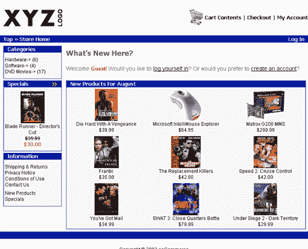
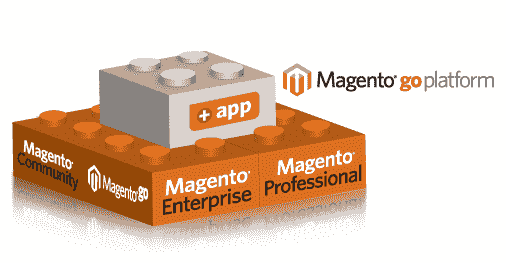
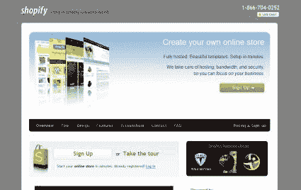
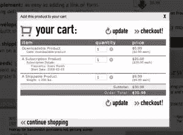
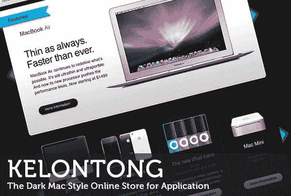

# 电子商务解决方案的世界:为您的业务简化

> 原文：<https://www.sitepoint.com/the-world-of-ecommerce-solutions-simplified-for-your-business/>

为企业选择一个好的托管电子商务解决方案并不容易。这些解决方案可以分为三类:开源、预托管和付费解决方案，以及 CMS 的电子商务模块。

# 开源电子商务解决方案

## A.osCommerce

osCommerce 所基于的原则与 Zen Cart 和 CRE Loaded 所使用的原则相同。用户可能会发现 osCommerce 易于使用，比 Zen Cart 和 CRE Loaded 简单得多。操作也很流畅，只能作为基本的购物车使用。选择 osCommerce 的一个优势是可以获得大量的贡献和升级。还有一个像样的安全措施，与 MySQL 5 和 PHP 5 不相上下。如果寻求大量捐款，总开支可能会膨胀。然而，缺少图形模板可能会给采用新设计带来问题。维护 osCommerce 购物车解决方案的成本因素与收益非常平衡，可以维持在非常低的水平。对于那些刚刚起步，并且正在努力为自己赢得一个名字的创业公司来说，这将是一个理想的选择。

osCommerce 提供的 SEO 服务是合理的，但是 osCommerce 基础版没有这些功能。即使是 osCommerce 基础版中使用的长 URL，对于 SEO 来说也往往是不合理的，这迟早会困扰一个商家。

## B.Magento 和 Magento 去

Magento 如今在电子商务解决方案领域占据主导地位。Magento 也是在开源的 lisense 下建立的，比如 osCommerce。使用开源 lisense 的目的是任何人都可以修改和编辑源代码，但必须遵守许可证中规定的准则。下载和使用 Magento 是免费的，但 Magento Go 可以在付费后购买。Magento 采用的开发时间表也令人印象深刻，可能会被证明是一项资产。Magento 平台上有很多定制功能，但是使用它们并不容易。许多使用普通系统的用户抱怨他们的系统在访问该解决方案时变得没有响应。

Magento development 是目前电子商务行业首选的解决方案之一，Magento 用户的数量也在增长。Magento 社区的增长部分是因为它比其他电子商务解决方案相对较新。现在几乎有 2000 个商家在使用这个平台，这说明了它在用户中的受欢迎程度。Magento 是 Varien 的一个解决方案，在被开发为自己的解决方案之前，它更早使用 osCommerce。Magento Go 中的实时购物车是一个非常有用的功能，通过它还可以委托材料管理过程，从而为初创公司节省更多资金。

## C.禅宗车

Zen Cart 是从 osCommerce 平台本身演变而来的。该解决方案是在 GPL 下许可的，这使得每个人都可以免费获得。模板和其他一些功能是 osCommerce 和 Zen Cart 的唯一区别。与 osCommerce 和 Magento 相比，创建和定制模板以使其独一无二相对容易。

在 Zen Cart 的插件部分，大约有 1000 个免费的插件可供消费者使用。然而，为了不让顾客感到迷惑，这些额外的选项可以被忽略。这只是表明，被这些电子商务解决方案提供的大量信息淹没可能会诱使你选择一个普通的解决方案。

皮肤模板是合适的，但过多的选项窒息了用户界面，很容易混淆电子商务网站的新访客。禅宗车的论坛是好的，但建设性地接受批评的能力似乎是缺失的。运营这个论坛的人可能不会很好地处理尖刻的评论，但除此之外，他们的表现是最佳的。

# 付费解决方案

## D.购物化

Shopify 电子商务解决方案是一个付费解决方案。拥有 Shopify 电子商务网站的商家不需要做任何技术工作。“先付款后交货”是它的工作流程。与安全服务层、支付网关和安全增强措施相关的所有问题仅由 Shopify 团队管理。您可以从选择他们的定制域开始。

他们提供的对 Google Analytics 的访问对于那些将要采用这个电子商务平台的企业来说起着至关重要的作用。谷歌分析是最深入的分析系统之一，有助于实现商业创意的潜力。Shopify 将其集成到电子商务平台中，易于使用，让管理员高枕无忧。

## E.狐步舞(电影)

FoxyCart 也是付费解决方案。Shopify 和 FoxyCart 的主要区别在于，FoxyCart 可以很容易地成为现有网站的一部分，因为它不是 CMS。通过在解决方案的 HTML 和 CSS 文件中进行一些更改，可以根据消费者的需求调整购物车的外观。

# CMS 电子商务解决方案

## F.用于 Drupal 的 Ubercart

要创建一个基于 Drupal 的购物车，Ubercart 可能会派上用场。它只能集成到现有的网站。这个解决方案非常适合启动电子商务软件。到目前为止还没有使用过 Drupal 的企业应该避免尝试，除非他们之前接触过这个平台。类似地，Drupal Commerce 也进入了市场考虑。Ubercart 提供了很多在 Drupal Commerce 上可能找不到的当代特性。

## G.WordPress 电子商务

WordPress 电子商务服务最适合那些已经拥有一个网站或博客，并且想要一个电子商务解决方案的人。WP 电子商务插件的积极方面包括它是开源的，可以免费获得，因此新的开发和修改可以来自其他人或个人。对于 WP 的电子商务解决方案，WordPress 的团队工作积极，并以非常友好的姿态处理不满。还提供了在现有模板上添加标签的功能，这使得用户非常容易优化他们的电子商务网站。

自定义电子商务插件也可用于特定类型的业务。例如，Dippsy 是一个 WordPress 电子商务插件，可用于下载产品。这个插件是免费的，可以与贝宝支付网关集成，以协助这些商品的交易。WordPress 用户可以使用的另一个令人印象深刻的插件是 eShop。这是一个购物车附件，可以定制许多功能。在线用户评论表明，一些 WordPress 插件配置起来可能有点乏味，但总的来说，其性能可以为所用的努力提供体面的结果。

WordPress 的 Shopp 插件也可以作为一个插件使用，但是这个插件不可避免的会出现一些 bug。虽然这可能很难建立，但一旦完成，结果会让你满意。获得不同的支付网关是可能的，尽管你设定的预算可能会偏向高端。就价值和易用性而言，WP 电子商务是一个更好的提议。

## H.Joomla 的虚拟集市

VirtueMart 是一个插件，Joomla 平台用户可以使用它来为他们的网站增加电子商务功能。Joomla 也有其他一些插件，但 VirtueMart 是最老的，也相当发达。关于该平台的用户友好性，用户的反应不一。有很多类似用途的高级插件可能会让用户感到不安。VirtueMart 可能能够与 osCommerce 的基础版本竞争，但无法与 CRE Loaded、Zen Cart 和 osCommerce 的高级版本竞争。

VirtueMart 的安装非常顺利，Joomla 的功能也很流畅。然而，只有基本购物车功能的可用性和插件的稀缺性可能很难改善，并且对行业的变化反应迟钝。

VirtueMart 的模板可以根据特定业务的需求进行重写。合并 Joomla 插件的功能，用于支付，运输，优惠券等。让用户更容易管理他们的在线商店。使用这个平台可以分享详细的产品描述和其他评论，也可以添加基于 SEO 的 Meta 标签。

电子商务解决方案提供商基本上提供基于网络的系统，其中集成了令人印象深刻的购物车，帮助最终用户即时选择他们喜欢的产品和服务。集成的支付网关带来了与行业标准相当的回报。开发人员需要安全和可扩展的主机，以及营销知识，以指出商家和最终买家的需求。

## 分享这篇文章